# Wazuh SOC Notes #001: Interfaces `veth` em modo promíscuo, quando um alerta de sniffing exige contexto

> **SOC | Threat Hunting | Incident Response | Detection Engineering | Linux | Wazuh**

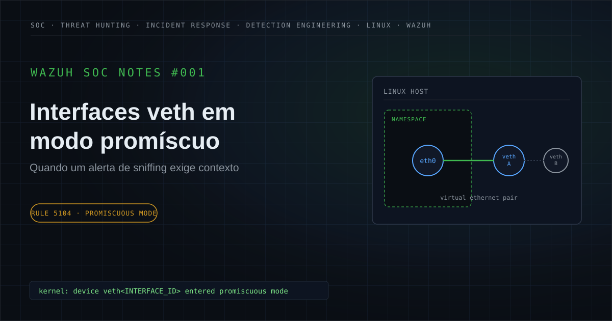

🔗 [Publicado no LinkedIn](https://www.linkedin.com/posts/felipe-r-amaral_wazuh-soc-incidentresponse-activity-7471061144879763456-1tnr)

---

## Executive Summary

Durante uma atividade de análise de segurança, foi investigado um alerta do Wazuh indicando que interfaces de rede de um host Linux haviam entrado em **modo promíscuo**.

O comportamento exigiu investigação porque uma interface operando em `promiscuous mode` pode receber tráfego além daquele destinado diretamente a ela, e esse tipo de comportamento possui relação técnica com cenários de captura de tráfego e **Network Sniffing**.

A hipótese inicial, portanto, considerou a possibilidade de atividade relacionada à técnica **MITRE ATT&CK T1040 — Network Sniffing**.

Entretanto, a investigação e o Threat Hunting identificaram que os eventos estavam associados a interfaces Ethernet virtuais com prefixo `veth`.

Interfaces `veth` são dispositivos Ethernet virtuais utilizados em pares e possuem aplicações legítimas em arquiteturas envolvendo **network namespaces, bridges, containers e virtualização de rede**.

A correlação dos eventos não identificou evidências complementares suficientes para sustentar a hipótese de captura maliciosa de tráfego.

Diante do conjunto de evidências analisado, o evento foi classificado como:

**Falso Positivo: comportamento legítimo associado a interfaces virtuais.**

---

## 1. Contexto do alerta

O Wazuh gerou um alerta relacionado à entrada de interfaces de rede em modo promíscuo.

A detecção estava associada à regra:

```text
Rule ID: 5104

Description:
Interface entered in promiscuous(sniffing) mode.
```

O evento tinha origem em logs do kernel Linux coletados pelo Wazuh.

Exemplo sanitizado:

```text
kernel: device veth<INTERFACE_ID> entered promiscuous mode
```

O alerta merece atenção porque o modo promíscuo pode permitir que uma interface processe pacotes além daqueles destinados diretamente ao próprio sistema.

Em determinados cenários, isso pode ser utilizado para captura passiva de tráfego.

Entretanto:

> **Promiscuous mode é um comportamento técnico; não é, isoladamente, evidência de comprometimento.**

O contexto da interface e os eventos correlacionados são determinantes para a classificação.

---

## 2. Hipótese inicial

A hipótese inicial considerada durante a triagem foi:

```text
Promiscuous Mode
        ↓
Possible Packet Capture
        ↓
Possible Network Sniffing
```

Foram considerados cenários como:

- captura não autorizada de tráfego;
- utilização de ferramentas de packet capture;
- reconhecimento de rede;
- coleta de informações transmitidas pela rede;
- monitoramento não autorizado;
- malware com capacidade de sniffing;
- alteração administrativa legítima;
- comportamento operacional relacionado à infraestrutura virtual.

A investigação precisava responder uma questão fundamental:

```text
A interface apenas possui capacidade de observar tráfego
                     OU
há evidências de que essa capacidade esteja sendo utilizada
              de forma maliciosa?
```

Essa diferença é essencial para evitar conclusões baseadas apenas na severidade ou descrição inicial de uma regra.

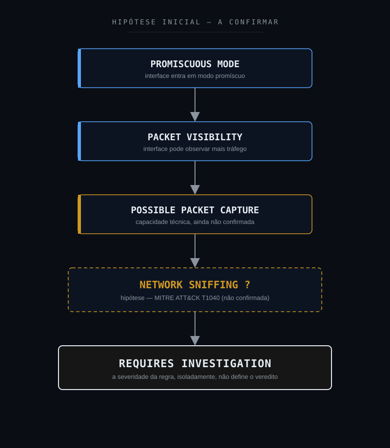

---

## 3. Escopo da investigação

A investigação foi estruturada para responder às seguintes perguntas:

1. Qual tipo de interface entrou em modo promíscuo?
2. A interface era física ou virtual?
3. O comportamento ocorreu de maneira isolada ou recorrente?
4. Existiam outras interfaces apresentando o mesmo comportamento?
5. Os eventos estavam temporalmente relacionados?
6. Existiam processos relacionados a packet capture?
7. Havia ferramentas conhecidas de sniffing em execução?
8. Existiam arquivos `.pcap` ou `.pcapng`?
9. Havia evidência de alteração manual da interface?
10. O comportamento poderia estar relacionado a containers ou network namespaces?
11. Existiam bridges ou componentes de virtualização de rede?
12. Havia atividade administrativa suspeita correlacionada?
13. Existiam outros indicadores de comprometimento?
14. A hipótese de Network Sniffing era sustentada por evidências adicionais?

---

## 4. 5W1H

### What: O que aconteceu?

O Wazuh identificou interfaces de rede entrando em modo promíscuo em um sistema Linux monitorado.

Os eventos estavam associados a interfaces Ethernet virtuais identificadas pelo prefixo `veth`.

### Who: Quem ou o que esteve envolvido?

Um ativo Linux monitorado pelo Wazuh e interfaces Ethernet virtuais.

Dentro das evidências analisadas, não foi identificado usuário, processo ou ferramenta maliciosa diretamente associado ao comportamento.

### When: Quando ocorreu?

Os eventos foram observados dentro da janela temporal analisada durante o Threat Hunting.

Os timestamps específicos foram removidos da versão pública para preservar a sanitização do caso.

### Where: Onde ocorreu?

Em interfaces Ethernet virtuais de um sistema Linux monitorado.

### Why: Por que era relevante?

Interfaces operando em modo promíscuo podem ser utilizadas para captura passiva de tráfego.

Esse comportamento possui relação com a técnica:

**MITRE ATT&CK T1040: Network Sniffing.**

Por isso, o evento exigia validação antes de qualquer classificação.

### How: Como foi analisado?

Foram realizadas consultas no Threat Hunting do Wazuh utilizando:

- Rule ID;
- host;
- período;
- mensagens contendo `promiscuous`;
- interfaces `veth`;
- eventos correlacionados.

O objetivo foi determinar se o comportamento representava atividade ofensiva ou dinâmica legítima da infraestrutura.

---

## 5. Evidências disponíveis

A análise separou evidências confirmadas de hipóteses e elementos não observados.

| Evidência | Fonte | Classificação | Confiança |
|---|---|---|---|
| Rule 5104 acionada | Wazuh | Confirmed | High |
| Interface entrou em promiscuous mode | Linux Kernel Log | Confirmed | High |
| Interface identificada como `veth` | Linux Kernel Log | Confirmed | High |
| Ocorrências relacionadas a interfaces virtuais | Threat Hunting | Confirmed | High |
| Contexto compatível com virtual networking | Correlação técnica | Supported | High |
| Ferramenta de sniffing | Hunting | Not Observed | Medium |
| Arquivo `.pcap` / `.pcapng` | Hunting | Not Observed | Medium |
| Alteração manual suspeita | Hunting | Not Observed | Medium |
| Atividade administrativa suspeita | Hunting | Not Observed | Medium |
| Credential Access correlacionado | Hunting | Not Observed | Medium |
| Command and Control correlacionado | Hunting | Not Observed | Medium |
| Exfiltração correlacionada | Hunting | Not Observed | Medium |

---

## 6. Classificação das evidências

Para evitar transformar ausência de evidência em evidência de ausência, foram utilizadas classificações diferentes.

### Confirmed

Informação diretamente demonstrada pela telemetria.

### Supported

Conclusão sustentada por múltiplos elementos tecnicamente coerentes.

### Inferred

Conclusão analítica derivada das evidências disponíveis.

### Hypothesis

Possibilidade considerada durante a investigação, ainda dependente de confirmação.

### Not Observed

O comportamento foi procurado nas fontes disponíveis, mas não foi identificado.

### Not Available

A telemetria disponível não permite determinar.

### Not Applicable

O elemento não possui aplicabilidade técnica relevante ao cenário.

É importante destacar:

> **Not Observed não significa que determinado comportamento seja tecnicamente impossível.**

Significa apenas que ele não foi identificado dentro das fontes, período e escopo analisados.

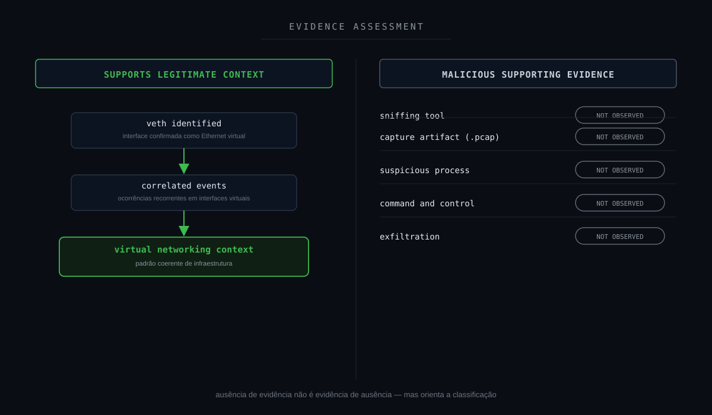

---

## 7. Timeline da investigação

A sequência lógica do caso pode ser representada da seguinte forma:

```text
Kernel Event
     ↓
Interface enters promiscuous mode
     ↓
Wazuh Collection
     ↓
Rule 5104
     ↓
SOC Alert
     ↓
Initial Hypothesis
     ↓
Possible Network Sniffing
     ↓
Threat Hunting
     ↓
Interface Type Validation
     ↓
veth Identified
     ↓
Correlation with Other Events
     ↓
Virtual Network Pattern
     ↓
Search for Sniffing Tools
     ↓
Search for Capture Artifacts
     ↓
Search for Supporting Malicious Behavior
     ↓
No Supporting Malicious Evidence
     ↓
Context Reassessment
     ↓
Legitimate Virtual Network Behavior
     ↓
FALSE POSITIVE
```

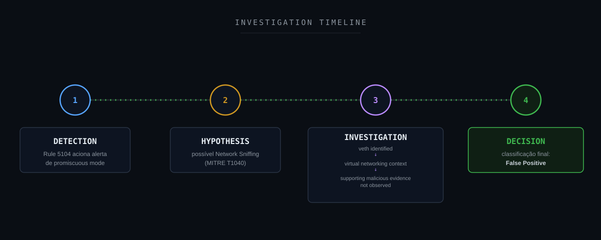

---

## 8. Threat Hunting

O objetivo do Threat Hunting foi determinar se a mudança para modo promíscuo estava associada a possível atividade de Network Sniffing.

Uma investigação desse tipo pode começar pela própria regra:

```text
rule.id:5104
```

Busca por eventos relacionados ao modo promíscuo:

```text
full_log:*promiscuous*
```

Correlação com interfaces virtuais:

```text
full_log:*promiscuous* AND full_log:*veth*
```

Busca específica pelo ativo:

```text
agent.ip:"<IP_DO_HOST>" AND full_log:*promiscuous*
```

Correlação entre ativo e interfaces virtuais:

```text
agent.ip:"<IP_DO_HOST>" AND full_log:*veth* AND full_log:*promiscuous*
```

Busca genérica pelo comportamento:

```text
full_log:*veth* AND full_log:*promiscuous*
```

Dependendo da estrutura do índice e da versão utilizada, a sintaxe pode exigir adaptação ao ambiente.

---

## 9. Campos relevantes para investigação

Entre os principais campos analisáveis nesse tipo de investigação estão:

```text
@timestamp
agent.name
agent.ip
agent.id
rule.id
rule.level
rule.description
location
decoder.name
full_log
```

Esses campos permitem avaliar:

- momento do evento;
- ativo envolvido;
- regra acionada;
- severidade;
- origem da telemetria;
- mensagem original;
- interface envolvida;
- recorrência;
- correlação temporal.

---

## 10. Resultado do Threat Hunting

A investigação demonstrou que o comportamento estava relacionado a interfaces identificadas como `veth`.

Esse detalhe alterou significativamente o contexto da análise.

A hipótese original era:

```text
Promiscuous Mode
        ↓
Possible Network Sniffing
```

Após a investigação:

```text
Promiscuous Mode
        ↓
veth Interface
        ↓
Virtual Ethernet Context
        ↓
Correlated Similar Events
        ↓
Virtual Networking Pattern
        ↓
No Supporting Malicious Evidence
```

A hipótese de sniffing malicioso perdeu sustentação conforme novas evidências foram adicionadas.

Esse processo é importante porque demonstra uma característica fundamental da análise de segurança:

> **Hipóteses devem mudar quando as evidências mudam.**

---

## 11. Entendendo interfaces `veth`

Interfaces `veth` são dispositivos Ethernet virtuais.

Normalmente são criadas em pares:

```text
vethA ←────────→ vethB
```

Pacotes enviados por uma extremidade aparecem na outra.

Esse mecanismo permite conectar diferentes componentes de uma infraestrutura Linux.

Uma arquitetura simplificada pode ser representada como:

```text
Linux Host
     │
     ├── Network Namespace / Container
     │          │
     │        eth0
     │          │
     │       vethA
     │          │
     └──────── vethB
                │
              Bridge
                │
        Physical Interface
                │
              Network
```

Esse tipo de arquitetura é comum em ambientes que utilizam:

- containers;
- network namespaces;
- bridges Linux;
- Docker;
- Kubernetes;
- outras tecnologias de virtualização de rede.

Por isso, uma interface `veth` entrando em modo promíscuo possui um contexto diferente de uma interface física inesperadamente colocada nesse estado.

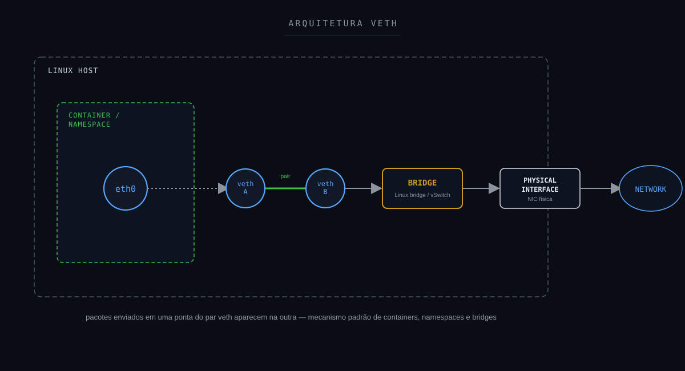

---

## 12. Correlação técnica

A investigação precisa diferenciar dois cenários.

### Cenário A: Contexto potencialmente legítimo

```text
Promiscuous Mode
        +
veth Interface
        +
Virtual Network
        +
Multiple Correlated Events
        +
Expected Infrastructure Behavior
        +
No Sniffing Tool
        +
No Capture Artifact
```

### Cenário B: Contexto potencialmente suspeito

```text
Promiscuous Mode
        +
Physical Interface
        +
tcpdump / tshark / dumpcap
        +
Unexpected Privilege
        +
Capture File
        +
Suspicious Process
        +
Additional Malicious Activity
```

O mesmo evento inicial pode, portanto, levar a conclusões completamente diferentes.

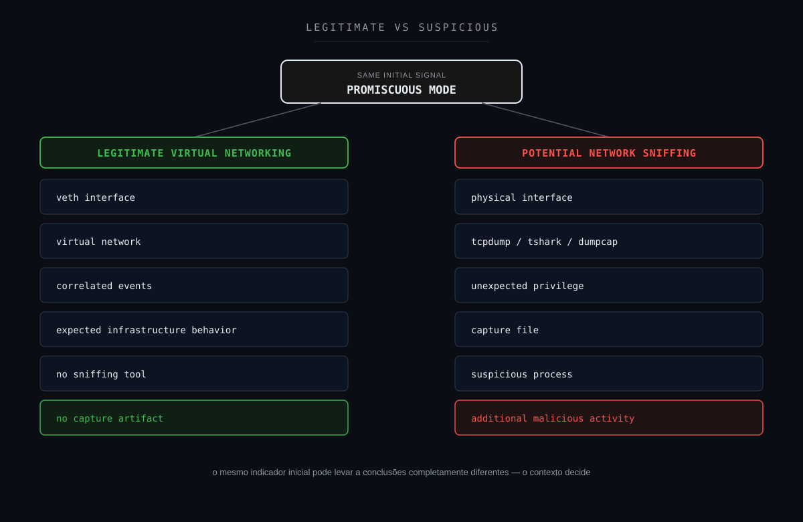

---

## 13. Cadeia fim a fim do evento

A cadeia técnica observável pode ser representada como:

```text
Linux Host
        ↓
Virtual Ethernet Interface
        ↓
veth
        ↓
Promiscuous Mode
        ↓
Linux Kernel Event
        ↓
System Logging
        ↓
Wazuh Agent
        ↓
Wazuh Manager
        ↓
Rule 5104
        ↓
Security Alert
        ↓
SOC Analysis
        ↓
Initial Hypothesis
        ↓
Network Sniffing
        ↓
Threat Hunting
        ↓
Event Correlation
        ↓
veth Pattern Identified
        ↓
Virtual Networking Context
        ↓
Search for Supporting Evidence
        ↓
No Supporting Malicious Evidence
        ↓
Analytical Reassessment
        ↓
FALSE POSITIVE
```

Essa cadeia é diferente de uma Attack Chain.

Ela representa o fluxo completo:

**telemetria → detecção → investigação → decisão.**

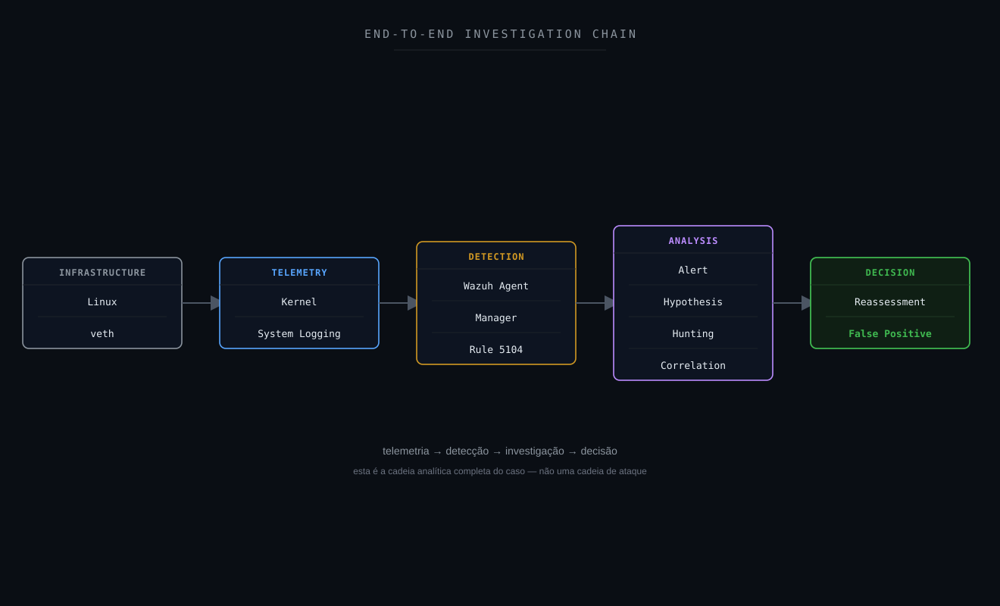

---

## 14. Attack Flow

Não foi identificado um Attack Flow adversarial confirmado.

Forçar uma cadeia ofensiva para esse caso seria tecnicamente incorreto.

A representação apropriada é um **Investigation / Decision Flow**:

```text
Detection
    ↓
Promiscuous Mode Alert
    ↓
Network Sniffing Hypothesis
    ↓
Interface Validation
    ↓
veth Identified
    ↓
Temporal Correlation
    ↓
Virtual Networking Context
    ↓
Search for Packet Capture Tools
    ↓
Search for Capture Artifacts
    ↓
Search for Supporting Malicious Activity
    ↓
No Supporting Evidence
    ↓
Hypothesis Reassessment
    ↓
Legitimate Behavior
    ↓
False Positive
```

---

## 15. Attack Chain Assessment

Mesmo sem uma cadeia de ataque confirmada, é útil verificar se outros estágios poderiam ser sustentados pelas evidências.

| Estágio | Status | Fundamentação |
|---|---|---|
| Reconnaissance | Not Observed | Nenhuma evidência correlacionada |
| Initial Access | Not Observed | Nenhuma evidência correlacionada |
| Execution | Not Available | Processo originador não determinado |
| Persistence | Not Observed | Nenhuma evidência |
| Privilege Escalation | Not Observed | Nenhuma evidência |
| Defense Evasion | Not Observed | Nenhuma evidência |
| Credential Access | Not Observed | Captura de credenciais não demonstrada |
| Discovery | Not Observed | Network Sniffing não confirmado |
| Lateral Movement | Not Observed | Nenhuma evidência |
| Collection | Not Observed | Captura efetiva de tráfego não demonstrada |
| Command and Control | Not Observed | Nenhuma evidência |
| Exfiltration | Not Observed | Nenhuma evidência |
| Impact | Not Observed | Nenhum impacto identificado |

A tabela evita um erro comum:

> **Mapear todo evento de segurança para uma cadeia ofensiva completa sem possuir evidência para isso.**

---

## 16. MITRE ATT&CK Mapping

### T1040: Network Sniffing

O principal mapeamento considerado durante a investigação foi:

**MITRE ATT&CK T1040: Network Sniffing**

A técnica descreve situações nas quais adversários podem capturar tráfego de rede para obter informações transmitidas entre sistemas.

A alteração de uma interface para `promiscuous mode` pode fazer parte desse comportamento.

Entretanto:

```text
Detection mapped to T1040
            ≠
Confirmed execution of T1040
```

O mapeamento representa uma hipótese técnica de investigação, não a confirmação automática de atividade adversarial.

[MITRE ATT&CK — T1040 Network Sniffing](https://attack.mitre.org/techniques/T1040/)

---

## 17. MITRE Detection Strategy

A MITRE também mantém estratégias de detecção relacionadas a Network Sniffing.

A correlação pode considerar elementos como:

- alterações de interfaces;
- processos;
- ferramentas de monitoramento;
- contexto de privilégios;
- execução de utilitários de captura;
- comportamento anômalo relacionado à rede.

Isso reforça uma característica importante deste estudo:

> **A mudança para promiscuous mode é um sinal; a correlação determina o significado.**

[MITRE ATT&CK — DET0314](https://attack.mitre.org/detectionstrategies/DET0314/)

---

## 18. Framework Mapping

Um framework só entra nesta lista quando há um número, técnica ou controle real e específico que se aplique a este case, não como referência genérica.

### MITRE ATT&CK

**Aplicabilidade: hipótese de investigação.**

T1040 — Network Sniffing foi utilizada como hipótese técnica.

### MITRE Attack Flow / Cyber Kill Chain

**Aplicabilidade: lente analítica, sem cadeia confirmada.**

Ambos estruturam a pergunta "houve progressão adversarial?" feita na Seção 15 (Attack Chain Assessment). Nenhum estágio foi confirmado neste case.

### NIST CSF

**Aplicabilidade: direta.**

Identify, Detect, Respond e Improve.

### NIST SP 800-61

**Aplicabilidade: direta.**

Orientações para investigação e tratamento de eventos de segurança.

### ISO/IEC 27035

**Aplicabilidade: direta.**

Ciclo de 5 fases (Plan & Prepare / Detection & Reporting / Assessment & Decision / Responses / Lessons Learned), espelhado na estrutura deste note.

### SANS PICERL

**Aplicabilidade: direta.**

Identification (Seções 1–10) e Lessons Learned (Seção 33) mapeados diretamente. Containment/Eradication não se aplicam, pois não houve ameaça real a conter.

### ISO/IEC 27001

**Aplicabilidade: direta.**

Anexo A 5.24–5.28 — controles de gestão de incidente de segurança da informação.

### COBIT 2019

**Aplicabilidade: direta.**

DSS02 (Managed Service Requests and Incidents) e MEA01/MEA02 (monitoramento e melhoria contínua).

### ITIL 4

**Aplicabilidade: direta.**

Prática de Incident Management e prática de Continual Improvement.

### Agile / Kanban

**Aplicabilidade: operacional (não classifica evidência do case).**

O pipeline de Detection Engineering (Seção 24) poderia ser gerenciado como backlog Scrum/Kanban: cada nova hipótese de detecção como item de sprint. Não é usado para classificar nenhum fato técnico deste alerta.

### CIS Controls

**Aplicabilidade: direta.**

```text
CIS Control 4 : Secure Configuration of Enterprise Assets and Software
CIS Control 8 : Audit Log Management
CIS Control 13: Network Monitoring and Defense
CIS Control 17: Incident Response Management
```

### SOC-CMM

**Aplicabilidade: direta.**

Detection Quality e False Positive Management.

### Metodologia analítica aplicada

```text
ACH: Analysis of Competing Hypotheses
```

As seções 2 e 12 avaliam explicitamente múltiplas hipóteses concorrentes e as refutam por evidência, em vez de apenas confirmar a primeira.

```text
Método Científico
```

Hipótese → Evidência → Teste → Conclusão é a estrutura epistêmica de todo o note.

```text
OODA Loop
```

Observe (telemetria) → Orient (hipótese/evidência) → Decide (veredito) → Act (recomendações).

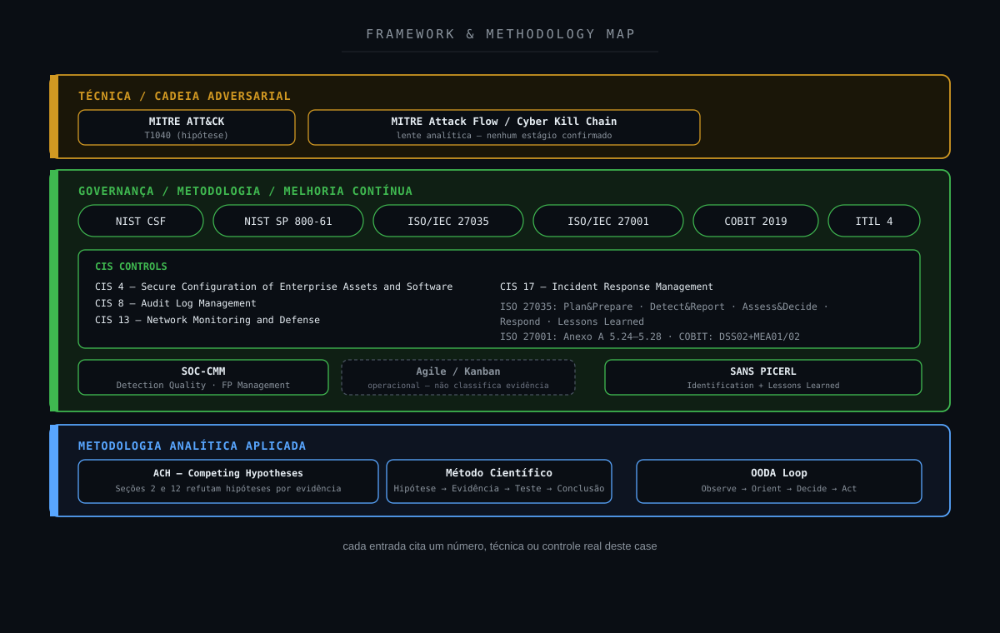

---

## 19. NIST Mapping

Sob a perspectiva do **NIST Cybersecurity Framework**, o caso possui aderência às atividades relacionadas principalmente à identificação de contexto, detecção, resposta e melhoria.

O alerta fornece o sinal inicial.

A investigação fornece contexto.

A correlação reduz incerteza.

O veredito determina a resposta apropriada.

As oportunidades identificadas durante a análise também podem retroalimentar processos de melhoria contínua.

O caso demonstra que **detecção não encerra o processo analítico**.

Para Incident Response, a análise também pode ser relacionada às orientações do NIST para investigação e tratamento de eventos de segurança.

[NIST Cybersecurity Framework](https://www.nist.gov/cyberframework)

[NIST SP 800-61 Rev. 3](https://csrc.nist.gov/pubs/sp/800/61/r3/final)

---

## 20. CIS Controls

O cenário possui relação principalmente com capacidades associadas a:

- Audit Log Management;
- Network Monitoring and Defense;
- Secure Configuration;
- Continuous Monitoring;
- Incident Response Management.

O ponto central é garantir que a organização possua telemetria suficiente para diferenciar comportamento operacional legítimo de atividade adversarial.

[CIS Controls](https://www.cisecurity.org/controls)

---

## 21. Detection Strategy

A detecção original possui valor defensivo.

Desabilitar completamente alertas de `promiscuous mode` seria uma decisão arriscada.

Uma estratégia mais madura seria enriquecer a detecção.

Modelo conceitual:

```text
Promiscuous Mode
        +
Interface Type
        +
Process Creation
        +
Privilege Context
        +
Known Sniffing Tool
        +
Capture Artifact
        +
Infrastructure Context
        +
Network Behavior
```

Quanto maior a quantidade de contexto disponível, maior a capacidade de diferenciar:

```text
Legitimate Virtual Networking
```

de:

```text
Malicious Packet Capture
```

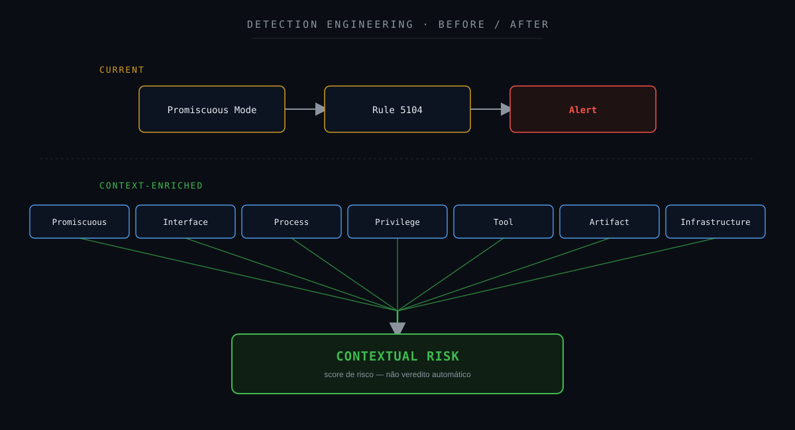

---

## 22. Detection Gap Analysis

### O que foi detectado?

Uma interface entrando em modo promíscuo.

### A detecção estava errada?

Não.

O comportamento ocorreu.

### Onde estava a lacuna?

Na ausência de contexto suficiente para determinar imediatamente se o comportamento era legítimo ou malicioso.

A regra detecta:

```text
Promiscuous Mode
```

Mas o analista precisa descobrir:

```text
Why?
Who?
Which interface?
Which process?
Which workload?
What happened before?
What happened after?
```

A principal lacuna não estava necessariamente na capacidade de detectar o comportamento.

Estava na capacidade de **contextualizá-lo automaticamente**.

---

## 23. Oportunidades de enriquecimento

Uma detecção futura poderia incorporar:

```text
Rule 5104
        +
Interface = veth
        +
Known Container Host
        +
Expected Workload
        +
No Sniffing Process
        ↓
Lower Suspicion
```

Enquanto:

```text
Rule 5104
        +
Physical Interface
        +
tcpdump/tshark
        +
Unexpected User
        +
Elevated Privilege
        +
.pcap Created
        ↓
Higher Suspicion
```

Isso é preferível a simplesmente excluir todos os eventos relacionados a `veth`.

O objetivo é preservar a visibilidade e melhorar a fidelidade analítica.

---

## 24. Detection Engineering

O caso representa uma oportunidade de **Detection Engineering**.

O objetivo não seria necessariamente criar outra regra isolada.

O ganho maior estaria em correlacionar diferentes sinais.

Uma estratégia futura poderia utilizar:

```text
Interface State Change
        ↓
Interface Classification
        ↓
Process Telemetry
        ↓
User / Privilege Context
        ↓
Packet Capture Tool Detection
        ↓
File Creation
        ↓
Infrastructure Context
        ↓
Risk Scoring
```

Essa abordagem aumenta a fidelidade da detecção sem eliminar a visibilidade fornecida pela regra original.

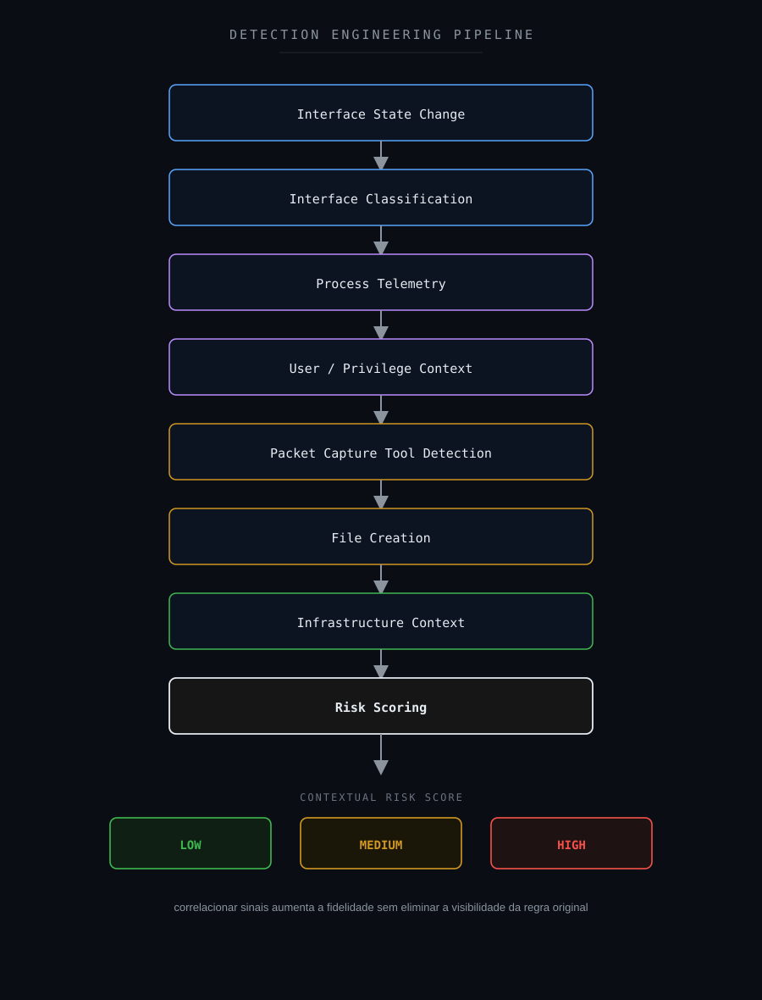

Um possível resultado seria classificar eventos de acordo com níveis contextuais de risco, como:

```text
LOW
MEDIUM
HIGH
```

O Risk Score deve servir como mecanismo de priorização e enriquecimento.

**Não como veredito automático.**

---

## 25. Sigma

Nenhuma regra Sigma foi necessária para determinar o veredito deste estudo.

Entretanto, Sigma pode ser utilizado em estudos futuros para desenvolver detecções portáveis relacionadas a comportamentos complementares.

Exemplos:

- execução de ferramentas de packet capture;
- comandos relacionados à manipulação de interfaces;
- processos incomuns relacionados a networking;
- criação de artefatos associados à captura de tráfego.

Sigma deve ser tratado como parte da camada de **Detection Engineering**, e não como evidência de que houve ataque neste caso.

[Sigma](https://sigmahq.io/)

---

## 26. Hardening Opportunities

O caso não demonstrou uma vulnerabilidade de hardening.

Ainda assim, algumas medidas podem melhorar a postura defensiva e principalmente a visibilidade:

- manter baseline de interfaces virtuais;
- identificar hosts que utilizam `veth`;
- documentar workloads containerizados;
- restringir ferramentas de captura de tráfego quando não necessárias;
- aplicar Least Privilege;
- monitorar criação de `.pcap` e `.pcapng`;
- aumentar visibilidade de processos;
- correlacionar eventos de containers com eventos de rede;
- documentar hosts com comportamento esperado de virtual networking;
- revisar configurações de rede periodicamente.

Nesse cenário, hardening deve ser tratado como **oportunidade de melhoria**, não como correção obrigatória decorrente do alerta.

Hardening não deve ser aplicado indiscriminadamente.

Os controles precisam considerar a função legítima do ativo e da arquitetura.

---

## 27. Controles defensivos

Alguns controles relevantes incluem:

```text
Network Monitoring
        +
Endpoint Telemetry
        +
Process Monitoring
        +
Linux Audit Logging
        +
Privilege Monitoring
        +
Container Visibility
        +
File / Artifact Monitoring
        +
SIEM
        +
Threat Hunting
```

Nenhuma dessas camadas isoladamente fornece contexto completo.

O valor surge da correlação.

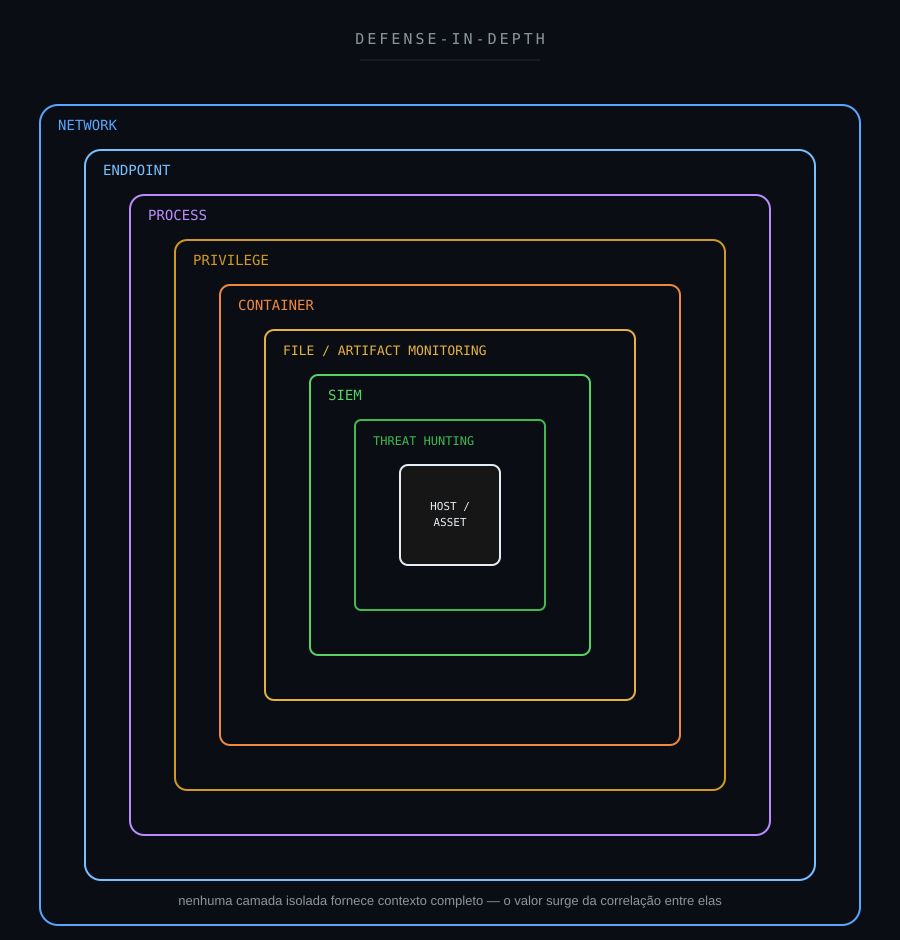

---

## 28. SOC-CMM

Sob a perspectiva de maturidade operacional, esse tipo de investigação envolve capacidades como:

- Security Monitoring;
- Incident Analysis;
- Threat Hunting;
- Detection Quality;
- False Positive Management;
- Continuous Improvement.

Uma operação menos madura poderia seguir uma lógica semelhante a:

```text
High Severity Alert
        ↓
Incident
```

Uma operação mais madura busca:

```text
Alert
  ↓
Context
  ↓
Evidence
  ↓
Correlation
  ↓
Hypothesis Validation
  ↓
Risk Assessment
  ↓
Decision
```

Entretanto, um único caso não permite determinar o nível de maturidade de um SOC.

O SOC-CMM deve ser utilizado como referência para avaliar processos e capacidades de forma mais ampla.

[SOC-CMM](https://www.soc-cmm.com/)

---

## 29. Métricas operacionais

Casos desse tipo também podem contribuir para métricas operacionais.

| Métrica | Objetivo |
|---|---|
| MTTD | Tempo até a detecção |
| MTTA | Tempo até o reconhecimento |
| MTTC | Tempo até contenção, quando aplicável |
| MTTR | Tempo até recuperação/resolução, conforme definição adotada |
| False Positive Rate | Avaliação da qualidade das detecções |
| Detection Coverage | Cobertura das capacidades de detecção |
| SLA | Acompanhamento dos compromissos operacionais |

Uma regra excessivamente sensível pode aumentar visibilidade, mas também elevar o custo operacional da investigação.

Detection Engineering precisa equilibrar:

```text
Visibility
    ×
Context
    ×
Precision
    ×
Operational Cost
```

Nenhuma métrica interna do ambiente original é publicada neste estudo.

Isso permite discutir maturidade operacional sem expor informações de operação, contratos ou organizações.

---

## 30. Decision Flow

O processo decisório pode ser representado por uma árvore de investigação em que cada evidência altera o nível de suspeita.

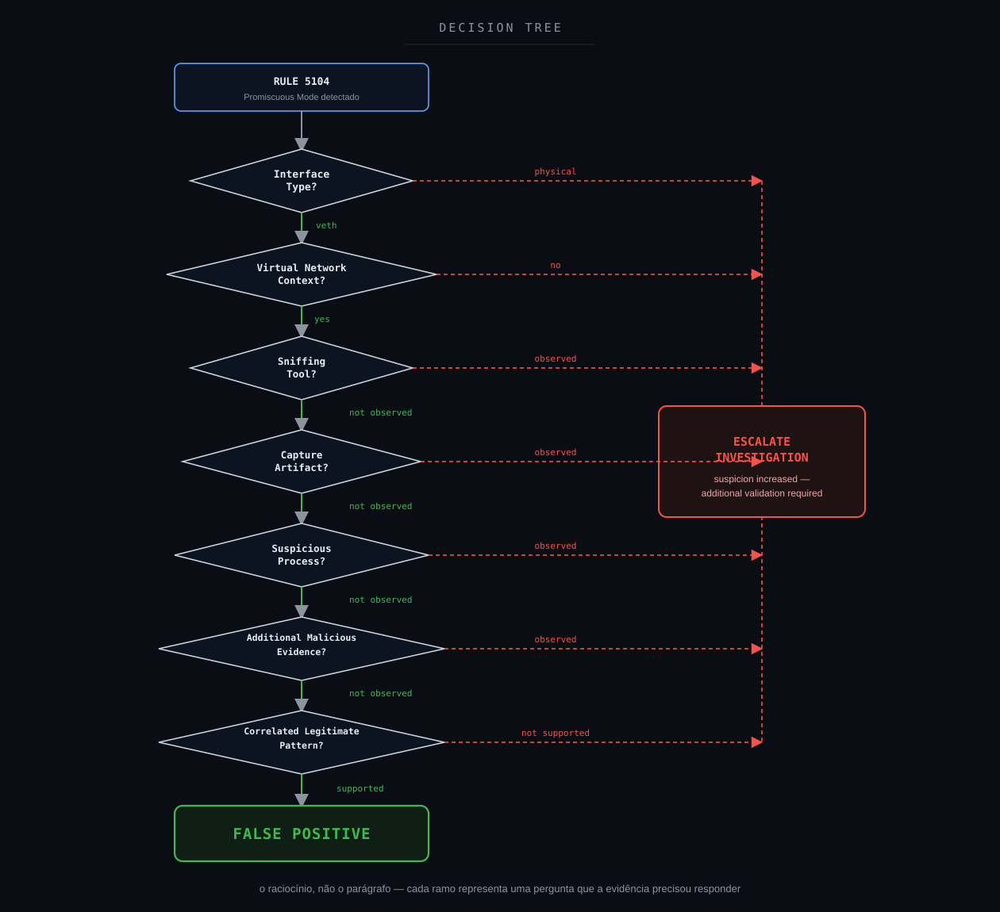

O fluxo considera elementos como:

- promiscuous mode;
- tipo da interface;
- contexto virtual;
- presença de ferramenta de sniffing;
- artefatos de captura;
- processos suspeitos;
- outras evidências maliciosas;
- padrão legítimo correlacionado.

A presença de um único indicador suspeito não deve determinar automaticamente um verdadeiro positivo.

Quando a suspeita aumenta, o comportamento adequado é:

> **Escalar a investigação e buscar validação adicional.**

---

## 31. Veredito técnico

**Classificação final:** Falso Positivo

**Contexto:** comportamento legítimo associado a interfaces virtuais

**Confiança analítica:** Alta

**Evidência de atividade maliciosa:** Não identificada

**Impacto de segurança:** Não identificado

A investigação demonstrou que os eventos estavam associados a interfaces Ethernet virtuais (`veth`) operando em modo promíscuo.

A correlação apresentou características compatíveis com operações de rede virtual em ambientes Linux.

Dentro das fontes e do escopo analisados, não foram identificadas evidências complementares suficientes para sustentar a hipótese de Network Sniffing malicioso.

A detecção cumpriu seu objetivo ao sinalizar uma alteração relevante no estado das interfaces.

Entretanto, a contextualização técnica alterou a interpretação do evento.

### Veredito

```text
FALSE POSITIVE
```

---

## 32. Por que Falso Positivo?

Existe uma distinção importante.

O evento aconteceu.

A interface realmente entrou em modo promíscuo.

Portanto:

```text
Event = TRUE
```

A questão era:

```text
Malicious Interpretation = ?
```

A investigação demonstrou:

```text
Promiscuous Mode
        +
Virtual Interface
        +
veth Pattern
        +
Virtual Networking Context
        +
No Supporting Malicious Evidence
        ↓
False Positive
```

Isso demonstra que:

> **Evento, detecção, alerta e incidente não são sinônimos.**

Um evento pode ser verdadeiro.

Uma detecção pode funcionar corretamente.

Um alerta pode justificar investigação.

E mesmo assim a interpretação inicial de risco pode não se confirmar.

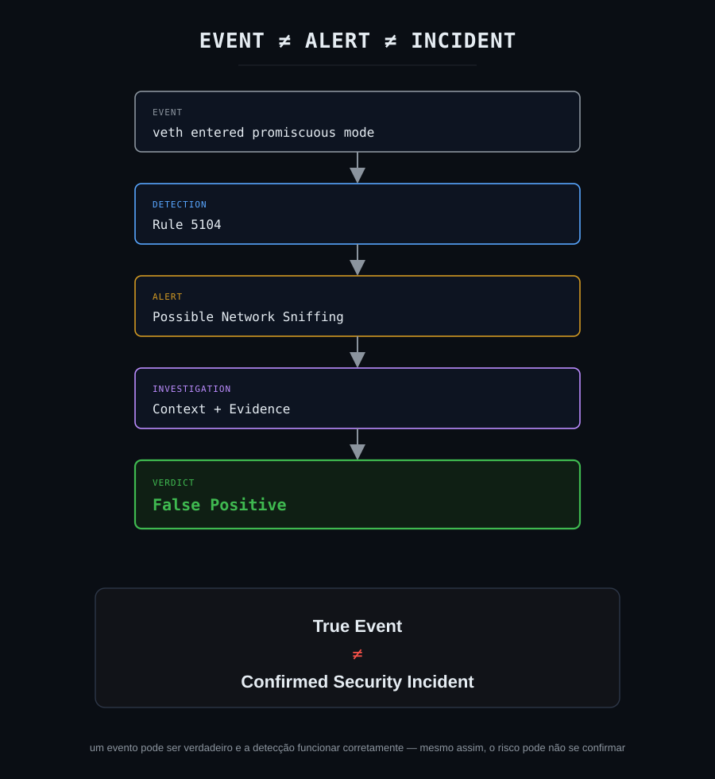

A mensagem central é:

> **True Event ≠ Confirmed Security Incident**

---

## 33. Lições aprendidas

A principal lição deste estudo é:

> **O valor de uma detecção não está apenas em disparar. Está em fornecer um ponto de partida para uma decisão baseada em evidências.**

Promiscuous mode pode representar atividade maliciosa.

Mas o analista precisa considerar:

- tipo de interface;
- arquitetura do host;
- network namespaces;
- containers;
- bridges;
- processos;
- privilégios;
- recorrência;
- artefatos;
- telemetria disponível;
- comportamento anterior;
- comportamento posterior.

O fluxo correto é:

```text
Telemetry
    ↓
Detection
    ↓
Alert
    ↓
Hypothesis
    ↓
Threat Hunting
    ↓
Correlation
    ↓
Context
    ↓
Evidence
    ↓
Decision
```

Pular etapas aumenta a possibilidade de falso positivo ou falso negativo.

### Severidade não substitui contexto

Um alerta de severidade elevada não representa automaticamente um incidente de segurança.

### Tipo de interface importa

`eth0` e `vethXXXXXXXX` podem possuir significados operacionais completamente diferentes.

### ATT&CK é uma referência, não um veredito

Relacionar um evento a T1040 não significa que Network Sniffing foi confirmado.

### Ausência de telemetria também é um achado

Não conseguir identificar processo, usuário ou command line pode revelar uma oportunidade de melhoria.

### Correlação reduz ambiguidade

Eventos analisados isoladamente podem parecer mais suspeitos do que quando observados em conjunto.

### Falso positivo também gera valor

Uma investigação encerrada como falso positivo pode produzir melhorias em:

- regras;
- telemetria;
- documentação;
- hardening;
- processos;
- conhecimento operacional.

---

## 34. Recomendações

1. Manter a detecção de `promiscuous mode` ativa.
2. Evitar supressões genéricas da Rule 5104.
3. Criar baseline das interfaces virtuais esperadas.
4. Identificar hosts que utilizam `veth`.
5. Correlacionar alterações de interface com processos.
6. Monitorar ferramentas de packet capture.
7. Monitorar criação de `.pcap` e `.pcapng`.
8. Correlacionar contexto de privilégios.
9. Utilizar informações de containers e namespaces.
10. Aplicar tuning específico em vez de exclusões amplas.
11. Documentar exceções conhecidas.
12. Revisar recorrência antes de alterar severidade.
13. Utilizar contexto de infraestrutura no enriquecimento das detecções.
14. Avaliar criação de correlações adicionais para elevar a fidelidade.
15. Manter Threat Hunting disponível para casos em que a telemetria inicial seja insuficiente.

---

## 35. Investigation Flow: visão final

A visão final consolida o processo investigativo desde a detecção inicial até a decisão técnica.

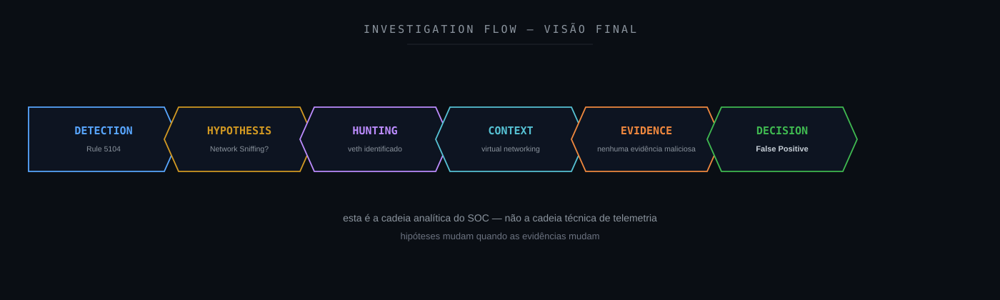

A cadeia analítica pode ser resumida como:

```text
DETECTION
    ↓
HYPOTHESIS
    ↓
HUNTING
    ↓
CONTEXT
    ↓
EVIDENCE
    ↓
DECISION
```

Diferentemente da cadeia apresentada anteriormente, que explica o percurso técnico da telemetria até a análise, esta visão representa a **cadeia analítica do SOC**.

O alerta é o início.

A decisão é resultado da investigação.

---

## 36. Referências técnicas

### Wazuh

- [Wazuh Documentation](https://documentation.wazuh.com/)

### MITRE ATT&CK

- [MITRE ATT&CK](https://attack.mitre.org/)
- [T1040: Network Sniffing](https://attack.mitre.org/techniques/T1040/)
- [DET0314: Detection Strategy](https://attack.mitre.org/detectionstrategies/DET0314/)

### Linux Virtual Ethernet

- [Linux `veth(4)`: Virtual Ethernet Device](https://man7.org/linux/man-pages/man4/veth.4.html)

### Docker Networking

- [Docker: Bridge Network Driver](https://docs.docker.com/engine/network/drivers/bridge/)

### MITRE D3FEND

- [MITRE D3FEND](https://d3fend.mitre.org/)

### MITRE Engage

- [MITRE Engage](https://engage.mitre.org/)

### MITRE Fight Fraud Framework

- [MITRE Fight Fraud Framework](https://ctid.mitre.org/fraud/)

### NIST

- [NIST Cybersecurity Framework](https://www.nist.gov/cyberframework)
- [NIST SP 800-61 Rev. 3](https://csrc.nist.gov/pubs/sp/800/61/r3/final)

### CIS

- [CIS Controls](https://www.cisecurity.org/controls)

### VERIS

- [VERIS Framework](https://verisframework.org/)

### Sigma

- [Sigma](https://sigmahq.io/)

### SOC-CMM

- [SOC-CMM](https://www.soc-cmm.com/)

---

## Disclaimer

Este estudo foi sanitizado para preservar a confidencialidade do ambiente originalmente analisado.

As investigações, decisões técnicas e veredictos apresentados neste estudo refletem experiência prática real do autor. Ferramentas de Inteligência Artificial foram utilizadas como apoio para formatação, diagramação e publicação do conteúdo, não para a condução da investigação em si.

Nomes de organizações, clientes, usuários, hostnames, endereços IP, identificadores de interfaces, identificadores de incidentes, timestamps específicos e demais informações operacionais foram removidos, generalizados ou substituídos.

Informações relacionadas a processos internos, SLAs, fluxos de atendimento, relacionamentos comerciais ou validações organizacionais não fazem parte deste estudo.

O objetivo desta publicação é exclusivamente compartilhar metodologia de investigação, raciocínio analítico, Threat Hunting, Incident Response, Detection Engineering e oportunidades de melhoria defensiva.

Este projeto é independente e não representa documentação oficial do Wazuh, MITRE, Linux, NIST, CIS ou das demais organizações e projetos mencionados.

---

**Wazuh SOC Notes**

> Segurança não termina no alerta. O valor está em transformar telemetria em contexto, contexto em evidência e evidência em decisão.
