# Wazuh SOC Notes #002 — Cloudflare WAF: quando um scanning autorizado se parece com atividade adversarial

> **SOC | Threat Hunting | Incident Response | Detection Engineering | WAF | Cloudflare | Wazuh**

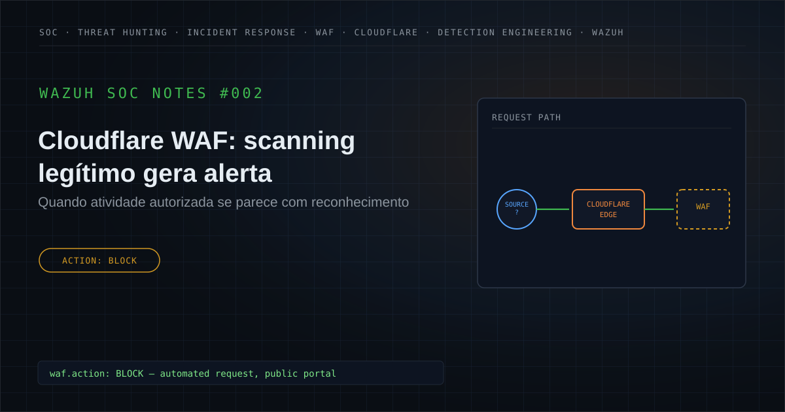

---

## Executive Summary

Durante uma atividade de monitoramento de segurança, foi investigado um alerta no Wazuh originado a partir de telemetria do **Cloudflare Web Application Firewall (WAF)**.

O evento estava relacionado a uma requisição direcionada a um **portal público protegido pelo WAF**, apresentando características compatíveis com atividade automatizada de scanning.

O Cloudflare aplicou a seguinte ação:

```text
BLOCK
```

Inicialmente, o comportamento justificava investigação porque atividades automatizadas direcionadas a aplicações expostas podem estar associadas a:

- reconhecimento externo;
- enumeração de recursos;
- identificação de tecnologias;
- descoberta de endpoints;
- validação de configurações;
- vulnerability scanning;
- preparação para tentativa de exploração.

Entretanto, a análise posterior acrescentou um elemento fundamental de contexto:

> **A atividade fazia parte de um scanning autorizado realizado por uma consultoria especializada contratada pela organização.**

A requisição realmente ocorreu.

O comportamento de scanning realmente ocorreu.

O WAF realmente aplicou o bloqueio.

Porém, a atividade não estava relacionada a uma operação adversarial não autorizada.

Dentro das fontes e do escopo analisados, também não foram identificadas evidências complementares suficientes para indicar:

- exploração não autorizada;
- bypass do WAF;
- comprometimento;
- execução maliciosa;
- persistência;
- Credential Access;
- Command and Control;
- exfiltração;
- impacto de segurança.

Diante do conjunto de evidências e da validação contextual, o evento foi classificado como:

**Falso Positivo contextual — atividade autorizada de scanning realizada por consultoria contratada, bloqueada pelo WAF e sem impacto de segurança identificado.**

---

## 1. Contexto do alerta

O Wazuh recebeu um evento relacionado a uma requisição HTTP/HTTPS processada pelo Cloudflare.

O WAF identificou o comportamento e aplicou:

```text
Action: BLOCK
```

Na versão pública deste estudo, foram removidos ou generalizados todos os elementos capazes de correlacionar o caso ao ambiente original.

Entre eles:

```text
Source IP
Destination IP
Domain
Hostname
URL
Request Path
Ray ID
Request ID
Incident ID
Timestamp
Collector ID
Internal Rule IDs
Environment-specific identifiers
```

O alvo será tratado apenas como:

```text
Public-Facing Portal
```

e a origem como:

```text
External Security Scanner
```

No momento inicial da análise, ainda não havia contexto suficiente para determinar se a atividade correspondia a:

```text
Unauthorized Scanning
```

ou:

```text
Authorized Security Assessment
```

O evento, portanto, exigia investigação.

---

## 2. Hipótese inicial

A hipótese inicial foi construída a partir exclusivamente do comportamento observado.

```text
External Source
        ↓
Automated Requests
        ↓
Public-Facing Portal
        ↓
Scanning Behavior
        ↓
Possible Reconnaissance
        ↓
WAF Detection
        ↓
BLOCK
        ↓
Requires Investigation
```

Foram considerados inicialmente cenários como:

- scanner automatizado;
- reconnaissance;
- enumeração de recursos;
- vulnerability scanning;
- identificação de tecnologias;
- descoberta de endpoints;
- tentativa de preparação para exploração;
- atividade legítima de segurança;
- ferramenta de avaliação autorizada.

A principal pergunta era:

```text
Scanning Activity
       ↓
Malicious?
       OR
Authorized?
```

A telemetria, isoladamente, não respondia essa pergunta.

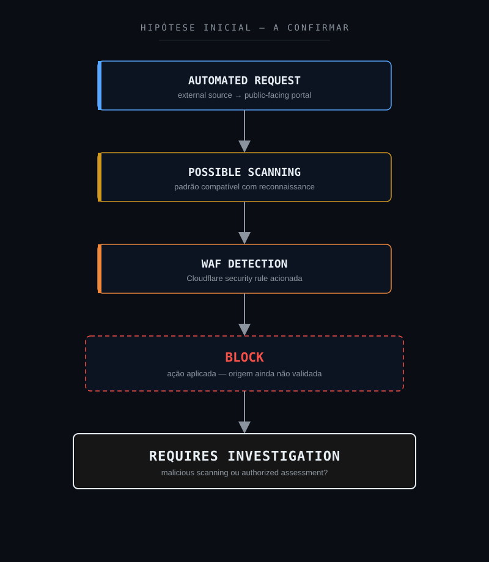

---

## 3. Escopo da investigação

A investigação foi estruturada para responder:

1. A requisição realmente ocorreu?
2. O WAF aplicou efetivamente uma ação de bloqueio?
3. O comportamento possuía características de automação?
4. Existiam múltiplas requisições relacionadas?
5. Houve scanning de diferentes recursos?
6. Existiam sinais de reconhecimento estruturado?
7. Houve tentativa de exploração?
8. O WAF foi contornado?
9. Alguma requisição suspeita alcançou o origin?
10. Houve resposta compatível com exploração bem-sucedida?
11. Houve execução de comandos ou processos?
12. Foram criados ou modificados artefatos?
13. Existiu atividade pós-exploração?
14. A origem era conhecida?
15. Existia algum assessment autorizado em andamento?
16. A atividade estava relacionada a fornecedor ou consultoria?
17. O teste estava dentro de uma janela previamente autorizada?
18. O comportamento estava dentro do escopo do assessment?
19. Existiu algum impacto inesperado?
20. O alerta deveria ser tratado como incidente de segurança?

---

## 4. 5W1H

### What — O que aconteceu?

Foi identificada uma atividade automatizada de scanning direcionada a um portal público protegido pelo Cloudflare WAF.

O controle de segurança aplicou:

```text
BLOCK
```

### Who — Quem esteve envolvido?

A atividade foi posteriormente relacionada a uma **consultoria especializada contratada pela organização para execução de avaliação de segurança autorizada**.

Nenhum nome de empresa, fornecedor ou profissional é publicado.

### When — Quando ocorreu?

A atividade ocorreu dentro da janela analisada pelo SOC.

Os timestamps específicos foram removidos da versão pública.

### Where — Onde ocorreu?

Contra um portal público protegido pelo Cloudflare.

Domínio, endereço IP, hostname, URL e path real foram sanitizados.

### Why — Por que ocorreu?

A atividade fazia parte de um **security assessment autorizado** conduzido por uma consultoria contratada.

### How — Como foi identificado?

O scanner realizou requisições contra a aplicação.

O Cloudflare avaliou o tráfego e aplicou ação de bloqueio.

O evento foi posteriormente analisado pelo SOC através da telemetria disponível no Wazuh e de validação contextual.

---

## 5. Evidências disponíveis

A investigação separou fatos diretamente observados de interpretações e hipóteses.

| Evidência | Fonte | Classificação | Confiança |
|---|---|---|---|
| Requisição HTTP/HTTPS ocorreu | Cloudflare / Wazuh | Confirmed | High |
| Comportamento automatizado observado | Telemetria | Confirmed | High |
| Ação `BLOCK` aplicada | Cloudflare | Confirmed | High |
| Comportamento compatível com scanning | Análise | Supported | High |
| Origem associada a consultoria contratada | Validação contextual | Confirmed | High |
| Assessment autorizado | Validação contextual | Confirmed | High |
| Exploração não autorizada | Hunting / Correlação | Not Observed | Medium |
| Bypass do WAF | Hunting / Correlação | Not Observed | Medium |
| Execução maliciosa | Hunting / Correlação | Not Observed | Medium |
| Persistência | Hunting / Correlação | Not Observed | Medium |
| Credential Access | Hunting / Correlação | Not Observed | Medium |
| Command and Control | Hunting / Correlação | Not Observed | Medium |
| Exfiltração | Hunting / Correlação | Not Observed | Medium |
| Impacto de segurança | Hunting / Correlação | Not Observed | High |

---

## 6. Classificação das evidências

Para preservar a diferença entre fato, interpretação e ausência de visibilidade, foram utilizadas as seguintes classificações.

### Confirmed

Informação diretamente demonstrada pela telemetria ou por validação operacional confiável.

### Supported

Conclusão sustentada por múltiplos elementos tecnicamente coerentes.

### Inferred

Conclusão analítica derivada das evidências disponíveis.

### Hypothesis

Possibilidade considerada durante a investigação, ainda dependente de confirmação.

### Not Observed

O comportamento foi procurado nas fontes disponíveis, mas não foi identificado.

### Not Available

A telemetria disponível não permite determinar.

### Not Applicable

O elemento não possui aderência técnica relevante ao cenário.

É importante destacar:

> **Not Observed não significa tecnicamente impossível.**

Significa apenas que o comportamento não foi identificado dentro das fontes, período e escopo analisados.

Outro ponto importante neste caso:

> **Uma atividade verdadeira pode possuir uma interpretação inicial de risco que posteriormente não se confirma.**

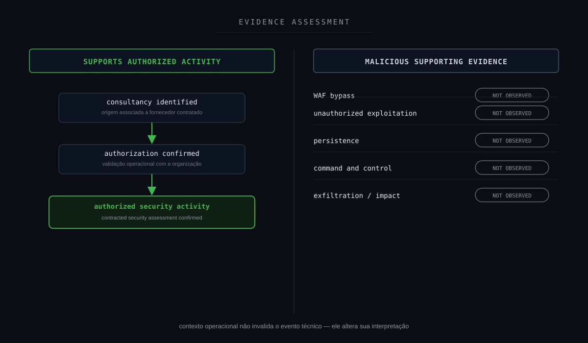

---

## 7. Timeline da investigação

A sequência lógica do caso pode ser representada como:

```text
External Automated Request
        ↓
Public-Facing Portal
        ↓
Cloudflare Inspection
        ↓
WAF Rule
        ↓
BLOCK
        ↓
Security Event
        ↓
Wazuh Alert
        ↓
SOC Investigation
        ↓
Initial Scanning Hypothesis
        ↓
Threat Hunting
        ↓
Source Correlation
        ↓
Behavior Analysis
        ↓
Operational Validation
        ↓
Known Consultancy Identified
        ↓
Authorized Security Assessment Confirmed
        ↓
Search for Unexpected Impact
        ↓
No Supporting Malicious Evidence
        ↓
Context Reassessment
        ↓
CONTEXTUAL FALSE POSITIVE
```

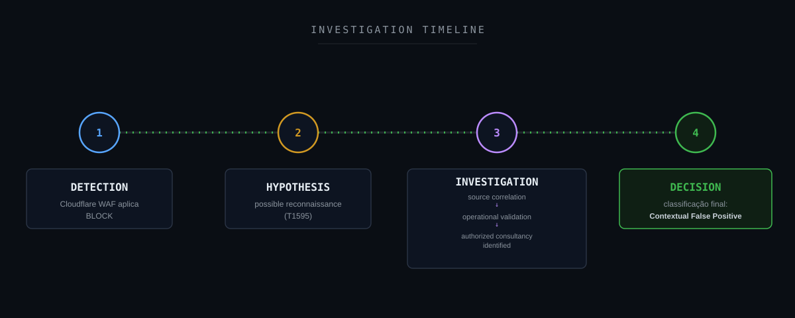

---

## 8. Threat Hunting

O objetivo do Threat Hunting foi determinar se o evento bloqueado fazia parte de uma atividade ofensiva não autorizada ou de um comportamento conhecido.

As queries abaixo são exemplos sanitizados.

Busca por eventos relacionados ao Cloudflare:

```text
rule.description:*Cloudflare*
```

Busca por ações de bloqueio:

```text
full_log:*block*
```

Correlação entre eventos relacionados ao Cloudflare e bloqueios:

```text
rule.description:*Cloudflare* AND full_log:*block*
```

Busca pela origem observada durante a investigação:

```text
source.ip:"<SOURCE_IP>"
```

Correlação por origem e bloqueio:

```text
source.ip:"<SOURCE_IP>" AND full_log:*block*
```

Busca por recorrência dentro de determinada janela:

```text
source.ip:"<SOURCE_IP>" AND @timestamp:[<START_TIME> TO <END_TIME>]
```

Correlação por destino sanitizado:

```text
destination.domain:"<SANITIZED_DOMAIN>"
```

Busca por múltiplas requisições da mesma origem:

```text
source.ip:"<SOURCE_IP>" AND destination.domain:"<SANITIZED_DOMAIN>"
```

A sintaxe deve ser adaptada de acordo com a estrutura dos índices, decoders e campos disponíveis.

Nenhum valor real utilizado na investigação é publicado neste estudo.

---

## 9. Campos relevantes para investigação

Entre os principais campos úteis nesse tipo de análise estão:

```text
@timestamp
rule.id
rule.level
rule.description
location
full_log
```

Quando disponíveis de forma estruturada:

```text
source.ip
source.asn
source.geo.country
destination.ip
destination.domain
http.request.method
http.request.path
http.request.user_agent
http.response.status_code
waf.action
waf.rule
cloudflare.ray_id
```

Esses campos permitem analisar:

- origem;
- destino;
- recorrência;
- método HTTP;
- recursos consultados;
- resposta;
- ação aplicada pelo WAF;
- padrão temporal;
- correlação entre requisições.

Os nomes dos campos podem ser apresentados publicamente.

Os valores reais associados ao ambiente não.

---

## 10. Resultado do Threat Hunting

A investigação confirmou:

```text
Automated Activity
        +
Public-Facing Portal
        +
WAF Detection
        +
BLOCK
```

A hipótese inicial era:

```text
External Scanning
        ↓
Possible Reconnaissance
        ↓
Possible Malicious Activity
```

Após a correlação técnica e validação operacional:

```text
External Scanning
        ↓
Known Security Consultancy
        ↓
Authorized Assessment
        ↓
Expected Activity
```

Não foram identificadas evidências suficientes de:

```text
Unauthorized Exploitation
WAF Bypass
Unauthorized Access
Execution
Persistence
Credential Access
Lateral Movement
Command and Control
Exfiltration
Impact
```

A hipótese mudou conforme novas evidências foram adicionadas.

---

## 11. Entendendo Security Scanning

Atividades de avaliação de segurança podem produzir tráfego muito semelhante ao observado durante reconnaissance adversarial.

Uma consultoria executando:

```text
Vulnerability Assessment
Penetration Testing
Security Validation
Attack Surface Assessment
```

pode realizar ações como:

```text
Endpoint Enumeration
Directory Enumeration
Technology Discovery
Sensitive Resource Discovery
Header Analysis
Service Identification
Configuration Testing
Vulnerability Scanning
```

Um atacante pode executar técnicas tecnicamente semelhantes.

Visualmente:

```text
Automated Requests
        +
Multiple Resources
        +
Short Time Window
        +
Security-Relevant Paths
```

pode representar:

```text
Malicious Reconnaissance
```

ou:

```text
Authorized Security Assessment
```

A diferença não necessariamente está no pacote de rede.

A diferença pode estar em:

```text
Intent
Authorization
Scope
Timing
Source
Operational Context
```

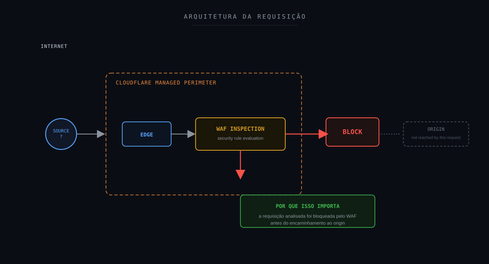

---

## 12. Correlação técnica

A análise precisou diferenciar dois cenários.

### Cenário A — possível atividade adversarial

```text
Unknown External Source
        +
Automated Requests
        +
Public Application
        +
Scanning Pattern
        +
No Known Authorization
        ↓
Potential Reconnaissance
```

### Cenário B — atividade legítima confirmada

```text
External Source
        +
Automated Requests
        +
Public Application
        +
WAF Blocks
        +
Known Consultancy
        +
Authorized Assessment
        ↓
Expected Security Activity
```

A telemetria inicial era semelhante.

O contexto foi o elemento determinante.

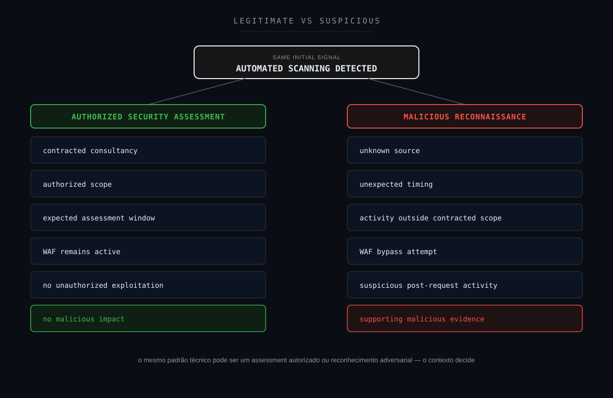

---

## 13. Cadeia fim a fim do evento

A cadeia técnica observável pode ser representada como:

```text
Authorized Security Consultancy
        ↓
Security Scanner
        ↓
Internet
        ↓
Public-Facing Portal
        ↓
Cloudflare Edge
        ↓
WAF Inspection
        ↓
Security Rule
        ↓
BLOCK
        ↓
Cloudflare Security Event
        ↓
Log Collection
        ↓
Wazuh
        ↓
SOC Alert
        ↓
Initial Hypothesis
        ↓
Threat Hunting
        ↓
Event Correlation
        ↓
Operational Validation
        ↓
Authorized Assessment Confirmed
        ↓
Search for Unexpected Impact
        ↓
No Supporting Malicious Evidence
        ↓
Contextual Reassessment
        ↓
FALSE POSITIVE
```

Essa cadeia não representa uma Attack Chain adversarial.

Ela representa:

```text
Activity
    ↓
Defense
    ↓
Telemetry
    ↓
Detection
    ↓
Investigation
    ↓
Context
    ↓
Decision
```

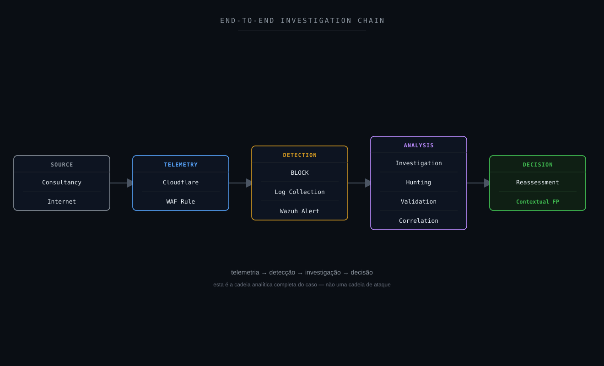

---

## 14. Attack Flow

Inicialmente, um fluxo ofensivo hipotético poderia ser considerado:

```text
External Source
        ↓
Scanning
        ↓
Reconnaissance
        ↓
Potential Target Discovery
        ↓
Potential Exploitation
```

Entretanto, a investigação confirmou:

```text
Authorized Consultancy
        ↓
Security Assessment
        ↓
Scanning
        ↓
WAF Block
```

Não existiam evidências suficientes para sustentar progressão para exploração adversarial.

Por isso, construir uma cadeia ofensiva completa seria tecnicamente incorreto.

A representação mais adequada é:

```text
Detection
        ↓
Scanning Hypothesis
        ↓
Investigation
        ↓
Context Validation
        ↓
Authorized Activity
        ↓
False Positive
```

---

## 15. Attack Chain Assessment

Mesmo sem uma cadeia adversarial confirmada, os estágios foram avaliados.

| Estágio | Status | Fundamentação |
|---|---|---|
| Reconnaissance | Hypothesis initially / Authorized activity confirmed | Comportamento semelhante a scanning adversarial |
| Initial Access | Not Observed | Nenhum acesso adversarial identificado |
| Execution | Not Observed | Nenhuma execução maliciosa |
| Persistence | Not Observed | Nenhuma evidência |
| Privilege Escalation | Not Observed | Nenhuma evidência |
| Defense Evasion | Not Observed | Nenhuma evidência |
| Credential Access | Not Observed | Nenhuma evidência |
| Discovery | Not Applicable as malicious activity | Scan autorizado |
| Lateral Movement | Not Observed | Nenhuma evidência |
| Collection | Not Observed | Nenhuma coleta adversarial |
| Command and Control | Not Observed | Nenhuma evidência |
| Exfiltration | Not Observed | Nenhuma evidência |
| Impact | Not Observed | Nenhum impacto identificado |

Esse exercício evita um erro comum:

> Transformar automaticamente todo comportamento tecnicamente ofensivo em uma cadeia de ataque confirmada.

---

## 16. MITRE ATT&CK Mapping

### T1595 — Active Scanning

Durante a hipótese inicial, o comportamento apresentava similaridade técnica com:

**MITRE ATT&CK T1595 — Active Scanning**

Scanning pode ser utilizado por adversários para obter informações sobre sistemas expostos e identificar possíveis superfícies de ataque.

Entretanto:

```text
Behavior Similar to T1595
            ≠
Confirmed Adversary Activity
```

Neste caso, a validação contextual demonstrou que o scanning fazia parte de uma atividade autorizada.

Portanto:

```text
T1595 = Analytical Hypothesis
```

e não:

```text
T1595 = Confirmed Malicious TTP
```

A técnica foi útil para orientar a investigação.

Não para determinar automaticamente o veredito.

---

## 17. MITRE Detection Strategy

A detecção de comportamentos semelhantes a scanning continua sendo válida.

Um mecanismo de segurança normalmente observa:

```text
Requests
Frequency
Destination
Pattern
Behavior
```

Ele pode não possuir imediatamente informações como:

```text
Contract
Authorization
Assessment Window
Supplier
Business Context
```

Portanto:

```text
Detection
        ↓
Behavior Identified
        ↓
Investigation
        ↓
Context Added
        ↓
Classification
```

Esse caso demonstra que uma detecção tecnicamente correta pode resultar em um falso positivo contextual.

O objetivo da melhoria não deve ser impedir que o evento seja observado.

Deve ser aumentar o contexto disponível para sua classificação.

---

## 18. Framework Mapping

Um framework só entra nesta lista quando há um número, técnica ou controle real e específico que se aplique a este case — não como referência genérica.

### MITRE ATT&CK

**Aplicabilidade: hipótese de investigação.**

T1595 — Active Scanning foi utilizado como hipótese comportamental durante a investigação.

### MITRE D3FEND

**Aplicabilidade: direta.**

```text
D3-NTF — Network Traffic Filtering
```

O WAF aplicou uma ação de bloqueio real sobre o tráfego — uma técnica defensiva efetivamente empregada, não apenas hipotética.

### MITRE Attack Flow / Cyber Kill Chain

**Aplicabilidade: lente analítica, sem cadeia confirmada.**

Estruturam a pergunta "houve progressão adversarial?" já feita na Seção 15 (Attack Chain Assessment). Nenhum estágio foi confirmado.

### NIST CSF

**Aplicabilidade: direta.**

Detect, Respond, Govern e Improve.

### NIST SP 800-61

**Aplicabilidade: direta.**

Investigação, classificação e resposta ao evento.

### ISO/IEC 27035

**Aplicabilidade: direta.**

Ciclo de 5 fases (Plan & Prepare / Detection & Reporting / Assessment & Decision / Responses / Lessons Learned).

### SANS PICERL

**Aplicabilidade: direta.**

Identification, Containment (o WAF já bloqueou o tráfego) e Lessons Learned mapeados diretamente na estrutura deste note.

### ISO/IEC 27001

**Aplicabilidade: direta.**

Anexo A 5.24–5.28 — controles de gestão de incidente de segurança da informação.

### COBIT 2019

**Aplicabilidade: direta.**

DSS02 (Managed Service Requests and Incidents) e MEA01/MEA02 (monitoramento e melhoria contínua).

### ITIL 4

**Aplicabilidade: direta.**

Prática de Incident Management e prática de Continual Improvement.

### Agile / Kanban

**Aplicabilidade: operacional (não classifica evidência do case).**

O pipeline de Detection Engineering (Seção 24) poderia ser gerenciado como backlog Scrum/Kanban — cada nova hipótese de detecção como item de sprint. Não é usado para classificar nenhum fato técnico deste alerta.

### CIS Controls

**Aplicabilidade: direta.**

```text
CIS 8  — Audit Log Management
CIS 13 — Network Monitoring and Defense
CIS 15 — Service Provider Management
CIS 16 — Application Software Security
CIS 17 — Incident Response Management
```

### SOC-CMM

**Aplicabilidade: direta.**

Detection Quality e Third-Party Context.

### Metodologia analítica aplicada

```text
ACH — Analysis of Competing Hypotheses
```

A investigação avaliou hipóteses concorrentes (scanner legítimo autorizado vs. reconhecimento adversarial) e refutou uma por evidência de contexto.

```text
Método Científico
```

Hipótese → Evidência → Teste → Conclusão é a estrutura epistêmica de todo o note.

```text
OODA Loop
```

Observe (telemetria) → Orient (hipótese/evidência) → Decide (veredito) → Act (recomendações).

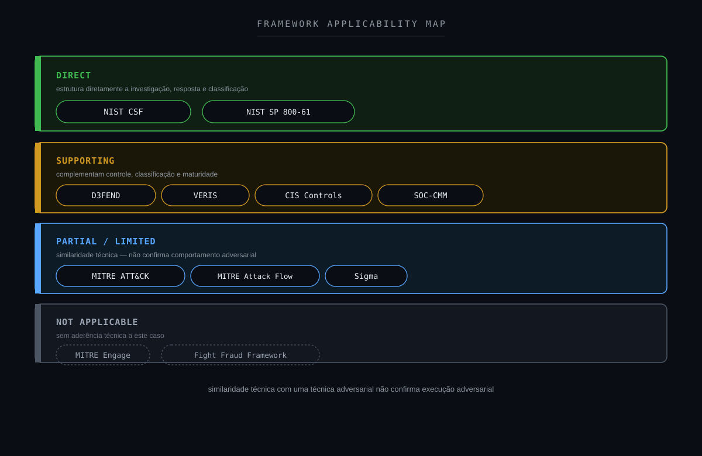

---

## 19. NIST Mapping

O caso pode ser relacionado ao NIST Cybersecurity Framework.

### IDENTIFY

Compreender:

- ativo exposto;
- superfície externa;
- controles existentes;
- fornecedores envolvidos;
- assessments planejados.

### PROTECT

O WAF atuou como controle preventivo:

```text
Internet
        ↓
Cloudflare WAF
        ↓
Application
```

### DETECT

A atividade automatizada foi identificada.

### RESPOND

O SOC executou:

```text
Alert Validation
        ↓
Threat Hunting
        ↓
Correlation
        ↓
Context Validation
        ↓
Classification
```

### RECOVER

```text
Not Applicable
```

Nenhum comprometimento ou impacto foi identificado.

### GOVERN

O caso possui relação direta com:

- gestão de terceiros;
- autorização de testes;
- comunicação entre áreas;
- definição de escopo;
- processos organizacionais.

### IMPROVE

O caso fornece oportunidade para melhorar o compartilhamento de contexto entre:

```text
Security Assessment
SOC
Infrastructure
Application Teams
Third Parties
```

---

## 20. CIS Controls

O cenário possui relação com capacidades como:

- Audit Log Management;
- Network Monitoring and Defense;
- Application Software Security;
- Incident Response Management;
- Service Provider Management.

O último ponto é especialmente relevante.

A atividade partiu de um terceiro autorizado.

Sem contexto, a telemetria era semelhante à de um potencial scanner adversarial.

O caso demonstra a importância de integrar:

```text
Security Monitoring
        +
Third-Party Management
        +
Operational Context
```

---

## 21. Detection Strategy

A estratégia atual pode ser representada como:

```text
Automated Request
        ↓
Cloudflare WAF
        ↓
Security Rule
        ↓
BLOCK
        ↓
Wazuh Alert
```

A detecção funcionou.

A lacuna estava principalmente no contexto disponível durante a triagem.

Uma abordagem enriquecida poderia considerar:

```text
Scanning Detection
        +
Source Classification
        +
Assessment Window
        +
Known Supplier
        +
Defined Scope
        +
Historical Behavior
        +
WAF Action
        ↓
Contextual Risk
```

Isso permitiria diferenciar melhor:

```text
Unknown Scanner
```

de:

```text
Authorized Security Scanner
```

sem eliminar visibilidade.

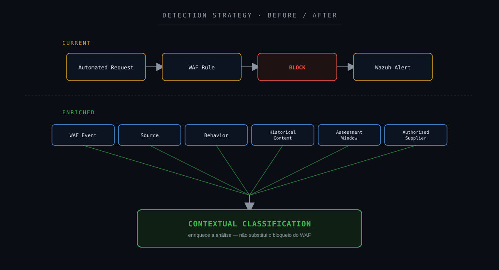

---

## 22. Detection Gap Analysis

### O que a detecção sabia?

```text
Automated Requests = TRUE
WAF Detection = TRUE
BLOCK = TRUE
```

### O que inicialmente não estava disponível?

```text
Authorized Consultancy?
Approved Assessment?
Expected Source?
Expected Time Window?
Defined Scope?
```

Portanto, a principal lacuna não era:

```text
Detection Gap
```

mas:

```text
Detection Context Gap
```

A detecção identificou corretamente o comportamento.

O SOC precisou descobrir por que aquele comportamento estava acontecendo.

---

## 23. Oportunidades de enriquecimento

Quando permitido pelos processos organizacionais, avaliações futuras podem fornecer previamente ao SOC informações como:

```text
Assessment Type
Assessment Window
Authorized Source Ranges
Target Scope
Supplier Identification
Change Reference
Authorization Reference
Expected Activity
```

Essas informações podem ser utilizadas como contexto.

Exemplo:

```text
WAF Alert
        +
Known Assessment Window
        +
Known Source
        +
Authorized Supplier
        ↓
Expected Activity Indicator
```

Isso não significa necessariamente:

```text
Suppress Alert
```

Muito menos:

```text
Disable Security Control
```

O ideal pode ser:

```text
Maintain Detection
        +
Add Context
        +
Reduce Investigation Time
```

---

## 24. Detection Engineering

O caso representa uma oportunidade de Detection Engineering voltada a enriquecimento contextual.

Um pipeline futuro poderia utilizar:

```text
Scanning Event
        ↓
Source Classification
        ↓
Threat Intelligence / Reputation
        ↓
Known Assessment Source?
        ↓
Assessment Window?
        ↓
Authorized Supplier?
        ↓
Target Within Scope?
        ↓
WAF Action
        ↓
Application Evidence
        ↓
Contextual Risk Score
```

Exemplo de baixo risco contextual:

```text
Scanning
        +
Known Assessment
        +
Authorized Source
        +
Expected Window
        +
Target In Scope
        +
No Unexpected Impact
        ↓
LOWER SUSPICION
```

Exemplo de maior risco:

```text
Scanning
        +
Unknown Source
        +
No Authorization
        +
Multiple Targets
        +
Unexpected Behavior
        +
Possible Exploitation
        ↓
HIGHER SUSPICION
```

O objetivo é evoluir de:

```text
Alert Severity
```

para:

```text
Evidence-Based Contextual Risk
```

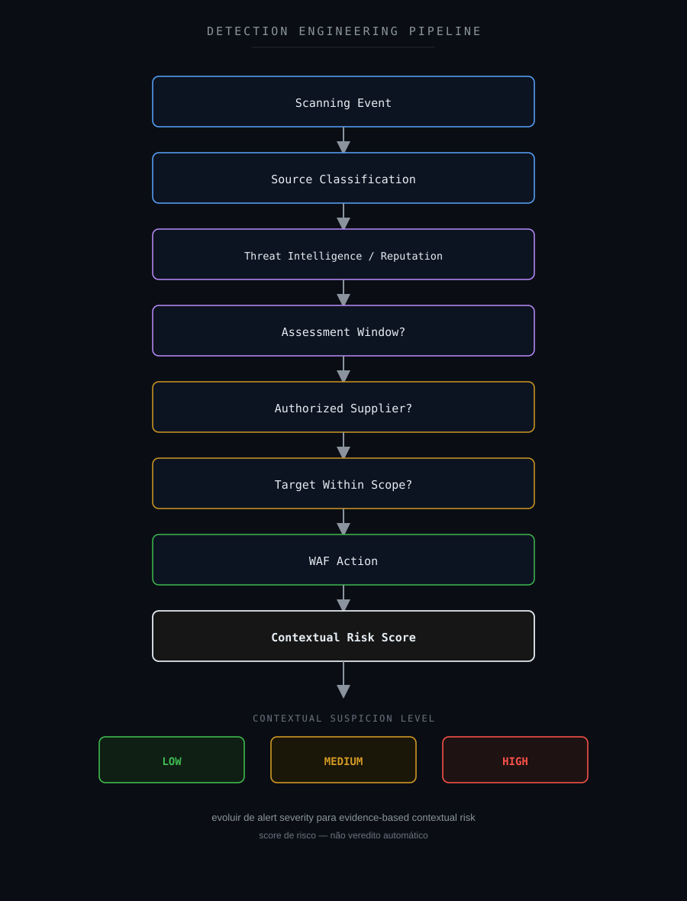

---

## 25. Sigma

Nenhuma regra Sigma foi necessária para determinar o veredito deste caso.

Entretanto, durante assessments autorizados, regras adicionais podem ser úteis para monitorar efeitos inesperados.

Exemplos:

```text
Web Server
        ↓
Unexpected Shell
```

```text
Application Process
        ↓
Suspicious Child Process
```

```text
HTTP Activity
        ↓
Unexpected File Creation
```

```text
Web Process
        ↓
Unexpected Outbound Connection
```

A existência de um teste autorizado não significa que qualquer comportamento subsequente deva ser automaticamente ignorado.

Sigma pode contribuir para garantir que atividades fora do comportamento esperado ainda sejam detectadas.

---

## 26. Hardening Opportunities

O evento não demonstrou uma falha específica de hardening.

O WAF executou o bloqueio esperado.

Mesmo assim, o caso permite discutir oportunidades.

### WAF

Manter políticas relacionadas a:

- automated scanning;
- reconnaissance;
- recursos sensíveis;
- padrões conhecidos de exploração.

### Application Security

Reduzir exposição de recursos desnecessários.

### Origin Protection

Quando possível, impedir acesso direto à infraestrutura de origem.

### Least Privilege

Serviços de aplicação devem operar com privilégios mínimos.

### Logging

Manter visibilidade em:

```text
CDN
WAF
Reverse Proxy
Application
Server
Endpoint
SIEM
```

### Third-Party Governance

Assessments devem possuir:

- autorização;
- escopo;
- janela;
- responsáveis;
- origem esperada;
- regras de engajamento.

Hardening, neste caso, deve ser tratado como melhoria defensiva e operacional, não como correção decorrente de comprometimento.

---

## 27. Controles defensivos

Uma visão Defense-in-Depth pode ser representada como:

```text
Internet
        ↓
Cloudflare
        ↓
WAF
        ↓
Reverse Proxy
        ↓
Application
        ↓
Server / Container
        ↓
Endpoint Telemetry
        ↓
Wazuh
        ↓
SOC
```

O assessment autorizado atravessa as mesmas camadas defensivas que uma atividade externa desconhecida.

Isso é importante.

Um teste autorizado não significa que os controles defensivos devam deixar de funcionar.

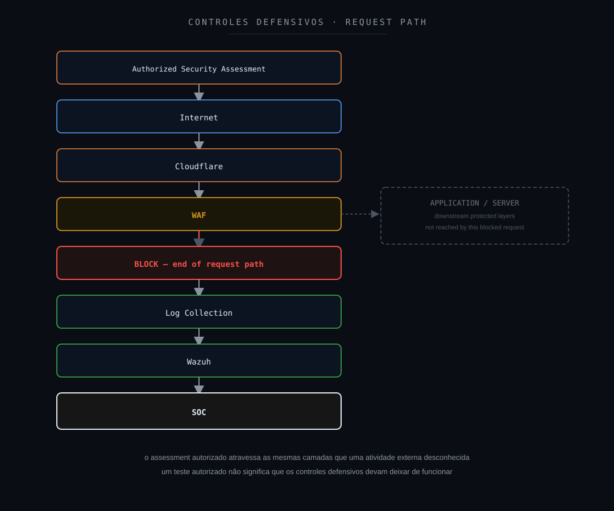

---

## 28. SOC-CMM

Sob a perspectiva de maturidade operacional, esse tipo de cenário envolve capacidades como:

- Security Monitoring;
- Incident Analysis;
- Threat Hunting;
- Detection Quality;
- False Positive Management;
- Third-Party Context;
- Continuous Improvement.

Uma operação menos madura poderia seguir:

```text
Alert
        ↓
BLOCK
        ↓
Close
```

Uma investigação mais estruturada:

```text
Alert
        ↓
Validate
        ↓
Threat Hunting
        ↓
Correlate Source
        ↓
Validate Authorization
        ↓
Assess Impact
        ↓
Classify
```

Uma operação ainda mais madura poderia possuir:

```text
Planned Assessment
        ↓
SOC Awareness
        ↓
Authorized Source Context
        ↓
Expected Window
        ↓
Continuous Monitoring
        ↓
Alert Validation
        ↓
Post-Assessment Review
```

Entretanto, um único caso não permite determinar o nível de maturidade de um SOC.

---

## 29. Métricas operacionais

O caso pode contribuir para métricas como:

| Métrica | Objetivo |
|---|---|
| MTTD | Tempo até a detecção |
| MTTA | Tempo até o reconhecimento |
| MTTR | Tempo até conclusão do tratamento |
| False Positive Rate | Avaliação da qualidade/contextualização |
| Detection Coverage | Cobertura das capacidades defensivas |
| Escalation Rate | Necessidade de investigação adicional |
| Third-Party Test Visibility | Visibilidade sobre assessments autorizados |
| SLA | Acompanhamento operacional |

Nenhum valor real do ambiente original é publicado.

Também é importante observar que:

```text
Lower MTTR
```

não deve ser obtido simplesmente encerrando alertas relacionados a scanners conhecidos.

A redução de tempo deve vir de:

```text
Better Context
        +
Better Enrichment
        +
Better Processes
```

---

## 30. Decision Flow

O fluxo decisório pode ser representado como uma árvore de investigação em que cada evidência altera o nível de suspeita.

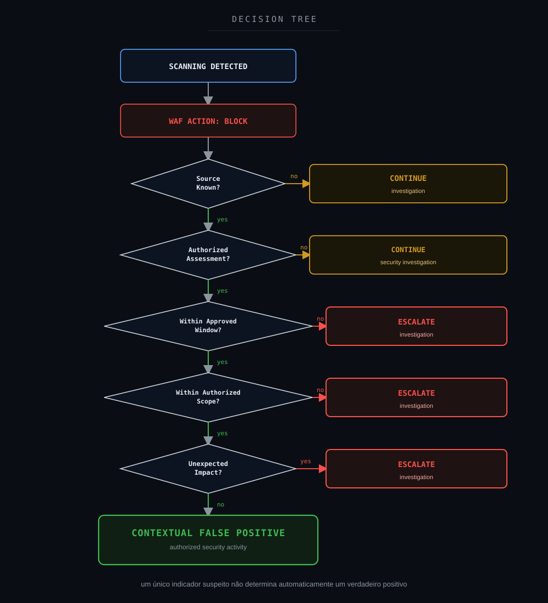

O fluxo considera elementos como:

- scanning detectado;
- ação aplicada pelo WAF;
- origem conhecida;
- assessment autorizado;
- janela aprovada;
- escopo autorizado;
- impacto inesperado.

A presença de um único indicador suspeito não deve determinar automaticamente um verdadeiro positivo.

Quando a suspeita aumenta — origem desconhecida, fora da janela aprovada, fora do escopo autorizado ou impacto inesperado —, o comportamento adequado é:

> **Escalar a investigação e buscar validação adicional.**

---

## 31. Veredito técnico

### Classificação final

**Falso Positivo contextual**

### Evento

```text
Confirmed
```

### Atividade

```text
Automated Security Scanning
```

### WAF Action

```text
BLOCK
```

### Origem

```text
Authorized Third-Party Security Consultancy
```

### Autorização

```text
Confirmed
```

### Exploração não autorizada

```text
Not Observed
```

### Bypass do WAF

```text
Not Observed
```

### Post-Exploitation

```text
Not Observed
```

### Impacto de segurança

```text
Not Observed
```

### Confiança analítica

```text
High
```

A investigação demonstrou que o comportamento estava associado a uma atividade de scanning realizada por uma consultoria especializada contratada pela organização.

O WAF detectou e bloqueou a requisição.

A detecção cumpriu sua função.

O comportamento observado era verdadeiro.

Entretanto, a interpretação inicial de possível atividade adversarial não se confirmou após a validação contextual.

### Veredito

```text
CONTEXTUAL FALSE POSITIVE
AUTHORIZED SECURITY SCANNING
WAF BLOCK
NO CONFIRMED SECURITY IMPACT
```

---

## 32. Por que Falso Positivo?

Existe uma distinção importante neste caso.

O evento aconteceu.

```text
Event = TRUE
```

A atividade de scanning aconteceu.

```text
Scanning = TRUE
```

O WAF realizou o bloqueio.

```text
WAF Block = TRUE
```

A questão investigada era:

```text
Malicious Interpretation = ?
```

Inicialmente:

```text
External Scanning
        ↓
Possible Reconnaissance
        ↓
Potential Threat
```

Após a investigação:

```text
External Scanning
        ↓
Authorized Consultancy
        ↓
Approved Security Assessment
        ↓
Expected Activity
```

Portanto:

```text
True Event
        +
Correct Detection
        +
Legitimate Context
        =
Contextual False Positive
```

O falso positivo não está na existência do evento.

Está na interpretação inicial de ameaça.

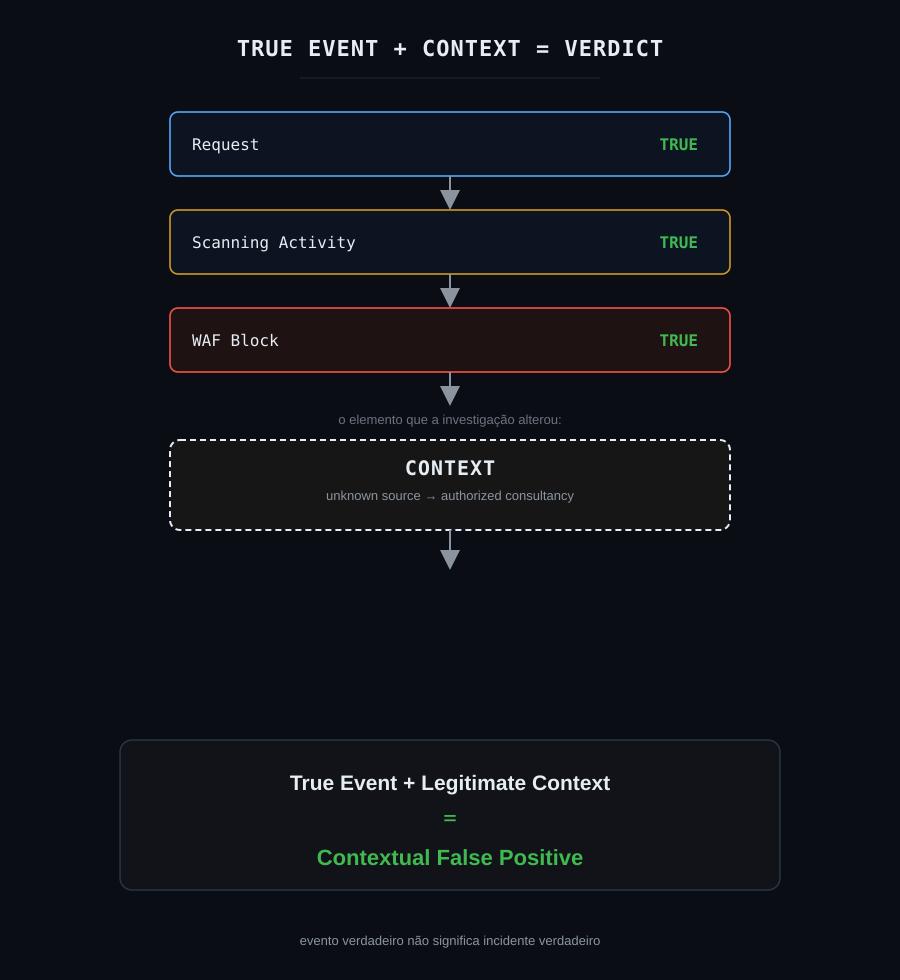

Mensagem principal:

> **True Security Event ≠ Confirmed Security Incident**

---

## 33. Lições aprendidas

A principal lição deste caso é:

> **Nem todo comportamento tecnicamente ofensivo representa uma atividade adversarial.**

Ferramentas utilizadas por profissionais de segurança podem executar ações semelhantes às utilizadas por atacantes.

Por exemplo:

```text
Scanning
Enumeration
Technology Discovery
Endpoint Discovery
Vulnerability Validation
```

podem aparecer tanto em:

```text
Offensive Security Assessment
```

quanto em:

```text
Adversary Reconnaissance
```

A diferença depende de contexto.

### Contexto operacional é evidência

Uma confirmação confiável de que a atividade fazia parte de um assessment autorizado altera significativamente a interpretação.

### Detecção correta não significa incidente confirmado

O WAF não estava errado.

A requisição ocorreu.

O bloqueio ocorreu.

### Um scan autorizado não deve necessariamente ser ignorado

A telemetria continua sendo importante.

### Allowlisting não deve significar invisibilidade

Mesmo fontes autorizadas podem produzir comportamento inesperado.

### Testes de segurança devem possuir governança

Idealmente:

```text
Authorization
        +
Scope
        +
Window
        +
Source
        +
Responsible Parties
        +
Rules of Engagement
```

### Evento, alerta e incidente são conceitos diferentes

```text
Telemetry
        ↓
Event
        ↓
Detection
        ↓
Alert
        ↓
Hypothesis
        ↓
Investigation
        ↓
Context
        ↓
Evidence
        ↓
Verdict
```

Pular essas etapas aumenta o risco de classificações incorretas.

---

## 34. Recomendações

1. Manter a detecção de atividades de scanning.
2. Não desabilitar o WAF para assessments sem necessidade técnica.
3. Manter telemetria mesmo para scanners autorizados.
4. Registrar previamente janelas de testes.
5. Documentar fornecedores autorizados.
6. Definir escopo de ativos e aplicações.
7. Registrar ranges de origem quando disponíveis.
8. Informar ao SOC sobre avaliações planejadas quando o processo permitir.
9. Utilizar origens autorizadas como contexto, não necessariamente como exclusão.
10. Evitar allowlists irrestritas.
11. Investigar atividades fora da janela aprovada.
12. Investigar acessos fora do escopo.
13. Investigar qualquer impacto inesperado.
14. Correlacionar eventos do WAF com aplicação e endpoint.
15. Manter proteção do origin.
16. Preservar logs para análise posterior.
17. Desenvolver enriquecimento contextual.
18. Documentar falsos positivos contextuais.
19. Utilizar casos recorrentes para tuning.
20. Avaliar scoring de risco baseado em autorização, comportamento e impacto.
21. Manter comunicação entre SOC, times técnicos e fornecedores.
22. Realizar revisão pós-assessment quando aplicável.

---

## 35. Investigation Flow — visão final

```text
Cloudflare WAF
        ↓
Scanning Detected
        ↓
BLOCK
        ↓
Wazuh Alert
        ↓
Initial Hypothesis
Possible Reconnaissance
        ↓
Threat Hunting
        ↓
Source Correlation
        ↓
Behavior Analysis
        ↓
Operational Context
        ↓
Known Consultancy Identified
        ↓
Authorized Security Assessment Confirmed
        ↓
Approved Window / Scope Validation
        ↓
Evidence Assessment
        ↓
No Supporting Malicious Progression
        ↓
No Unexpected Impact
        ↓
Context Reassessment
        ↓
CONTEXTUAL FALSE POSITIVE
```

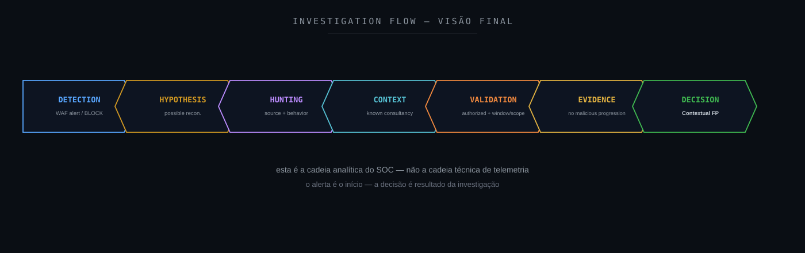

O fluxo analítico pode ser resumido como:

```text
DETECTION
    ↓
HYPOTHESIS
    ↓
HUNTING
    ↓
CONTEXT
    ↓
VALIDATION
    ↓
EVIDENCE
    ↓
DECISION
```

---

## 36. Referências técnicas

### Cloudflare

- [Cloudflare Web Application Firewall](https://developers.cloudflare.com/waf/)
- [Cloudflare Security Events](https://developers.cloudflare.com/waf/analytics/security-events/)
- [Cloudflare Custom Rules](https://developers.cloudflare.com/waf/custom-rules/)
- [Cloudflare Fundamentals](https://developers.cloudflare.com/fundamentals/)

### Wazuh

- [Wazuh Documentation](https://documentation.wazuh.com/)

### MITRE ATT&CK

- [MITRE ATT&CK](https://attack.mitre.org/)
- [MITRE ATT&CK — T1595 Active Scanning](https://attack.mitre.org/techniques/T1595/)

### MITRE D3FEND

- [MITRE D3FEND](https://d3fend.mitre.org/)

### MITRE Attack Flow

- [MITRE Attack Flow](https://center-for-threat-informed-defense.github.io/attack-flow/)

### MITRE Engage

- [MITRE Engage](https://engage.mitre.org/)

### NIST

- [NIST Cybersecurity Framework](https://www.nist.gov/cyberframework)
- [NIST SP 800-61 Rev. 3](https://csrc.nist.gov/pubs/sp/800/61/r3/final)

### CIS

- [CIS Controls](https://www.cisecurity.org/controls)

### VERIS

- [VERIS Framework](https://verisframework.org/)

### Sigma

- [Sigma](https://sigmahq.io/)

### SOC-CMM

- [SOC-CMM](https://www.soc-cmm.com/)

---

## Disclaimer

Este estudo foi sanitizado para preservar integralmente a confidencialidade do ambiente originalmente analisado.

As investigações, decisões técnicas e veredictos apresentados neste estudo refletem experiência prática real do autor. Ferramentas de Inteligência Artificial foram utilizadas como apoio para formatação, diagramação e publicação do conteúdo — não para a condução da investigação em si.

Nomes e valores relacionados aos seguintes elementos foram removidos, generalizados ou substituídos:

```text
Organization
Client
Consultancy
Supplier
Incident ID
Ticket ID
Source IP
Destination IP
Domain
Hostname
Username
E-mail Address
Exact Timestamp
Ray ID
Request ID
Session ID
GUID
Agent ID
Collector ID
Internal URL
Request Path
Internal Path
Environment-Specific Identifier
Credentials
Tokens
Secrets
```

O portal originalmente analisado não é identificado.

A consultoria responsável pelo assessment também não é identificada.

O endereço IP utilizado na atividade não é publicado.

O domínio alvo não é publicado.

O path real solicitado não é publicado.

Ray IDs, Request IDs, incidentes e demais identificadores únicos também não são publicados.

O contexto técnico foi preservado apenas no nível necessário para compreender o caso:

```text
Authorized Security Consultancy
        ↓
Security Scanning
        ↓
Public-Facing Portal
        ↓
Cloudflare WAF
        ↓
BLOCK
        ↓
Wazuh Alert
        ↓
SOC Investigation
        ↓
Authorized Activity Confirmed
        ↓
Contextual False Positive
```

Informações públicas e não correlacionáveis ao ambiente, como técnicas MITRE ATT&CK, nomes de tecnologias, frameworks e conceitos técnicos, podem ser mantidas quando relevantes para a análise.

As classificações `Not Observed` representam exclusivamente o resultado da investigação dentro das fontes, período e escopo disponíveis.

Elas não representam prova absoluta da inexistência de determinado comportamento.

O objetivo desta publicação é compartilhar:

- metodologia de investigação;
- raciocínio analítico;
- Threat Hunting;
- Incident Response;
- Detection Engineering;
- classificação de evidências;
- uso contextual de frameworks;
- gestão de terceiros;
- melhoria de detecções;
- aprendizado operacional.

Este projeto é independente e não representa documentação oficial do Wazuh, Cloudflare, MITRE, NIST, CIS ou das demais organizações e projetos mencionados.

---

**Wazuh SOC Notes**

> **Nem todo comportamento ofensivo é atividade adversarial. Telemetria mostra o que aconteceu; contexto e evidências ajudam a explicar por quê.**
