# Wazuh SOC Notes #003: Darktrace Threat Indicator e Quarantine Device, contenção não é conclusão

> **SOC | Threat Hunting | Incident Response | Network Detection & Response | Darktrace | Wazuh | Detection Engineering**

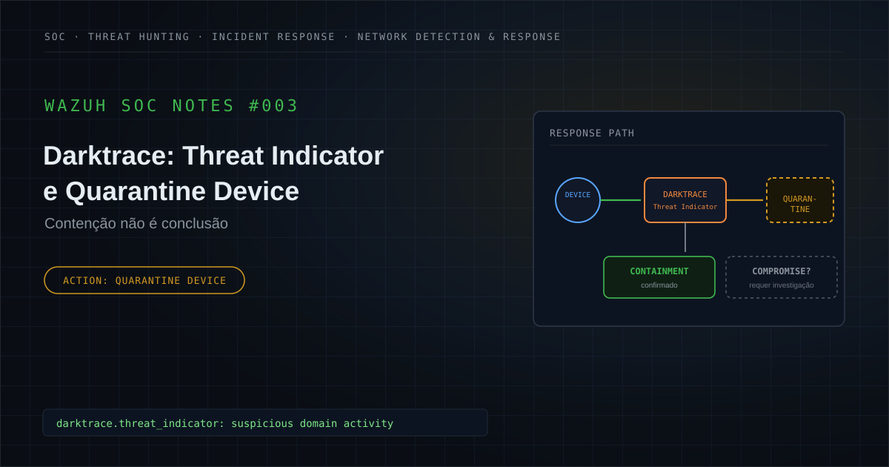

🔗 [Publicado no LinkedIn](https://www.linkedin.com/posts/felipe-r-amaral_wazuh-darktrace-soc-activity-7475601599474614272-CmhO)

---

## Executive Summary

Durante uma atividade de monitoramento de segurança, foi investigado no Wazuh um evento proveniente do **Darktrace** relacionado a um dispositivo monitorado.

A telemetria apresentava um **Threat Indicator associado a atividade de domínio considerada suspeita**, acompanhado de contexto de resposta e registro de:

```text
Quarantine Device
```

A presença de uma quarentena aumentava significativamente a relevância operacional do evento.

Diferentemente de uma detecção puramente informativa, havia indicação de que um controle defensivo havia atuado para restringir o comportamento do dispositivo.

Entretanto, uma distinção precisava ser preservada desde o início da investigação:

```text
Quarantine Applied
        ≠
Confirmed Compromise
```

A telemetria disponível permitia confirmar:

```text
Darktrace Threat Indicator
        +
Suspicious Domain Activity
        +
Quarantine Device
```

Mas não permitia concluir automaticamente:

```text
Malware Confirmed
Malicious Process Confirmed
Initial Access Confirmed
Persistence Confirmed
Credential Access Confirmed
Lateral Movement Confirmed
Command and Control Confirmed
Exfiltration Confirmed
Device Compromise Confirmed
```

O foco da investigação passou a ser determinar se a quarentena estava associada a uma cadeia maliciosa sustentada por outras evidências ou se representava uma **medida preventiva de contenção diante de comportamento considerado relevante pela plataforma**.

Dentro das fontes e do escopo analisados, não havia evidência suficiente para reconstruir uma cadeia de ataque ou confirmar comprometimento do dispositivo.

Diante disso, a classificação técnica adotada foi:

**Contenção preventiva aplicada: comprometimento não confirmado.**

O caso demonstra uma diferença fundamental para operações SOC:

```text
Detection
        ↓
Containment
        ↓
Investigation
        ↓
Evidence
        ↓
Verdict
```

A contenção reduz risco.

Ela não substitui o veredito.

---

## 1. Contexto do alerta

O Wazuh recebeu telemetria proveniente do Darktrace relacionada a um dispositivo monitorado.

O contexto do evento incluía:

```text
Darktrace Threat Indicator
```

associado a:

```text
Suspicious Domain Activity
```

e registro de uma ação de:

```text
Quarantine Device
```

A telemetria também apresentava contexto relacionado ao mecanismo de resposta do Darktrace, incluindo referência ao **Antigena**.

Entretanto, o evento analisado não deve ser descrito publicamente como uma ação autônoma confirmada apenas pela existência da quarentena.

A informação tecnicamente segura para este estudo é:

```text
Darktrace Response / Quarantine Action = Confirmed
```

e não:

```text
Autonomous Response = Confirmed
```

Para a versão pública, foram removidos ou generalizados:

```text
Organization
Client
Device Name
Device IP
MAC Address
Hostname
Domain
Suspicious Domain
Username
Incident ID
Ticket ID
Darktrace Internal Identifier
Model Identifier
Request ID
Exact Timestamp
Wazuh Internal Rule ID
Agent ID
Collector ID
Environment-Specific Identifier
```

O dispositivo será tratado apenas como:

```text
Monitored Device
```

e o domínio envolvido como:

```text
Suspicious Domain
```

A investigação precisava responder:

```text
Why was the device quarantined?
        ↓
What evidence supports malicious activity?
        ↓
Was compromise actually confirmed?
```

---

## 2. Hipótese inicial

A hipótese inicial considerada foi:

```text
Suspicious Domain Activity
        ↓
Darktrace Threat Indicator
        ↓
Quarantine Device
        ↓
Possible Device Compromise?
        ↓
Requires Investigation
```

A existência do Threat Indicator e da quarentena justificava investigar possibilidades como:

- comunicação suspeita;
- comportamento anômalo de rede;
- acesso a domínio de reputação negativa;
- dispositivo potencialmente comprometido;
- malware;
- comunicação de Command and Control;
- atividade legítima classificada como anômala;
- comportamento ainda sem contexto suficiente;
- contenção preventiva.

A principal pergunta era:

```text
Quarantine
        ↓
Confirmed Threat?
        OR
Preventive Defensive Action?
```

A telemetria inicial não era suficiente para responder isoladamente.

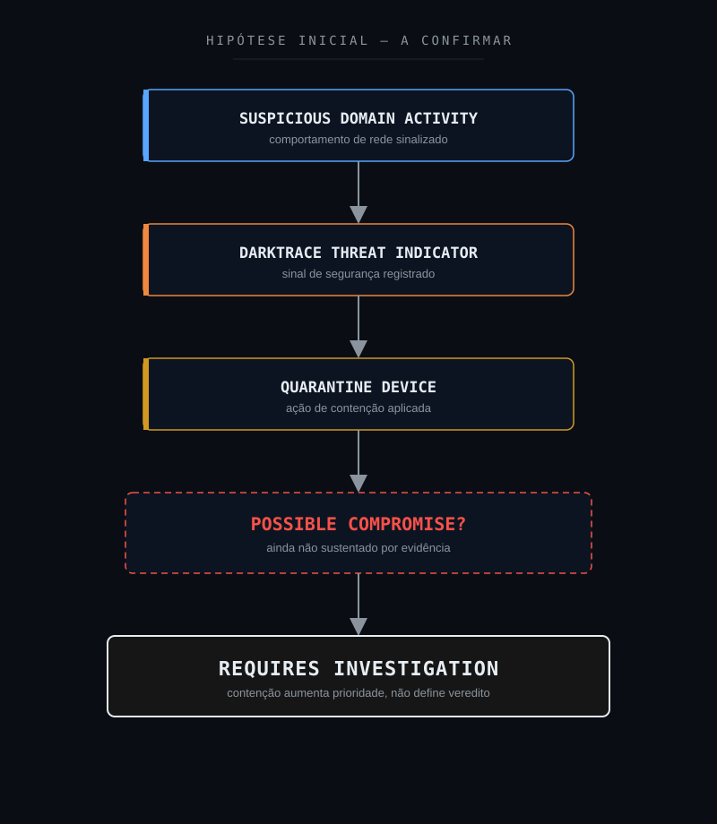

---

## 3. Escopo da investigação

A investigação foi estruturada para responder:

1. O Threat Indicator estava confirmado na telemetria?
2. Qual comportamento estava associado ao indicador?
3. Existia atividade relacionada a domínio suspeito?
4. A quarentena do dispositivo estava registrada?
5. Qual dispositivo estava envolvido?
6. O ativo possuía contexto suficiente?
7. Qual era sua função?
8. O dispositivo apresentava outras anomalias?
9. Existiam outros eventos Darktrace relacionados?
10. Houve recorrência?
11. Existiam outras comunicações suspeitas?
12. Havia processo responsável pela comunicação?
13. Existia telemetria de endpoint disponível?
14. Malware havia sido identificado?
15. Existia vetor de Initial Access?
16. Houve execução maliciosa?
17. Existiam mecanismos de persistência?
18. Houve Credential Access?
19. Existiu Discovery?
20. Houve movimentação lateral?
21. Existia comunicação compatível com Command and Control?
22. Houve coleta ou exfiltração?
23. Existia impacto?
24. A causa raiz poderia ser determinada?
25. A quarentena representava prevenção ou resposta a comprometimento confirmado?
26. Existiam evidências suficientes para classificar o dispositivo como comprometido?

---

## 4. 5W1H

### What: O que aconteceu?

O Darktrace registrou um Threat Indicator relacionado a atividade envolvendo domínio suspeito e uma ação de quarentena associada a um dispositivo monitorado.

### Who: Quem ou o que esteve envolvido?

Um dispositivo monitorado.

Identificadores reais do ativo foram removidos.

### When: Quando ocorreu?

O evento ocorreu dentro da janela analisada pelo SOC.

O timestamp exato não é publicado.

### Where: Onde ocorreu?

Em um ambiente monitorado pelo Darktrace e cuja telemetria era encaminhada para análise no Wazuh.

A infraestrutura original não é identificada.

### Why: Por que era relevante?

Porque a telemetria combinava:

```text
Threat Indicator
        +
Suspicious Domain Activity
        +
Quarantine Device
```

Isso justificava avaliar a possibilidade de comprometimento ou comunicação maliciosa.

### How: Como foi analisado?

Foram considerados:

- evento Darktrace;
- Threat Indicator;
- domínio suspeito de forma sanitizada;
- quarentena;
- contexto do dispositivo;
- eventos relacionados;
- recorrência;
- possíveis indicadores complementares;
- limitações de telemetria;
- evidências de comprometimento.

---

## 5. Evidências disponíveis

A investigação separou fatos observados de elementos que não podiam ser determinados.

| Evidência | Fonte | Classificação | Confiança |
|---|---|---|---|
| Evento Darktrace observado no Wazuh | Darktrace / Wazuh | Confirmed | High |
| Threat Indicator presente | Darktrace | Confirmed | High |
| Atividade relacionada a domínio suspeito | Darktrace | Confirmed | High |
| Quarantine Device registrada | Darktrace | Confirmed | High |
| Contexto Antigena presente na telemetria | Darktrace | Confirmed | High |
| Dispositivo associado ao evento | Darktrace | Confirmed | High |
| Identidade/função completa do ativo | Investigação | Not Available | Medium |
| Processo responsável pela comunicação | Telemetria disponível | Not Available | Medium |
| Malware identificado | Telemetria disponível | Not Available | Medium |
| Initial Access | Telemetria disponível | Not Available | Medium |
| Execução maliciosa | Telemetria disponível | Not Available | Medium |
| Persistência | Telemetria disponível | Not Available | Medium |
| Credential Access | Telemetria disponível | Not Available | Medium |
| Lateral Movement | Telemetria disponível | Not Available | Medium |
| Command and Control confirmado | Telemetria disponível | Not Available | Medium |
| Exfiltração | Telemetria disponível | Not Available | Medium |
| Causa raiz | Investigação | Not Available | Medium |
| Comprometimento do dispositivo | Investigação | Not Confirmed | High |

A síntese das evidências era:

```text
Threat Indicator = Confirmed
Suspicious Domain Activity = Confirmed
Quarantine = Confirmed
Compromise = Not Confirmed
```

---

## 6. Classificação das evidências

### Confirmed

Informação diretamente demonstrada pela telemetria.

Exemplos neste case:

```text
Threat Indicator
Suspicious Domain Activity
Quarantine Device
```

### Supported

Conclusão sustentada por múltiplos elementos coerentes.

### Inferred

Conclusão analítica baseada nas evidências disponíveis.

### Hypothesis

Possibilidade considerada durante a investigação.

### Not Observed

Utilizado somente quando determinado comportamento foi efetivamente procurado nas fontes disponíveis e não foi identificado.

### Not Available

A telemetria não fornece informação suficiente para determinar.

### Not Applicable

O elemento não possui aderência ao cenário.

Neste case, `Not Available` é especialmente importante.

Por exemplo:

```text
No telemetry confirming malware
```

não deve ser transformado em:

```text
Malware = Not Observed
```

caso a fonte analisada sequer possua visibilidade adequada sobre processos ou arquivos.

Da mesma forma:

```text
Quarantine = Confirmed
```

não permite transformar:

```text
Compromise = Unknown
```

em:

```text
Compromise = Confirmed
```

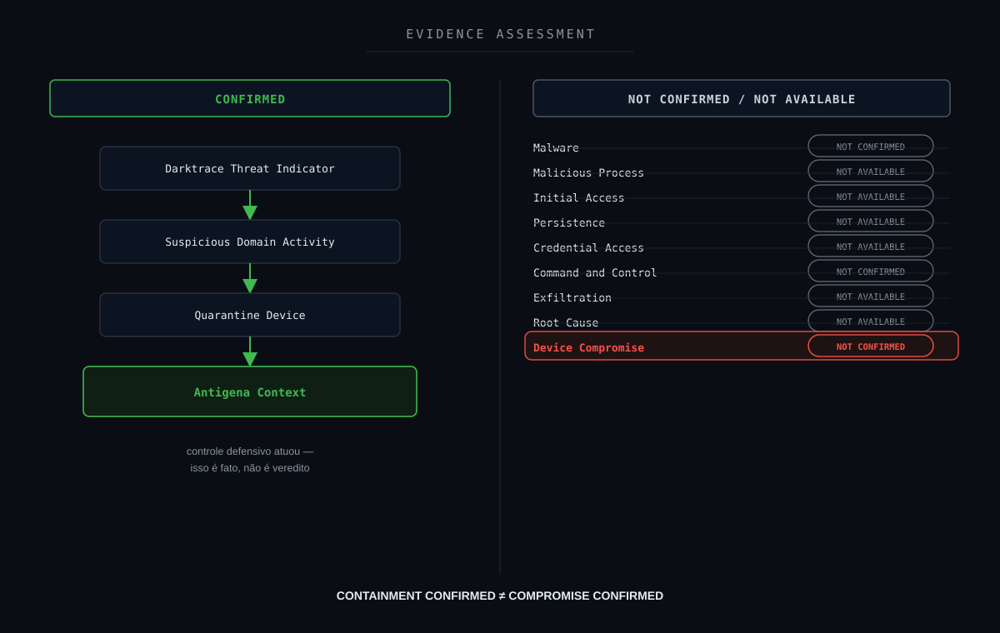

---

## 7. Timeline da investigação

A sequência lógica pode ser representada como:

```text
Device Network Activity
        ↓
Suspicious Domain Activity
        ↓
Darktrace Threat Indicator
        ↓
Quarantine Device
        ↓
Security Event
        ↓
Wazuh
        ↓
SOC Alert
        ↓
Initial Hypothesis
        ↓
Possible Device Compromise
        ↓
Threat Hunting
        ↓
Related Event Correlation
        ↓
Device Context Assessment
        ↓
Evidence Classification
        ↓
Containment Confirmed
        ↓
Compromise Not Confirmed
        ↓
Preventive Containment
```

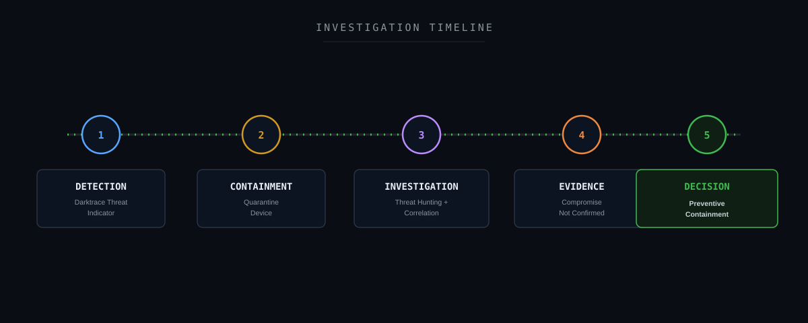

---

## 8. Threat Hunting

O Threat Hunting buscou identificar elementos capazes de aumentar ou reduzir a confiança na hipótese de comprometimento.

### Eventos Darktrace

```text
rule.description:*Darktrace*
```

### Eventos relacionados a Threat Indicator

```text
full_log:*"Threat Indicator"*
```

### Eventos relacionados a quarentena

```text
full_log:*quarantine*
```

### Busca pelo tipo de ação

```text
full_log:*"Quarantine device"*
```

### Correlação Darktrace + quarentena

```text
rule.description:*Darktrace* AND full_log:*quarantine*
```

### Correlação com Threat Indicator

```text
rule.description:*Darktrace* AND full_log:*"Threat Indicator"*
```

### Busca dentro da janela analisada

```text
@timestamp:[<START_TIME> TO <END_TIME>] AND rule.description:*Darktrace*
```

### Correlação pelo dispositivo

Quando um identificador sanitizado estiver disponível:

```text
full_log:*<DEVICE_IDENTIFIER>*
```

### Correlação com domínio

```text
full_log:*<SANITIZED_DOMAIN>*
```

A consulta real deve ser adaptada à estrutura do índice e decoder.

Nenhum valor real do dispositivo ou domínio é publicado.

---

## 9. Campos relevantes para investigação

Campos básicos:

```text
@timestamp
rule.id
rule.level
rule.description
location
full_log
```

Dependendo da estrutura da integração Darktrace:

```text
device.id
device.name
device.ip
source.ip
destination.ip
destination.domain
destination.port
protocol
model
threat_indicator
action
inhibitor
score
```

Os campos permitem avaliar:

- dispositivo;
- origem;
- destino;
- indicador;
- ação;
- recorrência;
- protocolo;
- score;
- contexto temporal.

Os nomes conceituais podem ser publicados.

Os valores reais não.

---

## 10. Resultado do Threat Hunting

A investigação confirmou:

```text
Darktrace Event
        +
Threat Indicator
        +
Suspicious Domain Activity
        +
Quarantine Device
```

Entretanto, o evento não fornecia sozinho visibilidade suficiente para determinar:

```text
Initial Access
Malware
Process Execution
Persistence
Credential Access
Lateral Movement
C2
Exfiltration
Root Cause
```

A hipótese inicial era:

```text
Suspicious Domain Activity
        ↓
Possible Device Compromise
```

Após análise das evidências disponíveis:

```text
Suspicious Domain Activity
        ↓
Darktrace Threat Indicator
        ↓
Quarantine Applied
        ↓
Insufficient Supporting Evidence
        ↓
Compromise Not Confirmed
```

A conclusão correta não era:

```text
Safe Device
```

nem:

```text
Confirmed Compromised Device
```

Era:

```text
Contained
        +
Compromise Not Confirmed
```

---

## 11. Entendendo Threat Indicator e Quarantine

Um Threat Indicator representa um sinal de segurança que merece avaliação.

Ele pode resultar de diferentes tipos de análise comportamental, contexto de ameaça ou correlação da plataforma.

Entretanto:

```text
Threat Indicator
        ≠
Confirmed Incident
```

Da mesma forma, uma ação de:

```text
Quarantine Device
```

representa essencialmente:

```text
Containment
```

A contenção tem como objetivo reduzir a capacidade de determinada atividade continuar enquanto o caso é avaliado.

O fluxo conceitual correto é:

```text
Behavior
        ↓
Detection / Threat Indicator
        ↓
Defensive Action
        ↓
Containment
        ↓
Investigation Continues
```

e não:

```text
Quarantine
        ↓
Compromise Confirmed
```

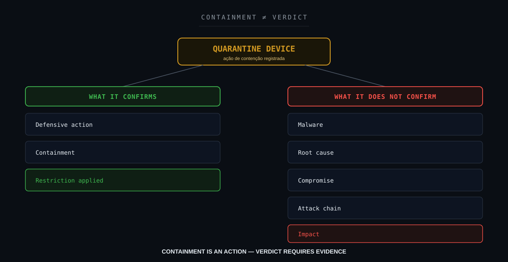

---

## 12. Correlação técnica

A investigação precisa diferenciar:

### Cenário A: contenção preventiva

```text
Threat Indicator
        +
Suspicious Network Activity
        +
Quarantine
        +
Limited Supporting Evidence
        +
Compromise Not Confirmed
        ↓
Preventive Containment
```

### Cenário B: comprometimento confirmado

```text
Threat Indicator
        +
Quarantine
        +
Malware Evidence
        +
Malicious Process
        +
Persistence
        +
C2 / Lateral Movement
        +
Multiple Supporting Indicators
        ↓
Confirmed Security Incident
```

A quarentena pode existir nos dois cenários.

O veredito depende das demais evidências.

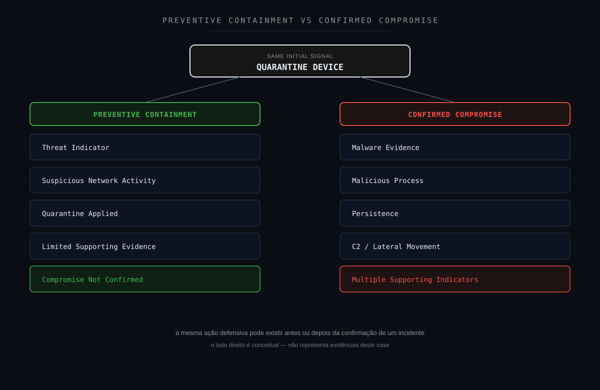

---

## 13. Cadeia fim a fim do evento

A cadeia técnica observável pode ser representada como:

```text
Monitored Device
        ↓
Suspicious Domain Activity
        ↓
Darktrace Threat Indicator
        ↓
Quarantine Device
        ↓
Security Event
        ↓
Log Collection
        ↓
Wazuh
        ↓
SOC Alert
        ↓
Initial Hypothesis
        ↓
Threat Hunting
        ↓
Related Activity Correlation
        ↓
Device Context Assessment
        ↓
Evidence Classification
        ↓
Containment Confirmed
        ↓
Compromise Not Confirmed
        ↓
Technical Verdict
```

Essa cadeia representa:

```text
Behavior
    ↓
Detection
    ↓
Containment
    ↓
Telemetry
    ↓
Investigation
    ↓
Decision
```

Ela não representa uma cadeia adversarial confirmada.

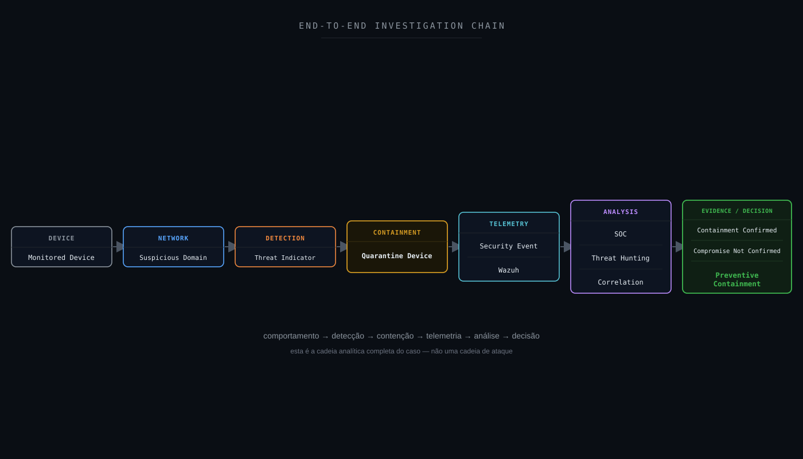

---

## 14. Attack Flow

Não foi identificado um Attack Flow adversarial confirmado.

A telemetria não permitia reconstruir com confiança:

```text
Initial Access
        ↓
Execution
        ↓
Persistence
        ↓
Credential Access
        ↓
Lateral Movement
        ↓
Command and Control
        ↓
Exfiltration
```

Seria incorreto utilizar a quarentena como evidência indireta de todas essas etapas.

O fluxo apropriado é:

```text
Threat Indicator
        ↓
Quarantine
        ↓
Possible Compromise Hypothesis
        ↓
Investigation
        ↓
Evidence Assessment
        ↓
Compromise Not Confirmed
```

Portanto:

```text
Investigation Flow = Applicable
```

enquanto:

```text
Confirmed Adversary Attack Flow = Not Available
```

---

## 15. Attack Chain Assessment

| Estágio | Status | Fundamentação |
|---|---|---|
| Reconnaissance | Not Available | Evento não permite determinar |
| Initial Access | Not Available | Vetor de entrada não demonstrado |
| Execution | Not Available | Processo originador não disponível |
| Persistence | Not Available | Telemetria insuficiente |
| Privilege Escalation | Not Available | Telemetria insuficiente |
| Defense Evasion | Not Available | Telemetria insuficiente |
| Credential Access | Not Available | Telemetria insuficiente |
| Discovery | Not Available | Telemetria insuficiente |
| Lateral Movement | Not Available | Telemetria insuficiente |
| Collection | Not Available | Telemetria insuficiente |
| Command and Control | Not Available | Domínio suspeito isoladamente não confirma C2 |
| Exfiltration | Not Available | Telemetria insuficiente |
| Impact | Not Available | Impacto não determinado |

Um ponto particularmente importante:

```text
Suspicious Domain Activity
        ≠
Confirmed Command and Control
```

Um domínio suspeito pode aumentar a hipótese de C2.

Não confirma automaticamente a técnica.

---

## 16. MITRE ATT&CK Mapping

Nenhuma técnica MITRE ATT&CK específica deve ser tratada como confirmada neste case.

Uma atividade envolvendo domínio suspeito poderia levantar hipóteses relacionadas a diferentes comportamentos adversariais.

Entretanto, faltavam evidências suficientes para determinar:

```text
Which adversary behavior?
Which process?
Which execution chain?
Which objective?
```

Portanto:

```text
MITRE ATT&CK = Investigation Support
```

e não:

```text
Confirmed TTP Mapping
```

Especialmente:

```text
Suspicious Domain
        ≠
Command and Control Confirmed
```

O ATT&CK deve ser utilizado quando a telemetria sustenta o comportamento adversarial.

Não apenas porque um controle defensivo tomou uma ação.

---

## 17. MITRE Detection Strategy

Uma estratégia de investigação mais robusta poderia correlacionar:

```text
Threat Indicator
        +
Domain Reputation
        +
DNS Activity
        +
Network Connections
        +
Device Context
        +
Process Telemetry
        +
Authentication Events
        +
Endpoint Alerts
        +
Historical Behavior
```

Exemplo:

```text
Suspicious Domain
        +
Unexpected Process
        +
Repeated Beaconing
        +
Endpoint Detection
        +
Persistence
        ↓
Higher Confidence
```

Enquanto:

```text
Suspicious Domain
        +
No Process Visibility
        +
No Endpoint Context
        ↓
Investigation Required
```

A qualidade do veredito depende da correlação.

---

## 18. Framework Mapping

Um framework só entra nesta lista quando há um número, técnica ou controle real e específico que se aplique a este case, não como referência genérica.

### MITRE D3FEND

**Aplicabilidade: direta.**

A ação de quarentena possui relação direta com o mecanismo defensivo:

```text
D3-NI: Network Isolation
```

A ideia defensiva consiste em restringir a capacidade de determinado host interagir com recursos de rede não necessários.

### MITRE Attack Flow / Cyber Kill Chain

**Aplicabilidade: lente analítica, sem cadeia confirmada.**

Estruturam a pergunta "houve progressão adversarial?" feita na Seção 15 (Attack Chain Assessment). Nenhum estágio foi confirmado, nem mesmo uma técnica MITRE ATT&CK específica (ver Seção 16).

### NIST CSF

**Aplicabilidade: direta.**

Especialmente Detect, Respond e Improve.

### NIST SP 800-61

**Aplicabilidade: direta.**

A contenção é apenas uma etapa dentro do tratamento do incidente.

### ISO/IEC 27035

**Aplicabilidade: direta.**

Ciclo de 5 fases (Plan & Prepare / Detection & Reporting / Assessment & Decision / Responses / Lessons Learned).

### SANS PICERL

**Aplicabilidade: direta.**

Identification, Containment (quarentena aplicada) e Lessons Learned mapeados diretamente na estrutura deste note.

### ISO/IEC 27001

**Aplicabilidade: direta.**

Anexo A 5.24–5.28 — controles de gestão de incidente de segurança da informação.

### COBIT 2019

**Aplicabilidade: direta.**

DSS02 (Managed Service Requests and Incidents) e MEA01/MEA02 (monitoramento e melhoria contínua).

### ITIL 4

**Aplicabilidade: direta.**

Prática de Incident Management e prática de Continual Improvement.

### Agile / Kanban

**Aplicabilidade: operacional (não classifica evidência do case).**

O pipeline de Detection Engineering (Seção 24) poderia ser gerenciado como backlog Scrum/Kanban: cada nova hipótese de detecção como item de sprint. Não é usado para classificar nenhum fato técnico deste alerta.

### CIS Controls

**Aplicabilidade: direta.**

```text
CIS 1 : Inventory and Control of Enterprise Assets
CIS 6 : Access Control Management
CIS 8 : Audit Log Management
CIS 13: Network Monitoring and Defense
CIS 17: Incident Response Management
```

### SOC-CMM

**Aplicabilidade: direta.**

Detection Management e Asset Context.

### Metodologia analítica aplicada

```text
ACH: Analysis of Competing Hypotheses
```

A Seção 13 avalia cenários concorrentes (falso positivo vs. comprometimento real) e os refuta por evidência disponível.

```text
Método Científico
```

Hipótese → Evidência → Teste → Conclusão é a estrutura epistêmica de todo o note.

```text
OODA Loop
```

Observe (telemetria) → Orient (hipótese/evidência) → Decide (veredito) → Act (recomendações).

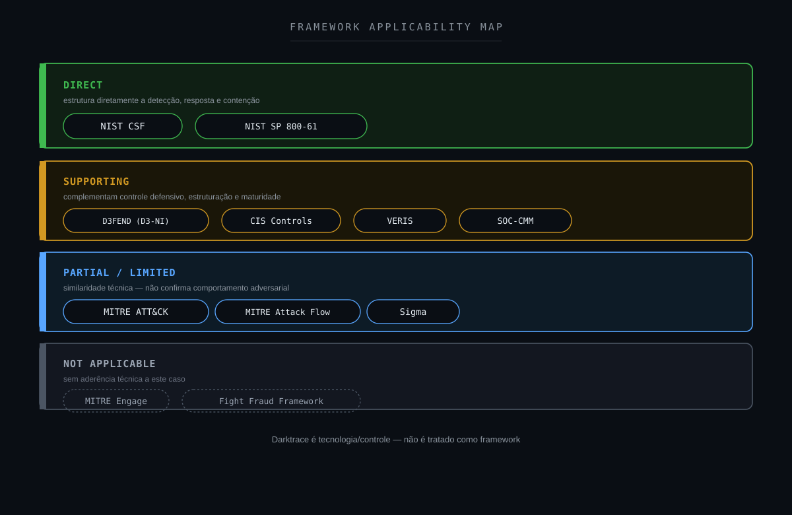

---

## 19. NIST Mapping

### IDENTIFY

Determinar:

- qual ativo;
- função;
- proprietário;
- criticidade;
- sistema operacional;
- comportamento esperado;
- dependências.

### PROTECT

Controles preventivos podem limitar exposição e progressão.

### DETECT

O Darktrace produziu o Threat Indicator.

### RESPOND

Foi registrada uma ação de quarentena.

Depois disso, o SOC precisava continuar:

```text
Contain
        ↓
Investigate
        ↓
Analyze
        ↓
Classify
```

### RECOVER

A necessidade de recuperação depende da confirmação de impacto.

Neste case:

```text
Recovery Requirement = Not Determined
```

### GOVERN

O caso possui relação com:

- autorização para ações de contenção;
- governança de resposta;
- criticidade de ativos;
- ownership;
- exceções;
- procedimentos de liberação.

### IMPROVE

O caso pode ser utilizado para melhorar:

- asset context;
- playbooks;
- correlação;
- enriquecimento;
- integração NDR/EDR;
- classificação de resposta.

---

## 20. CIS Controls

O cenário possui relação com:

- Inventory and Control of Enterprise Assets;
- Audit Log Management;
- Network Monitoring and Defense;
- Incident Response Management;
- Access Control Management;
- Continuous Monitoring.

O inventário de ativos merece destaque.

Sem contexto suficiente do dispositivo, perguntas básicas tornam-se mais difíceis:

```text
What is this device?
Who owns it?
What is its function?
What should it access?
What is normal behavior?
```

Portanto:

> **asset context também é capacidade defensiva.**

---

## 21. Detection Strategy

### Visão atual

```text
Suspicious Domain Activity
        ↓
Darktrace Threat Indicator
        ↓
Quarantine Device
        ↓
Wazuh Alert
```

Essa sequência oferece boa visibilidade sobre:

```text
Detection
        +
Containment
```

Mas ainda pode exigir enriquecimento para:

```text
Root Cause
        +
Compromise Validation
```

Uma estratégia mais completa:

```text
Threat Indicator
        +
Device Identity
        +
Asset Context
        +
DNS Activity
        +
Network Relationships
        +
Endpoint Telemetry
        +
Historical Behavior
        +
Containment Status
        ↓
Contextual Risk
```

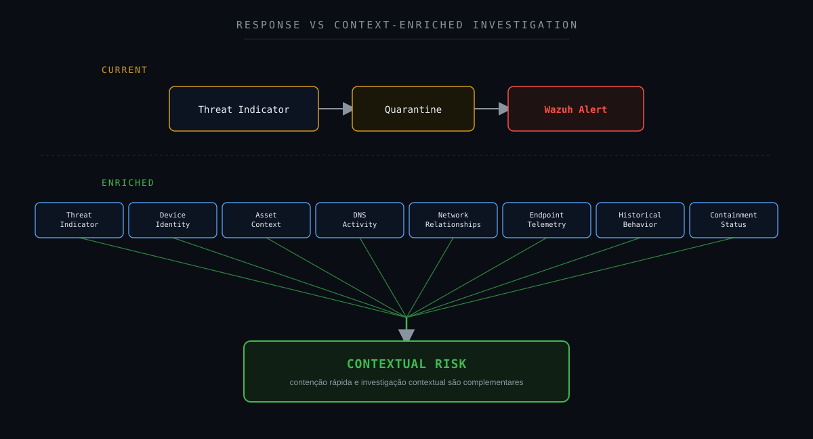

---

## 22. Detection Gap Analysis

### O que sabemos?

```text
Darktrace Event = Confirmed
Threat Indicator = Confirmed
Suspicious Domain Activity = Confirmed
Quarantine Device = Confirmed
```

### O que ainda não sabemos?

```text
What process generated the traffic?
Was malware involved?
Was the device initially compromised?
Was there persistence?
Was the suspicious domain used for C2?
Was there lateral movement?
Was there data collection?
Was there exfiltration?
What was the root cause?
```

A principal lacuna pode ser resumida como:

```text
Containment Visibility
        >
Root Cause Visibility
```

Sabemos que um controle atuou.

Não sabemos automaticamente por que toda a cadeia ocorreu.

---

## 23. Oportunidades de enriquecimento

Um evento desse tipo pode ser enriquecido com:

```text
Asset Owner
Asset Type
Asset Criticality
Operating System
Known Device?
Historical Baseline
DNS History
Domain Reputation
Source / Destination
Protocol
Port
Process Tree
EDR Alerts
Authentication Activity
Proxy Logs
Firewall Logs
Recent Changes
Vulnerability Context
```

Exemplo de aumento de confiança:

```text
Threat Indicator
        +
Suspicious Domain
        +
Unexpected Process
        +
Repeated Network Activity
        +
EDR Alert
        +
Persistence
        ↓
Higher Suspicion
```

Exemplo de redução de confiança na hipótese maliciosa:

```text
Threat Indicator
        +
Known Asset
        +
Known Application
        +
Legitimate Process
        +
Expected Destination Context
        +
No Supporting Evidence
        ↓
Lower Suspicion
```

Esses exemplos representam possibilidades futuras.

Não evidências observadas no #003.

---

## 24. Detection Engineering

O case representa uma oportunidade para desenvolver correlações baseadas em confiança.

Pipeline conceitual:

```text
DARKTRACE EVENT
        ↓
DEVICE
        ↓
ASSET CONTEXT
        ↓
DNS / NETWORK
        ↓
ENDPOINT
        ↓
IDENTITY
        ↓
RELATED ALERTS
        ↓
EVIDENCE
        ↓
CONTEXTUAL RISK
```

Possíveis resultados:

```text
LOW CONFIDENCE
```

```text
MEDIUM CONFIDENCE
```

```text
HIGH CONFIDENCE
```

Exemplo:

```text
Threat Indicator
        +
Unknown Device
        +
Suspicious Domain
        +
EDR Detection
        +
Unexpected Process
        ↓
HIGHER CONFIDENCE
```

Outro cenário:

```text
Threat Indicator
        +
Known Device
        +
Known Process
        +
Expected Context
        +
No Supporting Indicators
        ↓
LOWER CONFIDENCE
```

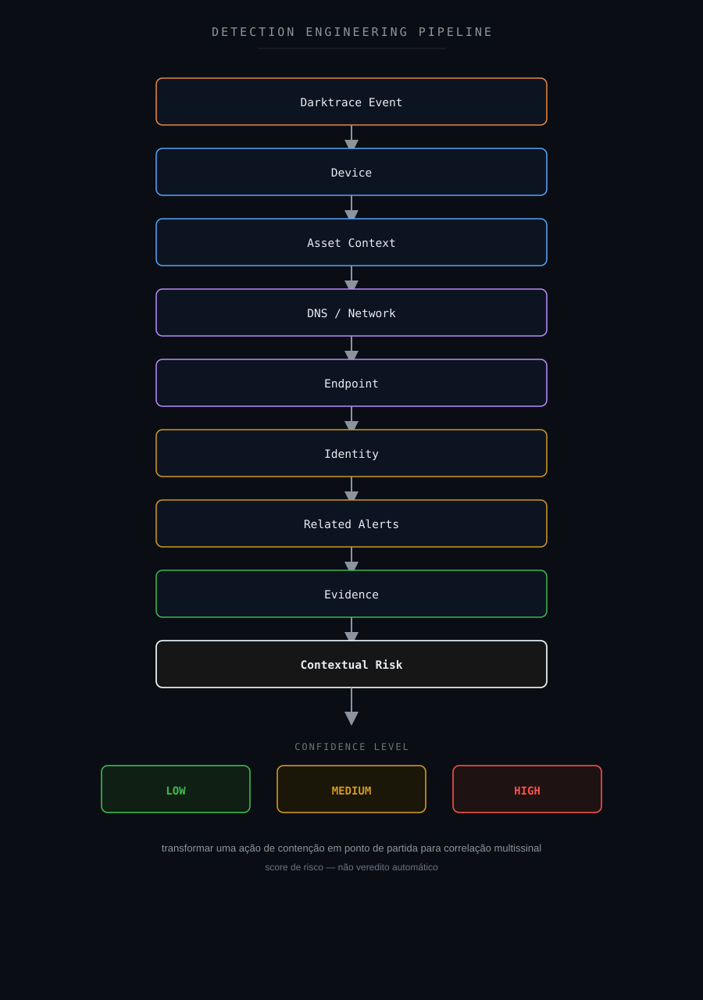

---

## 25. Sigma

Nenhuma regra Sigma foi necessária para determinar a classificação deste estudo.

Entretanto, Sigma poderia complementar a investigação quando outras fontes estivessem disponíveis.

Exemplos de comportamentos relevantes:

```text
Unexpected Process Creation
```

```text
Suspicious PowerShell
```

```text
Credential Dumping
```

```text
Persistence Mechanism
```

```text
Unexpected Remote Service
```

```text
Suspicious Outbound Connection
```

O objetivo seria buscar evidências adicionais capazes de sustentar ou enfraquecer a hipótese de comprometimento.

Sigma deve ser utilizado como parte de Detection Engineering.

Não como prova automática de ataque.

---

## 26. Hardening Opportunities

O evento analisado não demonstra uma vulnerabilidade específica de hardening.

Ainda assim, algumas medidas podem melhorar a postura defensiva.

### Asset Inventory

Manter inventário atualizado dos dispositivos.

### Asset Ownership

Relacionar ativos a responsáveis.

### Network Segmentation

Restringir comunicação conforme necessidade operacional.

### Least Privilege

Reduzir acessos e privilégios desnecessários.

### DNS Monitoring

Aumentar visibilidade sobre resoluções e comunicação com domínios de risco.

### Endpoint Telemetry

Garantir visibilidade sobre:

```text
Processes
Files
Persistence
Users
Network Connections
```

### Logging

Correlacionar:

```text
NDR
EDR
DNS
Proxy
Firewall
Authentication
Operating System
Application
```

### Response Governance

Definir:

- quais ativos podem ser isolados;
- critérios de contenção;
- exceções;
- procedimentos de validação;
- processo de liberação;
- responsáveis.

Nesse case, hardening representa oportunidade de melhoria.

Não correção de comprometimento confirmado.

---

## 27. Controles defensivos

Uma arquitetura Defense-in-Depth pode incluir:

```text
Asset Context
        ↓
Network Visibility
        ↓
Darktrace
        ↓
Containment
        ↓
Endpoint / Identity
        ↓
Wazuh / SIEM
        ↓
SOC / Threat Hunting
```

Cada camada responde a perguntas diferentes.

```text
Darktrace
→ What network behavior deserves attention?
```

```text
Containment
→ What activity should be restricted now?
```

```text
Endpoint
→ What executed?
```

```text
Identity
→ Who authenticated?
```

```text
SIEM
→ What correlates?
```

```text
SOC
→ What does the evidence actually support?
```

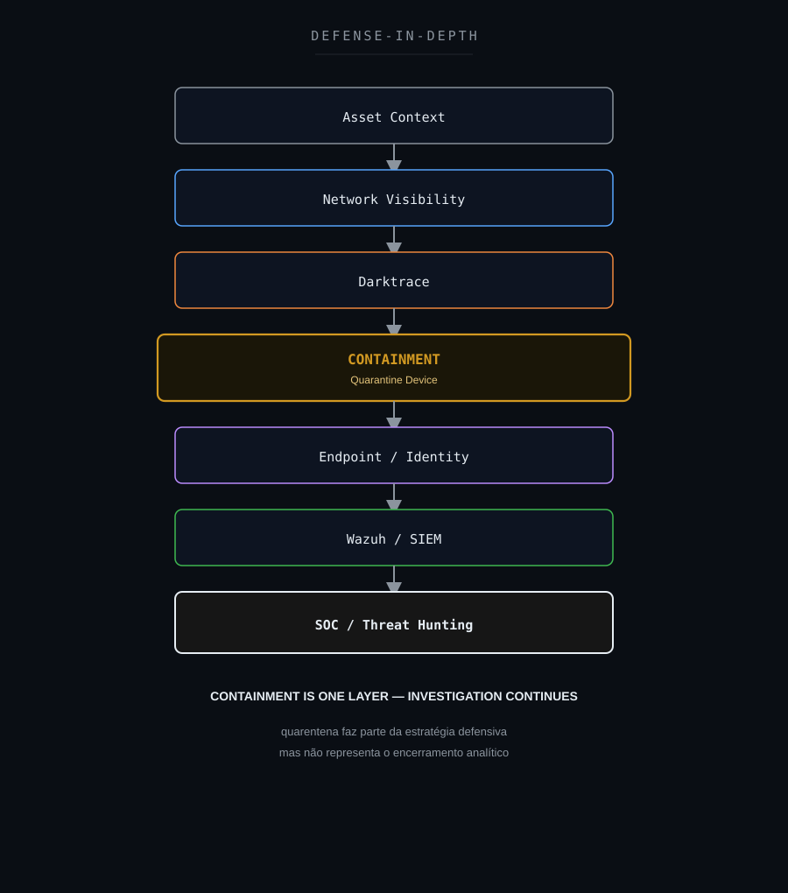

---

## 28. SOC-CMM

Esse cenário possui relação com capacidades de:

- Security Monitoring;
- Incident Analysis;
- Threat Hunting;
- Detection Management;
- Response Management;
- Asset Context;
- Continuous Improvement.

### Fluxo menos maduro

```text
Quarantine Alert
        ↓
Device Blocked
        ↓
Close
```

Problema:

```text
Containment
        =
Assumed Resolution
```

### Fluxo investigativo

```text
Quarantine Alert
        ↓
Validate Event
        ↓
Identify Device
        ↓
Understand Context
        ↓
Threat Hunting
        ↓
Correlate Evidence
        ↓
Determine Compromise
        ↓
Decide
```

### Fluxo enriquecido

```text
Darktrace
        +
Asset Context
        +
Endpoint
        +
Identity
        +
DNS
        +
Network
        +
SIEM
        +
Analyst Validation
        ↓
Evidence-Based Response
```

Um único caso não determina a maturidade do SOC.

O modelo serve como referência.

---

## 29. Métricas operacionais

O cenário pode contribuir para métricas como:

| Métrica | Objetivo |
|---|---|
| MTTD | Tempo até detecção |
| MTTA | Tempo até reconhecimento |
| MTTC | Tempo até contenção |
| MTTR | Tempo até resolução/recuperação conforme definição |
| Containment Rate | Volume de ações de contenção |
| False Positive Rate | Qualidade contextual |
| Detection Coverage | Cobertura defensiva |
| Enrichment Coverage | Disponibilidade de contexto |
| Escalation Rate | Casos que exigem investigação adicional |
| SLA | Acompanhamento operacional |

Um ponto importante:

```text
Fast MTTC
        ≠
Fast Root Cause Analysis
```

Uma plataforma pode conter rapidamente.

A investigação ainda pode demandar correlação adicional.

Nenhum valor interno é publicado.

---

## 30. Decision Flow

```text
Darktrace Event?
        ↓
YES
        ↓
Quarantine Confirmed?
        ↓
YES
        ↓
Device Context Available?
        ├── NO
        │    ↓
        │  Enrich Asset Context
        │    ↓
        │  Continue Investigation
        │
        └── YES
             ↓
Supporting Malicious Evidence?
        ├── YES
        │    ↓
        │  Escalate Investigation
        │
        └── NO / NOT AVAILABLE
             ↓
Root Cause Determined?
        ├── YES
        │    ↓
        │  Classify According to Evidence
        │
        └── NO
             ↓
Compromise Confirmed?
        ├── YES
        │    ↓
        │  CONFIRMED SECURITY INCIDENT
        │
        └── NO
             ↓
PREVENTIVE CONTAINMENT
COMPROMISE NOT CONFIRMED
```

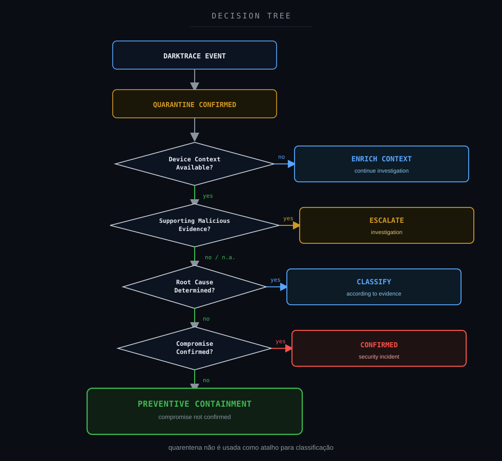

---

## 31. Veredito técnico

### Evento

```text
Confirmed
```

### Plataforma

```text
Darktrace
```

### Threat Indicator

```text
Confirmed
```

### Atividade de domínio suspeito

```text
Confirmed
```

### Quarantine Device

```text
Confirmed
```

### Contenção

```text
Confirmed
```

### Processo originador

```text
Not Available
```

### Malware

```text
Not Confirmed
```

### Initial Access

```text
Not Available
```

### Persistência

```text
Not Available
```

### Command and Control

```text
Not Confirmed
```

### Exfiltração

```text
Not Available
```

### Causa raiz

```text
Not Available
```

### Comprometimento

```text
Not Confirmed
```

### Classificação final

**Contenção preventiva aplicada: comprometimento não confirmado.**

A telemetria é suficiente para concluir:

```text
Threat Indicator = TRUE
Suspicious Domain Activity = TRUE
Quarantine = TRUE
Containment = TRUE
```

Não é suficiente para concluir:

```text
Compromise = TRUE
```

### Veredito

```text
PREVENTIVE CONTAINMENT APPLIED
COMPROMISE NOT CONFIRMED
```

---

## 32. Por que não classificar imediatamente como incidente confirmado?

O evento ocorreu.

```text
Security Event = TRUE
```

O Threat Indicator existiu.

```text
Threat Indicator = TRUE
```

A quarentena foi registrada.

```text
Quarantine = TRUE
```

A pergunta era:

```text
Confirmed Compromise = ?
```

Com as evidências disponíveis:

```text
Threat Indicator
        +
Suspicious Domain Activity
        +
Quarantine
        +
Insufficient Process Visibility
        +
Insufficient Root Cause Evidence
        +
No Confirmed Attack Chain
        ↓
Compromise Not Confirmed
```

Logo:

```text
True Event
        ≠
Confirmed Compromise
```

e:

```text
Containment
        ≠
Final Verdict
```

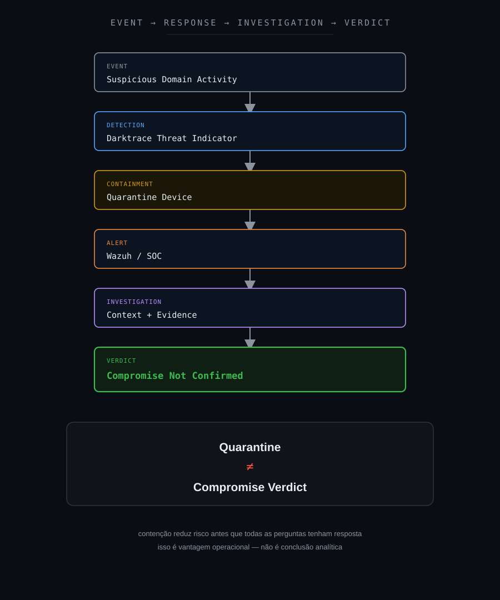

---

## 33. Lições aprendidas

A principal lição deste estudo é:

> **contenção não é conclusão.**

Uma ação defensiva pode reduzir risco antes que todas as perguntas tenham resposta.

Isso é uma vantagem operacional.

Mas precisa ser interpretado corretamente.

### Quarentena é evidência de ação defensiva

Ela demonstra:

```text
A control acted
```

Não demonstra automaticamente:

```text
Why the event happened
```

### Domínio suspeito não confirma C2

```text
Suspicious Domain
        ≠
Confirmed Command and Control
```

São necessárias evidências adicionais.

### Contenção e erradicação são conceitos diferentes

Um dispositivo isolado pode ainda necessitar:

- investigação;
- coleta;
- análise;
- remediação;
- recuperação.

### Automação ou resposta rápida não elimina análise

Mesmo quando uma ferramenta toma uma ação imediatamente, o SOC ainda precisa compreender o contexto.

### Asset Context importa

Sem contexto suficiente:

```text
What is the asset?
Who owns it?
What should it communicate with?
What is expected?
```

tornam-se perguntas mais difíceis.

### Not Available não significa benigno

```text
No process telemetry
```

não significa:

```text
No malicious process
```

### Não extrapolar ATT&CK

Uma detecção de domínio suspeito não autoriza mapear automaticamente:

```text
C2
Persistence
Credential Access
Exfiltration
```

### Estado operacional precisa ser preciso

Um caso pode estar:

```text
Contained
```

sem estar:

```text
Resolved
```

---

## 34. Recomendações

1. Manter visibilidade sobre ações de quarentena do Darktrace.
2. Correlacionar Threat Indicators com outros eventos do mesmo dispositivo.
3. Validar identidade e função do ativo.
4. Integrar inventário de ativos à investigação.
5. Correlacionar Darktrace com EDR.
6. Correlacionar eventos DNS.
7. Correlacionar proxy e firewall.
8. Investigar processo responsável pela comunicação quando houver endpoint telemetry.
9. Avaliar histórico de resoluções do domínio.
10. Avaliar frequência e padrão temporal da comunicação.
11. Correlacionar eventos de autenticação.
12. Buscar persistência quando houver visibilidade adequada.
13. Avaliar lateral movement apenas quando houver evidência.
14. Não inferir C2 exclusivamente a partir de domínio suspeito.
15. Não classificar quarentena isolada como comprometimento.
16. Não classificar quarentena isolada como falso positivo.
17. Diferenciar estados `Contained`, `Investigating` e `Resolved`.
18. Documentar critérios para liberação do dispositivo.
19. Definir procedimentos específicos para ativos críticos.
20. Preservar telemetria anterior e posterior à quarentena.
21. Desenvolver enriquecimento automático de ativos.
22. Correlacionar histórico comportamental.
23. Utilizar contextual risk scoring.
24. Medir MTTC separadamente de MTTR.
25. Documentar lacunas de telemetria.
26. Manter decisões baseadas em evidências.

---

## 35. Investigation Flow: visão final

```text
Suspicious Domain Activity
        ↓
Darktrace Threat Indicator
        ↓
Quarantine Device
        ↓
Wazuh Alert
        ↓
Initial Hypothesis
Possible Device Compromise
        ↓
Threat Hunting
        ↓
Related Activity Correlation
        ↓
Device / Asset Context
        ↓
Evidence Assessment
        ↓
Containment Confirmed
        ↓
Root Cause Not Available
        ↓
Compromise Not Confirmed
        ↓
Technical Reassessment
        ↓
PREVENTIVE CONTAINMENT
```

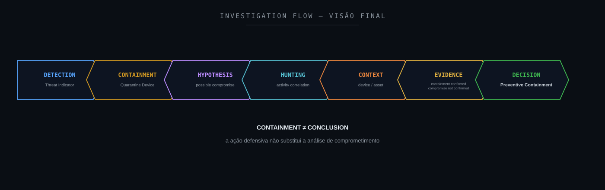

O fluxo analítico pode ser resumido em:

```text
DETECTION
    ↓
CONTAINMENT
    ↓
HYPOTHESIS
    ↓
HUNTING
    ↓
CONTEXT
    ↓
EVIDENCE
    ↓
DECISION
```

---

## 36. Referências técnicas

### Darktrace

- [Darktrace](https://www.darktrace.com/)
- [Darktrace Network](https://www.darktrace.com/products/network)
- [Darktrace ActiveAI Security Platform](https://www.darktrace.com/)

### Wazuh

- [Wazuh Documentation](https://documentation.wazuh.com/)

### MITRE ATT&CK

- [MITRE ATT&CK](https://attack.mitre.org/)

### MITRE D3FEND

- [MITRE D3FEND](https://d3fend.mitre.org/)
- [MITRE D3FEND: Network Isolation](https://d3fend.mitre.org/technique/d3f:NetworkIsolation/)

### MITRE Attack Flow

- [MITRE Attack Flow](https://center-for-threat-informed-defense.github.io/attack-flow/)

### MITRE Engage

- [MITRE Engage](https://engage.mitre.org/)

### NIST

- [NIST Cybersecurity Framework](https://www.nist.gov/cyberframework)
- [NIST SP 800-61 Rev. 3](https://csrc.nist.gov/pubs/sp/800/61/r3/final)

### CIS

- [CIS Controls](https://www.cisecurity.org/controls)

### VERIS

- [VERIS Framework](https://verisframework.org/)

### Sigma

- [Sigma](https://sigmahq.io/)

### SOC-CMM

- [SOC-CMM](https://www.soc-cmm.com/)

---

## Disclaimer

Este estudo foi sanitizado para preservar integralmente a confidencialidade do ambiente originalmente analisado.

As investigações, decisões técnicas e veredictos apresentados neste estudo refletem experiência prática real do autor. Ferramentas de Inteligência Artificial foram utilizadas como apoio para formatação, diagramação e publicação do conteúdo, não para a condução da investigação em si.

Não são publicados valores reais relacionados a:

```text
Organization
Client
Device Name
Device IP
MAC Address
Hostname
Domain
Suspicious Domain
Username
E-mail Address
Incident ID
Ticket ID
Exact Timestamp
Darktrace Internal Identifier
Threat Indicator Identifier
Model Identifier
Request ID
Session ID
GUID
Wazuh Internal Rule ID
Agent ID
Collector ID
Internal URL
Internal Network Information
Environment-Specific Identifier
Credentials
Tokens
Secrets
```

O dispositivo envolvido não é identificado.

O domínio associado ao Threat Indicator não é publicado.

Endereços IP, hostnames, nomes de usuários e demais identificadores também foram removidos.

O contexto técnico foi preservado apenas no nível necessário para compreender a investigação:

```text
Monitored Device
        ↓
Suspicious Domain Activity
        ↓
Darktrace Threat Indicator
        ↓
Quarantine Device
        ↓
Wazuh Alert
        ↓
SOC Investigation
        ↓
Evidence Assessment
        ↓
Containment Confirmed
        ↓
Compromise Not Confirmed
```

A existência de um domínio classificado como suspeito não deve ser interpretada isoladamente como confirmação de Command and Control.

A aplicação de quarentena também não representa prova automática de malware ou comprometimento.

As classificações `Not Observed`, `Not Available` e `Not Confirmed` possuem significados diferentes.

`Not Available` indica que a telemetria analisada não permite determinar determinado comportamento.

`Not Confirmed` indica que as evidências disponíveis não são suficientes para sustentar a afirmação.

Nenhuma técnica MITRE ATT&CK foi tratada como confirmada sem evidência comportamental suficiente.

O objetivo desta publicação é compartilhar:

- metodologia de investigação;
- raciocínio analítico;
- Threat Hunting;
- Incident Response;
- Network Detection & Response;
- contenção;
- classificação de evidências;
- Detection Engineering;
- correlação de telemetria;
- melhoria contínua.

Este projeto é independente e não representa documentação oficial do Wazuh, Darktrace, MITRE, NIST, CIS ou das demais organizações e projetos mencionados.

---

**Wazuh SOC Notes**

> **Contenção reduz risco. Evidência determina comprometimento. Quarentena não é conclusão.**
