# Wazuh SOC Notes #004 — CVE-2026-31431 e AF_ALG: quando um indicador de exploração aparece em um processo legítimo

> **SOC | Threat Hunting | Incident Response | Vulnerability Analysis | Linux | Containers | Detection Engineering | Wazuh**

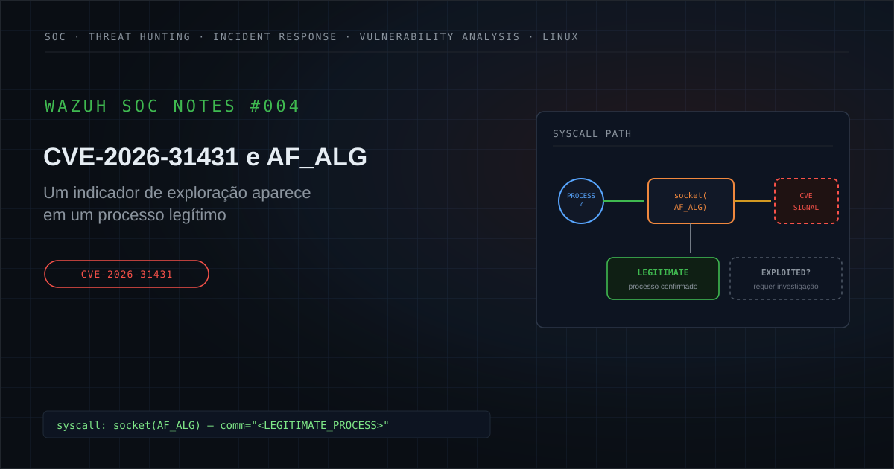

---

## Executive Summary

Durante uma atividade de monitoramento de segurança, foi investigado um alerta no Wazuh relacionado à **CVE-2026-31431**, vulnerabilidade do kernel Linux associada à interface criptográfica disponibilizada através de `AF_ALG`.

A detecção havia identificado a criação de um:

```text
socket(AF_ALG)
```

por um processo observado no sistema.

O processo associado ao evento era:

```text
pg_dump
```

utilitário legítimo do PostgreSQL utilizado para criação de backups lógicos de bancos de dados.

Esse detalhe alterou significativamente o contexto inicial da investigação.

A CVE-2026-31431 possui relação com uma vulnerabilidade do kernel Linux capaz de permitir elevação local de privilégios em sistemas afetados.

Dessa forma, a hipótese inicial precisava considerar:

```text
AF_ALG Activity
        ↓
Possible CVE-2026-31431 Exploitation
        ↓
Possible Privilege Escalation
```

Entretanto:

> **a utilização de AF_ALG não representa, isoladamente, exploração da CVE-2026-31431.**

A investigação identificou elementos adicionais relevantes:

- o processo associado ao evento era `pg_dump`;
- o processo estava sendo executado com contexto privilegiado;
- o evento ocorria sob perfil AppArmor compatível com ambiente containerizado;
- não havia terminal interativo associado;
- o `AUID` encontrava-se sem associação direta a usuário interativo;
- o mesmo padrão envolvendo `pg_dump` foi identificado em outro ativo com arquitetura semelhante;
- não foram identificados, nas fontes consultadas, comandos ou artefatos tipicamente relacionados a pós-exploração;
- a árvore completa de processos não pôde ser reconstruída devido à ausência de telemetria do processo pai no Wazuh.

Essa última condição é importante.

A investigação não possuía telemetria suficiente para afirmar:

```text
Exploit = Impossible
```

mas também não havia evidências suficientes para afirmar:

```text
Exploit = Confirmed
```

Diante do comportamento observado, da legitimidade do binário, da repetição do padrão em ambiente semelhante e da ausência de evidências complementares de exploração, o caso foi classificado como:

**Falso Positivo, com limitação de telemetria documentada.**

A principal lição deste estudo é:

> **um indicador associado a uma vulnerabilidade não é equivalente à exploração confirmada dessa vulnerabilidade.**

---

## 1. Contexto do alerta

O Wazuh gerou um alerta relacionado a possível utilização da CVE-2026-31431.

A regra analisava comportamento envolvendo:

```text
AF_ALG
```

que representa uma interface de socket do Linux utilizada para acesso à API criptográfica do kernel a partir do espaço de usuário.

A atividade observada estava associada a:

```text
Process:
pg_dump
```

Na versão pública deste estudo, foram removidos ou generalizados:

```text
Organization
Client
Hostname
Source IP
Agent ID
PID
PPID
Exact Timestamp
Incident ID
Internal Rule ID
Internal Path
Environment-Specific Identifier
```

O caminho real do executável também foi generalizado e será tratado apenas como:

```text
<POSTGRESQL_PATH>/pg_dump
```

O contexto adicional do evento indicava:

```text
User Context:
root

AppArmor:
docker-default

AUID:
unset / non-interactive context

Terminal:
none
```

Esses elementos eram relevantes porque sugeriam um processo executado de forma automatizada em contexto containerizado.

Entretanto, eles não eram suficientes, isoladamente, para explicar por que `AF_ALG` havia sido utilizado.

---

## 2. Hipótese inicial

A hipótese inicial foi construída a partir da regra e do comportamento observado.

```text
Process
        ↓
socket(AF_ALG)
        ↓
Kernel Crypto Interface
        ↓
CVE-2026-31431 Related Signal
        ↓
Possible Exploitation
        ↓
Possible Privilege Escalation
```

A investigação precisava responder:

```text
AF_ALG usage
     ↓
Legitimate kernel crypto interaction?
              OR
Exploit primitive related to CVE-2026-31431?
```

Cenários inicialmente considerados:

- exploração local da vulnerabilidade;
- tentativa de privilege escalation;
- execução de exploit público;
- uso de biblioteca legítima que interage com AF_ALG;
- comportamento legítimo de aplicação;
- atividade relacionada ao container;
- tarefa automatizada;
- backup de banco de dados;
- falso positivo contextual.

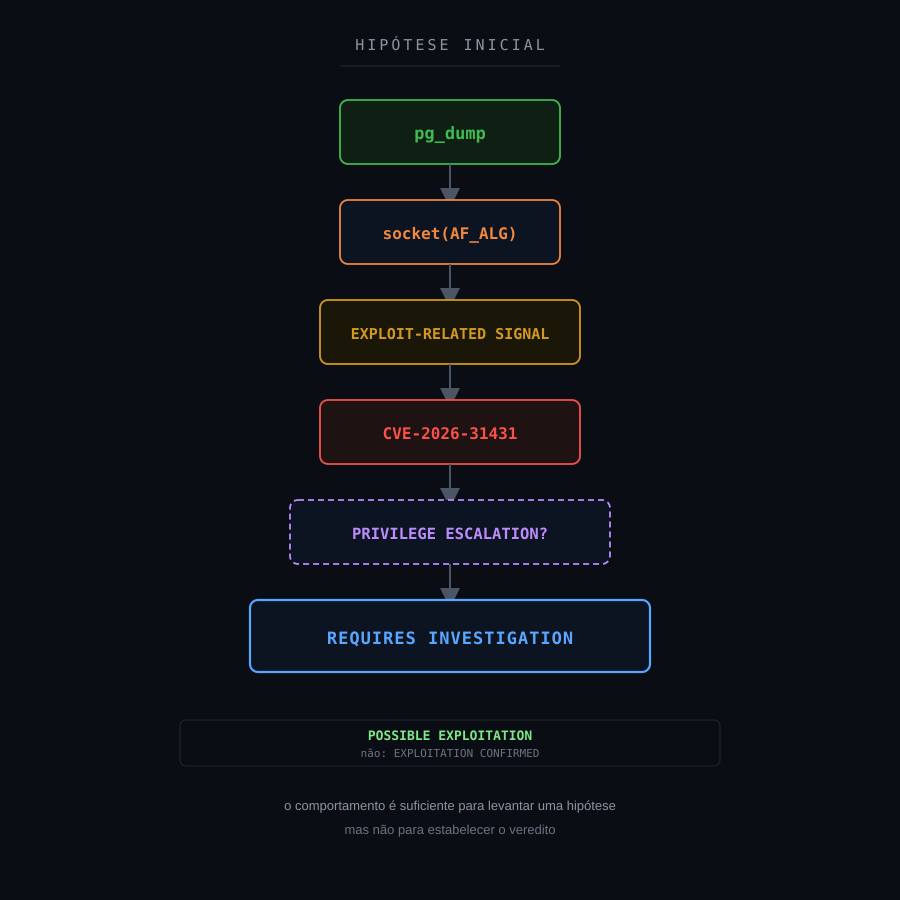

---

## 3. Escopo da investigação

A investigação foi estruturada para responder:

1. Qual processo realizou a chamada relacionada a `AF_ALG`?
2. O binário era legítimo?
3. Qual era seu caminho?
4. Qual usuário estava associado à execução?
5. O processo já estava privilegiado?
6. Qual era o PID?
7. Qual era o processo pai?
8. O PPID possuía telemetria disponível?
9. A árvore de processos podia ser reconstruída?
10. Existia shell relacionado?
11. Havia Python ou outro interpretador associado?
12. Existiam comandos de download?
13. Foram observados arquivos temporários suspeitos?
14. Existia utilização de `/tmp` ou `/dev/shm`?
15. Havia mecanismos de persistência?
16. Existiam comandos relacionados a cron?
17. Houve execução de utilitários incomuns?
18. Existiam sinais de pós-exploração?
19. O processo estava em container?
20. Qual perfil AppArmor estava associado?
21. Existia terminal interativo?
22. O `AUID` permitia associar a execução a usuário?
23. O mesmo comportamento existia em outro ativo?
24. O mesmo processo estava presente nesses eventos?
25. Existia sequência compatível com exploração?
26. O comportamento podia ser explicado por uma rotina operacional?
27. Existiam evidências suficientes para sustentar T1068?
28. Qual era a limitação da telemetria disponível?

---

## 4. 5W1H

### What — O que aconteceu?

O Wazuh identificou uma chamada envolvendo:

```text
socket(AF_ALG)
```

associada ao processo:

```text
pg_dump
```

e correlacionou o comportamento com possível exploração da CVE-2026-31431.

### Who — Quem ou o que esteve envolvido?

Um processo legítimo do PostgreSQL executado dentro de contexto Linux/containerizado.

O processo estava associado a um contexto privilegiado.

Nenhum usuário individual é identificado neste estudo.

### When — Quando ocorreu?

Os eventos ocorreram dentro da janela investigada pelo SOC.

Os timestamps exatos foram removidos.

### Where — Onde ocorreu?

Em ativos Linux com contexto compatível com aplicação containerizada.

Hostnames, endereços IP e demais identificadores foram sanitizados.

### Why — Por que era relevante?

Porque a CVE-2026-31431 envolve o subsistema criptográfico do kernel Linux e pode permitir elevação local de privilégios.

A utilização de `AF_ALG` possui relação técnica com o componente vulnerável.

### How — Como foi investigado?

A investigação correlacionou:

```text
Process
Executable
User Context
PID
PPID
AppArmor
AUID
Terminal
Host
Time Window
Related Events
Suspicious Commands
Post-Exploitation Indicators
```

e comparou o comportamento entre diferentes ativos.

---

## 5. Evidências disponíveis

| Evidência | Fonte | Classificação | Confiança |
|---|---|---|---|
| Evento relacionado a AF_ALG | Linux Audit / Wazuh | Confirmed | High |
| Processo identificado como `pg_dump` | Linux Audit / Wazuh | Confirmed | High |
| Binário relacionado ao PostgreSQL | Telemetria | Confirmed | High |
| Processo executado com contexto privilegiado | Linux Audit | Confirmed | High |
| Perfil `docker-default` | Linux Audit / AppArmor | Confirmed | High |
| Ausência de terminal | Linux Audit | Confirmed | High |
| AUID sem usuário interativo identificado | Linux Audit | Confirmed | High |
| Padrão semelhante em outro ativo | Threat Hunting | Confirmed | High |
| Mesmo tipo de processo no evento correlacionado | Threat Hunting | Confirmed | High |
| Processo pai identificado apenas por PPID | Linux Audit | Confirmed | High |
| Evento do processo pai disponível no Wazuh | Threat Hunting | Not Available | High |
| Árvore completa de processos | Threat Hunting | Not Available | High |
| Exploit confirmado | Investigação | Not Confirmed | High |
| Privilege escalation confirmada | Investigação | Not Confirmed | High |
| Payload malicioso | Threat Hunting | Not Observed | Medium |
| Shell suspeito correlacionado | Threat Hunting | Not Observed | Medium |
| Persistência | Threat Hunting | Not Observed | Medium |
| Pós-exploração | Threat Hunting | Not Observed | Medium |

A principal combinação de evidências era:

```text
AF_ALG Signal = TRUE
pg_dump = TRUE
Privileged Context = TRUE
Container Context = SUPPORTED
Exploit = NOT CONFIRMED
```

---

## 6. Classificação das evidências

### Confirmed

Informação diretamente demonstrada pela telemetria.

Exemplo:

```text
comm="pg_dump"
```

### Supported

Conclusão sustentada por diferentes sinais.

Exemplo:

```text
docker-default
+
no terminal
+
AUID unset
        ↓
Automated / containerized execution context
```

### Inferred

Conclusão derivada das evidências disponíveis.

### Hypothesis

Possibilidade que ainda exige validação.

Exemplo:

```text
CVE-2026-31431 exploitation
```

### Not Observed

O comportamento foi procurado nas fontes disponíveis e não foi identificado.

### Not Available

A telemetria necessária não estava disponível.

Exemplo:

```text
Parent Process Event
```

### Not Applicable

O elemento não possui aderência ao cenário.

Um ponto fundamental:

> **Not Available é diferente de Not Observed.**

Se o processo pai não possui evento disponível, não podemos afirmar:

```text
Parent Process = Benign
```

nem:

```text
Parent Process = Malicious
```

A classificação correta é:

```text
Not Available
```

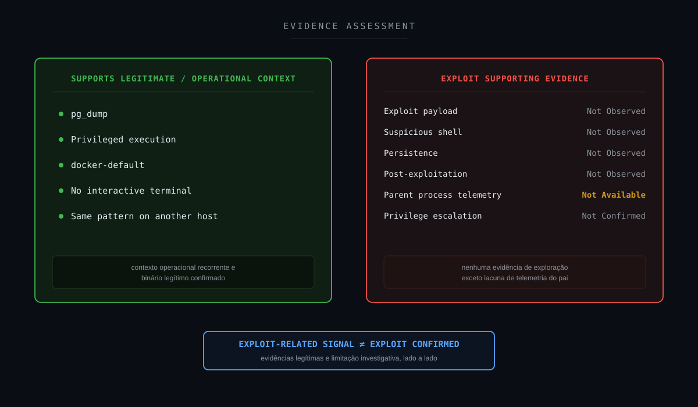

---

## 7. Timeline da investigação

A sequência lógica do caso pode ser representada como:

```text
Linux Audit Event
        ↓
socket(AF_ALG)
        ↓
Wazuh Detection
        ↓
CVE-2026-31431 Alert
        ↓
Initial Exploitation Hypothesis
        ↓
Process Identification
        ↓
pg_dump
        ↓
Privilege Context Analysis
        ↓
Container Context Identified
        ↓
PID / PPID Correlation
        ↓
Parent Event Search
        ↓
Parent Telemetry Not Available
        ↓
Threat Hunting
        ↓
Search for Shells / Payload / Persistence
        ↓
No Supporting Malicious Evidence
        ↓
Cross-Host Correlation
        ↓
Same pg_dump Pattern Identified
        ↓
Hypothesis Reassessment
        ↓
FALSE POSITIVE
TELEMETRY LIMITATION DOCUMENTED
```

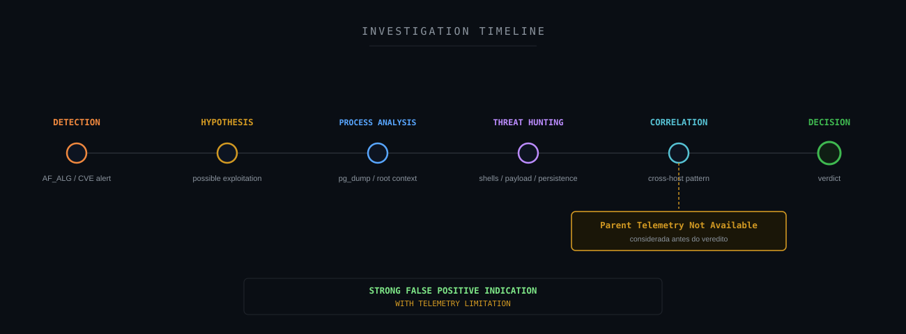

---

## 8. Threat Hunting

O Threat Hunting começou pela própria detecção.

Exemplo sanitizado:

```text
rule.description:*CVE-2026-31431*
```

Busca por referências a AF_ALG:

```text
full_log:*AF_ALG*
```

Busca pelo processo:

```text
full_log:*pg_dump*
```

Correlação entre processo e comportamento:

```text
full_log:*pg_dump* AND full_log:*AF_ALG*
```

Busca por determinado ativo:

```text
agent.name:"<HOST>" AND full_log:*AF_ALG*
```

Busca por processo pai:

```text
full_log:*<PPID>*
```

Busca por shells potencialmente relacionados:

```text
full_log:*bash* OR
full_log:*sh* OR
full_log:*dash*
```

Busca por interpretadores:

```text
full_log:*python*
```

Busca por ferramentas de download ou transferência:

```text
full_log:*curl* OR
full_log:*wget*
```

Busca por utilitários frequentemente observados em pós-exploração:

```text
full_log:*nc* OR
full_log:*busybox*
```

Busca por diretórios temporários:

```text
full_log:*/tmp/* OR
full_log:*/dev/shm/*
```

Busca por persistência via agendamento:

```text
full_log:*cron* OR
full_log:*crond*
```

As consultas devem ser adaptadas ao índice e à telemetria disponível.

Nenhum hostname, PID, PPID ou IP real é publicado.

---

## 9. Campos relevantes para investigação

Entre os campos importantes estavam:

```text
@timestamp
agent.name
agent.id
rule.id
rule.level
rule.description
location
full_log
```

Nos logs de auditoria Linux:

```text
comm
exe
pid
ppid
uid
euid
auid
tty
apparmor
syscall
```

Campos particularmente importantes:

```text
comm = pg_dump
```

```text
ppid = <PARENT_PID>
```

```text
auid = unset
```

```text
tty = none
```

```text
apparmor = docker-default
```

Esses elementos permitiram avaliar:

- identidade do processo;
- contexto de execução;
- relação pai-filho;
- interação humana;
- ambiente containerizado;
- recorrência.

---

## 10. Resultado do Threat Hunting

A investigação confirmou que o evento estava associado a:

```text
pg_dump
```

O comportamento foi posteriormente identificado também em outro ativo com contexto semelhante.

Isso produziu uma correlação importante:

```text
Host A
pg_dump
AF_ALG
```

e:

```text
Host B
pg_dump
AF_ALG
```

A repetição do mesmo padrão em diferentes ativos com arquitetura semelhante reduziu a probabilidade de um evento isolado relacionado a uma exploração específica.

Entretanto, isso não é prova absoluta de benignidade.

O hunting também não identificou, dentro das fontes disponíveis:

```text
bash
sh
dash
python
curl
wget
nc
busybox
/tmp suspicious artifacts
/dev/shm suspicious artifacts
cron persistence
exploit payload
post-exploitation chain
```

A árvore de processos não pôde ser reconstruída completamente porque o evento correspondente ao processo pai não estava indexado no Wazuh.

Portanto:

```text
Strong Benign Context
        +
Repeated Legitimate Pattern
        +
No Supporting Malicious Evidence
        +
Incomplete Parent Telemetry
        ↓
False Positive
Telemetry Limitation Documented
```

---

## 11. Entendendo AF_ALG

`AF_ALG` é uma família de sockets Linux utilizada para permitir que aplicações em espaço de usuário interajam com funcionalidades criptográficas implementadas no kernel.

Conceitualmente:

```text
User-Space Process
        ↓
socket(AF_ALG)
        ↓
Linux Kernel Crypto API
        ↓
Cryptographic Algorithm
```

Portanto:

```text
AF_ALG
```

não é, por definição:

```text
Exploit API
```

É uma interface legítima do kernel.

O problema investigativo surge porque a CVE-2026-31431 possui relação com componentes acessíveis através dessa interface.

Dessa forma:

```text
Legitimate Interface
        +
Known Vulnerability
        =
Detection Challenge
```

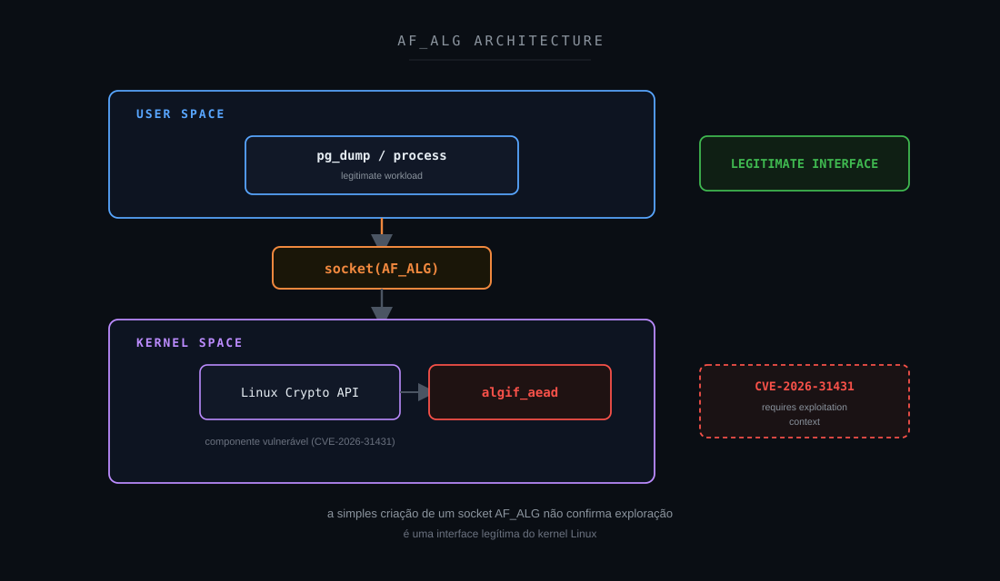

---

## 12. CVE-2026-31431 — contexto técnico

A CVE-2026-31431 está relacionada ao kernel Linux e ao tratamento de operações criptográficas através do componente `algif_aead`.

A vulnerabilidade pode permitir que um atacante local com privilégios reduzidos utilize o comportamento vulnerável para obter privilégios elevados em sistemas afetados.

Esse detalhe é extremamente importante para o case.

A hipótese ofensiva seria conceitualmente:

```text
Low-Privilege Local User
        ↓
CVE-2026-31431 Exploitation
        ↓
Kernel Primitive
        ↓
Privilege Escalation
        ↓
root
```

No evento analisado, entretanto, o processo observado estava associado a:

```text
root
```

Isso enfraquece significativamente a hipótese de:

```text
Privilege Escalation
```

porque o processo registrado já possuía contexto privilegiado.

Isso não significa:

```text
Exploit Impossible
```

Mas significa que o evento, isoladamente, **não apresenta o fluxo esperado de um usuário não privilegiado elevando privilégios para root**.

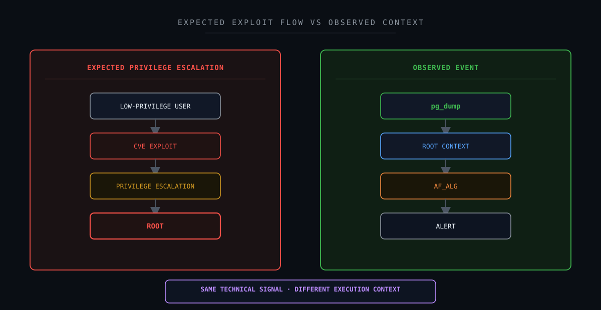

---

## 13. Correlação técnica

### Cenário potencialmente compatível com exploração

```text
Low-Privilege User
        +
AF_ALG
        +
Exploit Payload
        +
Suspicious Parent
        +
Privilege Transition
        +
Unexpected root process
        +
Post-Exploitation
        ↓
Higher Exploitation Confidence
```

### Cenário observado

```text
pg_dump
        +
Already Privileged Context
        +
Container Context
        +
No Interactive Terminal
        +
Repeated Pattern on Similar Host
        +
No Supporting Malicious Evidence
        +
Incomplete Parent Telemetry
        ↓
False Positive
```

O mesmo sinal inicial:

```text
AF_ALG
```

pode, portanto, possuir interpretações muito diferentes.

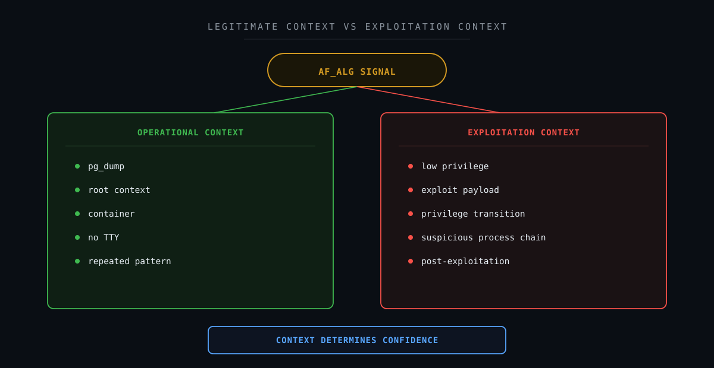

---

## 14. Cadeia fim a fim do evento

```text
Containerized Linux Workload
        ↓
pg_dump
        ↓
socket(AF_ALG)
        ↓
Linux Audit
        ↓
Wazuh Collection
        ↓
CVE-Related Detection
        ↓
SOC Alert
        ↓
Possible Exploitation Hypothesis
        ↓
Process Validation
        ↓
Privilege Context
        ↓
AppArmor / Container Context
        ↓
PID / PPID Correlation
        ↓
Parent Telemetry Search
        ↓
Parent Event Not Available
        ↓
Threat Hunting
        ↓
Cross-Host Correlation
        ↓
Same pg_dump Pattern
        ↓
Search for Exploitation Evidence
        ↓
No Supporting Malicious Evidence
        ↓
Context Reassessment
        ↓
FALSE POSITIVE
TELEMETRY LIMITATION DOCUMENTED
```

Essa cadeia representa:

```text
Telemetry
    ↓
Detection
    ↓
Hypothesis
    ↓
Hunting
    ↓
Correlation
    ↓
Decision
```

Não representa uma cadeia adversarial confirmada.

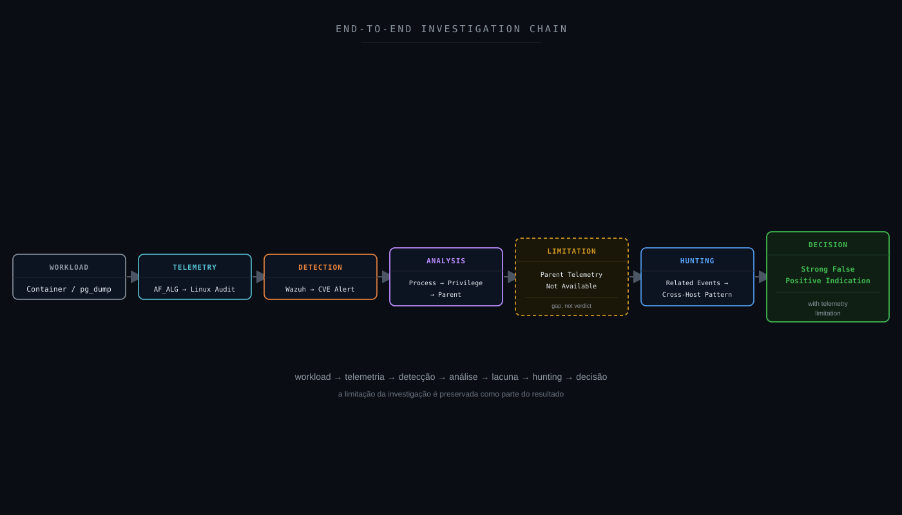

---

## 15. Attack Flow

Uma hipótese ofensiva poderia ser representada como:

```text
Local Access
        ↓
Low-Privilege Execution
        ↓
CVE-2026-31431
        ↓
Privilege Escalation
        ↓
root
        ↓
Post-Exploitation
```

Essa cadeia não foi observada.

O fluxo real da investigação foi:

```text
AF_ALG Alert
        ↓
Possible CVE Exploitation
        ↓
pg_dump Identified
        ↓
root Context
        ↓
Container Context
        ↓
Parent Investigation
        ↓
Telemetry Gap
        ↓
Threat Hunting
        ↓
Cross-Host Correlation
        ↓
No Supporting Exploitation Evidence
        ↓
Hypothesis Reassessment
```

Portanto:

```text
Confirmed Attack Flow = No
```

```text
Investigation Flow = Yes
```

---

## 16. Attack Chain Assessment

| Estágio | Status | Fundamentação |
|---|---|---|
| Reconnaissance | Not Observed | Nenhuma evidência correlacionada |
| Initial Access | Not Available | Não determinado pelo alerta |
| Execution | Confirmed only for `pg_dump` | Processo legítimo observado |
| Persistence | Not Observed | Nenhuma evidência correlacionada |
| Privilege Escalation | Not Confirmed | Nenhuma transição demonstrada |
| Defense Evasion | Not Observed | Nenhuma evidência |
| Credential Access | Not Observed | Nenhuma evidência |
| Discovery | Not Observed | Nenhuma evidência |
| Lateral Movement | Not Observed | Nenhuma evidência |
| Collection | Not Applicable to malicious hypothesis | `pg_dump` legítimo não implica coleta adversarial |
| Command and Control | Not Observed | Nenhuma evidência |
| Exfiltration | Not Observed | Nenhuma evidência |
| Impact | Not Observed | Nenhum impacto identificado |

A presença do `pg_dump` merece cuidado especial.

O utilitário realiza coleta legítima de dados de banco para fins de backup.

Isso não deve ser automaticamente mapeado para:

```text
ATT&CK Collection
```

sem evidência de intenção adversarial.

---

## 17. MITRE ATT&CK Mapping

### T1068 — Exploitation for Privilege Escalation

A principal técnica considerada como hipótese foi:

```text
T1068 — Exploitation for Privilege Escalation
```

A técnica descreve situações em que adversários exploram vulnerabilidades de software para elevar privilégios.

A CVE-2026-31431 possui aderência técnica a esse tipo de comportamento.

Entretanto:

```text
CVE Detection
        ≠
T1068 Confirmed
```

Para sustentar T1068 seria necessário observar uma cadeia compatível com:

```text
Lower Privilege
        ↓
Exploitation
        ↓
Privilege Transition
        ↓
Higher Privilege
```

No evento analisado:

```text
Observed Process = root context
```

e nenhuma transição de privilégio foi demonstrada.

Portanto:

```text
T1068 = Investigation Hypothesis
```

e não:

```text
T1068 = Confirmed TTP
```

---

## 18. MITRE Detection Strategy

A detecção de exploração para elevação de privilégio deve buscar mais do que a presença de uma syscall associada a uma vulnerabilidade.

Uma estratégia mais robusta pode considerar:

```text
Vulnerable Kernel
        +
Low-Privilege Process
        +
Exploit Primitive
        +
Process Lineage
        +
Privilege Transition
        +
Unexpected root Execution
        +
Post-Exploitation
```

Quanto maior a correlação:

```text
Behavior
        +
Process
        +
Privilege
        +
Lineage
        +
Outcome
```

maior a confiança.

No #004, o principal gap foi:

```text
Process Lineage
```

porque o processo pai não possuía evento disponível.

---

## 19. Framework Mapping

### CVE / NVD

**Aplicabilidade: direta.**

O alerta estava explicitamente relacionado a uma vulnerabilidade pública.

### MITRE ATT&CK

**Aplicabilidade: parcial.**

T1068 foi utilizado como hipótese de investigação.

### MITRE D3FEND

**Aplicabilidade: supporting.**

Pode apoiar análise de controles, restrição de superfície do kernel e monitoramento.

### MITRE Attack Flow

**Aplicabilidade: limitada.**

Não houve cadeia adversarial confirmada.

### MITRE Engage

**Aplicabilidade: Not Applicable.**

Não houve adversary engagement.

### MITRE Fight Fraud Framework

**Aplicabilidade: Not Applicable.**

Nenhum cenário de fraude.

### VERIS

**Aplicabilidade: supporting.**

Pode auxiliar na estruturação de ação, ativo e impacto.

### NIST CSF

**Aplicabilidade: direta.**

Detect, Respond e Improve.

### NIST SP 800-61

**Aplicabilidade: direta.**

Investigação, classificação e documentação das limitações.

### CIS Controls

**Aplicabilidade: supporting.**

Patch management, secure configuration, audit logs e monitoring.

### Sigma

**Aplicabilidade: parcial.**

Pode apoiar detecções complementares.

### SOC-CMM

**Aplicabilidade: supporting.**

Especialmente Detection Quality e Telemetry Coverage.

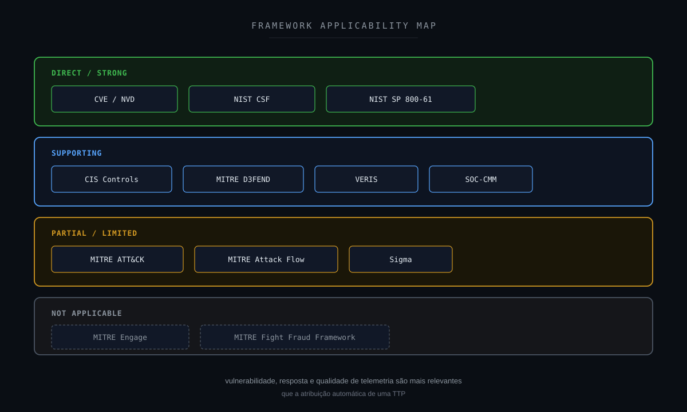

---

## 20. NIST Mapping

### IDENTIFY

Determinar:

- versão do kernel;
- exposição à CVE;
- workload;
- container;
- aplicação;
- função do processo;
- criticidade.

### PROTECT

Aplicar:

- patch management;
- atualização do kernel;
- hardening;
- isolamento;
- least privilege.

### DETECT

O Wazuh detectou comportamento relacionado a `AF_ALG`.

### RESPOND

O SOC realizou:

```text
Process Validation
        ↓
Privilege Analysis
        ↓
Threat Hunting
        ↓
Cross-Host Correlation
        ↓
Evidence Assessment
```

### RECOVER

Não aplicável ao case, pois não houve impacto confirmado.

### GOVERN

Relaciona-se a:

- vulnerability management;
- patch governance;
- risco;
- telemetria;
- exceções.

### IMPROVE

O principal aprendizado foi a necessidade de melhorar:

```text
Process Lineage Visibility
```

---

## 21. CIS Controls

O cenário possui relação com:

- Inventory and Control of Enterprise Assets;
- Secure Configuration;
- Continuous Vulnerability Management;
- Audit Log Management;
- Network Monitoring and Defense;
- Incident Response Management.

O caso demonstra a relação entre:

```text
Vulnerability Management
```

e:

```text
Detection Engineering
```

Uma vulnerabilidade conhecida pode gerar um indicador tecnicamente válido.

Mas esse indicador ainda precisa de contexto operacional.

---

## 22. Detection Strategy

A detecção atual pode ser representada como:

```text
AF_ALG
        ↓
CVE Pattern
        ↓
Wazuh Alert
```

Ela possui valor porque sinaliza comportamento sensível.

Entretanto, uma versão enriquecida poderia considerar:

```text
AF_ALG
        +
Process
        +
Executable Reputation
        +
UID / EUID
        +
AUID
        +
TTY
        +
Parent Process
        +
Container Context
        +
Kernel Version
        +
Privilege Transition
        +
Post-Execution Activity
        ↓
Contextual Risk
```

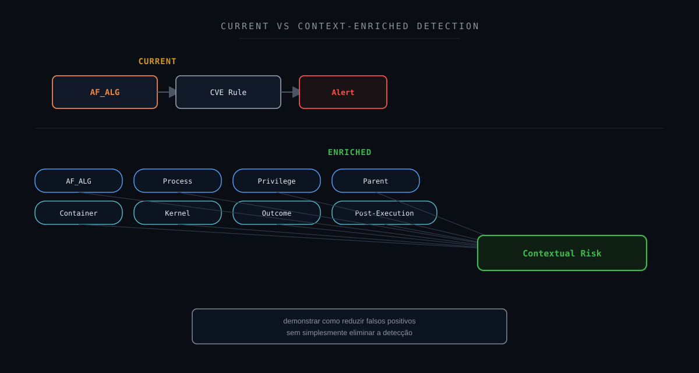

---

## 23. Detection Gap Analysis

### O que foi detectado?

```text
AF_ALG activity
```

### O processo foi identificado?

```text
YES
→ pg_dump
```

### O contexto privilegiado estava disponível?

```text
YES
```

### O processo pai estava disponível?

```text
NO
```

### A árvore de processos foi reconstruída?

```text
NO
```

Essa foi a principal lacuna.

```text
AF_ALG Event
        +
Child Process
        +
PPID
        -
Parent Process Event
        ↓
Incomplete Process Lineage
```

Isso reduz a capacidade de determinar:

```text
Who launched pg_dump?
Why was it launched?
What executed before it?
```

A investigação chegou a um Falso Positivo confirmado.

Mas não deve ocultar essa limitação.

---

## 24. Oportunidades de enriquecimento

Uma investigação futura poderia incorporar:

```text
Parent Process
Grandparent Process
Command Line
Container ID
Container Name
Image
Orchestrator
Workload
Kernel Version
Package Version
Process Start Time
Privilege Transition
Syscall Sequence
File Activity
Network Activity
```

Em especial:

```text
Parent / Grandparent
```

permitiria distinguir:

```text
Scheduled Backup
        ↓
pg_dump
```

de:

```text
Suspicious Script
        ↓
pg_dump / AF_ALG
```

---

## 25. Detection Engineering

Um pipeline futuro poderia utilizar:

```text
AF_ALG EVENT
        ↓
PROCESS CLASSIFICATION
        ↓
PRIVILEGE CONTEXT
        ↓
PROCESS LINEAGE
        ↓
CONTAINER CONTEXT
        ↓
KERNEL VULNERABILITY STATUS
        ↓
SYSCALL CORRELATION
        ↓
POST-EXECUTION ACTIVITY
        ↓
CROSS-HOST BASELINE
        ↓
CONTEXTUAL RISK
```

Exemplo de menor risco:

```text
pg_dump
        +
Known Workload
        +
Already Privileged
        +
Container Context
        +
Known Parent
        +
Repeated Baseline
        +
No Malicious Progression
        ↓
LOWER SUSPICION
```

Exemplo de maior risco:

```text
Unknown Process
        +
Low-Privilege User
        +
AF_ALG
        +
Suspicious Parent
        +
Privilege Transition
        +
Unexpected root Shell
        ↓
HIGHER SUSPICION
```

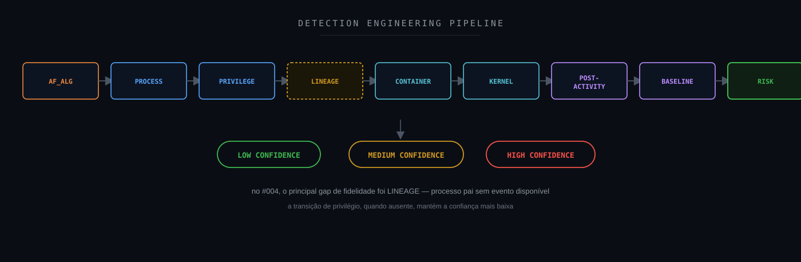

---

## 26. Sigma

Nenhuma regra Sigma foi necessária para chegar ao veredito.

Entretanto, Sigma poderia apoiar detecções complementares envolvendo:

```text
Suspicious Shell Execution
```

```text
Unexpected Privilege Escalation
```

```text
Process Spawned by Container Workload
```

```text
Unexpected Interpreter
```

```text
Execution from /tmp
```

```text
Execution from /dev/shm
```

```text
Unexpected root Shell
```

Sigma não deve ser utilizado para simplesmente converter:

```text
AF_ALG
```

em:

```text
Malicious
```

A correlação continua sendo necessária.

---

## 27. Hardening Opportunities

### Patch Management

Sistemas afetados pela CVE devem ser avaliados e atualizados conforme orientação do fornecedor.

### Kernel Exposure

Avaliar necessidade de interfaces e funcionalidades expostas ao espaço de usuário.

### Container Security

Revisar:

```text
Capabilities
Privileged Mode
AppArmor
Seccomp
Namespaces
Host Mounts
```

### Least Privilege

Workloads devem possuir apenas os privilégios necessários.

### Process Telemetry

Garantir captura de:

```text
Process Creation
Parent Process
Command Line
Container Context
```

### Audit

Revisar políticas de auditd para preservar linhagem relevante.

### Baseline

Identificar tarefas recorrentes como:

```text
Database Backup
Maintenance Jobs
Scheduled Operations
```

Neste case, hardening deve ser separado da classificação do alerta.

Mesmo que o evento seja falso positivo contextual, a CVE continua sendo uma vulnerabilidade real.

---

## 28. Controles defensivos

Uma estratégia Defense-in-Depth pode considerar:

```text
Vulnerability Management
        ↓
Kernel Patching
        ↓
Container Isolation
        ↓
AppArmor / Seccomp
        ↓
Process Telemetry
        ↓
Linux Audit
        ↓
Wazuh
        ↓
Threat Hunting
        ↓
Incident Response
```

Um ponto importante:

> **Falso positivo de detecção não significa falso risco de vulnerabilidade.**

O alerta pode não representar exploração.

A CVE continua exigindo gerenciamento.

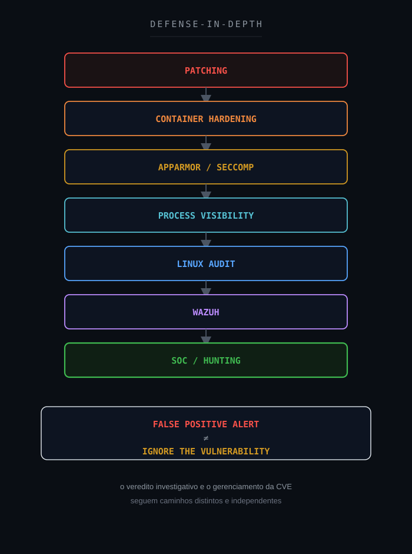

---

## 29. SOC-CMM

O caso possui relação com:

- Security Monitoring;
- Threat Hunting;
- Detection Quality;
- Vulnerability Context;
- Telemetry Coverage;
- False Positive Management;
- Continuous Improvement.

Uma abordagem menos madura:

```text
CVE Alert
        ↓
High Severity
        ↓
Incident
```

Uma abordagem mais madura:

```text
CVE Alert
        ↓
Validate Behavior
        ↓
Process Context
        ↓
Privilege Context
        ↓
Process Lineage
        ↓
Threat Hunting
        ↓
Baseline Correlation
        ↓
Evidence-Based Verdict
```

O gap de telemetria também precisa fazer parte do resultado.

---

## 30. Métricas operacionais

| Métrica | Objetivo |
|---|---|
| MTTD | Tempo até detecção |
| MTTA | Tempo até reconhecimento |
| MTTR | Tempo até conclusão |
| False Positive Rate | Qualidade das regras |
| Detection Coverage | Cobertura comportamental |
| Process Lineage Coverage | Visibilidade pai/filho |
| Telemetry Coverage | Qualidade das fontes |
| Vulnerability Exposure | Ativos potencialmente afetados |
| Enrichment Coverage | Capacidade de contextualização |
| SLA | Operação |

Uma métrica especialmente relevante para esse case seria:

```text
Process Lineage Coverage
```

porque:

```text
PPID Available
```

sem:

```text
Parent Event Available
```

representa uma lacuna investigativa significativa.

---

## 31. Decision Flow

```text
AF_ALG Detected?
        ↓
YES
        ↓
Process Identified?
        ↓
YES
        ↓
Known / Legitimate Process?
        ├── NO
        │    ↓
        │  Increase Suspicion
        │
        └── YES
             ↓
Low-Privilege Context?
        ├── YES
        │    ↓
        │  Investigate Privilege Escalation
        │
        └── NO
             ↓
Process Already Privileged?
        ↓
YES
        ↓
Parent Process Available?
        ├── YES
        │    ↓
        │  Validate Lineage
        │
        └── NO
             ↓
        TELEMETRY GAP
             ↓
Supporting Exploitation Evidence?
        ├── YES
        │    ↓
        │  ESCALATE INVESTIGATION
        │
        └── NO
             ↓
Repeated Legitimate Pattern?
        ├── NO
        │    ↓
        │  CONTINUE INVESTIGATION
        │
        └── YES
             ↓
FALSE POSITIVE
TELEMETRY LIMITATION DOCUMENTED
```

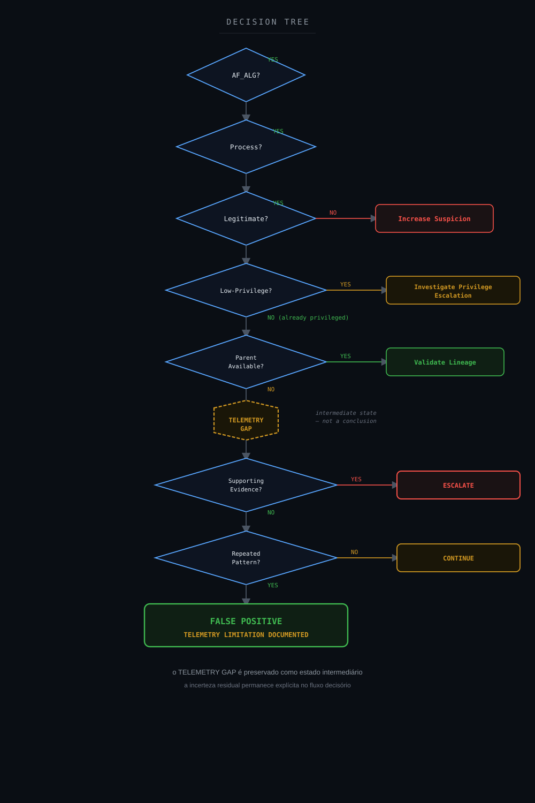

---

## 32. Veredito técnico

### Evento AF_ALG

```text
Confirmed
```

### Processo

```text
pg_dump
```

### Legitimidade do binário

```text
Confirmed
```

### Contexto privilegiado

```text
Confirmed
```

### Contexto containerizado

```text
Supported
```

### Mesmo padrão em outro ativo

```text
Confirmed
```

### Processo pai

```text
Not Available
```

### Árvore completa de processos

```text
Not Available
```

### Exploit

```text
Not Confirmed
```

### Privilege Escalation

```text
Not Confirmed
```

### Pós-exploração

```text
Not Observed
```

### Impacto

```text
Not Observed
```

### Confiança

```text
High
False Positive confirmed
Residual telemetry gap documented
```

### Classificação final

**Falso Positivo — comportamento associado a processo legítimo e contexto operacional compatível. A limitação de telemetria na reconstrução da árvore de processos é documentada como gap de visibilidade, não como impedimento ao veredito.**

### Veredito

```text
FALSE POSITIVE
TELEMETRY LIMITATION DOCUMENTED
NO CONFIRMED CVE EXPLOITATION
```

---

## 33. Por que Falso Positivo?

O evento aconteceu.

```text
AF_ALG Event = TRUE
```

A detecção estava tecnicamente relacionada a uma vulnerabilidade real.

```text
CVE Context = TRUE
```

O processo observado também era real.

```text
pg_dump = TRUE
```

A pergunta era:

```text
CVE Exploitation = ?
```

A investigação demonstrou:

```text
pg_dump
        +
Legitimate PostgreSQL Utility
        +
Already Privileged Context
        +
Container Context
        +
No Interactive Terminal
        +
Same Pattern on Similar Host
        +
No Supporting Exploitation Evidence
        +
Parent Telemetry Not Available
        ↓
False Positive
```

O ponto final é importante.

Sem telemetria do processo pai, não é possível declarar:

```text
Absolute Proof of Benign Activity
```

Mas o conjunto de evidências — binário legítimo, contexto já privilegiado, padrão repetido em ativo semelhante e ausência total de artefatos maliciosos mesmo após Threat Hunting ativo — foi suficiente para fechar a investigação como:

```text
False Positive
```

com a lacuna de telemetria do processo pai documentada como limitação residual de visibilidade, não como impedimento ao veredito.

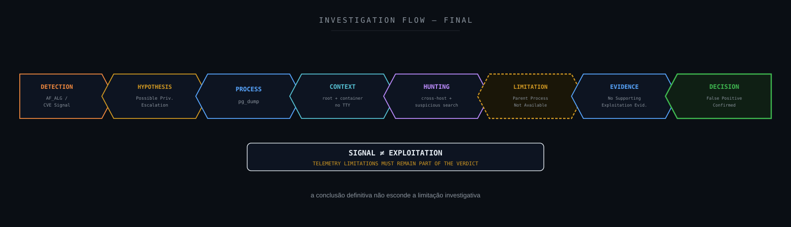

---

## 34. Lições aprendidas

A principal lição deste case é:

> **um indicador associado a uma CVE não representa exploração confirmada.**

### AF_ALG é uma interface legítima

A interface possui uso legítimo dentro do kernel Linux.

Sua presença isolada não define intenção.

### Vulnerabilidade e exploração são coisas diferentes

```text
Vulnerable Component
        ≠
Exploit Executed
```

### Contexto de privilégio importa

A CVE está relacionada à elevação local de privilégios.

Um processo observado já em contexto `root` enfraquece a interpretação de que aquele evento específico representa a transição esperada de privilégio.

### Processo legítimo não encerra investigação

```text
pg_dump
```

pode ser legítimo.

Mas processos legítimos também podem ser abusados ou executados a partir de cadeias maliciosas.

Por isso, a linhagem continua importante.

### Repetição em outro ativo aumenta contexto

O mesmo comportamento em arquitetura semelhante pode indicar baseline operacional.

Mas não é prova absoluta.

### Telemetry Gap deve permanecer documentado, mesmo com veredito fechado

Chegar a um Falso Positivo confirmado não significa esconder uma limitação de visibilidade identificada durante a investigação.

O gap de telemetria do processo pai não impediu o veredito, mas continua registrado como oportunidade de melhoria.

### Not Available é diferente de Not Observed

O processo pai não foi validado como benigno.

Ele simplesmente não estava disponível.

### Falso positivo não elimina necessidade de patch

A investigação avalia:

```text
Was this alert exploitation?
```

Vulnerability Management avalia:

```text
Is the system vulnerable?
```

São perguntas diferentes.

---

## 35. Recomendações

1. Manter a detecção relacionada à CVE enquanto houver exposição relevante.
2. Não suprimir genericamente eventos de `AF_ALG`.
3. Enriquecer a regra com contexto de processo.
4. Adicionar contexto de UID/EUID/AUID.
5. Identificar transições reais de privilégio.
6. Capturar processo pai e processo avô.
7. Preservar command line.
8. Correlacionar eventos de auditd com process creation.
9. Integrar telemetria de containers.
10. Registrar container ID e image quando disponível.
11. Baselinear tarefas de `pg_dump`.
12. Identificar jobs de backup conhecidos.
13. Correlacionar execução com scheduler/orchestrator.
14. Buscar comportamento semelhante em outros ativos.
15. Investigar shells relacionados.
16. Monitorar execução em `/tmp`.
17. Monitorar execução em `/dev/shm`.
18. Monitorar interpretadores inesperados.
19. Monitorar privilege transitions.
20. Validar versão do kernel.
21. Priorizar patching quando aplicável.
22. Revisar configuração de AF_ALG quando não necessária.
23. Revisar AppArmor e seccomp.
24. Aplicar Least Privilege em containers.
25. Separar resultado da investigação de vulnerabilidade do resultado de Vulnerability Management.
26. Documentar lacunas de telemetria.
27. Criar métrica de Process Lineage Coverage.
28. Evitar transformar CVE + syscall em incidente automático.
29. Manter Threat Hunting para detecções comportamentais de alta severidade.
30. Preservar a distinção entre evidência, hipótese e inferência.

---

## 36. Referências técnicas

### CVE / NVD

CVE-2026-31431 — CVE.org
https://www.cve.org/CVERecord?id=CVE-2026-31431

NVD — CVE-2026-31431
https://nvd.nist.gov/vuln/detail/CVE-2026-31431

Red Hat — CVE-2026-31431
https://access.redhat.com/security/cve/CVE-2026-31431

### Linux Kernel

Linux Kernel — User Space Interface / AF_ALG
https://www.kernel.org/doc/html/latest/crypto/userspace-if.html

### PostgreSQL

PostgreSQL — pg_dump
https://www.postgresql.org/docs/current/app-pgdump.html

### Wazuh

Wazuh Documentation
https://documentation.wazuh.com/

### MITRE ATT&CK

MITRE ATT&CK
https://attack.mitre.org/

T1068 — Exploitation for Privilege Escalation
https://attack.mitre.org/techniques/T1068/

Detection Strategy — Exploitation for Privilege Escalation
https://attack.mitre.org/detectionstrategies/DET0514/

### MITRE D3FEND

MITRE D3FEND
https://d3fend.mitre.org/

### MITRE Attack Flow

MITRE Attack Flow
https://center-for-threat-informed-defense.github.io/attack-flow/

### NIST

NIST Cybersecurity Framework
https://www.nist.gov/cyberframework

NIST SP 800-61 Rev. 3
https://csrc.nist.gov/pubs/sp/800/61/r3/final

### CIS

CIS Controls
https://www.cisecurity.org/controls

### VERIS

VERIS Framework
https://verisframework.org/

### Sigma

Sigma
https://sigmahq.io/

### SOC-CMM

SOC-CMM
https://www.soc-cmm.com/

---

## Disclaimer

Este estudo foi sanitizado para preservar integralmente a confidencialidade do ambiente originalmente analisado.

As investigações, decisões técnicas e veredictos apresentados neste estudo refletem experiência prática real do autor. Ferramentas de Inteligência Artificial foram utilizadas como apoio para formatação, diagramação e publicação do conteúdo — não para a condução da investigação em si.

Não são publicados valores reais relacionados a:

```text
Organization
Client
Incident ID
Ticket ID
Hostname
Source IP
Destination IP
Agent ID
PID
PPID
Exact Timestamp
Container Identifier
Internal Path
Environment-Specific Identifier
Internal Rule ID
Username
E-mail Address
Session ID
GUID
Credentials
Tokens
Secrets
```

Os nomes reais dos ativos não são publicados.

Endereços IP não são publicados.

PIDs e PPIDs reais foram substituídos ou generalizados.

O caminho real do executável foi generalizado.

O contexto técnico foi preservado apenas no nível necessário:

```text
Linux / Container Context
        ↓
pg_dump
        ↓
AF_ALG
        ↓
CVE-Related Alert
        ↓
Threat Hunting
        ↓
Cross-Host Correlation
        ↓
Telemetry Gap
        ↓
No Supporting Exploitation Evidence
        ↓
False Positive
```

A CVE-2026-31431 é pública e pode ser mencionada porque sua identificação não expõe o ambiente originalmente analisado.

Da mesma forma, nomes públicos de tecnologias como Linux, PostgreSQL, Wazuh, AppArmor e frameworks podem ser mantidos quando necessários à explicação técnica.

A existência de um evento associado a `AF_ALG` não é tratada como confirmação automática da exploração da CVE-2026-31431.

A ausência da telemetria do processo pai foi preservada como limitação investigativa.

As classificações:

```text
Confirmed
Supported
Inferred
Hypothesis
Not Observed
Not Available
Not Applicable
```

possuem significados distintos e não devem ser intercambiadas.

O objetivo desta publicação é compartilhar:

- metodologia de investigação;
- raciocínio analítico;
- Threat Hunting;
- Incident Response;
- Vulnerability Analysis;
- Linux Security;
- Container Security;
- Detection Engineering;
- classificação de evidências;
- análise de lacunas de telemetria;
- melhoria contínua.

Este projeto é independente e não representa documentação oficial do Wazuh, Linux, PostgreSQL, MITRE, NIST, CIS ou das demais organizações e projetos mencionados.

---

**Wazuh SOC Notes**

> **Uma CVE cria contexto de risco. Um alerta cria uma hipótese. Evidências determinam se houve exploração.**
