# Wazuh SOC Notes #005 — Sysmon Event ID 11: criação de um script em Windows Temp não confirma execução maliciosa

> **SOC | Threat Hunting | Incident Response | Detection Engineering | Sysmon | Windows | PowerShell | Wazuh**

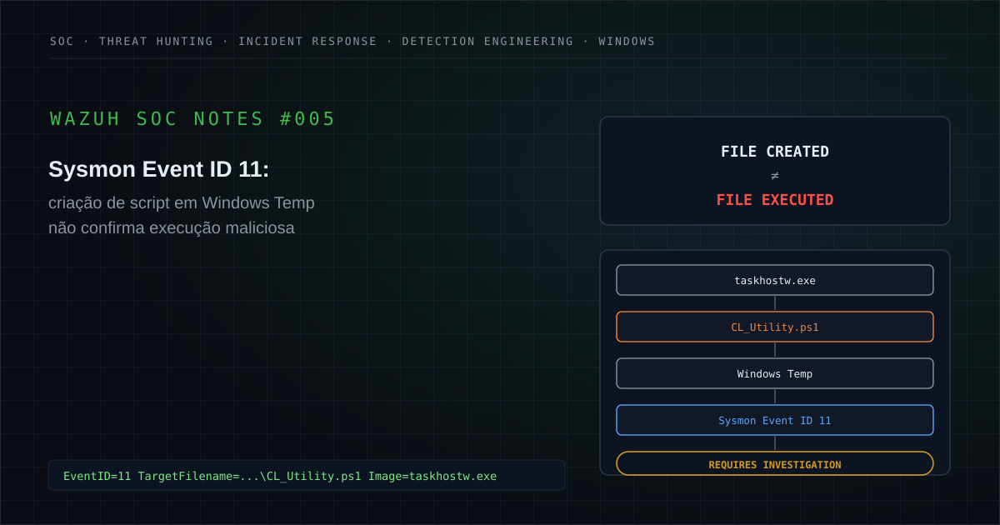

---

## Executive Summary

Durante uma atividade de monitoramento de segurança, foi investigado no Wazuh um alerta relacionado à criação de um arquivo de script em um diretório temporário do Windows.

A detecção estava associada à:

```text
Wazuh Rule ID: 119032
```

com contexto equivalente a:

```text
Scripting file created under Windows Temp or User folder
```

A telemetria de origem era:

```text
Sysmon Event ID 11 — FileCreate
```

O arquivo observado foi sanitizado como:

```text
C:\Windows\Temp\SDIAG_<GUID>\CL_Utility.ps1
```

e o processo responsável pela criação foi:

```text
C:\Windows\System32\taskhostw.exe
```

O alerta possuía relevância porque atacantes frequentemente utilizam diretórios temporários para:

- staging;
- criação de scripts;
- armazenamento de payloads;
- execução intermediária;
- evasão operacional;
- preparação para persistência ou pós-exploração.

Além disso, a extensão:

```text
.ps1
```

naturalmente levanta a hipótese de possível atividade PowerShell.

Entretanto:

> **a criação de um arquivo `.ps1` não demonstra que o arquivo tenha sido executado.**

O Sysmon Event ID 11 demonstra que um arquivo foi:

```text
created
```

ou:

```text
overwritten
```

por determinado processo.

Para concluir execução, seriam necessárias outras fontes de telemetria, como:

```text
Sysmon Event ID 1 — Process Creation
PowerShell Operational Logs
Script Block Logging
Process Command Line
EDR Telemetry
```

A investigação também identificou elementos relevantes de contexto:

- o processo criador era `taskhostw.exe`;
- o executável observado estava localizado em `C:\Windows\System32`;
- o arquivo possuía nomenclatura compatível com rotina de diagnóstico;
- o diretório utilizava padrão `SDIAG_<GUID>`;
- não foram identificadas evidências complementares suficientes de execução maliciosa;
- não foram identificadas comunicações suspeitas correlacionadas;
- não foram identificados mecanismos de persistência relacionados;
- não foi identificada sequência de pós-exploração;
- a telemetria disponível não permitia reconstruir completamente toda a cadeia de processos relacionada ao evento.

A correlação indicou que o comportamento era compatível com uma rotina legítima de diagnóstico/suporte do Windows.

Diante das evidências analisadas, o caso foi classificado como:

**Falso Positivo — criação de arquivo compatível com atividade legítima do Windows, sem evidências complementares suficientes de execução maliciosa.**

A principal lição deste estudo é:

> **FileCreate é evidência de criação. Não é evidência automática de execução.**

---

## 1. Contexto do alerta

O Wazuh recebeu um evento proveniente do Sysmon relacionado à criação de um arquivo de script em um diretório considerado sensível para monitoramento.

A detecção estava associada à:

```text
Rule ID: 119032
```

com descrição equivalente a:

```text
Scripting file created under Windows Temp or User folder
```

A telemetria de origem era:

```text
Sysmon Event ID 11
```

O arquivo observado foi:

```text
C:\Windows\Temp\SDIAG_<GUID>\CL_Utility.ps1
```

O processo responsável pela criação foi:

```text
C:\Windows\System32\taskhostw.exe
```

Na versão pública deste estudo, foram removidos ou generalizados:

```text
Organization
Client
Hostname
Source IP
Username
Agent ID
Process GUID
Exact Timestamp
Incident ID
Ticket ID
Internal Identifiers
SDIAG GUID
Environment-Specific Values
```

O diretório temporário é relevante porque:

```text
C:\Windows\Temp
```

pode ser utilizado tanto por componentes legítimos do Windows quanto por software malicioso.

Portanto:

```text
Sensitive Directory
        ≠
Malicious Activity
```

O contexto é determinante.

---

## 2. Hipótese inicial

A hipótese inicial foi:

```text
Script File Created
        ↓
Windows Temp
        ↓
PowerShell File
        ↓
Possible Script Execution?
        ↓
Possible Malicious Activity?
        ↓
Requires Investigation
```

Foram considerados cenários como:

- script PowerShell malicioso;
- payload temporário;
- staging;
- download de ferramenta;
- execução posterior;
- persistência;
- script administrativo legítimo;
- rotina de manutenção;
- mecanismo de diagnóstico;
- comportamento legítimo do Windows.

A principal pergunta era:

```text
File Created
       ↓
Was it executed?
       ↓
If executed, by whom and why?
```

Essa distinção era essencial porque a telemetria inicial mostrava:

```text
File Creation
```

e não:

```text
PowerShell Execution
```

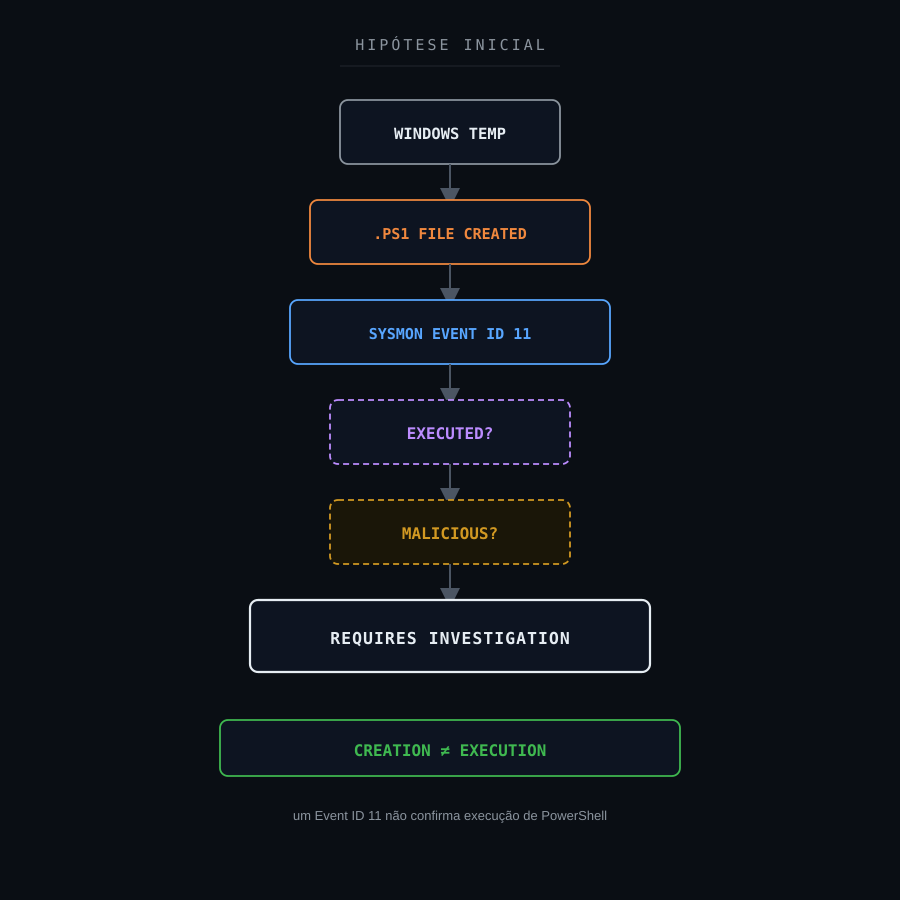

---

## 3. Escopo da investigação

A investigação foi estruturada para responder:

1. Qual arquivo foi criado?
2. Em qual diretório?
3. Qual processo criou o arquivo?
4. O processo criador era conhecido?
5. Qual era o caminho do processo?
6. O binário estava em localização esperada?
7. O arquivo possuía extensão executável ou de script?
8. O nome do arquivo era compatível com ferramenta conhecida?
9. O diretório apresentava padrão conhecido?
10. O arquivo foi executado posteriormente?
11. Houve processo `powershell.exe` relacionado?
12. Houve `pwsh.exe` relacionado?
13. Existia Event ID 1 correlacionado?
14. Existia command line disponível?
15. O processo pai podia ser identificado?
16. A árvore completa de processos estava disponível?
17. Houve conexão de rede relacionada?
18. Houve resolução DNS relacionada?
19. Houve criação de outros arquivos?
20. Houve alteração de Registro?
21. Houve criação de ADS?
22. Existiam mecanismos de persistência?
23. Houve atividade suspeita posterior?
24. Existiam outros alertas correlacionados?
25. O comportamento era compatível com diagnóstico legítimo?
26. Havia evidências suficientes para classificar o evento como incidente?

---

## 4. 5W1H

### What — O que aconteceu?

Um processo do Windows criou um arquivo PowerShell em um diretório temporário:

```text
C:\Windows\Temp\SDIAG_<GUID>\CL_Utility.ps1
```

O Sysmon registrou a criação através do Event ID 11.

### Who — Quem ou o que esteve envolvido?

O processo criador foi:

```text
taskhostw.exe
```

localizado em:

```text
C:\Windows\System32\
```

Usuário, hostname e demais identificadores reais foram removidos.

### When — Quando ocorreu?

O evento ocorreu dentro da janela analisada pelo SOC.

O timestamp específico não é publicado.

### Where — Onde ocorreu?

Em um host Windows monitorado pelo Wazuh.

O arquivo foi criado sob:

```text
C:\Windows\Temp\
```

### Why — Por que era relevante?

Diretórios temporários são frequentemente utilizados para armazenar scripts e payloads durante diferentes estágios de ataques.

Além disso, arquivos `.ps1` podem ser executados pelo PowerShell.

Por isso, a criação justificava investigação.

### How — Como foi analisado?

A análise utilizou:

- Sysmon Event ID 11;
- processo criador;
- TargetFilename;
- ProcessGuid;
- Rule ID;
- correlação temporal;
- Threat Hunting;
- busca por execução posterior;
- busca por eventos de rede;
- busca por persistência;
- análise de contexto do Windows.

---

## 5. Evidências disponíveis

| Evidência | Fonte | Classificação | Confiança |
|---|---|---|---|
| Sysmon Event ID 11 registrado | Sysmon / Wazuh | Confirmed | High |
| Arquivo `.ps1` criado | Sysmon | Confirmed | High |
| Arquivo criado sob Windows Temp | Sysmon | Confirmed | High |
| Nome `CL_Utility.ps1` | Sysmon | Confirmed | High |
| Diretório `SDIAG_<GUID>` | Sysmon | Confirmed | High |
| Processo criador `taskhostw.exe` | Sysmon | Confirmed | High |
| Processo em `C:\Windows\System32` | Sysmon | Confirmed | High |
| Contexto compatível com diagnóstico Windows | Correlação técnica | Supported | Medium/High |
| Execução de `CL_Utility.ps1` | Telemetria disponível | Not Confirmed | Medium |
| `powershell.exe` correlacionado | Threat Hunting | Not Observed | Medium |
| Download externo correlacionado | Threat Hunting | Not Observed | Medium |
| Comunicação suspeita | Threat Hunting | Not Observed | Medium |
| Persistência | Threat Hunting | Not Observed | Medium |
| Cadeia maliciosa de processos | Investigação | Not Confirmed | Medium |
| Processo pai completo | Telemetria disponível | Not Available | Medium |
| Comprometimento do host | Investigação | Not Confirmed | High |

A síntese era:

```text
File Creation = Confirmed
Legitimate Windows Context = Supported
Script Execution = Not Confirmed
Malicious Activity = Not Confirmed
```

---

## 6. Classificação das evidências

### Confirmed

Informação diretamente registrada pela telemetria.

Exemplo:

```text
TargetFilename = ...\CL_Utility.ps1
```

### Supported

Conclusão sustentada por diferentes elementos tecnicamente coerentes.

Exemplo:

```text
taskhostw.exe
+
System32
+
SDIAG_<GUID>
+
CL_Utility.ps1
        ↓
Context compatible with Windows diagnostics
```

### Inferred

Conclusão analítica derivada das evidências.

### Hypothesis

Possibilidade que ainda exige validação.

Exemplo:

```text
Possible malicious PowerShell execution
```

### Not Observed

Comportamento procurado nas fontes disponíveis, mas não identificado.

### Not Available

A telemetria necessária não estava disponível.

### Not Applicable

Elemento sem aderência técnica ao cenário.

Um ponto especialmente importante:

```text
No Event ID 1
```

ou:

```text
No Process Creation Telemetry
```

não permite afirmar:

```text
Script Was Never Executed
```

A afirmação tecnicamente correta é:

```text
Execution Not Confirmed
```

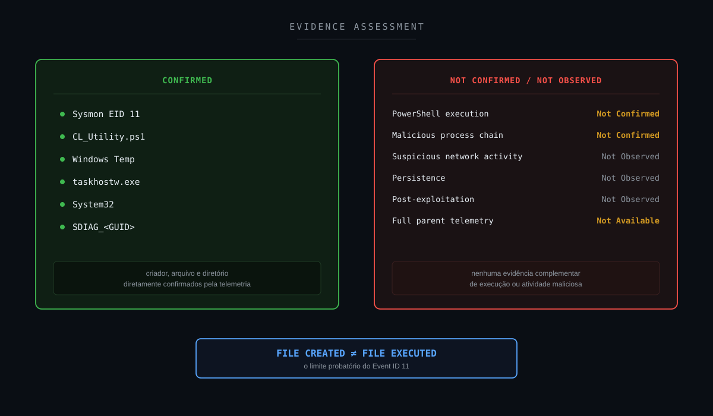

---

## 7. Timeline da investigação

```text
Windows Activity
        ↓
taskhostw.exe
        ↓
CL_Utility.ps1 Created
        ↓
Windows Temp / SDIAG_<GUID>
        ↓
Sysmon Event ID 11
        ↓
Wazuh Rule 119032
        ↓
SOC Alert
        ↓
Initial Suspicious Hypothesis
        ↓
Process Validation
        ↓
taskhostw.exe / System32
        ↓
Filename / Directory Analysis
        ↓
Windows Diagnostic Pattern
        ↓
Threat Hunting
        ↓
Search for PowerShell Execution
        ↓
Search for Network Activity
        ↓
Search for Persistence
        ↓
No Supporting Malicious Evidence
        ↓
Execution Not Confirmed
        ↓
Context Reassessment
        ↓
FALSE POSITIVE
```

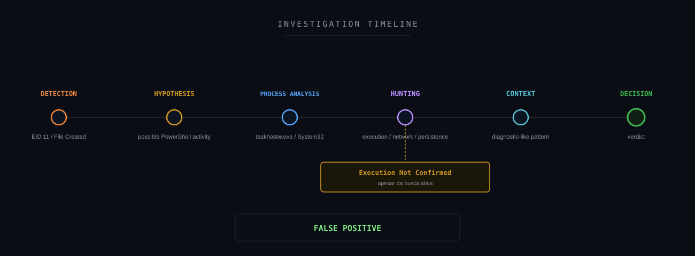

---

## 8. Threat Hunting

Uma investigação desse tipo pode começar pela própria descrição do alerta.

```text
rule.description:*Executable file dropped*
```

ou pelo contexto Sysmon:

```text
rule.groups:*sysmon*
```

Busca específica por Event ID 11:

```text
data.win.system.eventID:11
```

Busca por arquivos criados:

```text
full_log:*TargetFilename*
```

Busca por processos responsáveis pela criação:

```text
full_log:*Image*
```

Busca pelo ativo:

```text
agent.name:"<HOST_ANALISADO>" AND data.win.system.eventID:11
```

Busca pelo processo:

```text
data.win.eventdata.image:*taskhostw.exe*
```

Busca pelo arquivo:

```text
data.win.eventdata.targetFilename:*CL_Utility.ps1*
```

Busca pelo padrão de diagnóstico:

```text
data.win.eventdata.targetFilename:*SDIAG*
```

Busca por possível execução PowerShell:

```text
data.win.eventdata.image:*powershell.exe*
```

ou:

```text
data.win.eventdata.image:*pwsh.exe*
```

Busca utilizando ProcessGuid:

```text
data.win.eventdata.processGuid:"<PROCESS_GUID>"
```

Busca por eventos relacionados ao mesmo ProcessId:

```text
data.win.eventdata.processId:"<PROCESS_ID>"
```

Busca por regras correlacionadas:

```text
rule.id:(119034 OR 92213 OR 92205 OR 119032 OR 119028)
```

Os valores reais utilizados durante a investigação foram removidos.

---

## 9. Campos relevantes para investigação

Entre os principais campos estavam:

```text
@timestamp
agent.name
agent.ip
rule.id
rule.level
rule.description
data.win.system.eventID
data.win.eventdata.image
data.win.eventdata.targetFilename
data.win.eventdata.processGuid
data.win.eventdata.processId
full_log
```

Os elementos mais importantes para o Event ID 11 são:

```text
Image
```

e:

```text
TargetFilename
```

porque permitem responder:

```text
Who created the file?
```

e:

```text
What file was created?
```

Entretanto, eles não respondem sozinhos:

```text
Was the file executed?
```

---

## 10. Resultado do Threat Hunting

O processo associado à criação do arquivo foi:

```text
taskhostw.exe
```

em localização:

```text
C:\Windows\System32\
```

O arquivo criado seguia padrão:

```text
C:\Windows\Temp\SDIAG_<GUID>\CL_Utility.ps1
```

A combinação:

```text
taskhostw.exe
        +
System32
        +
SDIAG_<GUID>
        +
CL_Utility.ps1
```

apresentava contexto compatível com atividade de diagnóstico/suporte do Windows.

O hunting não identificou, dentro das fontes disponíveis, uma sequência suficiente para sustentar:

```text
Malicious PowerShell Execution
```

Também não foram identificadas evidências complementares de:

```text
Suspicious Network Connection
Persistence
Malware Staging
Post-Exploitation
Anomalous Related Activity
```

A conclusão foi:

```text
True File Creation
        +
Legitimate-Looking Creator
        +
Diagnostic-Like Path
        +
No Supporting Malicious Evidence
        ↓
FALSE POSITIVE
```

---

## 11. Entendendo Sysmon Event ID 11

O Sysmon Event ID 11 representa:

```text
FileCreate
```

Ele registra quando um arquivo é:

```text
created
```

ou:

```text
overwritten
```

Isso possui grande valor para detectar:

- payloads;
- scripts;
- arquivos temporários;
- alterações em diretórios críticos;
- artefatos de persistência;
- malware staging.

Entretanto, existe uma limitação conceitual importante:

```text
FileCreate
        ≠
ProcessCreate
```

Exemplo:

```text
taskhostw.exe
        ↓
creates
        ↓
CL_Utility.ps1
```

O Event ID 11 confirma essa relação.

Ele não confirma:

```text
powershell.exe
        ↓
executes
        ↓
CL_Utility.ps1
```

Para isso, seria necessária telemetria adicional.

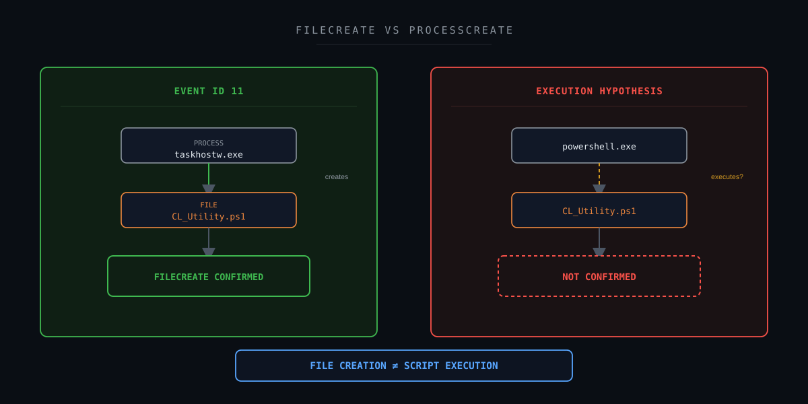

---

## 12. Entendendo o contexto `SDIAG_<GUID>`

O arquivo estava localizado sob um diretório com estrutura sanitizada como:

```text
C:\Windows\Temp\SDIAG_<GUID>\
```

O padrão:

```text
SDIAG
```

é compatível com contexto de diagnóstico/troubleshooting do Windows.

O arquivo:

```text
CL_Utility.ps1
```

também apresentava nomenclatura consistente com uma utility script.

Isso não significa:

```text
Any SDIAG File = Safe
```

O diretório ainda precisa ser correlacionado com:

```text
Creator Process
Executable Path
Digital Signature
Process Lineage
Execution
Network
Persistence
Related Alerts
```

Neste case, o contexto do diretório reforçou a hipótese legítima.

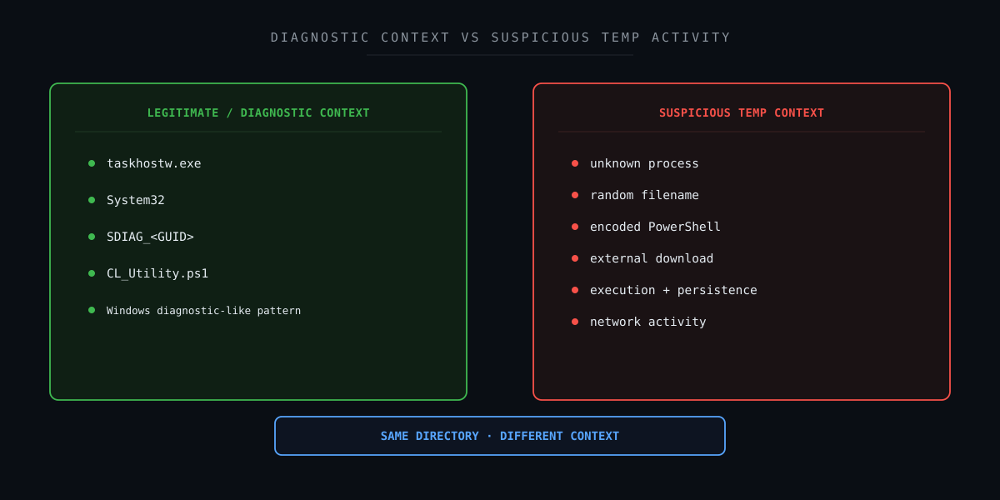

---

## 13. Correlação técnica

### Cenário potencialmente suspeito

```text
Unknown Process
        +
Windows Temp
        +
PowerShell Script
        +
powershell.exe
        +
Encoded Command
        +
Network Connection
        +
Persistence
        ↓
Higher Suspicion
```

### Cenário observado

```text
taskhostw.exe
        +
System32
        +
SDIAG_<GUID>
        +
CL_Utility.ps1
        +
FileCreate Event
        +
No Confirmed Execution
        +
No Supporting Malicious Evidence
        ↓
Legitimate Diagnostic Context
```

O mesmo evento inicial:

```text
.PS1 Created in Temp
```

pode resultar em conclusões completamente diferentes.

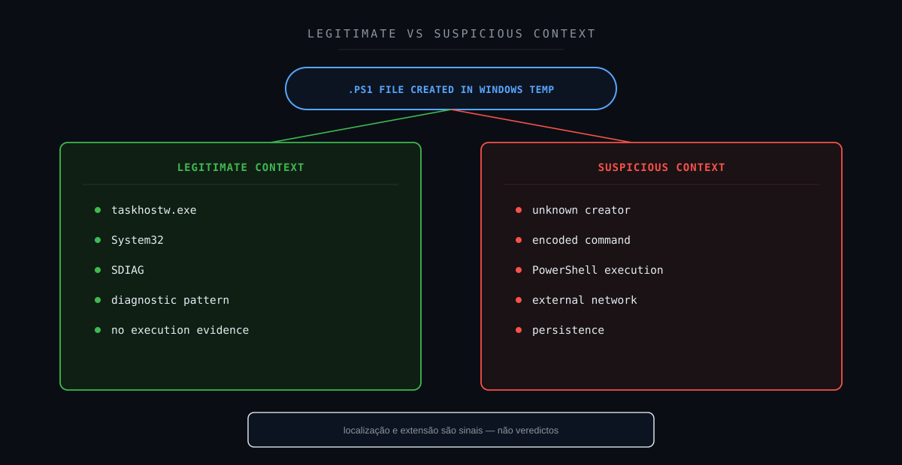

---

## 14. Cadeia fim a fim do evento

```text
Windows Component
        ↓
taskhostw.exe
        ↓
File Creation
        ↓
CL_Utility.ps1
        ↓
Windows Temp
        ↓
Sysmon Event ID 11
        ↓
Wazuh Collection
        ↓
Rule 119032
        ↓
SOC Alert
        ↓
Initial Suspicious Hypothesis
        ↓
Process Validation
        ↓
Path Validation
        ↓
Threat Hunting
        ↓
Search for Execution
        ↓
Search for Network Activity
        ↓
Search for Persistence
        ↓
Evidence Assessment
        ↓
No Supporting Malicious Evidence
        ↓
Context Reassessment
        ↓
FALSE POSITIVE
```

Essa cadeia representa:

```text
File Activity
    ↓
Telemetry
    ↓
Detection
    ↓
Investigation
    ↓
Context
    ↓
Decision
```

Ela não representa uma cadeia de ataque confirmada.

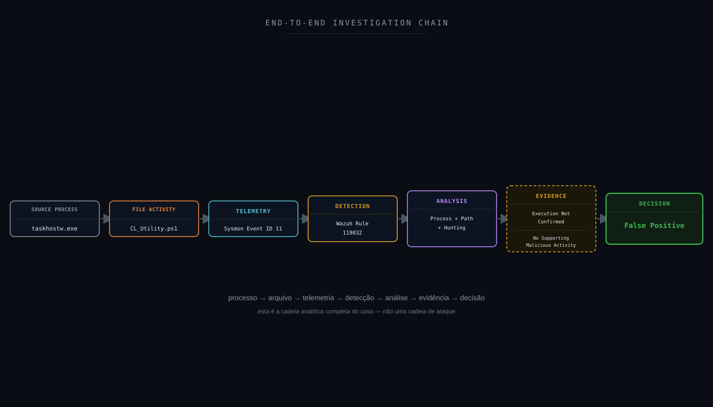

---

## 15. Attack Flow

Não foi identificado Attack Flow adversarial confirmado.

Uma hipótese ofensiva poderia ser:

```text
Initial Access
        ↓
Payload Drop
        ↓
PowerShell Script
        ↓
Execution
        ↓
Persistence / C2
```

O evento analisado demonstrava apenas:

```text
File Created
```

A sequência posterior não foi confirmada.

Portanto:

```text
FileCreate
        ↓
Possible Script
        ↓
Possible Execution?
```

permaneceu apenas como hipótese inicial.

O fluxo adequado para o case é:

```text
Detection
        ↓
File Validation
        ↓
Creator Validation
        ↓
Execution Search
        ↓
Correlation
        ↓
Context
        ↓
Verdict
```

---

## 16. Attack Chain Assessment

| Estágio | Status | Fundamentação |
|---|---|---|
| Reconnaissance | Not Observed | Nenhuma evidência |
| Initial Access | Not Available | Evento não permite determinar |
| Execution | Not Confirmed | EID 11 não demonstra execução |
| Persistence | Not Observed | Nenhuma evidência correlacionada |
| Privilege Escalation | Not Observed | Nenhuma evidência |
| Defense Evasion | Not Observed | Nenhuma evidência |
| Credential Access | Not Observed | Nenhuma evidência |
| Discovery | Not Observed | Nenhuma evidência |
| Lateral Movement | Not Observed | Nenhuma evidência |
| Collection | Not Observed | Nenhuma evidência |
| Command and Control | Not Observed | Nenhuma comunicação suspeita correlacionada |
| Exfiltration | Not Observed | Nenhuma evidência |
| Impact | Not Observed | Nenhum impacto identificado |

O principal cuidado é:

```text
.ps1 File
        ≠
PowerShell Execution
```

---

## 17. MITRE ATT&CK Mapping

### T1059.001 — PowerShell

A extensão:

```text
.ps1
```

pode levantar uma hipótese relacionada à:

```text
T1059.001 — PowerShell
```

Entretanto, a técnica descreve **execução** através de PowerShell.

Neste case:

```text
PowerShell Script Created
```

foi confirmado.

Mas:

```text
PowerShell Script Executed
```

não foi confirmado.

Logo:

```text
T1059.001 = Investigation Hypothesis
```

e não:

```text
T1059.001 = Confirmed TTP
```

O mapeamento só deveria evoluir para técnica confirmada caso telemetria adicional demonstrasse:

```text
powershell.exe
        +
Command Line
        +
Script Execution
```

---

## 18. MITRE Detection Strategy

Uma estratégia mais robusta para arquivos PowerShell em diretórios temporários poderia correlacionar:

```text
File Creation
        +
Creator Process
        +
Process Lineage
        +
PowerShell Execution
        +
Command Line
        +
Network Connection
        +
DNS
        +
Registry
        +
Persistence
        +
File Stream
```

Um único sinal:

```text
.ps1 Created
```

possui menor fidelidade do que:

```text
.ps1 Created
        +
powershell.exe
        +
Encoded Command
        +
External Connection
        +
Persistence
```

Portanto:

```text
Signal Correlation
        ↓
Higher Detection Confidence
```

---

## 19. Framework Mapping

Um framework só entra nesta lista quando há um número, técnica ou controle real e específico que se aplique a este case — não como referência genérica.

### MITRE ATT&CK

**Aplicabilidade: hipótese de investigação (não confirmada).**

```text
T1059.001 — PowerShell
```

Execução PowerShell não foi confirmada; a técnica permanece hipótese.

### MITRE Attack Flow / Cyber Kill Chain

**Aplicabilidade: lente analítica, sem cadeia confirmada.**

Estruturam a pergunta "houve progressão adversarial (criação → execução)?" feita na Seção 16 (Attack Chain Assessment). Nenhum estágio foi confirmado.

### NIST CSF

**Aplicabilidade: direta.**

Detect, Respond e Improve.

### NIST SP 800-61

**Aplicabilidade: direta.**

Investigação, classificação e tratamento.

### ISO/IEC 27035

**Aplicabilidade: direta.**

Ciclo de 5 fases (Plan & Prepare / Detection & Reporting / Assessment & Decision / Responses / Lessons Learned).

### SANS PICERL

**Aplicabilidade: direta.**

Identification (Seções 1–10) e Lessons Learned (Seção 34) mapeados diretamente. Containment/Eradication não se aplicam — execução maliciosa não foi confirmada.

### ISO/IEC 27001

**Aplicabilidade: direta.**

Anexo A 5.24–5.28 — controles de gestão de incidente de segurança da informação.

### COBIT 2019

**Aplicabilidade: direta.**

DSS02 (Managed Service Requests and Incidents) e MEA01/MEA02 (monitoramento e melhoria contínua).

### ITIL 4

**Aplicabilidade: direta.**

Prática de Incident Management e prática de Continual Improvement.

### Agile / Kanban

**Aplicabilidade: operacional (não classifica evidência do case).**

O pipeline de Detection Engineering (Seção 25) poderia ser gerenciado como backlog Scrum/Kanban — cada nova hipótese de detecção como item de sprint. Não é usado para classificar nenhum fato técnico deste alerta.

### CIS Controls

**Aplicabilidade: direta.**

```text
CIS 1  — Inventory and Control of Enterprise Assets
CIS 2  — Inventory and Control of Software Assets
CIS 4  — Secure Configuration of Enterprise Assets and Software
CIS 8  — Audit Log Management
CIS 10 — Malware Defenses
CIS 13 — Network Monitoring and Defense
CIS 17 — Incident Response Management
```

### SOC-CMM

**Aplicabilidade: direta.**

Detection Quality e Telemetry Coverage.

### Metodologia analítica aplicada

```text
ACH — Analysis of Competing Hypotheses
```

A Seção 13 avalia cenários concorrentes (execução maliciosa vs. rotina de diagnóstico do Windows) e os refuta por evidência.

```text
Método Científico
```

Hipótese → Evidência → Teste → Conclusão é a estrutura epistêmica de todo o note.

```text
OODA Loop
```

Observe (telemetria) → Orient (hipótese/evidência) → Decide (veredito) → Act (recomendações).

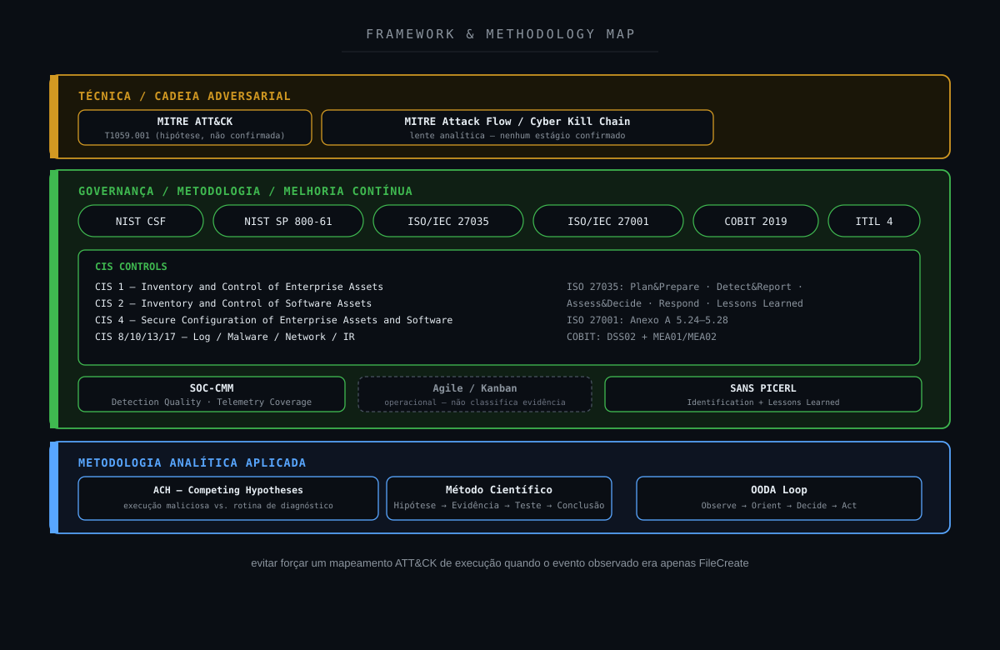

---

## 20. NIST Mapping

### IDENTIFY

Compreender:

- ativo;
- software;
- função;
- processos esperados;
- comportamento operacional.

### PROTECT

Aplicar:

- hardening;
- least privilege;
- script controls;
- application control;
- endpoint protection.

### DETECT

Sysmon identificou:

```text
FileCreate
```

e o Wazuh gerou o alerta.

### RESPOND

O SOC executou:

```text
File Analysis
        ↓
Creator Process Validation
        ↓
Threat Hunting
        ↓
Execution Search
        ↓
Correlation
        ↓
Verdict
```

### RECOVER

Não aplicável.

Nenhum impacto foi identificado.

### GOVERN

Relaciona-se a:

- política de logging;
- visibilidade de endpoint;
- retenção de telemetria;
- controle de scripts.

### IMPROVE

O principal ganho identificado foi:

```text
Better Process Telemetry
```

---

## 21. CIS Controls

O case possui relação com:

- Inventory and Control of Enterprise Assets;
- Inventory and Control of Software Assets;
- Secure Configuration;
- Audit Log Management;
- Malware Defenses;
- Network Monitoring and Defense;
- Incident Response Management.

O principal ponto é:

> **a qualidade da resposta depende da qualidade da telemetria.**

Event ID 11 responde:

```text
What file was created?
Who created it?
```

Mas não responde sozinho:

```text
Was it executed?
What happened after?
```

---

## 22. Detection Strategy

### Detecção atual

```text
.ps1 File
        +
Temp Directory
        ↓
Sysmon Event ID 11
        ↓
Wazuh Alert
```

Essa detecção possui valor.

Não deve ser simplesmente removida porque um caso resultou em falso positivo.

### Detecção enriquecida

```text
FileCreate
        +
Extension
        +
Directory
        +
Creator Process
        +
Digital Signature
        +
Process Lineage
        +
ProcessCreate
        +
Command Line
        +
Network
        +
DNS
        +
Registry
        ↓
Contextual Risk
```

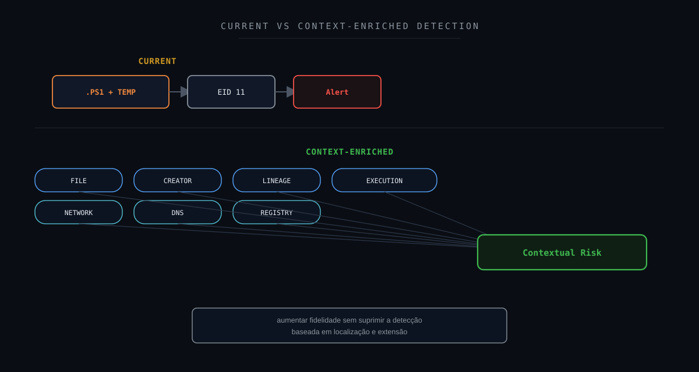

---

## 23. Detection Gap Analysis

### O que foi detectado?

```text
File Creation
```

### Sabemos quem criou?

```text
YES
→ taskhostw.exe
```

### Sabemos qual arquivo?

```text
YES
→ CL_Utility.ps1
```

### Sabemos onde?

```text
YES
→ Windows Temp / SDIAG_<GUID>
```

### Sabemos se foi executado?

```text
NOT CONFIRMED
```

### Sabemos a cadeia completa?

```text
NOT AVAILABLE
```

A principal lacuna pode ser representada como:

```text
FILE TELEMETRY
        >
PROCESS EXECUTION TELEMETRY
```

Ou seja:

> **a criação estava visível com boa qualidade, mas a investigação precisava de mais contexto de processo para responder sobre execução.**

---

## 24. Oportunidades de enriquecimento

Uma configuração futura pode correlacionar Sysmon Event IDs adicionais.

### Event ID 1 — Process Create

Responder:

```text
Was the script executed?
Which process executed it?
What was the command line?
Who was the parent?
```

### Event ID 3 — Network Connect

Responder:

```text
Did the process establish a network connection?
```

### Event ID 7 — Image Load

Responder:

```text
Which modules were loaded?
```

### Event IDs 12, 13 e 14 — Registry

Responder:

```text
Was persistence or configuration modification performed?
```

### Event ID 15 — FileCreateStreamHash

Responder:

```text
Was an alternate data stream created?
```

### Event ID 22 — DNS Query

Responder:

```text
Did the process resolve external infrastructure?
```

Essa correlação permite evoluir de:

```text
FILE CREATED
```

para:

```text
FILE CREATED
        +
EXECUTION
        +
NETWORK
        +
DNS
        +
PERSISTENCE
```

quando esses comportamentos realmente existirem.

---

## 25. Detection Engineering

Um pipeline futuro poderia utilizar:

```text
FILECREATE EVENT
        ↓
FILE CLASSIFICATION
        ↓
DIRECTORY RISK
        ↓
CREATOR PROCESS
        ↓
PROCESS REPUTATION
        ↓
PROCESS LINEAGE
        ↓
EXECUTION CORRELATION
        ↓
NETWORK / DNS
        ↓
REGISTRY / PERSISTENCE
        ↓
HISTORICAL BASELINE
        ↓
CONTEXTUAL RISK
```

Exemplo de menor risco:

```text
.ps1
        +
SDIAG
        +
taskhostw.exe
        +
System32
        +
Known Diagnostic Pattern
        +
No Execution Evidence
        +
No Supporting Malicious Activity
        ↓
LOWER SUSPICION
```

Exemplo de maior risco:

```text
.ps1
        +
Temp
        +
Unknown Creator
        +
powershell.exe
        +
Encoded Command
        +
External Network
        +
Registry Persistence
        ↓
HIGHER SUSPICION
```

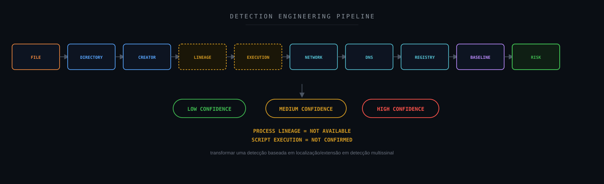

---

## 26. Sigma

Sigma pode complementar casos envolvendo criação e execução de scripts.

Possíveis estratégias:

```text
PowerShell Script Created in Temp
```

```text
PowerShell Executed from Temp
```

```text
Encoded PowerShell Command
```

```text
Suspicious Parent → powershell.exe
```

```text
Script Creation + Network Connection
```

```text
Script Execution + Registry Persistence
```

Entretanto:

```text
Sigma Match
```

também precisa de contexto.

Uma regra deve produzir um sinal de investigação.

Não um veredito automático.

---

## 27. Hardening Opportunities

### PowerShell Logging

Avaliar habilitação e retenção de:

```text
PowerShell Operational Logs
Script Block Logging
Module Logging
```

conforme política e necessidade.

### Sysmon

Ampliar telemetria relevante, principalmente:

```text
EID 1
EID 3
EID 7
EID 12
EID 13
EID 14
EID 15
EID 22
```

### Application Control

Avaliar:

```text
AppLocker
Windows Defender Application Control
```

conforme arquitetura e política.

### Least Privilege

Reduzir privilégios desnecessários.

### Temp Monitoring

Manter monitoramento de:

```text
Windows\Temp
User Temp
Downloads
AppData
```

### Baseline

Documentar processos legítimos que criam arquivos nesses diretórios.

### Endpoint Protection

Correlacionar criação de arquivos com EDR.

O resultado de falso positivo não significa que o monitoramento do Windows Temp deva ser removido.

---

## 28. Controles defensivos

Uma estratégia Defense-in-Depth pode incluir:

```text
Secure Configuration
        ↓
Application Control
        ↓
PowerShell Logging
        ↓
Sysmon
        ↓
Endpoint Protection
        ↓
Wazuh
        ↓
Threat Hunting
        ↓
Incident Response
```

Cada camada responde a perguntas diferentes.

```text
Sysmon EID 11
→ What file was created?
```

```text
Sysmon EID 1
→ What process executed?
```

```text
Network / DNS
→ Where did it communicate?
```

```text
Registry
→ Did it establish persistence?
```

```text
SOC
→ What does the complete evidence support?
```

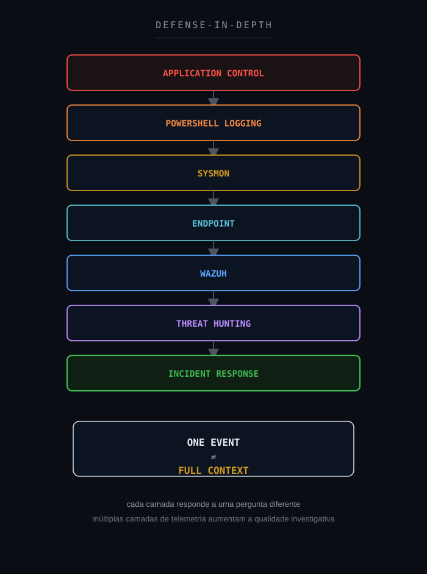

---

## 29. SOC-CMM

O case possui relação com:

- Security Monitoring;
- Incident Analysis;
- Threat Hunting;
- Detection Quality;
- Telemetry Coverage;
- False Positive Management;
- Continuous Improvement.

Uma abordagem menos madura:

```text
PowerShell File in Temp
        ↓
High Severity
        ↓
Malicious
```

Uma abordagem mais madura:

```text
FileCreate
        ↓
Validate Creator
        ↓
Validate File
        ↓
Search Execution
        ↓
Search Network
        ↓
Search Persistence
        ↓
Assess Context
        ↓
Evidence-Based Verdict
```

O case também demonstra que falso positivo não deve ser tratado apenas como:

```text
Noise
```

Ele pode revelar:

```text
Detection Improvement Opportunity
```

---

## 30. Métricas operacionais

| Métrica | Objetivo |
|---|---|
| MTTD | Tempo até detecção |
| MTTA | Tempo até reconhecimento |
| MTTR | Tempo até conclusão |
| False Positive Rate | Qualidade das regras |
| Detection Coverage | Cobertura de comportamento |
| Process Telemetry Coverage | Visibilidade de criação de processos |
| DNS Coverage | Visibilidade de resolução |
| Network Telemetry Coverage | Visibilidade de conexões |
| Enrichment Coverage | Quantidade de alertas enriquecidos |
| SLA | Operação |

Uma métrica especialmente útil seria:

```text
Process Telemetry Coverage
```

porque um Event ID 11 sem capacidade de correlacionar Event ID 1 reduz a resposta à pergunta:

```text
Was the file executed?
```

---

## 31. Decision Flow

```text
File Created?
        ↓
YES
        ↓
Sensitive Directory?
        ↓
YES
        ↓
Script File?
        ↓
YES
        ↓
Creator Process Known?
        ├── NO
        │    ↓
        │  Increase Suspicion
        │
        └── YES
             ↓
Creator Legitimate / Expected?
        ├── NO
        │    ↓
        │  Escalate Investigation
        │
        └── YES
             ↓
Execution Confirmed?
        ├── YES
        │    ↓
        │  Analyze Command Line / Parent
        │
        └── NO / NOT AVAILABLE
             ↓
Supporting Malicious Evidence?
        ├── YES
        │    ↓
        │  ESCALATE INVESTIGATION
        │
        └── NO
             ↓
Known Diagnostic Pattern?
        ├── NO
        │    ↓
        │  CONTINUE INVESTIGATION
        │
        └── YES
             ↓
FALSE POSITIVE
LEGITIMATE FILE CREATION
```

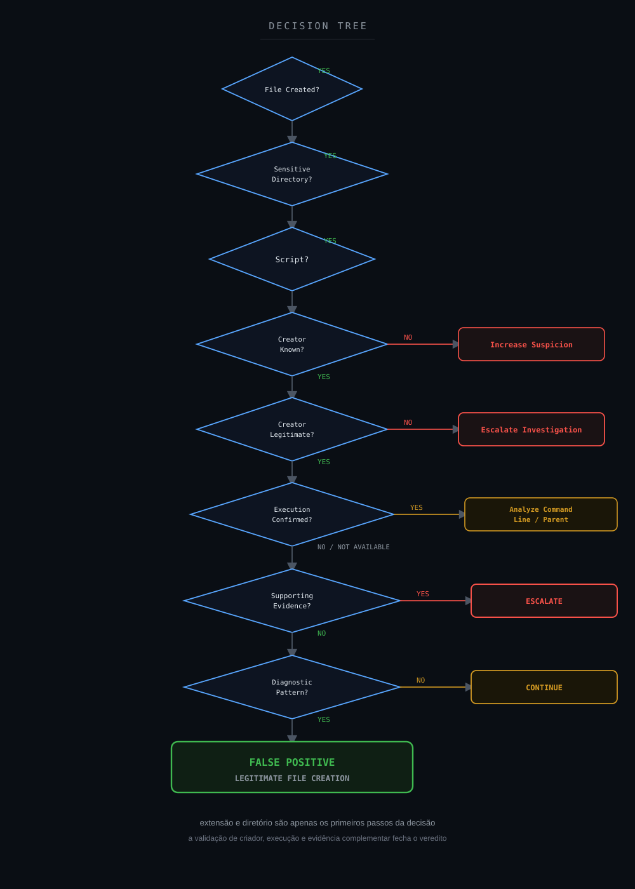

---

## 32. Veredito técnico

### Sysmon Event ID 11

```text
Confirmed
```

### Arquivo criado

```text
CL_Utility.ps1
```

### Diretório

```text
Windows Temp / SDIAG_<GUID>
```

### Processo criador

```text
taskhostw.exe
```

### Localização do processo

```text
C:\Windows\System32\
```

### Contexto de diagnóstico Windows

```text
Supported
```

### Execução PowerShell

```text
Not Confirmed
```

### Comunicação suspeita

```text
Not Observed
```

### Persistência

```text
Not Observed
```

### Pós-exploração

```text
Not Observed
```

### Cadeia completa de processos

```text
Not Available
```

### Atividade maliciosa

```text
Not Confirmed
```

### Impacto

```text
Not Observed
```

### Classificação final

**Falso Positivo — criação de script compatível com rotina legítima de diagnóstico/suporte do Windows, sem evidências complementares suficientes de execução ou atividade maliciosa.**

### Veredito

```text
FALSE POSITIVE
LEGITIMATE FILE CREATION CONTEXT
NO CONFIRMED MALICIOUS EXECUTION
```

---

## 33. Por que Falso Positivo?

O evento aconteceu.

```text
FileCreate = TRUE
```

O arquivo foi criado.

```text
CL_Utility.ps1 = TRUE
```

A localização também era real.

```text
Windows Temp = TRUE
```

A pergunta era:

```text
Malicious Activity = ?
```

A investigação demonstrou:

```text
taskhostw.exe
        +
System32
        +
SDIAG_<GUID>
        +
CL_Utility.ps1
        +
Diagnostic-Like Pattern
        +
No Confirmed Execution
        +
No Suspicious Network Activity
        +
No Persistence
        +
No Supporting Malicious Evidence
        ↓
FALSE POSITIVE
```

Isso demonstra:

```text
True Event
        ≠
Malicious Event
```

e principalmente:

```text
File Created
        ≠
File Executed
```

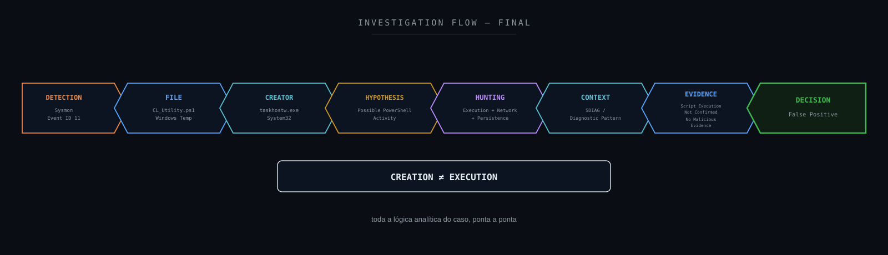

---

## 34. Lições aprendidas

A principal lição deste estudo é:

> **criação de arquivo e execução de arquivo são eventos diferentes.**

### Event ID 11 confirma FileCreate

Ele responde:

```text
What file?
Which process created it?
When?
```

### Event ID 11 não confirma execução

Para isso, precisamos de telemetria complementar.

### Diretórios temporários precisam continuar monitorados

O fato de uma rotina legítima utilizar:

```text
C:\Windows\Temp
```

não transforma o diretório em irrelevante.

Malware também utiliza diretórios temporários.

### Processos legítimos exigem validação contextual

O nome:

```text
taskhostw.exe
```

sozinho não é suficiente.

É necessário considerar:

```text
Path
Signature
Lineage
Behavior
```

### Um `.ps1` não significa PowerShell executado

A extensão representa formato de arquivo.

Não atividade de execução.

### Falso positivo contextual não significa regra ruim

A detecção cumpriu seu objetivo:

```text
Sensitive File Creation
        ↓
Analyst Investigation
```

### O verdadeiro gap estava na correlação

A capacidade de correlacionar:

```text
FileCreate
        +
ProcessCreate
        +
Network
        +
DNS
        +
Registry
```

aumentaria significativamente a confiança.

### Não transformar ausência de telemetria em benignidade

Se não temos telemetria de execução:

```text
Not Confirmed
```

é melhor que:

```text
Did Not Execute
```

---

## 35. Recomendações

1. Manter monitoramento de scripts criados em Windows Temp.
2. Não suprimir genericamente a Rule 119032.
3. Baselinear artefatos legítimos relacionados a `SDIAG`.
4. Validar processos responsáveis pela criação.
5. Validar caminho dos executáveis.
6. Validar assinatura digital quando disponível.
7. Correlacionar Event ID 11 com Event ID 1.
8. Preservar ProcessGuid para correlação.
9. Preservar ProcessId e ParentProcessId.
10. Habilitar telemetria de Process Create quando necessário.
11. Correlacionar Event ID 3 para conexões de rede.
12. Correlacionar Event ID 7 para módulos carregados.
13. Correlacionar Event IDs 12, 13 e 14 para Registro.
14. Correlacionar Event ID 15 para ADS.
15. Correlacionar Event ID 22 para DNS.
16. Avaliar PowerShell Script Block Logging.
17. Avaliar PowerShell Module Logging.
18. Correlacionar com EDR.
19. Monitorar `powershell.exe` e `pwsh.exe`.
20. Monitorar encoded commands.
21. Monitorar downloads executados por PowerShell.
22. Monitorar criação de arquivos subsequentes.
23. Monitorar mecanismos de persistência.
24. Utilizar baseline em vez de exclusões amplas.
25. Documentar rotinas legítimas de diagnóstico.
26. Manter Threat Hunting disponível.
27. Documentar lacunas de telemetria.
28. Diferenciar `File Created` de `File Executed`.
29. Avaliar tuning contextual da regra.
30. Utilizar múltiplos sinais para elevar confiança analítica.

---

## 36. Referências técnicas

### Microsoft Sysmon

Sysmon — Sysinternals
https://learn.microsoft.com/en-us/sysinternals/downloads/sysmon

Sysmon Events
https://learn.microsoft.com/en-us/windows/security/operating-system-security/sysmon/sysmon-events

Sysmon Configuration Files
https://learn.microsoft.com/en-us/windows/security/operating-system-security/sysmon/sysmon-configuration-files

### Microsoft PowerShell

PowerShell Documentation
https://learn.microsoft.com/en-us/powershell/

PowerShell Logging
https://learn.microsoft.com/en-us/powershell/module/microsoft.powershell.core/about/about_logging_windows

### Wazuh

Wazuh Documentation
https://documentation.wazuh.com/

### MITRE ATT&CK

MITRE ATT&CK
https://attack.mitre.org/

T1059.001 — PowerShell
https://attack.mitre.org/techniques/T1059/001/

### MITRE D3FEND

MITRE D3FEND
https://d3fend.mitre.org/

### MITRE Attack Flow

MITRE Attack Flow
https://center-for-threat-informed-defense.github.io/attack-flow/

### NIST

NIST Cybersecurity Framework
https://www.nist.gov/cyberframework

NIST SP 800-61 Rev. 3
https://csrc.nist.gov/pubs/sp/800/61/r3/final

### CIS

CIS Controls
https://www.cisecurity.org/controls

### VERIS

VERIS Framework
https://verisframework.org/

### Sigma

Sigma
https://sigmahq.io/

### SOC-CMM

SOC-CMM
https://www.soc-cmm.com/

---

## Disclaimer

Este estudo foi sanitizado para preservar integralmente a confidencialidade do ambiente originalmente analisado.

As investigações, decisões técnicas e veredictos apresentados neste estudo refletem experiência prática real do autor. Ferramentas de Inteligência Artificial foram utilizadas como apoio para formatação, diagramação e publicação do conteúdo — não para a condução da investigação em si.

Não são publicados valores reais relacionados a:

```text
Organization
Client
Hostname
Source IP
Destination IP
Username
E-mail Address
Incident ID
Ticket ID
Exact Timestamp
Agent ID
Process GUID
Process ID
Parent Process ID
SDIAG GUID
Internal Rule Details
Environment-Specific Identifier
Credentials
Tokens
Secrets
```

O hostname originalmente envolvido não é identificado.

O endereço IP não é publicado.

O usuário não é identificado.

O GUID real do diretório `SDIAG` foi substituído por:

```text
<GUID>
```

O contexto técnico foi mantido apenas no nível necessário para compreender a investigação:

```text
Windows Host
        ↓
taskhostw.exe
        ↓
CL_Utility.ps1
        ↓
Windows Temp / SDIAG_<GUID>
        ↓
Sysmon Event ID 11
        ↓
Wazuh Alert
        ↓
Threat Hunting
        ↓
No Confirmed Malicious Execution
        ↓
False Positive
```

A presença de um arquivo `.ps1` não é tratada como confirmação de execução PowerShell.

O Event ID 11 é utilizado neste estudo exclusivamente como evidência de criação/sobrescrita do arquivo.

Quando determinada telemetria necessária à confirmação de execução ou processo pai não estava disponível, a análise preservou essa limitação em vez de convertê-la em evidência de benignidade.

Informações públicas e não correlacionáveis ao ambiente, como:

```text
Wazuh Rule ID
Sysmon Event IDs
MITRE ATT&CK Techniques
Technology Names
Frameworks
```

podem ser preservadas quando necessárias ao contexto técnico.

As classificações:

```text
Confirmed
Supported
Inferred
Hypothesis
Not Observed
Not Available
Not Applicable
```

possuem significados distintos.

O objetivo desta publicação é compartilhar:

- metodologia de investigação;
- raciocínio analítico;
- Threat Hunting;
- Incident Response;
- Sysmon;
- Windows Security;
- PowerShell investigation;
- Detection Engineering;
- classificação de evidências;
- análise de lacunas de telemetria;
- melhoria contínua.

Este projeto é independente e não representa documentação oficial do Wazuh, Microsoft, MITRE, NIST, CIS ou das demais organizações e projetos mencionados.

---

**Wazuh SOC Notes**

> **Arquivo criado é evidência. Execução exige outra evidência. Contexto transforma telemetria em decisão.**
