# Wazuh SOC Notes #006 — Darktrace Watched Domain: severidade não é impacto

> **SOC | Threat Hunting | Incident Response | Network Detection & Response | DNS | Darktrace | Wazuh | Detection Engineering**

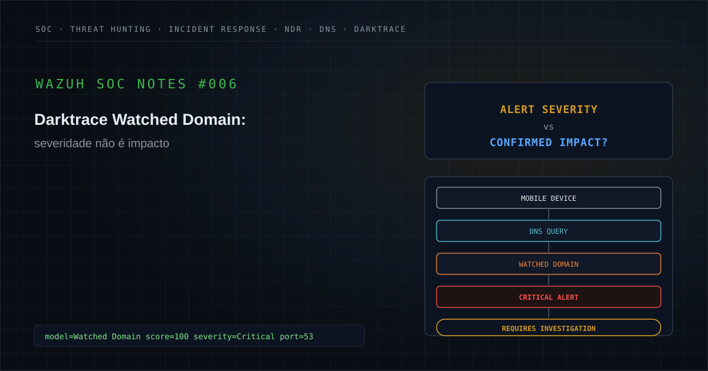

---

## Executive Summary

Durante uma atividade de monitoramento de segurança, foi investigado no Wazuh um alerta originado a partir de telemetria do **Darktrace** relacionado ao modelo:

```text
Watched Domain
```

O evento envolvia um dispositivo classificado como:

```text
Mobile / Android
```

realizando atividade DNS associada a um domínio previamente monitorado pela plataforma.

O alerta apresentava:

```text
Score: 100%
```

e havia sido recebido pelo Wazuh com classificação operacional crítica.

À primeira vista, a combinação:

```text
Critical Severity
        +
Score 100%
        +
Watched Domain
        +
Mobile Device
```

poderia sugerir comprometimento de alta gravidade.

Entretanto, a investigação demonstrou que essa leitura seria prematura.

O destino de rede observado no evento era um endereço interno utilizando:

```text
Port 53 / DNS
```

o que era **compatível com utilização de um resolvedor DNS interno**.

A atividade tecnicamente confirmada era:

```text
Mobile Device
        ↓
DNS Activity
        ↓
Watched Domain
```

Não havia, no evento isolado, evidência suficiente para confirmar:

```text
Malware Execution
Command and Control
Payload Download
Credential Access
Lateral Movement
Exfiltration
Device Compromise
```

Essa distinção é essencial.

Uma consulta DNS pode representar uma etapa anterior a diversas atividades.

Mas:

```text
DNS Query
        ≠
Successful Connection
```

e:

```text
Watched Domain
        ≠
Confirmed Command and Control
```

Da mesma forma:

```text
Score 100%
        ≠
100% Probability of Compromise
```

O score representa a força/aderência do evento ao modelo ou condição de detecção configurada.

Ele não deve ser interpretado como probabilidade matemática de comprometimento.

Como a telemetria disponível não permitia confirmar nem afastar tecnicamente a hipótese de comprometimento, o SOC escalou o caso para validação junto ao usuário/proprietário do dispositivo — o próprio fluxo de decisão previsto para eventos envolvendo ativos Mobile/BYOD.

Nessa etapa, o usuário reconheceu a atividade como acesso realizado a partir do seu próprio dispositivo pessoal.

Esse reconhecimento não é telemetria técnica adicional — é uma fonte de evidência diferente, obtida por confirmação direta do usuário/asset owner, e foi tratado como tal:

```text
User Acknowledgment = Confirmed (via user attestation)
```

e não como:

```text
Technical Follow-up Evidence
```

Com essa confirmação, o caso foi encerrado.

A classificação final adotada para o case foi:

**Falso Positivo — atividade DNS relacionada a Watched Domain a partir de dispositivo Mobile/Android, com acesso reconhecido pelo usuário como legítimo.**

A severidade contextual foi tratada como:

```text
Medium
```

apesar da criticidade original do alerta.

O comprometimento técnico permaneceu:

```text
Not Confirmed (nunca demonstrado por telemetria)
```

mas o caso foi fechado com base em:

```text
Confirmed User Acknowledgment
```

A principal lição do estudo é:

> **severidade ajuda a definir prioridade. Evidências determinam impacto — e nem toda evidência que fecha um caso é telemetria.**

---

## 1. Contexto do alerta

O Wazuh recebeu um alerta proveniente do Darktrace relacionado a uma detecção do tipo:

```text
Watched Domain
```

O evento indicava atividade DNS envolvendo:

```text
Mobile / Android Device
```

e um domínio monitorado pela plataforma.

Os elementos principais do evento, já sanitizados, podem ser representados como:

```text
Source:
<ANDROID_DEVICE>

Source IP:
<INTERNAL_IP>

Destination:
<INTERNAL_DNS_ADDRESS>

Destination Port:
53 / DNS

Domain:
<WATCHED_DOMAIN>

Score:
100%

Alert Severity:
Critical
```

Todos os identificadores capazes de correlacionar o estudo ao ambiente original foram removidos.

Isso inclui:

```text
Organization
Client
Hostname
Source IP
Destination IP
MAC Address
Domain
SSID
Subnet
PBID
Model Breach ID
Collector
Incident ID
Timestamp
Internal Rule ID
Environment-Specific Tags
```

O principal cuidado analítico era não transformar:

```text
Critical Alert
```

em:

```text
Critical Impact
```

sem evidência adicional.

---

## 2. Hipótese inicial

A hipótese inicial foi:

```text
Mobile Device
        ↓
DNS Query
        ↓
Watched Domain
        ↓
Possible Suspicious Communication
        ↓
Possible C2?
        ↓
Requires Investigation
```

Os cenários inicialmente considerados incluíam:

- domínio malicioso;
- aplicação indesejada;
- atividade de navegador;
- advertising/redirect;
- aplicativo mobile;
- malware;
- possível infraestrutura de C2;
- domínio incluído manualmente em watchlist;
- uso indevido da rede;
- dispositivo BYOD;
- dispositivo desconhecido;
- atividade legítima posteriormente categorizada como suspeita.

A principal pergunta era:

```text
Watched Domain Detection
        ↓
What actually happened?
```

e não:

```text
Watched Domain Detection
        ↓
Compromise Confirmed
```

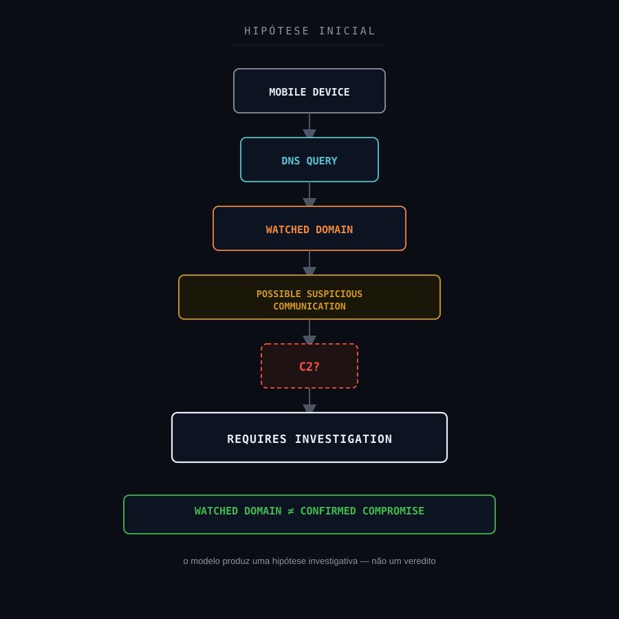

---

## 3. Escopo da investigação

A investigação foi estruturada para responder:

1. Qual comportamento gerou o Watched Domain?
2. O evento representava DNS ou conexão direta?
3. Qual era o destino de rede observado?
4. Qual porta estava envolvida?
5. O destino aparentava ser interno ou externo?
6. O dispositivo era Mobile/Android?
7. O ativo era corporativo, BYOD ou desconhecido?
8. O domínio havia sido monitorado previamente?
9. O score representava força do modelo ou impacto?
10. Houve resolução DNS?
11. Houve posteriormente conexão HTTP/HTTPS?
12. Houve download?
13. Existia tráfego para o IP retornado pelo DNS?
14. Houve recorrência?
15. Outros dispositivos consultaram o mesmo domínio?
16. Existiam eventos relacionados no firewall?
17. Existiam eventos no proxy?
18. Existia telemetria de endpoint?
19. Houve execução de processo suspeito?
20. Houve instalação de aplicativo?
21. Existiam sinais de persistência?
22. Houve Command and Control?
23. Houve exfiltração?
24. Existia alguma ação de contenção confirmada?
25. Qual era o impacto efetivamente observado?
26. O nível crítico representava impacto real ou prioridade operacional?

---

## 4. 5W1H

### What — O que aconteceu?

Foi observada atividade DNS de um dispositivo Mobile/Android relacionada a um domínio classificado como Watched Domain pelo Darktrace.

### Who — Quem ou o que esteve envolvido?

Um dispositivo Mobile/Android conectado ao ambiente monitorado.

O hostname, endereço IP e MAC Address reais não são publicados.

### When — Quando ocorreu?

O evento ocorreu dentro da janela analisada pelo SOC.

O timestamp exato foi removido.

### Where — Onde ocorreu?

Em uma rede monitorada pelo Darktrace e integrada ao Wazuh.

O destino observado estava em endereço interno utilizando a porta:

```text
53 / DNS
```

Esse comportamento era consistente com a utilização de um resolvedor DNS interno.

### Why — Por que era relevante?

O domínio consultado estava associado ao modelo:

```text
Watched Domain
```

e o evento recebeu score elevado e classificação crítica.

Isso justificava investigação prioritária.

### How — Como foi analisado?

A análise considerou:

- tipo do dispositivo;
- protocolo;
- porta;
- destino;
- modelo Darktrace;
- score;
- natureza do evento DNS;
- recorrência;
- possíveis comunicações posteriores;
- contexto do endpoint;
- impacto observado;
- limitações de telemetria.

---

## 5. Evidências disponíveis

| Evidência | Fonte | Classificação | Confiança |
|---|---|---|---|
| Evento Watched Domain | Darktrace / Wazuh | Confirmed | High |
| Dispositivo classificado como Mobile/Android | Darktrace | Confirmed | High |
| Atividade DNS | Darktrace | Confirmed | High |
| Porta 53 envolvida | Darktrace | Confirmed | High |
| Domínio presente em Watched Domain | Darktrace | Confirmed | High |
| Score 100% | Darktrace | Confirmed | High |
| Alert severity crítica | Wazuh / Darktrace | Confirmed | High |
| Destino de rede interno | Darktrace | Confirmed | High |
| Destino compatível com resolvedor DNS interno | Correlação | Supported | High |
| Resolução DNS bem-sucedida | Evento disponível | Not Confirmed | Medium |
| Conexão HTTP/HTTPS posterior | Fonte analisada | Not Available | Medium |
| Download de payload | Fonte analisada | Not Available | Medium |
| Processo originador no Android | Fonte analisada | Not Available | Medium |
| Malware | Investigação | Not Confirmed | High |
| Command and Control | Investigação | Not Confirmed | High |
| Comprometimento do dispositivo | Investigação | Not Confirmed | High |
| Exfiltração | Fonte analisada | Not Available | Medium |
| Impacto de segurança | Investigação | Not Confirmed | High |
| Reconhecimento do usuário sobre a atividade | Validação com usuário / asset owner | Confirmed (user attestation) | High |

A síntese correta era:

```text
DNS Activity = Confirmed
Watched Domain = Confirmed
Critical Alert = Confirmed
Impact (technical) = Not Confirmed
Compromise (technical) = Not Confirmed
User Acknowledgment = Confirmed
```

---

## 6. Classificação das evidências

### Confirmed / Observed

Informação diretamente sustentada pela telemetria.

Exemplo:

```text
DNS activity to Watched Domain
```

`Confirmed` também pode ser sustentado por uma fonte não técnica, quando essa fonte é direta e verificável — por exemplo, o reconhecimento do próprio usuário/asset owner sobre uma atividade. Esse tipo de confirmação é registrado separadamente como:

```text
Confirmed (user attestation)
```

para não ser confundido com confirmação por telemetria.

### Supported

Conclusão sustentada por diferentes elementos coerentes.

Exemplo:

```text
Internal Destination
        +
Port 53
        ↓
Consistent with Internal DNS Resolver
```

### Inferred

Interpretação analítica derivada das evidências.

### Hypothesis

Possibilidade ainda dependente de validação.

Exemplo:

```text
Possible Command and Control
```

### Not Observed

Utilizado somente quando determinado comportamento foi efetivamente procurado em fonte adequada e não encontrado.

### Not Available

A telemetria necessária para responder à pergunta não estava disponível.

Exemplo:

```text
Application-layer connection after DNS resolution
```

quando somente o evento DNS estava disponível.

### Not Confirmed

Existe um sinal ou hipótese relevante, mas as evidências disponíveis não sustentam a conclusão.

Exemplo:

```text
Device Compromise
```

### Not Applicable

Elemento sem aderência técnica ao cenário.

Um princípio central deste case:

```text
Not Available
        ≠
Not Observed
```

e:

```text
Not Confirmed
        ≠
Did Not Happen
```

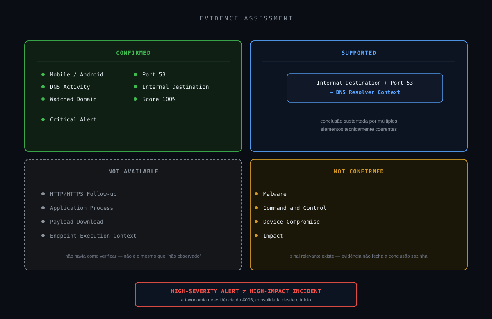

---

## 7. Timeline da investigação

A sequência lógica pode ser representada como:

```text
Mobile Device
        ↓
DNS Activity
        ↓
Watched Domain
        ↓
Darktrace Model Breach
        ↓
Score 100%
        ↓
Critical Alert
        ↓
Wazuh
        ↓
SOC Investigation
        ↓
Initial Risk Hypothesis
        ↓
Protocol Validation
        ↓
Port 53 Identified
        ↓
Destination Validation
        ↓
Internal Destination
        ↓
DNS Resolver Context Supported
        ↓
Search for Follow-up Activity
        ↓
Application-Layer Evidence Not Available
        ↓
Compromise Not Confirmed
        ↓
Impact Reassessment
        ↓
Asset / User Validation
        ↓
FALSE POSITIVE
```

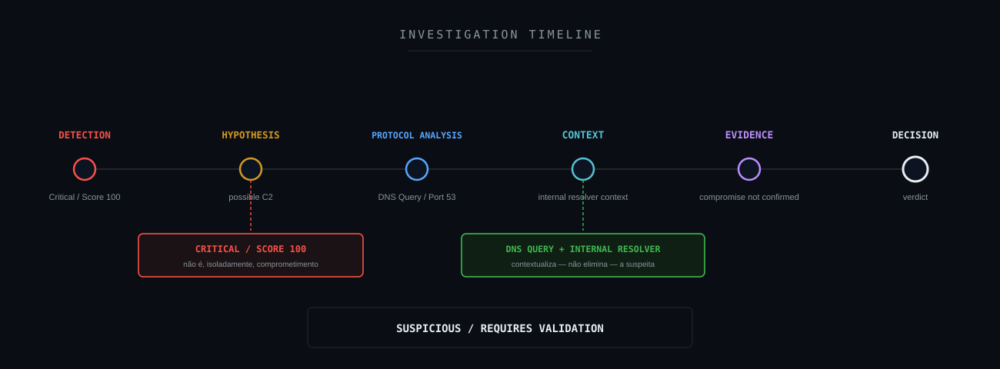

---

## 8. Threat Hunting

As queries abaixo são exemplos sanitizados.

### Eventos Darktrace Watched Domain

```text
rule.description:*Darktrace* AND rule.description:*Watched Domain*
```

### Busca por atividade DNS

```text
full_log:*DNS*
```

ou, quando os campos estiverem estruturados:

```text
destination.port:53
```

### Busca pelo dispositivo

```text
source.ip:"<SOURCE_IP>"
```

### Correlação com o domínio

```text
full_log:*<WATCHED_DOMAIN>*
```

### Dispositivo + domínio

```text
source.ip:"<SOURCE_IP>" AND full_log:*<WATCHED_DOMAIN>*
```

### Recorrência do mesmo domínio

```text
full_log:*<WATCHED_DOMAIN>*
```

### Recorrência do mesmo dispositivo

```text
source.ip:"<SOURCE_IP>" AND rule.description:*Darktrace*
```

### Busca por outras portas

```text
source.ip:"<SOURCE_IP>" AND NOT destination.port:53
```

### Busca por HTTP/HTTPS, quando disponível

```text
source.ip:"<SOURCE_IP>" AND destination.port:(80 OR 443)
```

### Busca por outros eventos de segurança associados

```text
source.ip:"<SOURCE_IP>" AND rule.level:>=10
```

As consultas reais devem ser adaptadas aos campos do índice e decoder disponíveis.

Nenhum IP, hostname ou domínio real é publicado.

---

## 9. Campos relevantes para investigação

Campos potencialmente relevantes:

```text
@timestamp
rule.id
rule.level
rule.description
location
full_log
```

Dependendo da integração Darktrace:

```text
device.type
device.ip
device.tags
source.ip
destination.ip
destination.port
domain
model.name
percentScore
score
category
```

Os campos mais importantes para este case foram:

```text
Device Type
```

```text
Destination
```

```text
Destination Port
```

```text
Watched Domain
```

```text
Score
```

Esses elementos permitiram separar:

```text
Model Severity
```

de:

```text
Observed Network Behavior
```

---

## 10. Resultado do Threat Hunting

A investigação confirmou o seguinte comportamento:

```text
Mobile / Android Device
        ↓
DNS Activity
        ↓
Internal Destination :53
        ↓
Watched Domain Detection
```

O que isso sustenta:

```text
A DNS-related security event occurred
```

O que isso não sustenta sozinho:

```text
Malware Executed
```

```text
C2 Established
```

```text
Payload Downloaded
```

```text
Device Compromised
```

O principal ajuste de interpretação foi:

```text
Critical Watched Domain Alert
```

para:

```text
Suspicious DNS Activity
Requiring Additional Validation
```

A investigação não converteu o alerta em falso positivo.

Também não o converteu em incidente confirmado.

O estado correto foi:

```text
SUSPICIOUS
+
ACTIONABLE FOR VALIDATION
```

---

## 11. Entendendo Watched Domain

Um modelo de Watched Domain possui como objetivo aumentar a visibilidade sobre comunicação relacionada a domínios previamente selecionados para monitoramento.

O motivo de inclusão de um domínio em uma watchlist pode variar.

Por exemplo:

```text
Threat Intelligence
Policy
Previous Incident
Manual Monitoring
Investigation
Risk Category
```

Por isso:

```text
Watched Domain
```

não deve ser interpretado automaticamente como:

```text
Confirmed Malware Infrastructure
```

O modelo responde principalmente:

```text
Did activity related to a monitored domain occur?
```

A investigação precisa responder:

```text
What type of activity?
From which asset?
Through which protocol?
What happened afterwards?
Was there impact?
```

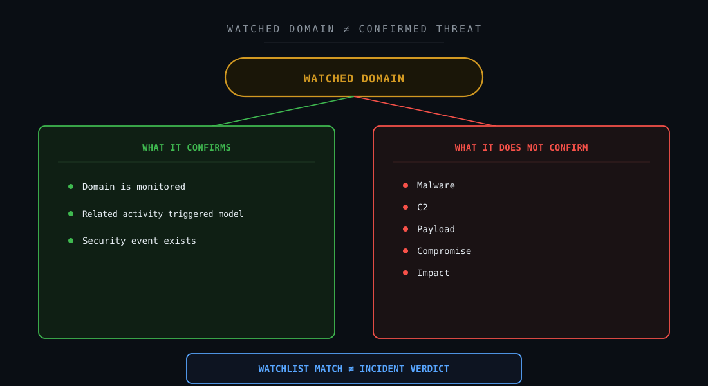

---

## 12. Entendendo DNS no contexto do alerta

O evento observado envolvia:

```text
Destination Port: 53
```

e um endereço interno como destino de rede.

Essa combinação era consistente com:

```text
Device
        ↓
Internal DNS Resolver
        ↓
Domain Resolution
```

Esse detalhe é importante porque o destino interno não deve ser automaticamente interpretado como:

```text
Malicious External Server
```

O comportamento mais coerente era:

```text
Mobile Device
        ↓
DNS Request
        ↓
Internal Resolver
        ↓
Watched Domain
```

Entretanto, mesmo a resolução DNS não demonstra, por si só:

```text
HTTP Connection
TLS Connection
File Download
Command and Control
```

Essas etapas exigiriam fontes adicionais.

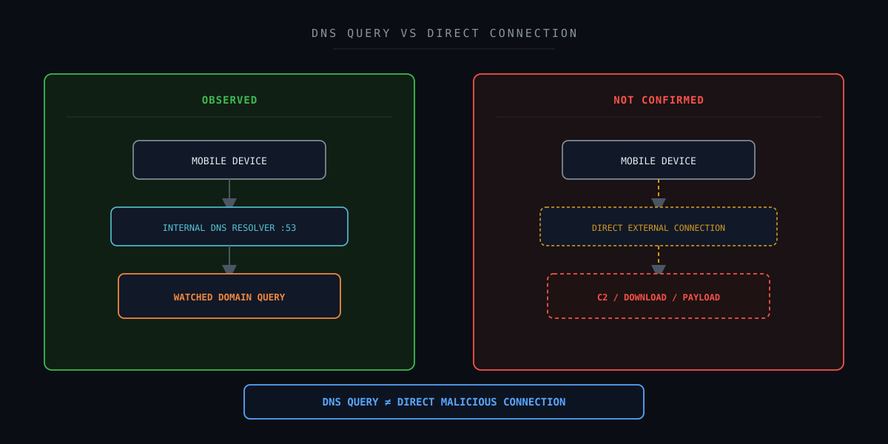

---

## 13. Correlação técnica

### Cenário de menor evidência adversarial

```text
Mobile Device
        +
Watched Domain
        +
DNS Query
        +
Internal Resolver
        +
No Application-Layer Evidence Available
        ↓
Suspicious Activity
Requires Validation
```

### Cenário de maior confiança adversarial

```text
Watched Domain
        +
DNS Query
        +
Direct Connection
        +
Repeated Beaconing
        +
Known Malicious Process
        +
EDR Alert
        +
Persistence
        ↓
Higher Compromise Confidence
```

O case possuía elementos do primeiro cenário.

Não havia evidências suficientes para afirmar o segundo.

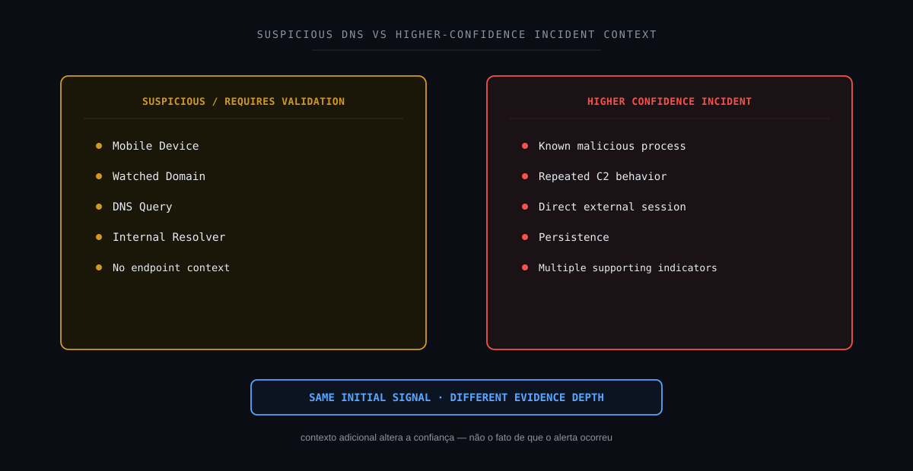

---

## 14. Cadeia fim a fim do evento

```text
Mobile / Android Device
        ↓
DNS Activity
        ↓
Internal Destination :53
        ↓
Watched Domain
        ↓
Darktrace Detection
        ↓
Score 100%
        ↓
Critical Alert
        ↓
Wazuh
        ↓
SOC Investigation
        ↓
Initial Compromise Hypothesis
        ↓
Protocol Analysis
        ↓
Destination Analysis
        ↓
Internal DNS Resolver Context
        ↓
Evidence Classification
        ↓
Application-Layer Activity Not Available
        ↓
Compromise Not Confirmed
        ↓
Impact Reassessment
        ↓
Escalated for Asset / User Validation
        ↓
User Acknowledges Personal Access
        ↓
FALSE POSITIVE
```

Essa cadeia representa:

```text
Network Activity
    ↓
Detection
    ↓
Severity
    ↓
Investigation
    ↓
Context
    ↓
Evidence
    ↓
Decision
```

Ela não representa uma cadeia de ataque confirmada.

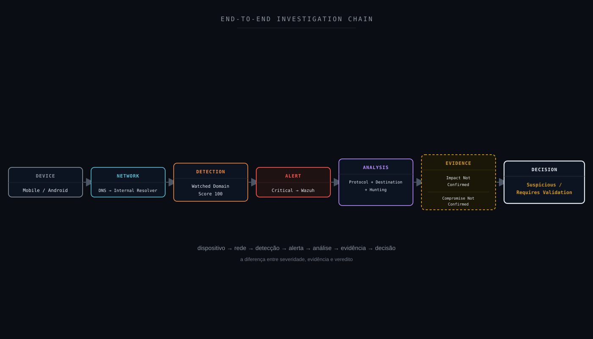

---

## 15. Attack Flow

Não foi possível reconstruir um Attack Flow adversarial.

Uma hipótese possível seria:

```text
Compromised Device
        ↓
DNS Resolution
        ↓
C2 Infrastructure
        ↓
Beaconing
        ↓
Command Exchange
```

Entretanto, o evento analisado demonstrava apenas:

```text
DNS Activity
        ↓
Watched Domain
```

A cadeia posterior estava:

```text
Not Available / Not Confirmed
```

Portanto:

```text
Confirmed Attack Flow = Not Available
```

O fluxo aplicável era:

```text
Detection
        ↓
Hypothesis
        ↓
Hunting
        ↓
Context
        ↓
Evidence
        ↓
Decision
```

---

## 16. Attack Chain Assessment

| Estágio | Status | Fundamentação |
|---|---|---|
| Reconnaissance | Not Available | Evento DNS não permite determinar |
| Initial Access | Not Available | Vetor de entrada não disponível |
| Execution | Not Available | Sem telemetria de processo |
| Persistence | Not Available | Sem telemetria adequada |
| Privilege Escalation | Not Available | Sem telemetria adequada |
| Defense Evasion | Not Available | Sem telemetria adequada |
| Credential Access | Not Available | Sem telemetria adequada |
| Discovery | Not Available | Sem telemetria adequada |
| Lateral Movement | Not Available | Sem telemetria adequada |
| Collection | Not Available | Sem telemetria adequada |
| Command and Control | Not Confirmed | DNS para Watched Domain não confirma C2 |
| Exfiltration | Not Available | Sem evidência de fluxo de dados |
| Impact | Not Confirmed | Nenhum impacto sustentado pelo evento |

Essa tabela evidencia a disciplina da taxonomia:

```text
No Endpoint Telemetry
        =
Not Available
```

e não:

```text
Not Observed
```

---

## 17. MITRE ATT&CK Mapping

### T1071.004 — Application Layer Protocol: DNS

DNS pode ser utilizado por adversários para comunicação através de protocolos de camada de aplicação.

Por isso, durante a hipótese inicial, poderia ser considerado:

```text
T1071.004 — DNS
```

Entretanto:

```text
DNS Query
        ≠
T1071.004 Confirmed
```

Para sustentar uma técnica adversarial relacionada a DNS seria necessário demonstrar contexto compatível com comunicação de Command and Control ou outra utilização maliciosa.

Neste case:

```text
DNS Activity = Confirmed
```

mas:

```text
Malicious DNS Usage = Not Confirmed
```

Logo:

```text
T1071.004 = Investigation Hypothesis
```

e não:

```text
T1071.004 = Confirmed TTP
```

---

## 18. MITRE Detection Strategy

Uma estratégia mais robusta para eventos DNS suspeitos pode correlacionar:

```text
DNS Query
        +
Domain Reputation
        +
Request Frequency
        +
Query Pattern
        +
Resolved IP
        +
Subsequent Connection
        +
Process
        +
Endpoint Context
        +
Historical Behavior
```

Exemplo de aumento de confiança:

```text
Watched Domain
        +
Frequent DNS Queries
        +
Direct TLS Connection
        +
Unknown Process
        +
EDR Detection
        +
Repeated Beaconing
        ↓
Higher C2 Confidence
```

No #006, o evento fornecia principalmente:

```text
DNS Query
        +
Watched Domain
```

As demais etapas precisavam de enriquecimento.

---

## 19. Framework Mapping

Um framework só entra nesta lista quando há um número, técnica ou controle real e específico que se aplique a este case — não como referência genérica.

### MITRE ATT&CK

**Aplicabilidade: hipótese de investigação (não confirmada).**

```text
T1071.004 — Application Layer Protocol: DNS
```

DNS malicioso/C2 não foi confirmado; a técnica permanece hipótese.

### MITRE Attack Flow / Cyber Kill Chain

**Aplicabilidade: lente analítica, sem cadeia confirmada.**

Estruturam a pergunta "houve progressão adversarial (C2 via DNS)?" feita na Seção 16 (Attack Chain Assessment). Nenhum estágio foi confirmado.

### NIST CSF

**Aplicabilidade: direta.**

Detect, Respond e Improve.

### NIST SP 800-61

**Aplicabilidade: direta.**

Triagem, investigação, classificação e impacto.

### ISO/IEC 27035

**Aplicabilidade: direta.**

Ciclo de 5 fases (Plan & Prepare / Detection & Reporting / Assessment & Decision / Responses / Lessons Learned).

### SANS PICERL

**Aplicabilidade: direta.**

Identification e Lessons Learned mapeados diretamente. O fechamento via reconhecimento do usuário (Seção 32) equivale ao encerramento do ciclo — Containment/Eradication não se aplicam, pois não houve ameaça a conter.

### ISO/IEC 27001

**Aplicabilidade: direta.**

Anexo A 5.24–5.28 — controles de gestão de incidente de segurança da informação.

### COBIT 2019

**Aplicabilidade: direta.**

DSS02 (Managed Service Requests and Incidents) e MEA01/MEA02 (monitoramento e melhoria contínua).

### ITIL 4

**Aplicabilidade: direta.**

Prática de Incident Management e prática de Continual Improvement.

### Agile / Kanban

**Aplicabilidade: operacional (não classifica evidência do case).**

O pipeline de Detection Engineering (Seção 25) poderia ser gerenciado como backlog Scrum/Kanban — cada nova hipótese de detecção como item de sprint. Não é usado para classificar nenhum fato técnico deste alerta.

### CIS Controls

**Aplicabilidade: direta.**

```text
CIS 1  — Inventory and Control of Enterprise Assets
CIS 8  — Audit Log Management
CIS 10 — Malware Defenses
CIS 13 — Network Monitoring and Defense
CIS 17 — Incident Response Management
```

### SOC-CMM

**Aplicabilidade: direta.**

Asset Context e Alert Triage.

### Metodologia analítica aplicada

```text
ACH — Analysis of Competing Hypotheses
```

A Seção 13 avalia cenários concorrentes (C2 via DNS vs. resolução de resolvedor interno) e os refuta por evidência.

```text
Método Científico
```

Hipótese → Evidência → Teste → Conclusão é a estrutura epistêmica de todo o note.

```text
OODA Loop
```

Observe (telemetria) → Orient (hipótese/evidência) → Decide (veredito) → Act (recomendações).

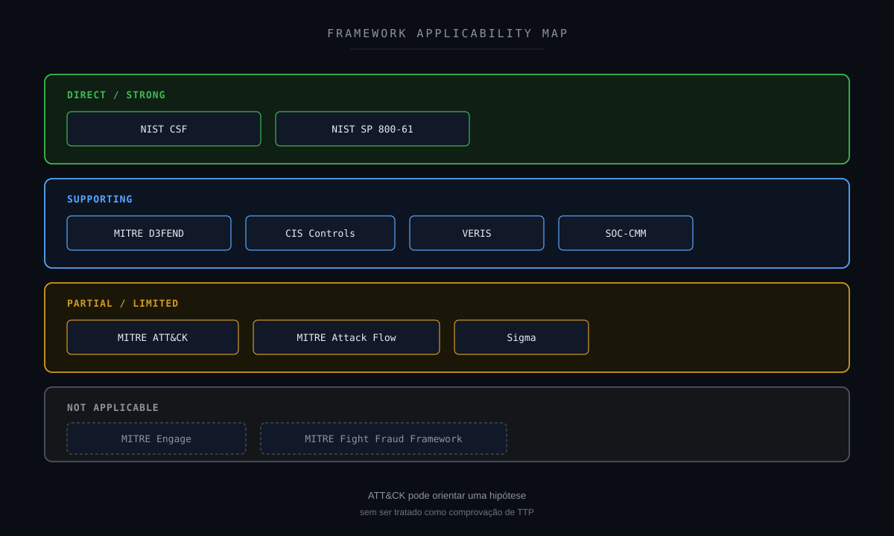

---

## 20. NIST Mapping

### IDENTIFY

Compreender:

- tipo do ativo;
- ownership;
- rede;
- dispositivo corporativo ou BYOD;
- criticidade;
- política aplicável.

### PROTECT

Controles podem incluir:

- DNS filtering;
- network segmentation;
- MDM;
- application control;
- endpoint security.

### DETECT

O Darktrace identificou atividade envolvendo Watched Domain.

### RESPOND

O SOC realizou:

```text
Alert Validation
        ↓
Protocol Analysis
        ↓
Destination Analysis
        ↓
Threat Hunting
        ↓
Evidence Classification
        ↓
Impact Reassessment
```

### RECOVER

```text
Not Applicable at this stage
```

Não havia impacto confirmado que exigisse recuperação.

### GOVERN

O case possui aderência a:

- política de dispositivos móveis;
- BYOD;
- domínio monitorado;
- regras de severidade;
- critérios de escalonamento.

### IMPROVE

A principal oportunidade:

```text
Enrich Watched Domain Alerts
```

com contexto adicional antes da classificação final.

---

## 21. CIS Controls

O cenário possui relação com:

- Inventory and Control of Enterprise Assets;
- Audit Log Management;
- Network Monitoring and Defense;
- DNS Security;
- Malware Defenses;
- Incident Response Management.

Um ponto importante é o tipo de ativo.

```text
Mobile / Android
```

pode representar:

```text
Corporate Device
BYOD
Guest Device
Unknown Device
```

Cada contexto altera:

```text
Risk
Ownership
Response Options
```

Por isso:

```text
Device Classification
```

deve fazer parte da investigação.

---

## 22. Detection Strategy

### Estratégia atual

```text
Watched Domain
        +
DNS Activity
        ↓
Darktrace
        ↓
Critical Alert
        ↓
Wazuh
```

O mecanismo detecta corretamente eventos relacionados a domínios monitorados.

Entretanto, pode faltar contexto suficiente para determinar impacto.

### Estratégia enriquecida

```text
Watched Domain
        +
Protocol
        +
Source Device
        +
Asset Ownership
        +
DNS Resolver
        +
Resolved IP
        +
Follow-up Connection
        +
Proxy / Firewall
        +
Endpoint
        +
Historical Behavior
        ↓
Contextual Risk
```

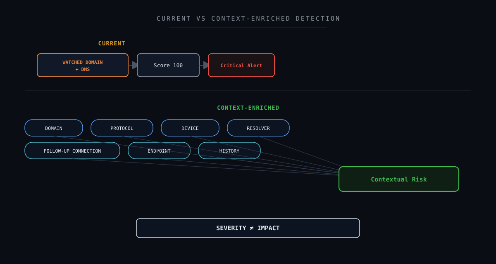

---

## 23. Detection Gap Analysis

### O que sabemos?

```text
Watched Domain = Confirmed
DNS Activity = Confirmed
Mobile Device = Confirmed
Port 53 = Confirmed
Critical Alert = Confirmed
Score 100 = Confirmed
```

### O que não sabemos a partir desse evento?

```text
Which application triggered the DNS query?
Did DNS resolution succeed?
Did a direct connection follow?
Was content downloaded?
Did a process execute?
Was malware present?
Was C2 established?
```

Classificação:

```text
Application Process = Not Available
Follow-up Connection = Not Available
Payload = Not Available
Malware = Not Confirmed
C2 = Not Confirmed
Compromise = Not Confirmed
```

A lacuna principal pode ser resumida como:

```text
DNS VISIBILITY
        >
APPLICATION / ENDPOINT VISIBILITY
```

---

## 24. Oportunidades de enriquecimento

O evento poderia ser enriquecido com:

```text
Device Ownership
Corporate / BYOD / Guest
MDM Status
Operating System
Application
DNS Query Result
Resolved IP
DNS Response Code
Follow-up TCP Session
TLS SNI
HTTP Host
Proxy Events
Firewall Events
EDR Alerts
Application Inventory
Historical Queries
Domain Age / Reputation
```

Uma correlação importante seria:

```text
DNS Query
        ↓
Resolved IP
        ↓
Subsequent Connection
```

Isso permitiria distinguir melhor:

```text
Domain Lookup Only
```

de:

```text
Actual Communication
```

---

## 25. Detection Engineering

Um pipeline futuro poderia utilizar:

```text
WATCHED DOMAIN EVENT
        ↓
DEVICE CLASSIFICATION
        ↓
DNS CONTEXT
        ↓
DOMAIN CONTEXT
        ↓
RESOLVED IP
        ↓
FOLLOW-UP CONNECTION
        ↓
PROXY / FIREWALL
        ↓
ENDPOINT
        ↓
HISTORICAL BASELINE
        ↓
CONTEXTUAL RISK
```

Exemplo de menor confiança:

```text
Watched Domain
        +
Single DNS Query
        +
Internal Resolver
        +
No Follow-up Telemetry
        ↓
SUSPICIOUS
REQUIRES VALIDATION
```

Exemplo de maior confiança:

```text
Watched Domain
        +
Repeated DNS Queries
        +
Direct External Session
        +
Unknown Application
        +
EDR Alert
        +
Beaconing Pattern
        ↓
HIGHER INCIDENT CONFIDENCE
```

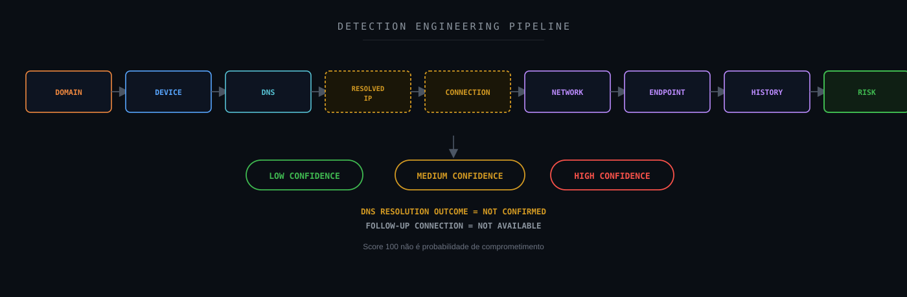

---

## 26. Sigma

Sigma não foi necessária para determinar a classificação inicial deste case.

Entretanto, outras fontes poderiam suportar detecções complementares envolvendo:

```text
Suspicious DNS Client Process
```

```text
Unexpected Browser / Application
```

```text
Repeated DNS Beaconing
```

```text
Malware Process + Watched Domain
```

```text
DNS Query + Suspicious Process Creation
```

```text
DNS Query + Persistence
```

O objetivo seria correlacionar:

```text
Network Indicator
```

com:

```text
Endpoint Behavior
```

Sigma não deve transformar:

```text
Watched Domain Match
```

em:

```text
Confirmed Malware
```

sem evidência complementar.

---

## 27. Hardening Opportunities

### DNS Security

Avaliar:

- filtering;
- logging;
- threat intelligence;
- response visibility.

### Mobile Device Management

Para dispositivos corporativos:

```text
MDM
Application Inventory
Compliance
Patch Level
Security Configuration
```

### BYOD Governance

Definir claramente:

```text
Authorized Devices
Guest Access
Segmentation
Policy
```

### Network Segmentation

Separar dispositivos móveis quando apropriado.

### Endpoint / Mobile Visibility

Melhorar visibilidade sobre:

```text
Applications
Network Connections
Security Status
```

### Proxy / Firewall Correlation

Preservar telemetria posterior à resolução DNS.

### Baseline

Identificar domínios frequentemente consultados por determinados aplicativos.

O alerta não demonstra, sozinho, necessidade de remediação do endpoint.

Essas são oportunidades de melhoria defensiva.

---

## 28. Controles defensivos

Uma arquitetura Defense-in-Depth pode considerar:

```text
DEVICE INVENTORY
        ↓
MDM / BYOD CONTROL
        ↓
NETWORK SEGMENTATION
        ↓
DNS MONITORING
        ↓
DARKTRACE
        ↓
FIREWALL / PROXY
        ↓
ENDPOINT SECURITY
        ↓
WAZUH
        ↓
SOC / THREAT HUNTING
```

Cada camada responde a perguntas diferentes.

```text
DNS
→ What domain was queried?
```

```text
Darktrace
→ Why is this domain interesting?
```

```text
Firewall / Proxy
→ Was there follow-up communication?
```

```text
Endpoint
→ Which application/process caused it?
```

```text
SOC
→ What does the complete evidence support?
```

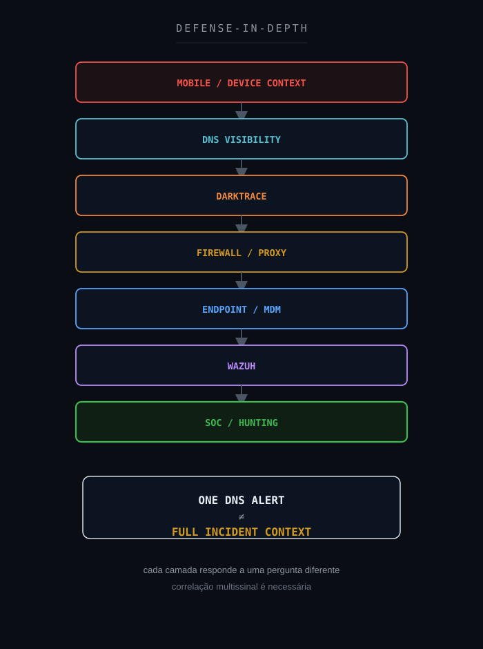

---

## 29. SOC-CMM

O case possui relação com:

- Security Monitoring;
- Threat Hunting;
- Detection Quality;
- Asset Context;
- Alert Triage;
- False Positive Management;
- Continuous Improvement.

Uma abordagem menos madura:

```text
Critical Alert
        ↓
Score 100
        ↓
Critical Incident
```

Uma abordagem mais madura:

```text
Critical Alert
        ↓
Validate Protocol
        ↓
Validate Destination
        ↓
Understand Device
        ↓
Correlate Follow-up Activity
        ↓
Classify Evidence
        ↓
Assess Impact
        ↓
Contextual Verdict
```

O case demonstra que:

```text
Alert Severity
```

é apenas um dos elementos da decisão.

---

## 30. Métricas operacionais

| Métrica | Objetivo |
|---|---|
| MTTD | Tempo até detecção |
| MTTA | Tempo até reconhecimento |
| MTTR | Tempo até conclusão |
| False Positive Rate | Qualidade de modelos e regras |
| Detection Coverage | Cobertura de DNS/network |
| DNS Enrichment Coverage | Qualidade de contexto |
| Asset Context Coverage | Identificação do dispositivo |
| Follow-up Connection Coverage | Capacidade de correlacionar DNS e conexão |
| Escalation Rate | Eventos que requerem validação adicional |
| SLA | Operação |

Uma métrica especialmente útil seria:

```text
Alert-to-Impact Conversion Rate
```

para avaliar quantos alertas de alta severidade efetivamente apresentam:

```text
Confirmed Security Impact
```

Isso ajuda a identificar se determinada severidade está alinhada ao risco operacional real.

---

## 31. Decision Flow

```text
Watched Domain Alert?
        ↓
YES
        ↓
Event Type / Protocol?
        ├── DNS
        │    ↓
        │  Destination / Resolver Context?
        │    ↓
        │  Port 53?
        │    ↓
        │  Resolver Context Supported?
        │
        └── DIRECT / OTHER
             ↓
           Analyze Connection
             ↓
Follow-up Connection Available?
        ├── YES
        │    ↓
        │  Analyze Connection
        │
        └── NO
             ↓
        NOT AVAILABLE
             ↓
Supporting Malicious Evidence?
        ├── YES
        │    ↓
        │  ESCALATE INVESTIGATION
        │
        └── NO / NOT CONFIRMED
             ↓
Device Context Known?
        ├── NO
        │    ↓
        │  VALIDATE ASSET / BYOD
        │    ↓
        │  User Acknowledges Access?
        │    ├── YES
        │    │    ↓
        │    │  FALSE POSITIVE
        │    │
        │    └── NO
        │         ↓
        │       ESCALATE INVESTIGATION
        │
        └── YES
             ↓
SUSPICIOUS
REQUIRES VALIDATION
```

Neste case específico, o caminho percorrido foi `Device Context Known? → NO → VALIDATE ASSET / BYOD → User Acknowledges Access? → YES → FALSE POSITIVE`.

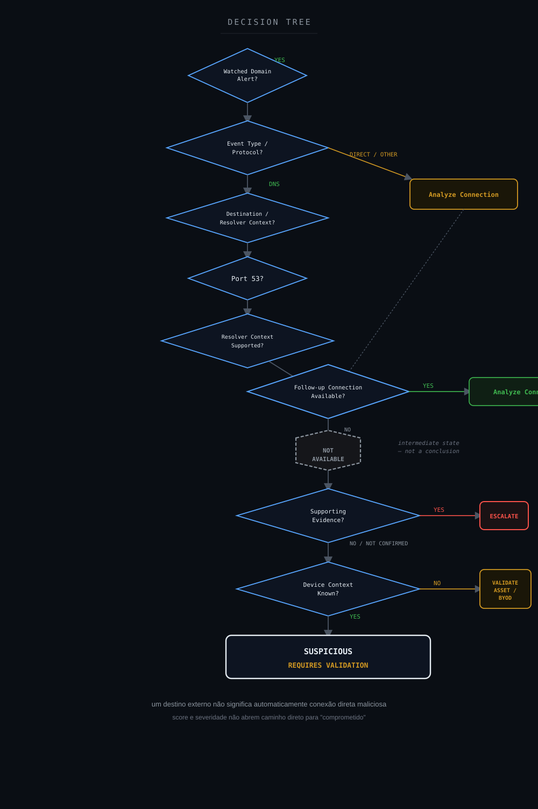

---

## 32. Veredito técnico

### Evento Watched Domain

```text
Confirmed
```

### Dispositivo Mobile/Android

```text
Confirmed
```

### Atividade DNS

```text
Confirmed
```

### Porta 53

```text
Confirmed
```

### Destino interno

```text
Confirmed
```

### Contexto compatível com resolvedor DNS interno

```text
Supported
```

### Score 100%

```text
Confirmed
```

### Classificação crítica do alerta

```text
Confirmed
```

### Conexão HTTP/HTTPS posterior

```text
Not Available
```

### Processo/aplicativo originador

```text
Not Available
```

### Download

```text
Not Available
```

### Malware

```text
Not Confirmed
```

### Command and Control

```text
Not Confirmed
```

### Comprometimento do dispositivo

```text
Not Confirmed
```

### Impacto

```text
Not Confirmed (technical)
```

### Reconhecimento do usuário

```text
Confirmed (user attestation)
```

### Classificação final

**Falso Positivo — atividade DNS relacionada a Watched Domain a partir de dispositivo Mobile/Android, com acesso reconhecido pelo usuário como legítimo. Encerrado por confirmação do asset owner, não por telemetria técnica adicional.**

### Severidade contextual recomendada

```text
MEDIUM (até a validação do usuário)
```

### Estado

```text
CLOSED — RESOLVED VIA USER ACKNOWLEDGMENT
```

### Veredito

```text
SUSPICIOUS DNS ACTIVITY
WATCHED DOMAIN DETECTED
COMPROMISE NOT CONFIRMED (technical)
USER ACKNOWLEDGED PERSONAL ACCESS
FALSE POSITIVE
```

---

## 33. Por que não classificar como incidente crítico confirmado?

O alerta existiu.

```text
Alert = TRUE
```

O score era elevado.

```text
Score 100 = TRUE
```

O domínio estava monitorado.

```text
Watched Domain = TRUE
```

A consulta DNS existiu.

```text
DNS Activity = TRUE
```

A pergunta era:

```text
Critical Security Impact = ?
```

As evidências disponíveis sustentavam:

```text
Mobile Device
        +
Watched Domain
        +
DNS Activity
        +
Internal DNS Destination
        +
Critical Alert
```

Mas não sustentavam:

```text
Malware
C2
Payload
Compromise
Exfiltration
Impact
```

Por isso:

```text
Critical Severity
        ≠
Critical Impact
```

e:

```text
Score 100
        ≠
Compromise Probability 100%
```

O resultado correto foi manter o evento como:

```text
SUSPICIOUS
```

sem elevá-lo artificialmente a:

```text
CONFIRMED CRITICAL INCIDENT
```

nem reduzi-lo prematuramente a falso positivo apenas por causa do contexto de resolvedor DNS interno.

O fechamento do caso não veio de telemetria adicional — as fontes técnicas de follow-up (conexão HTTP/HTTPS, IP resolvido, contexto de endpoint) permaneceram `Not Available` até o fim.

O caso foi encerrado quando, na etapa de validação de ativo prevista para dispositivos Mobile/BYOD, o usuário reconheceu a atividade como acesso realizado a partir do seu próprio dispositivo pessoal.

```text
Technical Follow-up = Not Available
        +
User Acknowledgment = Confirmed
        ↓
FALSE POSITIVE
```

Essa distinção importa: o caso não foi fechado porque a ausência de evidência técnica foi interpretada como prova de benignidade — foi fechado porque uma fonte de evidência diferente, a confirmação direta do usuário, supriu a lacuna que a telemetria não conseguiu preencher.

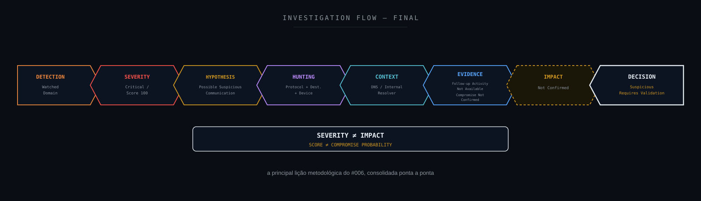

---

## 34. Lições aprendidas

A principal lição deste estudo é:

> **severidade não é impacto.**

### Um alerta crítico exige prioridade

Mas não confirma automaticamente um incidente crítico.

### Score do modelo não é probabilidade de comprometimento

```text
Score 100
```

não deve ser lido como:

```text
100% compromised
```

### Watched Domain não significa malware confirmado

Significa que houve atividade relacionada a um domínio monitorado.

### DNS Query não significa C2

```text
DNS Query
        ≠
C2 Session
```

### Endereço interno em porta 53 não deve ser tratado como IOC externo

Ele pode representar infraestrutura DNS interna.

### `Not Available` não é `Not Observed`

Sem firewall, proxy ou endpoint adequados, não é possível afirmar que não houve determinada atividade.

### `Not Confirmed` não significa benigno

O dispositivo ainda pode requerer validação.

### Dispositivos móveis exigem contexto

```text
Corporate
BYOD
Guest
Unknown
```

alteram significativamente o tratamento.

### Severidade contextual pode divergir da severidade do alerta

O mecanismo pode atribuir criticidade elevada ao match.

O SOC avalia:

```text
Evidence
+
Context
+
Impact
```

### Não fechar cedo demais

O case não foi tratado como falso positivo apenas porque o destino era DNS interno.

Enquanto a telemetria técnica de follow-up permaneceu indisponível, o estado correto era:

```text
Suspicious / Requires Validation
```

### Reconhecimento do usuário é evidência — de um tipo diferente de telemetria

O caso só foi encerrado quando o usuário confirmou a atividade como acesso pessoal legítimo.

```text
Confirmed (user attestation)
        ≠
Confirmed (telemetry)
```

Ambas são formas válidas de evidência.

Mas devem ser registradas e comunicadas como fontes distintas, para que o leitor entenda por que o caso fechou sem que a lacuna técnica (`Not Available`) tenha sido preenchida.

---

## 35. Recomendações

1. Manter detecção de Watched Domains.
2. Não reduzir automaticamente alertas apenas por serem DNS.
3. Não tratar score 100 como comprometimento confirmado.
4. Identificar se o ativo é corporativo, BYOD, guest ou desconhecido.
5. Correlacionar com inventário/MDM.
6. Correlacionar DNS com firewall.
7. Correlacionar DNS com proxy.
8. Identificar IP retornado pela resolução.
9. Buscar conexão posterior ao IP resolvido.
10. Identificar TLS SNI quando disponível.
11. Buscar atividade HTTP/HTTPS posterior.
12. Correlacionar com endpoint security.
13. Identificar aplicativo/processo responsável quando possível.
14. Avaliar recorrência do domínio.
15. Avaliar recorrência no mesmo dispositivo.
16. Avaliar outros dispositivos consultando o mesmo domínio.
17. Validar reputação do domínio em fontes confiáveis.
18. Evitar bloquear IP de resolvedor interno como IOC.
19. Priorizar FQDN/domínio quando houver necessidade de restrição.
20. Documentar motivo de inclusão em watchlist quando possível.
21. Diferenciar alert severity de incident severity.
22. Diferenciar score do modelo de analytical confidence.
23. Adicionar contexto de resolvedor DNS ao alerta.
24. Desenvolver correlação DNS → conexão posterior.
25. Documentar lacunas de endpoint telemetry.
26. Aplicar taxonomia `Not Available / Not Confirmed` corretamente.
27. Evitar mapear T1071.004 como confirmado sem comportamento adversarial suficiente.
28. Manter o caso aberto para validação quando o impacto não puder ser determinado.
29. Revisar tuning somente após volume suficiente de casos.
30. Utilizar evidência multissinal antes de elevar para comprometimento confirmado.

---

## 36. Referências técnicas

### Darktrace

Darktrace
https://www.darktrace.com/

Darktrace Network
https://www.darktrace.com/products/network

### Wazuh

Wazuh Documentation
https://documentation.wazuh.com/

### MITRE ATT&CK

MITRE ATT&CK
https://attack.mitre.org/

T1071.004 — Application Layer Protocol: DNS
https://attack.mitre.org/techniques/T1071/004/

### MITRE D3FEND

MITRE D3FEND
https://d3fend.mitre.org/

### MITRE Attack Flow

MITRE Attack Flow
https://center-for-threat-informed-defense.github.io/attack-flow/

### MITRE Engage

MITRE Engage
https://engage.mitre.org/

### NIST

NIST Cybersecurity Framework
https://www.nist.gov/cyberframework

NIST SP 800-61 Rev. 3
https://csrc.nist.gov/pubs/sp/800/61/r3/final

### CIS

CIS Controls
https://www.cisecurity.org/controls

### VERIS

VERIS Framework
https://verisframework.org/

### Sigma

Sigma
https://sigmahq.io/

### SOC-CMM

SOC-CMM
https://www.soc-cmm.com/

---

## Disclaimer

Este estudo foi sanitizado para preservar integralmente a confidencialidade do ambiente originalmente analisado.

As investigações, decisões técnicas e veredictos apresentados neste estudo refletem experiência prática real do autor. Ferramentas de Inteligência Artificial foram utilizadas como apoio para formatação, diagramação e publicação do conteúdo — não para a condução da investigação em si.

Não são publicados valores reais relacionados a:

```text
Organization
Client
Hostname
Device Name
Source IP
Destination IP
MAC Address
SSID
Subnet
Domain
Watched Domain
Username
Incident ID
Ticket ID
PBID
Model Breach ID
Exact Timestamp
Collector
Agent ID
Internal Rule ID
Environment-Specific Tags
Internal URLs
Credentials
Tokens
Secrets
```

O dispositivo real não é identificado.

O domínio real monitorado não é publicado.

O endereço interno utilizado para resolução DNS também não é publicado.

O contexto técnico foi preservado apenas no nível necessário:

```text
Mobile / Android Device
        ↓
DNS Activity
        ↓
Internal Destination :53
        ↓
Watched Domain
        ↓
Darktrace Alert
        ↓
Score 100 / Critical Severity
        ↓
Wazuh
        ↓
SOC Investigation
        ↓
Context Analysis
        ↓
Compromise Not Confirmed (technical)
        ↓
Asset / User Validation
        ↓
User Acknowledged Personal Access
        ↓
False Positive
```

`Score 100` é apresentado apenas como atributo do evento e não como probabilidade matemática de comprometimento.

A classificação crítica do alerta também não é tratada como prova de impacto crítico.

A atividade DNS não é utilizada isoladamente para confirmar Command and Control.

Quando uma fonte necessária não estava disponível para validar determinada etapa, a classificação utilizada foi:

```text
Not Available
```

e não:

```text
Not Observed
```

Quando existia uma hipótese relevante, mas evidência insuficiente para sustentá-la, foi utilizada:

```text
Not Confirmed
```

Informações públicas e não correlacionáveis ao ambiente, como nomes de tecnologias, frameworks e técnicas MITRE ATT&CK, podem ser preservadas quando necessárias à explicação técnica.

O objetivo desta publicação é compartilhar:

- metodologia de investigação;
- raciocínio analítico;
- Threat Hunting;
- Incident Response;
- Network Detection & Response;
- DNS Security;
- Detection Engineering;
- classificação de evidências;
- análise contextual de severidade;
- análise de impacto;
- melhoria contínua.

Este projeto é independente e não representa documentação oficial do Wazuh, Darktrace, MITRE, NIST, CIS ou das demais organizações e projetos mencionados.

---

**Wazuh SOC Notes**

> **Severidade define prioridade. Evidência define impacto. Score não substitui investigação.**
