# Wazuh SOC Notes #007 — AnyDesk bloqueado pelo FortiGate: detecção de acesso remoto não é sessão remota confirmada

> **SOC | Threat Hunting | Incident Response | Detection Engineering | FortiGate | AnyDesk | Remote Access | Wazuh**

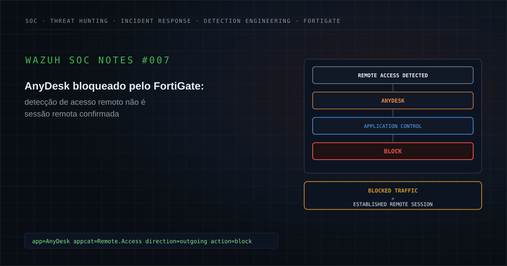

---

## Executive Summary

Durante uma atividade de monitoramento de segurança, foi investigado no Wazuh um alerta originado a partir de telemetria do **FortiGate Application Control** relacionado à identificação de tráfego associado ao **AnyDesk**.

A telemetria registrava:

```text
Application: AnyDesk
Category: Remote.Access
Direction: outgoing
Application Risk: high
Action: block
```

Foram observadas tentativas de comunicação utilizando portas associadas a serviços web, incluindo:

```text
80
443
```

O comportamento também apresentou recorrência em mais de uma janela analisada.

A hipótese inicial considerou possível utilização de software de acesso remoto não autorizado.

Essa hipótese era tecnicamente relevante porque ferramentas legítimas de suporte remoto também podem ser utilizadas por adversários para:

- manter acesso interativo;
- estabelecer um canal alternativo;
- facilitar pós-exploração;
- transferir ferramentas;
- manter persistência operacional.

Entretanto, a telemetria disponível era predominantemente de rede.

Ela permitia confirmar:

```text
AnyDesk-related Network Activity
        +
Remote.Access Classification
        +
Outbound Communication Attempt
        +
Application Control BLOCK
        +
Recurrence
```

Mas não permitia concluir automaticamente:

```text
AnyDesk Installed
AnyDesk Executed
User Responsible
Remote Session Established
Interactive Remote Control
Authorized Use
Unauthorized Use
Persistence
File Transfer
Command and Control
Endpoint Compromise
```

O ponto central deste estudo é:

> **detectar tráfego associado a uma ferramenta de acesso remoto não é o mesmo que confirmar execução local, sessão remota estabelecida ou comprometimento.**

A ação defensiva também precisa ser interpretada corretamente.

```text
BLOCK
```

confirma que o controle aplicou uma ação sobre o tráfego observado.

Ela não confirma:

```text
Endpoint Remediated
```

nem:

```text
Remote Access Never Occurred
```

fora do escopo específico da telemetria analisada.

A telemetria de rede, isoladamente, não permitia fechar o caso — nem como falso positivo, nem como comprometimento.

O fechamento veio de uma etapa fora da telemetria: a validação de autorização junto à área responsável pelo ativo confirmou que o uso do AnyDesk **não era autorizado** — o que explica, retroativamente, por que o Application Control bloqueou o tráfego.

```text
Authorization Status = UNAUTHORIZED (confirmed via asset/process-owner validation)
```

Não houve evidência de execução, sessão estabelecida ou comprometimento — o bloqueio impediu a comunicação antes de qualquer uma dessas etapas.

Como ação corretiva, foi definida a criação de uma **GPO (Group Policy Object)** para impedir a instalação do AnyDesk no ambiente, reforçando via política o que o Application Control já vinha bloqueando na rede.

### Classificação final

**Contenção Preventiva — tráfego AnyDesk não autorizado, identificado e bloqueado corretamente pelo FortiGate Application Control; comprometimento não confirmado. Ação corretiva definida: GPO para impedir a instalação do AnyDesk.**

### Estado analítico

```text
AnyDesk Network Activity = Confirmed
Application Control Block = Confirmed
Recurrence = Confirmed

AnyDesk Process Execution = Not Available
Responsible User = Not Available

Unauthorized Use = Confirmed (via asset/process-owner validation)
Remote Session Established = Not Confirmed
Interactive Control = Not Confirmed
Command and Control = Not Confirmed
Endpoint Compromise = Not Confirmed
```

O caso não foi fechado por ausência de evidência técnica contrária.

Foi fechado porque uma fonte de evidência diferente — validação organizacional de autorização — confirmou que o tráfego não era autorizado, sustentando o bloqueio já aplicado como ação preventiva correta, sem evidência de comprometimento.

```text
Network Telemetry Gap
        +
Unauthorized Use Confirmed (organizational validation)
        +
Block Already Applied
        +
Compromise Not Confirmed
        ↓
CONTENÇÃO PREVENTIVA
```

---

## 1. Contexto do alerta

O evento teve origem em telemetria de firewall integrada ao Wazuh.

O FortiGate identificou uma tentativa de comunicação de saída associada ao AnyDesk e registrou o tráfego com elementos equivalentes a:

```text
app="AnyDesk"
appcat="Remote.Access"
apprisk="high"
direction="outgoing"
action="block"
```

Um exemplo sanitizado pode ser representado como:

```text
date=<DATE>
time=<TIME>
srcip=<SOURCE_IP>
dstip=<DESTINATION_IP>
dstport=443
direction="outgoing"
appid=<APP_ID>
app="AnyDesk"
appcat="Remote.Access"
apprisk="high"
action="block"
hostname="<REMOTE_ACCESS_SERVICE_HOST>"
msg="Remote.Access: AnyDesk"
```

O Wazuh recebeu a telemetria e uma regra de correlação do ambiente elevou o evento para investigação pelo SOC.

Para publicação foram removidos ou generalizados:

```text
Organization
Client
Hostname
Source IP
Destination IP
Username
Session ID
Policy ID
Incident ID
Ticket ID
Internal Rule ID
Collector ID
Exact Timestamp
Environment-Specific Identifiers
```

O evento técnico era verdadeiro.

O Application Control classificou o tráfego.

O bloqueio também foi registrado.

A investigação precisava determinar:

```text
What caused this traffic?
Was AnyDesk installed?
Was it executed?
Was it authorized?
Was a session established?
Was there malicious activity?
```

---

## 2. Hipótese inicial

A hipótese inicial foi:

> **possível utilização de software de acesso remoto não autorizado em um ativo interno.**

Softwares de Remote Desktop e RMM possuem uso dual.

Podem ser utilizados legitimamente para:

```text
Help Desk
Remote Support
Administration
Troubleshooting
Maintenance
Vendor Access
```

Mas também podem ser abusados para:

```text
Unauthorized Remote Access
Persistence
Interactive Control
Post-Compromise Access
Tool Transfer
Alternative Access Channel
```

Portanto:

```text
AnyDesk Detected
        ≠
Malicious AnyDesk Use Confirmed
```

Ao mesmo tempo:

```text
AnyDesk Detected
        ≠
Authorized AnyDesk Use Confirmed
```

A investigação precisava preservar as duas possibilidades.

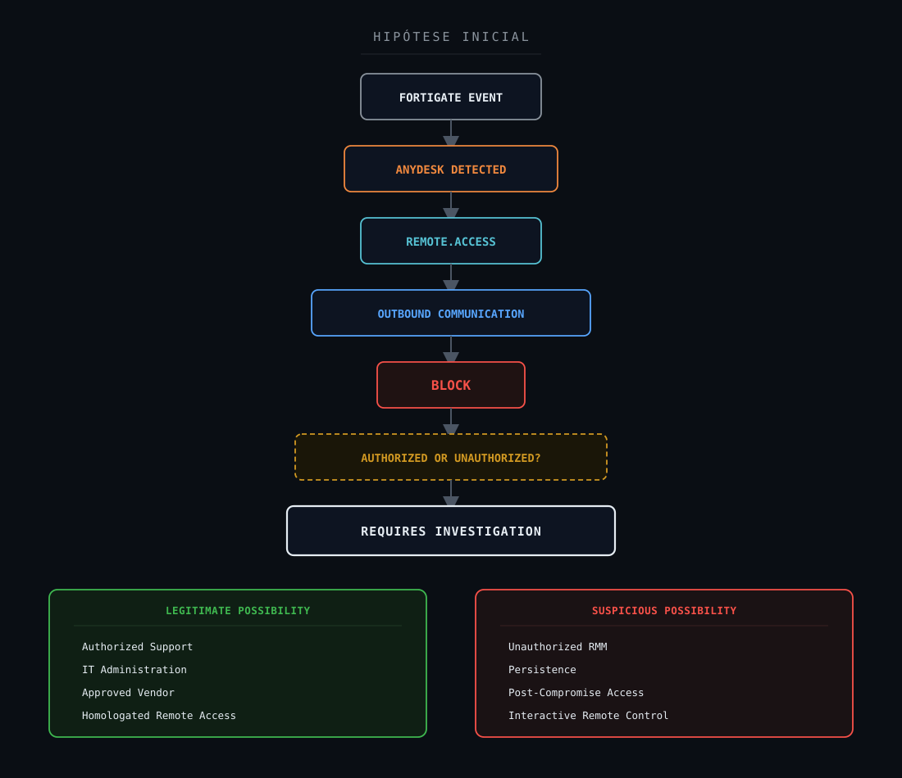

---

## 3. Escopo da investigação

A investigação foi estruturada para responder:

1. O FortiGate realmente identificou AnyDesk?
2. Qual categoria foi atribuída?
3. O tráfego era de entrada ou saída?
4. Qual ação foi aplicada?
5. Quais portas estavam envolvidas?
6. Houve recorrência?
7. O mesmo ativo apresentou novas tentativas?
8. Houve algum evento com ação diferente de `block`?
9. O AnyDesk estava instalado?
10. O processo `AnyDesk.exe` foi executado?
11. Qual era o caminho do executável?
12. Qual era o processo pai?
13. Existia command line?
14. Qual usuário estava envolvido?
15. O software era autorizado?
16. O ativo fazia parte de equipe de suporte?
17. Existia fornecedor autorizado?
18. Uma sessão remota foi estabelecida?
19. Houve autenticação no serviço?
20. Houve controle interativo?
21. Houve transferência de arquivos?
22. Existia serviço persistente?
23. Houve criação de tarefa agendada?
24. Existiam outros mecanismos de persistência?
25. Houve comportamento pós-comprometimento?
26. Existiam alertas correlacionados no endpoint?
27. Houve atividade compatível com C2?
28. O dispositivo estava comprometido?
29. O bloqueio ocorreu antes do estabelecimento da sessão?
30. Qual era o contexto real da atividade?

---

## 4. 5W1H

### What — O que ocorreu?

Foi identificado tráfego de saída classificado pelo FortiGate como pertencente ao AnyDesk.

A ação aplicada pelo controle foi:

```text
BLOCK
```

### Who — Quem ou o que esteve envolvido?

Um ativo interno iniciou as tentativas de comunicação.

O usuário responsável não estava disponível na fonte de firewall utilizada neste estudo.

Portanto:

```text
Source Device = Confirmed
Responsible User = Not Available
```

### When — Quando ocorreu?

A atividade ocorreu dentro da janela analisada e apresentou recorrência em momentos distintos.

Timestamps específicos foram removidos da publicação.

### Where — Onde ocorreu?

No tráfego de saída de um ativo interno em direção a infraestrutura associada ao serviço remoto.

Foram observadas portas como:

```text
80
443
```

Endereços IP e hostnames reais foram sanitizados.

### Why — Por que era relevante?

Softwares de acesso remoto podem ser utilizados tanto para suporte legítimo quanto para controle não autorizado de endpoints.

Sua identificação exige correlação com:

```text
Asset
User
Process
Software Inventory
Authorization
Endpoint Telemetry
Historical Context
```

### How — Como foi detectado?

O FortiGate Application Control classificou o tráfego como AnyDesk e aplicou `block`.

O evento foi posteriormente encaminhado ao Wazuh e analisado pelo SOC.

---

## 5. Evidências disponíveis

| Evidência | Fonte | Classificação | Confiança |
|---|---|---|---|
| Tráfego identificado como AnyDesk | FortiGate | Confirmed | High |
| Categoria `Remote.Access` | FortiGate | Confirmed | High |
| Comunicação `outgoing` | FortiGate | Confirmed | High |
| `action="block"` | FortiGate | Confirmed | High |
| Comunicação através de portas 80/443 | FortiGate | Confirmed | High |
| Recorrência do mesmo padrão | Threat Hunting | Confirmed | High |
| Comunicação compatível com infraestrutura do serviço remoto | Correlação | Supported | High |
| Processo local AnyDesk | Endpoint telemetry | Not Available | High |
| Command line | Endpoint telemetry | Not Available | High |
| Usuário responsável | Identity/Endpoint telemetry | Not Available | High |
| Instalação do AnyDesk | Endpoint inventory | Not Confirmed | Medium |
| Uso não autorizado | Validação com área responsável pelo ativo | Confirmed (organizational validation) | High |
| Sessão remota estabelecida | Evidências disponíveis | Not Confirmed | High |
| Controle interativo | Evidências disponíveis | Not Confirmed | High |
| Persistência | Endpoint telemetry | Not Available | Medium |
| Transferência de arquivos | Evidências disponíveis | Not Confirmed | Medium |
| Command and Control | Investigação | Not Confirmed | High |
| Comprometimento | Investigação | Not Confirmed | High |

Síntese:

```text
Network Detection = Confirmed
Block = Confirmed
Recurrence = Confirmed

Endpoint Execution Context = Not Available

Unauthorized Use = Confirmed (organizational validation)
Remote Session = Not Confirmed
Compromise = Not Confirmed
```

---

## 6. Classificação das evidências

### Confirmed / Observed

Informação diretamente sustentada pela evidência.

Neste case:

```text
AnyDesk Traffic
Remote.Access Category
Outbound Communication
Application Control Block
Recurrence
```

### Supported

Conclusão sustentada por múltiplos elementos coerentes.

Exemplo:

```text
AnyDesk Classification
        +
Remote Access Infrastructure
        +
Recurring Network Pattern
        ↓
Communication compatible with AnyDesk service
```

### Inferred

Interpretação derivada das evidências.

Exemplo:

```text
Recurring blocked attempts
        ↓
Possible automatic retry by a local component
```

Isso é uma inferência.

Não confirmação.

### Hypothesis

Possibilidade ainda sob investigação.

Exemplo:

```text
Unauthorized Remote Access Software
```

### Not Observed

Utilizado somente quando determinado comportamento foi procurado em fonte adequada e não encontrado.

### Not Available

A fonte necessária para verificar determinado comportamento não estava disponível.

Neste case:

```text
Process
Command Line
User
Process Lineage
Service
Persistence Telemetry
```

### Not Confirmed

Existe uma hipótese ou sinal relevante, mas evidência insuficiente para conclusão.

Neste case, até o momento da correlação de rede/endpoint:

```text
Authorization
Remote Session
Interactive Control
C2
Compromise
```

`Authorization` permaneceu indeterminada (nem `Authorized` nem `Unauthorized` confirmados) enquanto dependia apenas de telemetria técnica. A pergunta só foi respondida quando uma fonte diferente — validação organizacional junto à área responsável pelo ativo — confirmou `Unauthorized Use` (ver Seção 32).

### Not Applicable

Elemento sem aderência técnica ao caso.

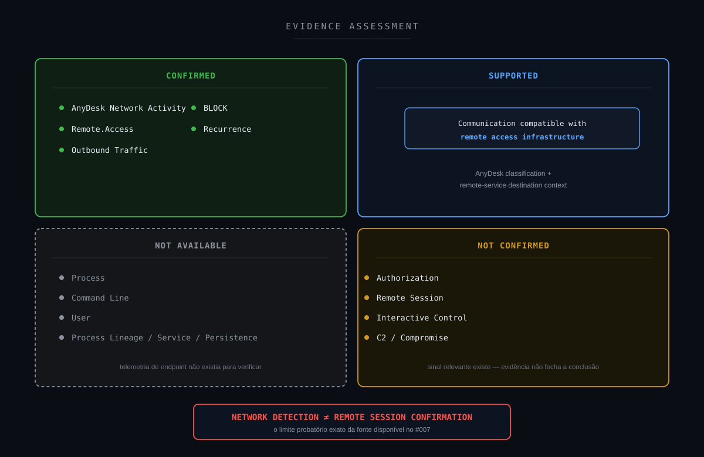

---

## 7. Timeline da investigação

A sequência lógica do case pode ser representada como:

```text
Outbound Network Activity
        ↓
FortiGate Application Control
        ↓
AnyDesk Identified
        ↓
Remote.Access
        ↓
BLOCK
        ↓
Security Event
        ↓
Wazuh
        ↓
SOC Alert
        ↓
Initial Hypothesis
Unauthorized Remote Access?
        ↓
Threat Hunting
        ↓
Historical Search
        ↓
Recurring Blocked Attempts Identified
        ↓
Evidence Classification
        ↓
Endpoint Context Not Available
        ↓
Authorization Not Confirmed (technical)
        ↓
Remote Session Not Confirmed
        ↓
Compromise Not Confirmed
        ↓
Asset / Authorization Validation
        ↓
Unauthorized Use Confirmed (organizational)
        ↓
CONTENÇÃO PREVENTIVA
```

A recorrência aumenta a relevância investigativa.

Mas:

```text
Recurrence
        ≠
Success
```

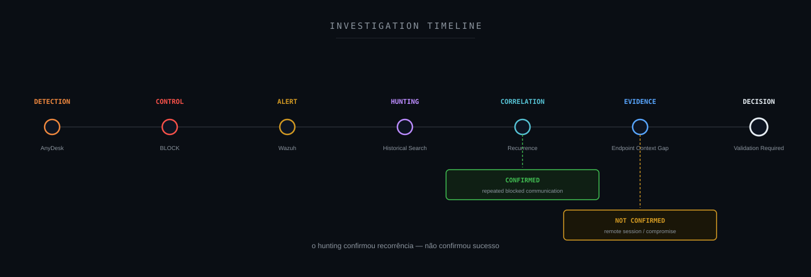

---

## 8. Threat Hunting

As consultas abaixo representam exemplos sanitizados.

### Busca geral por AnyDesk

```text
full_log:*AnyDesk*
```

### Categoria Remote.Access

```text
full_log:*Remote.Access*
```

### AnyDesk bloqueado

```text
full_log:*AnyDesk* AND full_log:*action=\"block\"*
```

### Mesmo ativo

```text
full_log:*srcip=<SOURCE_IP>* AND full_log:*AnyDesk*
```

### Mesmo ativo + categoria

```text
full_log:*srcip=<SOURCE_IP>* AND full_log:*Remote.Access*
```

### Mesmo ativo + bloqueio

```text
full_log:*srcip=<SOURCE_IP>* AND full_log:*AnyDesk* AND full_log:*action=\"block\"*
```

### Busca por portas observadas

```text
full_log:*srcip=<SOURCE_IP>* AND
(full_log:*dstport=80* OR full_log:*dstport=443*) AND
full_log:*AnyDesk*
```

### Busca por ações diferentes de bloqueio

```text
full_log:*srcip=<SOURCE_IP>* AND
full_log:*AnyDesk* AND
NOT full_log:*action=\"block\"*
```

Essa última consulta é especialmente relevante.

Caso nenhuma ação diferente de `block` seja encontrada no escopo pesquisado, a conclusão correta é:

```text
No non-blocked AnyDesk event observed
within the searched scope
```

e não:

```text
AnyDesk was never allowed
```

---

## 9. Campos relevantes para investigação

Campos relevantes na camada FortiGate:

```text
date
time
srcip
srcport
srcintf
dstip
dstport
dstintf
direction
service
appid
app
appcat
apprisk
action
hostname
policyid
sessionid
eventtype
subtype
msg
```

Campos relevantes no Wazuh:

```text
@timestamp
agent.name
agent.ip
rule.id
rule.level
rule.description
location
full_log
```

Os elementos mais importantes para decisão foram:

```text
Source
Application
Category
Direction
Destination
Port
Action
Recurrence
```

Ainda faltavam:

```text
Process
User
Asset Owner
Software Inventory
Authorization
Endpoint Behavior
```

---

## 10. Resultado do Threat Hunting

O Threat Hunting confirmou recorrência.

O mesmo ativo apresentou o padrão:

```text
Internal Source
        ↓
AnyDesk Classification
        ↓
Remote.Access
        ↓
Outbound Communication
        ↓
Application Control
        ↓
BLOCK
```

em mais de uma janela analisada.

Isso sustenta:

```text
Recurring AnyDesk Network Activity = Confirmed
```

Mas não sustenta automaticamente:

```text
AnyDesk Remote Session = Confirmed
```

Não havia evidência suficiente na fonte analisada para afirmar:

```text
Process Execution
User Interaction
Authentication to AnyDesk
Successful Session
Interactive Control
File Transfer
Persistence
C2
Compromise
```

Portanto:

> **repetição de tentativas bloqueadas representa recorrência de atividade, não confirmação de sucesso.**

---

## 11. Entendendo AnyDesk e Remote Access Software

AnyDesk é uma ferramenta legítima de acesso remoto.

Softwares dessa categoria são utilizados para:

```text
Remote Support
System Administration
Troubleshooting
Remote Assistance
Vendor Support
Maintenance
```

Ao mesmo tempo, possuem capacidade suficiente para serem abusados em contexto adversarial.

Essa característica define uma tecnologia de uso dual:

```text
Legitimate Software
        +
Powerful Remote Capability
        =
Dual-Use Technology
```

Portanto, a pergunta correta não é:

```text
Is AnyDesk malicious?
```

Mas:

```text
Is this AnyDesk activity
authorized and expected
for this device/user?
```

O nome da aplicação sozinho não responde isso.

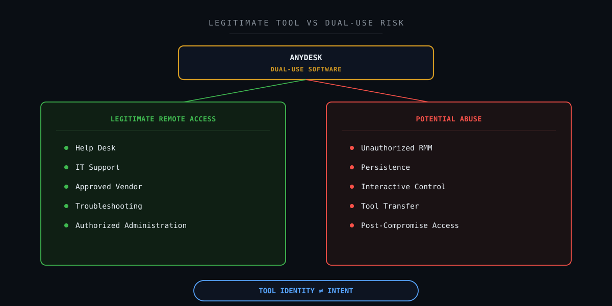

---

## 12. Detecção de aplicação vs sessão remota estabelecida

Este é um dos pontos mais importantes do case.

O FortiGate identificou tráfego associado ao AnyDesk.

Isso sustenta:

```text
AnyDesk-related Network Activity
```

Não sustenta automaticamente:

```text
Interactive Remote Session Established
```

Uma cadeia possível seria:

```text
Software Installed
        ↓
Software Executed
        ↓
Network Communication
        ↓
Service Contact
        ↓
Authentication
        ↓
Session Establishment
        ↓
Interactive Remote Control
```

O evento analisado sustentava diretamente:

```text
Network Communication Attempt
        +
AnyDesk Identification
        +
BLOCK
```

Os demais estados precisavam de outras evidências.

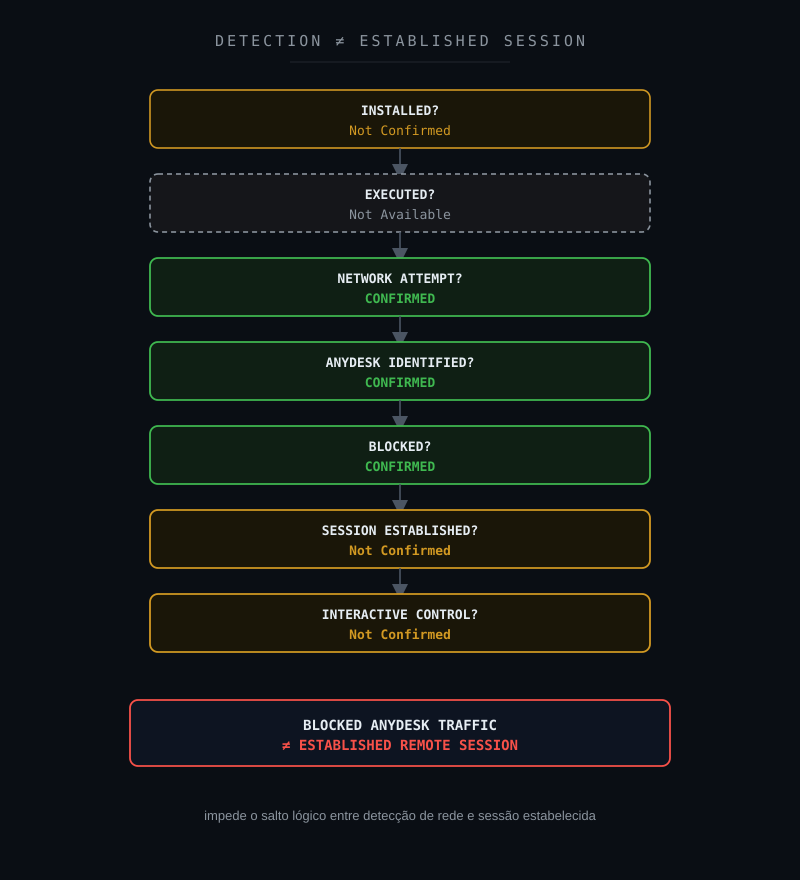

---

## 13. Correlação técnica

A recorrência identificada permite considerar diferentes hipóteses.

### Cenário A — aplicação autorizada tentando alcançar o serviço

```text
Approved Software
        +
Expected Device
        +
Expected User
        +
Support Context
        ↓
Legitimate Activity
```

### Cenário B — software não homologado

```text
AnyDesk
        +
Corporate Endpoint
        +
No Authorization
        ↓
Unauthorized Software / Policy Violation
```

### Cenário C — componente residual ou persistente

```text
Previous Installation
        +
Background Service
        +
Automatic Connection Retry
```

### Cenário D — utilização adversarial

```text
Compromised Endpoint
        +
AnyDesk
        +
Persistence
        +
Interactive Remote Access
        +
Supporting Malicious Evidence
```

A telemetria disponível confirmou apenas:

```text
Recurring AnyDesk Network Activity
```

O motivo da atividade permaneceu:

```text
Not Confirmed
```

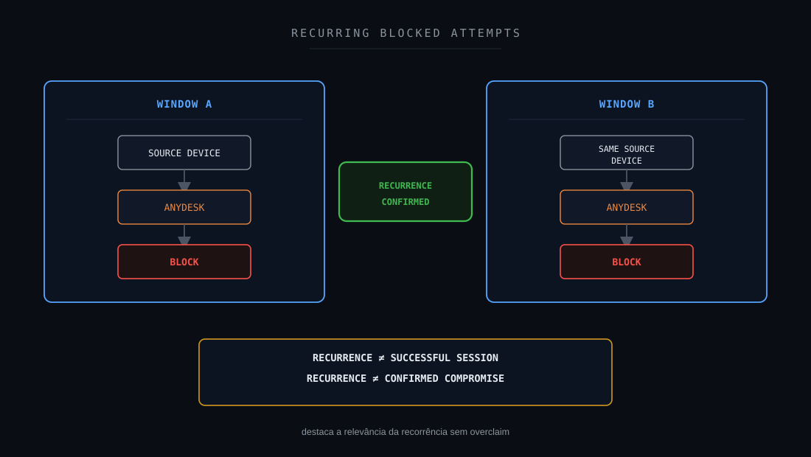

---

## 14. Cadeia fim a fim do evento

```text
Internal Device
        ↓
Outbound Network Communication
        ↓
FortiGate
        ↓
Application Control
        ↓
AnyDesk Identified
        ↓
Remote.Access Category
        ↓
Action = BLOCK
        ↓
Security Log
        ↓
Centralized Collection
        ↓
Wazuh
        ↓
SOC Alert
        ↓
Initial Hypothesis
Unauthorized Remote Access?
        ↓
Threat Hunting
        ↓
Historical Correlation
        ↓
Recurring Pattern Identified
        ↓
Evidence Assessment
        ↓
Endpoint Telemetry Gap
        ↓
Authorization Not Confirmed (technical)
        ↓
Remote Session Not Confirmed
        ↓
Compromise Not Confirmed
        ↓
Asset / Authorization Validation
        ↓
Unauthorized Use Confirmed (organizational)
        ↓
CONTENÇÃO PREVENTIVA
```

Essa cadeia representa:

```text
Network Activity
    ↓
Control
    ↓
Telemetry
    ↓
Detection
    ↓
Investigation
    ↓
Evidence
    ↓
Decision
```

Ela não representa uma cadeia de ataque confirmada.

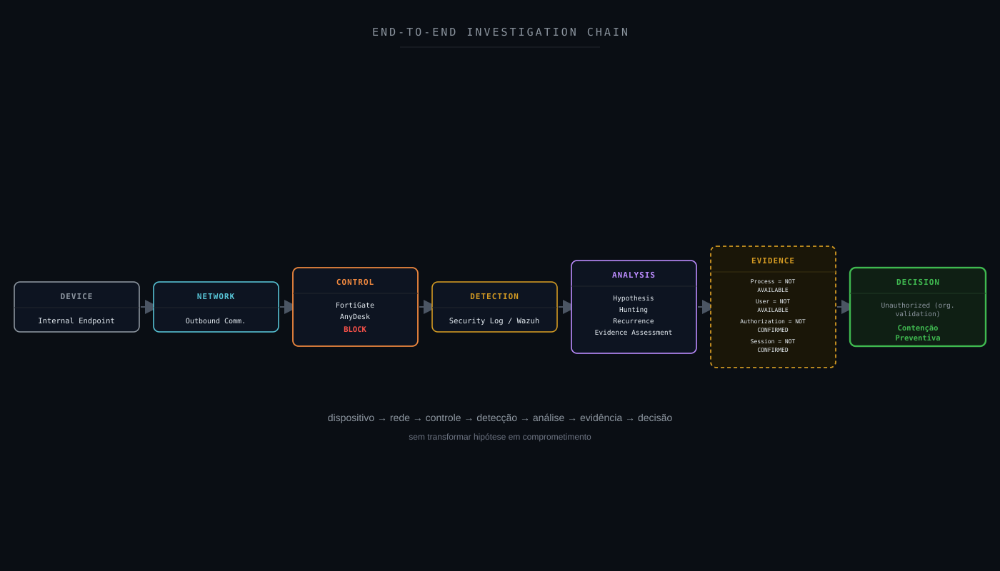

---

## 15. Attack Flow

Não existe evidência suficiente para construir um Attack Flow adversarial confirmado.

Seria incorreto representar automaticamente:

```text
Initial Access
        ↓
Execution
        ↓
Persistence
        ↓
Command and Control
```

apenas pela identificação do AnyDesk.

O fluxo sustentado pelas evidências é investigativo:

```text
Remote Access Alert
        ↓
AnyDesk Identified
        ↓
Block Confirmed
        ↓
Historical Search
        ↓
Recurrence Identified
        ↓
Endpoint Context Required
        ↓
Process Not Available
        ↓
User Not Available
        ↓
Authorization Not Confirmed
        ↓
Remote Session Not Confirmed
        ↓
Maintain Investigation State
```

Portanto:

```text
Investigation Flow = Applicable
```

```text
Confirmed Adversary Attack Flow = Not Available
```

---

## 16. Attack Chain Assessment

| Estágio | Status | Fundamentação |
|---|---|---|
| Reconnaissance | Not Available | Fonte de firewall não permite determinar |
| Initial Access | Not Available | Vetor inicial desconhecido |
| Execution | Not Available | Sem telemetria de processo |
| Persistence | Not Available | Sem telemetria adequada |
| Privilege Escalation | Not Available | Sem telemetria adequada |
| Defense Evasion | Not Confirmed | Evidência insuficiente |
| Credential Access | Not Confirmed | Evidência insuficiente |
| Discovery | Not Confirmed | Evidência insuficiente |
| Lateral Movement | Not Confirmed | Evidência insuficiente |
| Collection | Not Confirmed | Evidência insuficiente |
| Command and Control | Not Confirmed | AnyDesk pode ser abusado para acesso remoto, mas uso adversarial não foi demonstrado |
| Exfiltration | Not Confirmed | Transferência de dados não demonstrada |
| Impact | Not Confirmed | Impacto não confirmado |
| Remote Access Network Activity | Confirmed | Tráfego AnyDesk identificado |
| Application Control Block | Confirmed | `action="block"` registrado |

O objetivo dessa avaliação é evitar:

```text
Remote Access Tool Detected
        ↓
Full Attack Chain Assumed
```

---

## 17. MITRE ATT&CK Mapping

### T1219.002 — Remote Desktop Software

O comportamento possui relação técnica com:

```text
MITRE ATT&CK
T1219.002
Remote Access Software: Remote Desktop Software
```

Ferramentas legítimas de desktop remoto podem ser utilizadas por adversários.

Entretanto:

```text
Technology Match
        ≠
Adversary Technique Confirmed
```

Neste case:

```text
AnyDesk-related Traffic = Confirmed
```

mas:

```text
Adversarial AnyDesk Use = Not Confirmed
```

Portanto:

```text
T1219.002 = Investigation Hypothesis / Partial Mapping
```

e não:

```text
T1219.002 = Confirmed TTP
```

A técnica pode possuir relação com Command and Control em contexto adversarial.

Mas:

```text
Command and Control = Not Confirmed
```

neste estudo.

---

## 18. MITRE Detection Strategy

Uma estratégia aderente para Remote Desktop Software deve combinar múltiplas fontes.

Conceitualmente:

```text
Remote Access Process
        +
Executable Path
        +
User
        +
Process Lineage
        +
Service
        +
Network Connection
        +
Historical Behavior
        +
Authorization
```

No case atual, a principal visibilidade era:

```text
Network / Application Control
```

Essa fonte respondeu:

```text
Which application?
Which direction?
Which destination?
Which port?
Was it blocked?
Did it recur?
```

Mas não respondeu:

```text
Who executed it?
Was it installed?
Was a session established?
Was the activity authorized?
```

Uma Detection Strategy madura precisa combinar rede e endpoint.

---

## 19. Framework Mapping

### MITRE ATT&CK

**Aplicabilidade: parcial / hipótese.**

T1219.002 possui aderência comportamental.

Uso adversarial não foi confirmado.

### MITRE Detection Strategy

**Aplicabilidade: forte.**

A correlação entre software de acesso remoto, processo e rede é diretamente relevante.

### MITRE D3FEND

**Aplicabilidade: supporting.**

Controles de rede, filtragem e monitoramento possuem aderência defensiva.

### MITRE Attack Flow

**Aplicabilidade: limitada.**

Não existe cadeia adversarial confirmada.

### MITRE Engage

**Aplicabilidade: Not Applicable.**

Não houve adversary engagement.

### MITRE Fight Fraud Framework

**Aplicabilidade: Not Applicable.**

Nenhum cenário de fraude.

### VERIS

**Aplicabilidade: supporting.**

Pode apoiar classificação estruturada do evento.

### NIST CSF

**Aplicabilidade: direta.**

Principalmente Detect, Respond e Improve.

### NIST SP 800-61

**Aplicabilidade: direta.**

Investigação e resposta.

### CIS Controls

**Aplicabilidade: supporting / forte.**

Inventário de software, logs e monitoramento de rede são particularmente relevantes.

### Sigma

**Aplicabilidade: parcial.**

Pode complementar a detecção na camada de processo.

### SOC-CMM

**Aplicabilidade: supporting.**

Expõe oportunidades de maturidade de contexto e correlação.

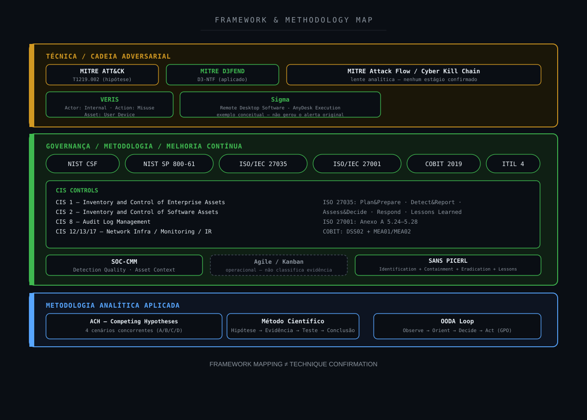

---

## 20. NIST Mapping

### IDENTIFY

Compreender:

- ativo;
- proprietário;
- criticidade;
- software instalado;
- necessidade de acesso remoto;
- fornecedor;
- autorização.

### PROTECT

Aplicar:

```text
Software Governance
Application Control
Least Privilege
Endpoint Security
Network Controls
```

### DETECT

O FortiGate identificou atividade AnyDesk.

O Wazuh transformou a telemetria em alerta.

### RESPOND

O SOC executou:

```text
Alert Validation
        ↓
Historical Hunting
        ↓
Recurrence Analysis
        ↓
Evidence Classification
        ↓
Context Validation
```

### RECOVER

```text
Not Applicable at this stage
```

Não havia comprometimento ou impacto confirmados.

### GOVERN

Possui aderência a:

- política de software remoto;
- gestão de terceiros;
- catálogo de ferramentas autorizadas;
- exceções;
- ownership de ativos.

### IMPROVE

O principal ganho está em enriquecer alertas com:

```text
Asset
Process
User
Software Inventory
Authorization
```

---

## 21. CIS Controls

O cenário possui relação com capacidades como:

- Inventory and Control of Enterprise Assets;
- Inventory and Control of Software Assets;
- Audit Log Management;
- Network Infrastructure Management;
- Network Monitoring and Defense;
- Incident Response Management.

Um dos principais problemas defensivos é:

```text
AnyDesk Detected
        +
Authorization Unknown
```

A organização precisa conseguir responder:

```text
Is this software approved?
On which assets?
For which users?
For what purpose?
```

Sem esse contexto, a investigação permanece manual.

---

## 22. Detection Strategy

### Estratégia atual

```text
Network Traffic
        ↓
FortiGate Application Control
        ↓
AnyDesk
        ↓
BLOCK
        ↓
Wazuh Alert
```

Essa detecção possui valor e não deve ser descartada.

### Estratégia enriquecida

```text
AnyDesk Activity
        +
Asset Inventory
        +
Device Owner
        +
Software Inventory
        +
Process Creation
        +
Executable Path
        +
Digital Signature
        +
Service State
        +
User Session
        +
EDR Telemetry
        +
Authorization
        +
Historical Activity
        +
Firewall Action
        ↓
Contextual Risk
```

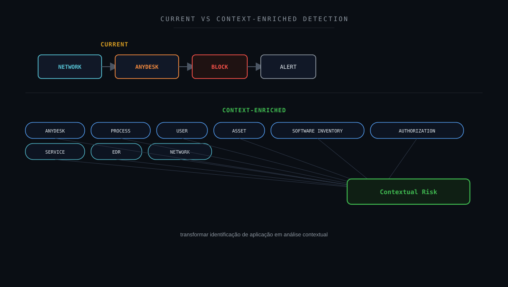

---

## 23. Detection Gap Analysis

### O que foi detectado?

```text
AnyDesk-related Network Communication
```

### O FortiGate aplicou bloqueio?

```text
YES
```

### Houve recorrência?

```text
YES
```

### Sabemos se o software estava instalado?

```text
Not Confirmed
```

### Sabemos se o processo foi executado?

```text
Not Available
```

### Sabemos qual usuário iniciou?

```text
Not Available
```

### Sabemos se era autorizado?

```text
Not Confirmed
```

### Sabemos se uma sessão foi estabelecida?

```text
Not Confirmed
```

A principal lacuna é:

```text
NETWORK CONTEXT
        >
ENDPOINT / IDENTITY CONTEXT
```

O firewall conhece a comunicação.

Ele não conhece automaticamente:

```text
Intent
Authorization
Process Lineage
User
Interactive Session State
```

---

## 24. Oportunidades de enriquecimento

### Endpoint Process Telemetry

Utilizar fontes como:

```text
Sysmon Event ID 1
EDR Process Creation
Windows Security Process Events
```

Objetivo:

```text
Process
Parent Process
Command Line
User
```

### Network Connection Telemetry

```text
Sysmon Event ID 3
EDR Network Telemetry
```

Objetivo:

correlacionar processo e conexão.

### File Creation

```text
Sysmon Event ID 11
EDR File Telemetry
```

Objetivo:

identificar instalação ou artefatos.

### Software Inventory

Responder:

```text
Is AnyDesk installed?
```

### Windows Services

Responder:

```text
Is a persistent AnyDesk service configured?
```

### Identity Context

Responder:

```text
Which user was logged on?
```

### Asset Management

Responder:

```text
Who owns the device?
What is its role?
```

### Authorization Context

Responder:

```text
Is AnyDesk approved for this device/user?
```

---

## 25. Detection Engineering

Um pipeline de maior maturidade poderia utilizar:

```text
STAGE 1
NETWORK IDENTIFICATION
AnyDesk

        ↓

STAGE 2
FIREWALL ACTION
Block / Allow

        ↓

STAGE 3
ASSET CONTEXT
Known / Unknown

        ↓

STAGE 4
SOFTWARE INVENTORY
Installed / Not Installed / Unknown

        ↓

STAGE 5
PROCESS TELEMETRY
Executed / Not Observed / Not Available

        ↓

STAGE 6
IDENTITY
Expected User / Unexpected User / Not Available

        ↓

STAGE 7
AUTHORIZATION
Approved / Unapproved / Not Confirmed

        ↓

STAGE 8
BEHAVIOR CORRELATION
Process + Service + Network + User

        ↓

STAGE 9
CONTEXTUAL RISK
```

No #007, destacar:

```text
PROCESS = NOT AVAILABLE
IDENTITY = NOT AVAILABLE
AUTHORIZATION = NOT CONFIRMED
```

Exemplo de maior suspeita:

```text
AnyDesk
        +
Unapproved Software
        +
Unexpected User
        +
Persistent Service
        +
Active Remote Session
        +
Supporting Malicious Evidence
        ↓
HIGHER CONFIDENCE
```

Exemplo de menor suspeita:

```text
AnyDesk
        +
Approved Device
        +
Approved Support Team
        +
Expected Process
        +
Documented Authorization
        ↓
LOWER SUSPICION
```

Esses são exemplos conceituais.

Não fatos observados neste case.

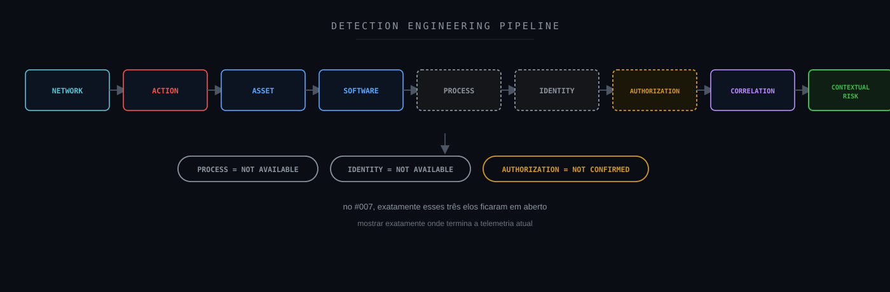

---

## 26. Sigma

Sigma pode complementar a investigação na camada de endpoint.

Exemplo conceitual:

```yaml
title: Remote Desktop Software - AnyDesk Execution
status: experimental

logsource:
  category: process_creation
  product: windows

detection:
  selection:
    Image|endswith:
      - '\AnyDesk.exe'
  condition: selection

falsepositives:
  - Authorized remote support activity

level: medium
```

Essa regra não representa evidência do #007.

É uma oportunidade de enriquecimento.

Uma implementação mais madura deveria considerar também:

```text
Executable Path
Signer
Product Metadata
Parent Process
Service Creation
Hash
Network Behavior
```

O objetivo seria combinar:

```text
FortiGate AnyDesk
        +
Endpoint Process
        +
User
        +
Authorization
```

---

## 27. Hardening Opportunities

### Inventário de ferramentas de acesso remoto

A organização deve possuir lista das soluções autorizadas.

### Catálogo de RMM

Exemplo:

```text
Approved
Restricted
Prohibited
Exception Required
```

### Application Control

Manter controle sobre ferramentas remotas.

### Evitar allowlist global

Permitir uma ferramenta para toda a rede reduz controle e visibilidade.

### Política contextual

Quando necessária:

```text
Authorized Device
        +
Authorized User
        +
Approved Purpose
        +
Controlled Network Access
```

### Software não autorizado

Quando confirmado, avaliar remoção.

### Serviços persistentes

Monitorar serviços criados por aplicações de acesso remoto.

### Endpoint Telemetry

Correlacionar processo, serviço, arquivo e rede.

### Bloqueio enquanto contexto é desconhecido

Pode ser defensivamente apropriado preservar a restrição até validação.

---

## 28. Controles defensivos

Uma arquitetura Defense-in-Depth pode utilizar:

```text
SOFTWARE GOVERNANCE
        ↓
APPLICATION CONTROL
        ↓
ENDPOINT PROTECTION
        ↓
PROCESS TELEMETRY
        ↓
NETWORK MONITORING
        ↓
IDENTITY CONTEXT
        ↓
WAZUH / SIEM
        ↓
SOC ANALYSIS
```

Cada camada responde a uma pergunta.

```text
Application Control
→ What application is communicating?
```

```text
Endpoint
→ What process executed?
```

```text
Identity
→ Who was using the system?
```

```text
Inventory
→ Should this software exist?
```

```text
SOC
→ What does the complete evidence support?
```

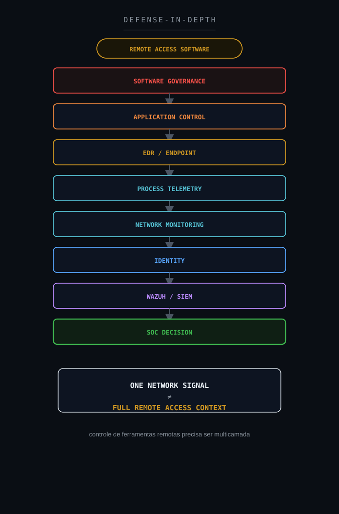

---

## 29. SOC-CMM

O case permite observar diferentes níveis de maturidade.

### Capacidade básica

```text
Alert
        ↓
Analyst Investigation
```

### Capacidade intermediária

```text
Alert
        +
Historical Correlation
        +
Asset Validation
```

### Capacidade mais madura

```text
Network
        +
Endpoint
        +
Identity
        +
Asset Inventory
        +
Authorization
        +
Automated Enrichment
        +
Contextual Severity
```

O ganho de maturidade não está em criar mais alertas.

Está em reduzir perguntas manuais.

Idealmente o alerta deveria chegar ao SOC com:

```text
Device Owner
Software Status
Process
User
Authorization
Historical Behavior
Firewall Action
EDR Context
```

---

## 30. Métricas operacionais

| Métrica | Objetivo |
|---|---|
| MTTD | Tempo até detecção |
| MTTA | Tempo até reconhecimento |
| MTTC | Tempo até contenção quando aplicável |
| MTTR | Tempo até resolução operacional |
| False Positive Rate | Atividades posteriormente validadas como autorizadas |
| Remote Access Authorization Coverage | Cobertura de contexto de autorização |
| Detection Enrichment Coverage | Alertas enriquecidos com ativo/processo/usuário |
| Recurrence Rate | Ativos com novas tentativas após bloqueio |
| Endpoint Correlation Coverage | Cobertura de rede + processo |
| SLA | Acompanhamento operacional |

Neste case:

```text
Firewall Block
```

não deve ser tratado automaticamente como:

```text
Endpoint Containment
```

São conceitos diferentes.

---

## 31. Decision Flow

```text
Remote Access Application Detected?
        ↓
YES
        ↓
Traffic Blocked?
        ├── NO
        │    ↓
        │  Analyze Connection
        │    ↓
        │  Remote Session Evidence?
        │    ↓
        │  Escalate According to Evidence
        │
        └── YES
             ↓
Authorization Status?
        ├── AUTHORIZED
        │    ↓
        │  Activity Expected?
        │    ├── YES
        │    │    ↓
        │    │  Legitimate / Authorized Activity
        │    │
        │    └── NO
        │         ↓
        │       Investigate Anomaly
        │
        ├── UNAUTHORIZED
        │    ↓
        │  Policy / Endpoint Investigation
        │
        └── NOT CONFIRMED / UNKNOWN
             ↓
        Validate Asset
             ↓
        Process Available?
        ├── YES → Analyze Process
        └── NO  → NOT AVAILABLE
             ↓
        User Available?
        ├── YES → Analyze User
        └── NO  → NOT AVAILABLE
             ↓
        Remote Session Confirmed?
        ├── YES → ESCALATE INVESTIGATION
        └── NO / NOT CONFIRMED
             ↓
        Supporting Malicious Evidence?
        ├── YES → ESCALATE INVESTIGATION
        └── NO / NOT CONFIRMED
             ↓
        VALIDATION REQUIRED
```

O fluxo do #007 seguiu, inicialmente, o ramo `NOT CONFIRMED / UNKNOWN` (a autorização ainda não estava confirmada tecnicamente):

```text
AnyDesk Detected
        ↓
BLOCK
        ↓
Authorization Status = NOT CONFIRMED / UNKNOWN
        ↓
Process Not Available
        ↓
User Not Available
        ↓
Remote Session Not Confirmed
        ↓
Compromise Not Confirmed
```

Até esse ponto, o estado correto era `VALIDATION REQUIRED`. A validação de autorização junto à área responsável pelo ativo confirmou que o uso **não era autorizado**, reclassificando o caso para o ramo `UNAUTHORIZED`:

```text
Asset / Authorization Validation
        ↓
Authorization Status = UNAUTHORIZED
        ↓
Policy / Endpoint Investigation
        ↓
Block Already Applied
        +
Compromise Not Confirmed
        ↓
CONTENÇÃO PREVENTIVA
        ↓
Corrective Action: GPO to Block AnyDesk Installation
```

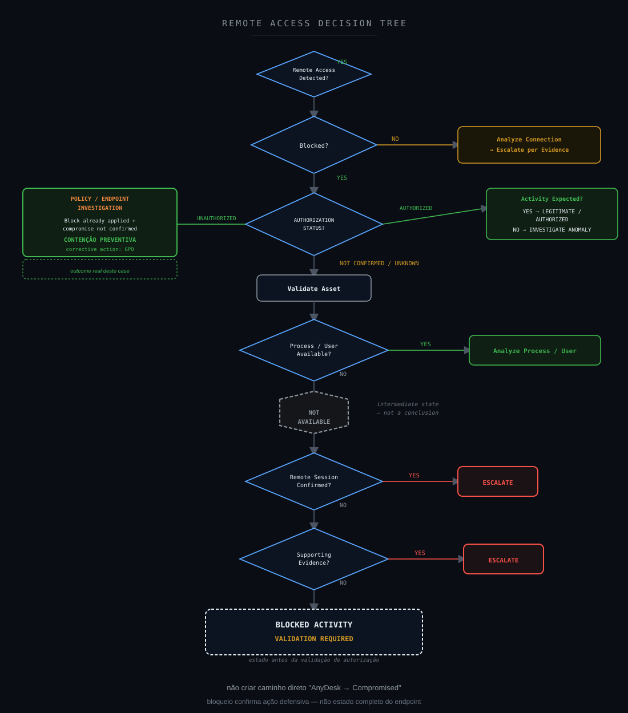

---

## 32. Veredito técnico

### AnyDesk-related Network Activity

```text
Confirmed
```

### Categoria Remote.Access

```text
Confirmed
```

### Comunicação de saída

```text
Confirmed
```

### Application Control Block

```text
Confirmed
```

### Recorrência

```text
Confirmed
```

### Infraestrutura compatível com serviço de acesso remoto

```text
Supported
```

### AnyDesk instalado

```text
Not Confirmed
```

### Processo AnyDesk executado

```text
Not Available
```

### Command line

```text
Not Available
```

### Usuário responsável

```text
Not Available
```

### Uso não autorizado

```text
Confirmed (organizational validation)
```

### Sessão remota estabelecida

```text
Not Confirmed
```

### Controle interativo

```text
Not Confirmed
```

### Persistência

```text
Not Available
```

### Command and Control adversarial

```text
Not Confirmed
```

### Comprometimento

```text
Not Confirmed
```

### Classificação final

**Contenção Preventiva — tráfego AnyDesk não autorizado, identificado e bloqueado corretamente pelo FortiGate Application Control; comprometimento não confirmado. Ação corretiva definida: GPO para impedir a instalação do AnyDesk no ambiente.**

### Estado final

```text
BLOCKED REMOTE ACCESS ACTIVITY
UNAUTHORIZED USE CONFIRMED (organizational validation)
REMOTE SESSION NOT CONFIRMED
COMPROMISE NOT CONFIRMED
CONTENÇÃO PREVENTIVA
```

O caso não foi classificado como incidente confirmado por ausência de evidência técnica de sessão remota, controle interativo ou comprometimento — o bloqueio impediu a comunicação antes dessas etapas.

Ele foi classificado como Contenção Preventiva porque:

```text
Block Already Applied
        +
Unauthorized Use Confirmed (organizational validation)
        +
Compromise Not Confirmed
        ↓
Defensive Action Sustained, Compromise Not Established
```

---

## 33. Por que não classificar como benigno ou comprometido?

Existem dois erros simétricos.

### Erro 1 — assumir benignidade porque AnyDesk é legítimo

```text
Legitimate Software
        ≠
Legitimate Use
```

### Erro 2 — assumir comprometimento porque AnyDesk pode ser abusado

```text
Tool Used by Threat Actors
        ≠
Threat Actor Confirmed
```

O fato diretamente observado é:

```text
ANYDESK NETWORK ACTIVITY
        +
BLOCK
```

A interpretação depende de contexto adicional.

O fluxo correto é:

```text
EVENT
        ↓
DETECTION
        ↓
CONTROL ACTION
        ↓
ALERT
        ↓
HYPOTHESIS
        ↓
INVESTIGATION
        ↓
EVIDENCE
        ↓
VERDICT
```

Não existe atalho seguro entre:

```text
AnyDesk Alert
```

e:

```text
Compromised Host
```

O mesmo raciocínio se aplica ao encerramento do caso: não existe atalho seguro entre "não há evidência técnica de comprometimento" e "o uso é benigno".

O caso só pôde ser encerrado quando a área responsável pelo ativo confirmou que a atividade **não era autorizada** — uma fonte de evidência organizacional, complementar à telemetria de rede, que sustentou o bloqueio já aplicado sem apontar evidência de comprometimento.

```text
Network Telemetry Gap
        +
Unauthorized Use Confirmed (organizational)
        +
Block Already Applied
        +
Compromise Not Confirmed
        ↓
CONTENÇÃO PREVENTIVA
```

Como ação corretiva, foi definida a criação de uma GPO para impedir a instalação do AnyDesk no ambiente daqui em diante, reduzindo a dependência de bloqueio reativo na camada de rede.

---

## 34. Lições aprendidas

### 1. Remote Access Software é uma categoria de comportamento

Não um veredito.

### 2. BLOCK confirma a ação defensiva

```text
action="block"
```

confirma o tratamento daquele tráfego.

Não o estado completo do endpoint.

### 3. Rede não substitui endpoint

O firewall consegue identificar comunicação.

Para entender execução, é necessário endpoint telemetry.

### 4. Ferramenta legítima não significa uso legítimo

AnyDesk possui finalidade legítima.

A autorização precisa ser contextual.

### 5. Técnica MITRE aplicável não significa técnica confirmada

```text
T1219.002
```

é relevante.

Uso adversarial continua:

```text
Not Confirmed
```

### 6. Recorrência aumenta prioridade

Mas:

```text
Recurring Attempts
        ≠
Successful Remote Session
```

### 7. Not Available é diferente de Not Observed

Sem telemetria de processo:

```text
Process = Not Available
```

Não:

```text
Process Did Not Execute
```

### 8. Not Confirmed não significa benigno

A ausência de confirmação de comprometimento não transforma a atividade em falsa positiva.

### 9. O inventário de software é parte da investigação

Responder rapidamente:

```text
Should AnyDesk exist here?
```

reduz significativamente o tempo de análise.

### 10. O estado intermediário é válido

Nem todo caso precisa terminar imediatamente em:

```text
True Positive
```

ou:

```text
False Positive
```

Às vezes, a evidência sustenta:

```text
Validation Required
```

Neste case, `Validation Required` não foi o fim da linha — foi o estado que existiu até a validação organizacional ser concluída. O estado intermediário é válido porque preserva a investigação enquanto a resposta certa não chega; ele não é, por si só, a resposta final.

### 11. GPO transforma bloqueio reativo em controle preventivo

A ação corretiva deste case não foi apenas manter o Application Control bloqueando cada nova tentativa indefinidamente.

Foi criar uma GPO para impedir a instalação do AnyDesk, endereçando a causa (o software presente no endpoint) e não só o sintoma (o tráfego de rede).

---

## 35. Investigation Flow — visão final

```text
Internal Device
        ↓
Outbound Communication
        ↓
FortiGate Application Control
        ↓
AnyDesk Identified
        ↓
Remote.Access
        ↓
BLOCK
        ↓
Wazuh Alert
        ↓
Initial Hypothesis
Unauthorized Remote Access?
        ↓
Threat Hunting
        ↓
Recurring Blocked Attempts
        ↓
Evidence Classification
        ↓
Process?
NOT AVAILABLE
        ↓
User?
NOT AVAILABLE
        ↓
Authorization? (technical)
NOT CONFIRMED
        ↓
Remote Session?
NOT CONFIRMED
        ↓
Compromise?
NOT CONFIRMED
        ↓
Asset / Authorization Validation
        ↓
Unauthorized Use Confirmed
(organizational validation)
        ↓
FINAL STATE
CONTENÇÃO PREVENTIVA
CORRECTIVE ACTION: GPO TO BLOCK ANYDESK INSTALLATION
```

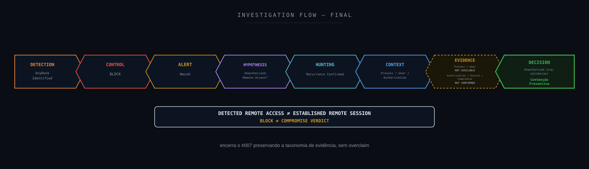

---

## 36. Referências técnicas

### Wazuh

Wazuh Documentation
https://documentation.wazuh.com/

### Fortinet

Fortinet Documentation
https://docs.fortinet.com/

FortiGate Application Control
https://docs.fortinet.com/document/fortigate/latest/administration-guide/

### AnyDesk

AnyDesk Documentation
https://support.anydesk.com/

### MITRE ATT&CK

MITRE ATT&CK
https://attack.mitre.org/

T1219 — Remote Access Software
https://attack.mitre.org/techniques/T1219/

T1219.002 — Remote Desktop Software
https://attack.mitre.org/techniques/T1219/002/

### MITRE Detection Strategy

MITRE ATT&CK Detection Strategies
https://attack.mitre.org/detectionstrategies/

### MITRE D3FEND

MITRE D3FEND
https://d3fend.mitre.org/

### MITRE Attack Flow

MITRE Attack Flow
https://center-for-threat-informed-defense.github.io/attack-flow/

### MITRE Engage

MITRE Engage
https://engage.mitre.org/

### NIST

NIST Cybersecurity Framework
https://www.nist.gov/cyberframework

NIST SP 800-61 Rev. 3
https://csrc.nist.gov/pubs/sp/800/61/r3/final

### CIS

CIS Controls
https://www.cisecurity.org/controls

### VERIS

VERIS Framework
https://verisframework.org/

### Sigma

Sigma
https://sigmahq.io/

### SOC-CMM

SOC-CMM
https://www.soc-cmm.com/

---

## Disclaimer

Este estudo foi sanitizado para preservar integralmente a confidencialidade do ambiente originalmente analisado.

As investigações, decisões técnicas e veredictos apresentados neste estudo refletem experiência prática real do autor. Ferramentas de Inteligência Artificial foram utilizadas como apoio para formatação, diagramação e publicação do conteúdo — não para a condução da investigação em si.

Não são publicados valores reais relacionados a:

```text
Organization
Client
Hostname
Source IP
Destination IP
Username
E-mail Address
Session ID
Policy ID
Incident ID
Ticket ID
Internal Rule ID
Collector ID
Exact Timestamp
Internal Infrastructure Name
Environment-Specific Identifier
Credentials
Tokens
Secrets
```

Os endereços externos reais associados à comunicação não são publicados.

O ativo interno não é identificado.

O usuário responsável não é identificado.

O contexto técnico foi preservado apenas no nível necessário:

```text
Internal Device
        ↓
Outbound Communication
        ↓
FortiGate
        ↓
Application Control
        ↓
AnyDesk
        ↓
Remote.Access
        ↓
BLOCK
        ↓
Wazuh Alert
        ↓
Threat Hunting
        ↓
Recurring Blocked Attempts
        ↓
Endpoint Context Gap
        ↓
Authorization Not Confirmed (technical)
        ↓
Remote Session Not Confirmed
        ↓
Compromise Not Confirmed
        ↓
Asset / Authorization Validation
        ↓
Unauthorized Use Confirmed (organizational)
        ↓
Contenção Preventiva
        ↓
Corrective Action: GPO to Block AnyDesk Installation
```

A identificação de AnyDesk na telemetria de rede não foi utilizada como evidência automática de comprometimento.

Da mesma forma, o fato de AnyDesk ser uma ferramenta legítima não foi utilizado como evidência automática de uso autorizado — o status de autorização só foi tratado como confirmado (neste case, como não autorizado) após validação explícita com a área responsável pelo ativo, sem identificar essa área.

O estudo mantém separação explícita entre:

```text
Detected
Blocked
Installed
Executed
Authorized
Connected
Session Established
Interactive Control
Compromised
Resolved
```

Esses estados não são intercambiáveis.

Quando não existia fonte adequada para verificar determinado comportamento, foi utilizada:

```text
Not Available
```

Quando havia hipótese relevante, mas evidência insuficiente para conclusão, foi utilizada:

```text
Not Confirmed
```

A técnica MITRE ATT&CK relacionada a Remote Desktop Software foi utilizada como referência comportamental e investigativa.

Ela não foi tratada como TTP adversarial confirmada.

O objetivo desta publicação é compartilhar:

- metodologia de investigação;
- raciocínio analítico;
- Threat Hunting;
- Incident Response;
- Network Security;
- Application Control;
- Remote Access Security;
- Detection Engineering;
- classificação de evidências;
- análise de lacunas de telemetria;
- melhoria contínua.

Este projeto é independente e não representa documentação oficial do Wazuh, Fortinet, AnyDesk, MITRE, NIST, CIS ou das demais organizações e projetos mencionados.

---

**Wazuh SOC Notes**

> **Detectar uma ferramenta mostra o comportamento. Confirmar uma sessão exige evidência. Determinar comprometimento exige contexto.**
