# Wazuh SOC Notes #008 — E-mail promocional reportado como suspeito: autenticação aprovada não é veredito automático

**SOC | Email Security | Phishing Analysis | Threat Hunting | Incident Response | Detection Engineering | Microsoft 365 | SPF | DKIM | DMARC**

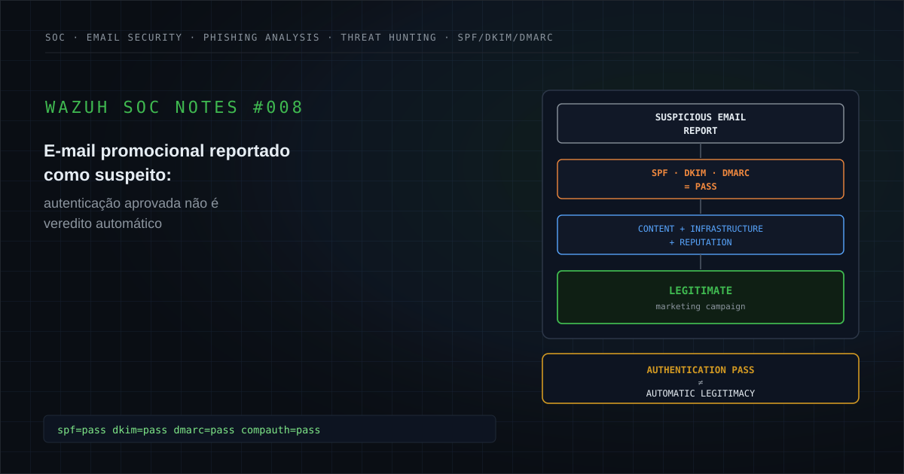

---

## Executive Summary

Durante uma análise de segurança de e-mail, uma mensagem promocional externa reportada por um usuário como potencialmente suspeita foi submetida a investigação técnica.

A análise começou pelos artefatos originais da mensagem:

```text
.eml
HTML Body
Headers
Message Metadata
```

A primeira camada de análise identificou:

```text
SPF = PASS
DKIM = PASS
DMARC = PASS
Composite Authentication = PASS
```

Também foi observada coerência entre:

```text
From
Return-Path
DKIM Signing Domain
SPF Envelope
SMTP Origin
```

A cadeia `Received` era cronologicamente consistente e a infraestrutura de envio apresentava características compatíveis com uma plataforma legítima de automação de marketing.

O corpo da mensagem apresentava:

- conteúdo promocional;
- identidade visual coerente com a campanha;
- CTAs comerciais;
- links de tracking;
- ausência de anexos;
- mecanismo formal de descadastramento;
- `List-Unsubscribe`;
- `List-Unsubscribe-Post`;
- ausência de solicitação de credenciais;
- ausência de urgência relacionada a segurança;
- ausência de solicitação financeira irregular;
- ausência de impersonação interna.

Entretanto, autenticação positiva não foi utilizada como único argumento para conclusão.

A investigação avançou para correlação das URLs, domínio, infraestrutura e reputação utilizando múltiplas fontes externas.

As fontes consultadas não apresentaram evidência atual e corroborada suficiente para sustentar:

```text
Phishing
Malware
Credential Harvesting
Spoofing
Impersonation
Malicious Attachment
Malicious Redirect
```

Um registro reputacional histórico isolado foi identificado durante a investigação.

Esse registro:

```text
Historical Signal
        ≠
Current Campaign Evidence
```

não possuía correlação temporal, técnica ou de payload com a mensagem analisada.

O resultado consolidado demonstrou que o comportamento observado era compatível com uma campanha legítima de marketing distribuída através de infraestrutura especializada de automação de e-mail.

### Classificação final

**Legítimo — comunicação promocional autenticada, sem evidências suficientes de phishing ou atividade maliciosa.**

### Estado das evidências

```text
SPF PASS = Confirmed
DKIM PASS = Confirmed
DMARC PASS = Confirmed
Composite Authentication PASS = Confirmed
SMTP Chain Consistency = Confirmed
Marketing Content = Confirmed
List-Unsubscribe = Confirmed
Tracking Links = Confirmed

Legitimate Marketing Infrastructure = Supported
Legitimate Marketing Campaign = Supported

Credential Harvesting = Not Observed
Malicious Attachment = Not Observed
Sender Impersonation = Not Observed
Financial Fraud Request = Not Observed
Malicious Redirect = Not Observed

Phishing = Not Confirmed
Malware = Not Confirmed
Security Impact = Not Confirmed
```

O principal aprendizado é:

```text
SPF / DKIM / DMARC PASS
        ≠
Automatic Legitimacy

Tracking Links
        ≠
Phishing

Marketing Email
        ≠
Malicious Email
```

O veredito deve ser resultado da correlação completa das evidências.

---

# 1. Contexto do alerta

A investigação começou após um usuário reportar uma mensagem externa como potencialmente suspeita.

A mensagem possuía características capazes de gerar dúvida inicial:

```text
External Sender
Marketing Content
Multiple Links
Tracking Parameters
Promotional CTA
Remote Images
```

Nenhuma dessas características, isoladamente, permite definir a mensagem como phishing.

Da mesma forma, o fato de a mensagem possuir:

```text
SPF PASS
DKIM PASS
DMARC PASS
```

não elimina automaticamente a possibilidade de abuso.

A investigação precisava determinar:

```text
Who actually sent the message?
Was the sender authenticated?
Were the domains aligned?
Was the SMTP chain coherent?
Where did the links lead?
Was there credential harvesting?
Was there impersonation?
Was there malicious infrastructure?
Was the message compatible with legitimate marketing?
```

Para publicação, todas as informações capazes de identificar o ambiente foram sanitizadas.

Exemplo conceitual:

```text
From: <MARKETING_SENDER>@<SANITIZED_DOMAIN>
Return-Path: <MARKETING_SENDER>@<SANITIZED_DOMAIN>
Reply-To: <MARKETING_REPLY>@<SANITIZED_PARENT_DOMAIN>

Source:
<MARKETING_INFRASTRUCTURE_HOST>
<SOURCE_IP>

Destination:
<MICROSOFT_365_ENVIRONMENT>
```

---

# 2. Hipótese inicial

A hipótese inicial foi:

```text
User Reports Email
        ↓
External Marketing Message
        ↓
Multiple Tracking Links
        ↓
Possible Phishing?
```

As possibilidades consideradas incluíam:

### Hipótese A — campanha legítima

```text
Authorized Marketing Infrastructure
        +
Authenticated Sender
        +
Expected Commercial Content
        +
Legitimate Tracking
```

### Hipótese B — spoofing

```text
Brand Identity
        +
Forged Sender
        +
Authentication Failure
```

### Hipótese C — phishing

```text
Brand Identity
        +
Malicious CTA
        +
Credential Harvesting
```

### Hipótese D — malicious redirect

```text
Tracking Link
        ↓
Redirect Chain
        ↓
Malicious Destination
```

### Hipótese E — campanha legítima porém indesejada

```text
Authentic Marketing
        ≠
User Expected Marketing
```

Essa última distinção é importante.

```text
Unwanted
        ≠
Malicious
```

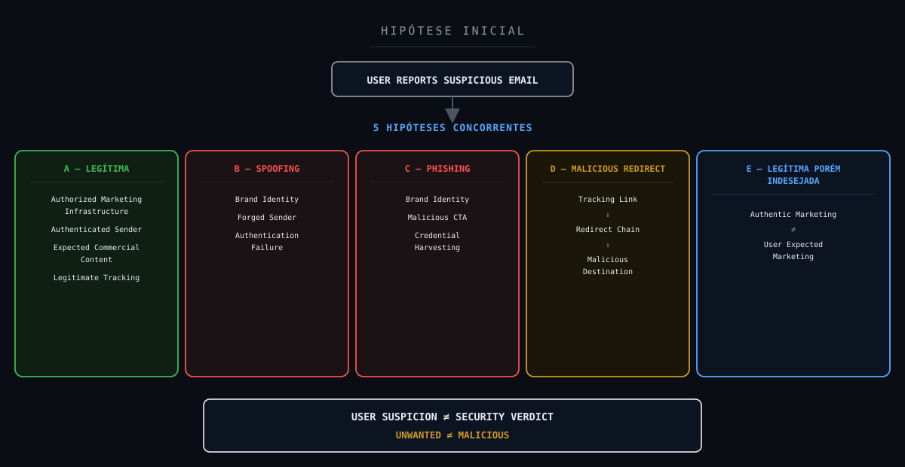

**Objetivo:** demonstrar que o reporte inicia a investigação, mas não define a classificação.

---

# 3. Escopo da investigação

A investigação utilizou quatro artefatos técnicos principais:

```text
Original E-mail
        ↓
Header
        ↓
HTML Body
        ↓
Message Metadata
```

Posteriormente foram adicionadas fontes externas de reputação e infraestrutura.

O escopo buscou responder:

1. Qual era o remetente declarado?
2. Qual era o envelope sender?
3. Qual era o Reply-To?
4. Qual era o primeiro hop externo?
5. O SPF passou?
6. O DKIM passou?
7. O DMARC passou?
8. O Composite Authentication passou?
9. Os domínios estavam alinhados?
10. A cadeia SMTP era cronologicamente coerente?
11. O HELO era compatível?
12. A infraestrutura correspondia a plataforma legítima?
13. Existiam anexos?
14. Existiam executáveis?
15. Existiam documentos suspeitos?
16. Havia solicitação de senha?
17. Havia formulário de autenticação?
18. Havia urgência relacionada a conta?
19. Havia solicitação financeira?
20. Havia impersonação?
21. Os CTAs apontavam para domínios inesperados?
22. Existia encurtador externo?
23. Existia homógrafo?
24. Os links possuíam tracking?
25. O tracking era coerente com plataforma de marketing?
26. Existia mecanismo de unsubscribe?
27. O domínio possuía reputação adversa atual?
28. O IP possuía evidência adversa atual?
29. As URLs possuíam reputação maliciosa?
30. Alguma fonte apresentou malware?
31. Alguma fonte apresentou phishing?
32. Existia correlação entre sinais históricos e a mensagem atual?
33. O conteúdo era coerente com marketing?
34. Existia impacto de segurança?
35. Era necessária contenção?

---

# 4. 5W1H

## What — O que ocorreu?

Um usuário recebeu e reportou como suspeita uma mensagem promocional externa.

## Who — Quem esteve envolvido?

```text
External Marketing Sender
        →
Corporate Recipient
```

Identidades reais foram removidas.

## When — Quando ocorreu?

A mensagem foi recebida dentro da janela analisada.

Timestamps específicos foram sanitizados.

## Where — Onde ocorreu?

A mensagem foi enviada por infraestrutura externa de automação de marketing e recebida através do Microsoft 365.

## Why — Por que foi analisada?

Porque a mensagem continha:

```text
External Sender
Marketing CTA
Tracking URLs
Remote Content
```

e foi reportada pelo destinatário como potencialmente suspeita.

## How — Como ocorreu?

A entrega ocorreu através de infraestrutura SMTP autenticada utilizando controles como:

```text
SPF
DKIM
DMARC
TLS
```

e conteúdo HTML típico de campanha promocional.

---

# 5. Evidências disponíveis

| Evidência | Resultado | Status |
|---|---|---|
| SPF | PASS | Confirmed |
| DKIM | PASS | Confirmed |
| DMARC | PASS | Confirmed |
| Composite Authentication | PASS | Confirmed |
| Cadeia Received coerente | Sim | Confirmed |
| Primeiro hop compatível | Sim | Confirmed |
| From ↔ Return-Path | Coerente | Confirmed |
| From ↔ DKIM | Coerente | Confirmed |
| SPF ↔ primeiro hop | Coerente | Confirmed |
| Conteúdo promocional | Presente | Confirmed |
| Links de tracking | Presentes | Confirmed |
| List-Unsubscribe | Presente | Confirmed |
| List-Unsubscribe-Post | Presente | Confirmed |
| Anexo | Ausente | Confirmed |
| Solicitação de credenciais | Não identificada | Not Observed |
| Impersonação interna | Não identificada | Not Observed |
| Domínio homógrafo | Não identificado | Not Observed |
| Solicitação financeira irregular | Não identificada | Not Observed |
| Redirect malicioso | Não identificado | Not Observed |
| Evidência atual de malware | Não identificada | Not Observed |
| Evidência atual de phishing | Não identificada | Not Observed |
| Infraestrutura legítima de marketing | Evidências convergentes | Supported |
| Campanha legítima | Evidências convergentes | Supported |
| Phishing | Evidência insuficiente | Not Confirmed |
| Malware | Evidência insuficiente | Not Confirmed |
| Impacto de segurança | Não confirmado | Not Confirmed |

---

# 6. Evidence Assessment

## Confirmed / Observed

```text
SPF PASS
DKIM PASS
DMARC PASS
Composite Authentication PASS
SMTP Chain Consistency
Marketing Content
Tracking URLs
List-Unsubscribe
No Attachments
```

## Supported

```text
Legitimate Marketing Infrastructure
Legitimate Marketing Campaign
```

Essas conclusões resultaram da correlação entre múltiplos elementos.

## Inferred

É plausível que o destinatário estivesse incluído em uma lista promocional ou campanha comercial.

A origem exata do cadastro não foi necessária para o veredito de segurança.

## Hypothesis

```text
Possible Phishing
Possible Spoofing
Possible Malicious Tracking
```

foram hipóteses iniciais de investigação.

## Not Observed

Após análise das fontes adequadas:

```text
Credential Harvesting
Malicious Attachment
Brand Impersonation
Suspicious Financial Request
Malicious Redirect
Homograph Domain
Current Corroborated Malware Evidence
```

não foram identificados.

## Not Available

Telemetria de comportamento pós-clique no endpoint do destinatário não fazia parte do conjunto original de evidências.

Isso não compromete o veredito sobre a mensagem, mas delimita o escopo.

## Not Confirmed

```text
Phishing
Malware
Security Compromise
Security Impact
```

não foram confirmados.

## Not Applicable

Frameworks ou conceitos ofensivos sem relação técnica comprovada devem permanecer:

```text
Not Applicable
```

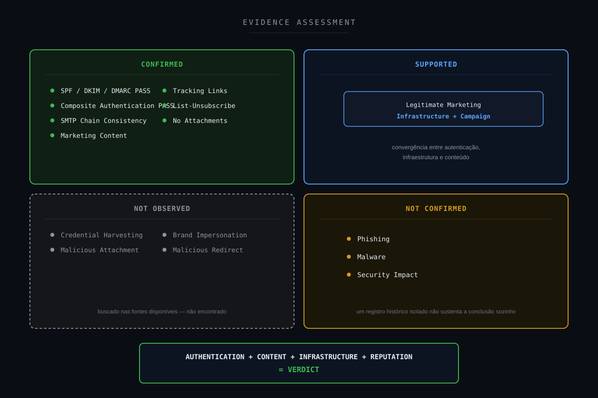

**Objetivo:** demonstrar que o veredito foi resultado do conjunto e não apenas de SPF/DKIM/DMARC.

---

# 7. Timeline

A timeline técnica foi reconstruída a partir dos headers.

De forma sanitizada:

```text
External Marketing Platform
        ↓
SMTP Submission
        ↓
Microsoft 365 Frontend
        ↓
Internal Transport
        ↓
Mailbox
        ↓
User Report
        ↓
SOC Investigation
        ↓
Header Analysis
        ↓
Content Analysis
        ↓
IOC Reputation
        ↓
Final Correlation
        ↓
LEGITIMATE
```

Os hops SMTP eram cronologicamente coerentes.

Não foram observados:

```text
Impossible Time Sequence
Unknown Intermediate Relay
Header Chain Break
Unexpected Sender Infrastructure
```

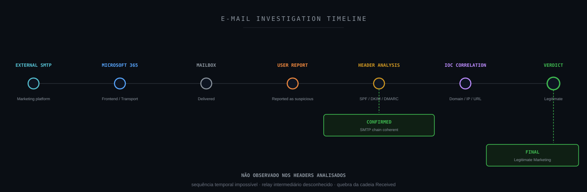

**Objetivo:** mostrar a progressão da mensagem e da investigação.

---

# 8. Análise dos headers

O header foi utilizado para reconstruir a origem técnica.

Os principais elementos foram:

```text
From
Return-Path
Reply-To
Received
Authentication-Results
Received-SPF
DKIM-Signature
Message-ID
List-Unsubscribe
List-Unsubscribe-Post
```

A análise demonstrou:

```text
SPF = PASS
DKIM = PASS
DMARC = PASS
CompAuth = PASS
```

Também foi observada coerência entre os elementos de identidade.

Não havia evidência de:

```text
Forged From
Unexpected Reply-To
Authentication Failure
Suspicious Relay Chain
```

---

# 9. SPF

SPF respondeu à pergunta:

```text
Was the sending infrastructure
authorized to send mail
for the envelope domain?
```

Resultado:

```text
PASS
```

O primeiro hop externo utilizado no transporte era compatível com o endereço validado pelo SPF.

Portanto:

```text
SPF Authorization = Confirmed
```

Mas:

```text
SPF PASS
        ≠
Message Is Safe
```

SPF valida autorização de envio.

Não analisa:

```text
Body
URLs
Intent
Credential Harvesting
Malicious Content
```

---

# 10. DKIM

A assinatura DKIM foi validada.

Resultado:

```text
DKIM = PASS
```

O domínio utilizado para assinatura era coerente com o domínio remetente.

Isso sustenta:

```text
Message Signature Valid
        +
Signing Domain Alignment
```

Mas:

```text
DKIM PASS
        ≠
Benign Content Guaranteed
```

Uma infraestrutura legítima ou conta autorizada ainda pode ser abusada.

Por isso a análise continuou.

---

# 11. DMARC

O DMARC também foi aprovado.

Resultado:

```text
DMARC = PASS
```

A identidade visível do remetente possuía alinhamento suficiente através dos mecanismos de autenticação.

Isso reduz significativamente a hipótese de spoofing simples do domínio.

Entretanto:

```text
DMARC PASS
        ≠
Phishing Impossible
```

Phishing pode utilizar:

```text
Legitimate Domains
Compromised Accounts
Lookalike Domains
Cloud Platforms
Marketing Platforms
```

A autenticação precisa ser interpretada juntamente com o conteúdo.

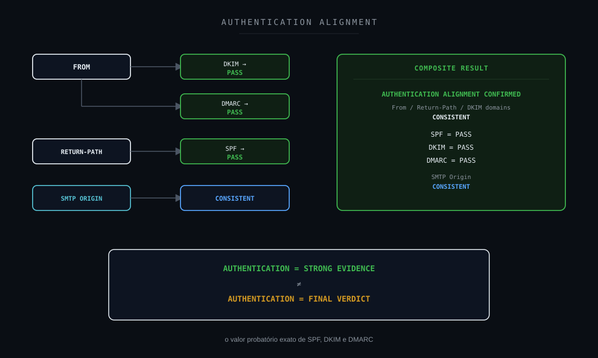

**Objetivo:** explicar exatamente o valor probatório de SPF, DKIM e DMARC.

---

# 12. Composite Authentication

O ambiente Microsoft também registrou:

```text
Composite Authentication = PASS
```

Esse resultado representou evidência adicional favorável à consistência de identidade da mensagem.

Ainda assim, a lógica investigativa permaneceu:

```text
Authentication
        ↓
Identity Confidence
        ↓
Content Analysis
        ↓
URL Analysis
        ↓
Reputation
        ↓
Context
        ↓
Verdict
```

---

# 13. Análise do corpo HTML

O HTML apresentava conteúdo comercial.

Foram identificados:

```text
Promotional Text
Branding
Commercial CTA
Marketing Images
Tracking Links
Navigation Links
Unsubscribe
```

Não foram observados:

```text
Credential Form
Password Request
Account Verification
MFA Request
Security Alert Pretext
Executable Attachment
Invoice Fraud
Bank Account Change
Pix Request
Internal Executive Impersonation
```

O conteúdo HTML era coerente com os demais artefatos.

```text
HTML
        =
EML Content
        =
Message Metadata
```

Não foram encontradas divergências relevantes entre as versões analisadas.

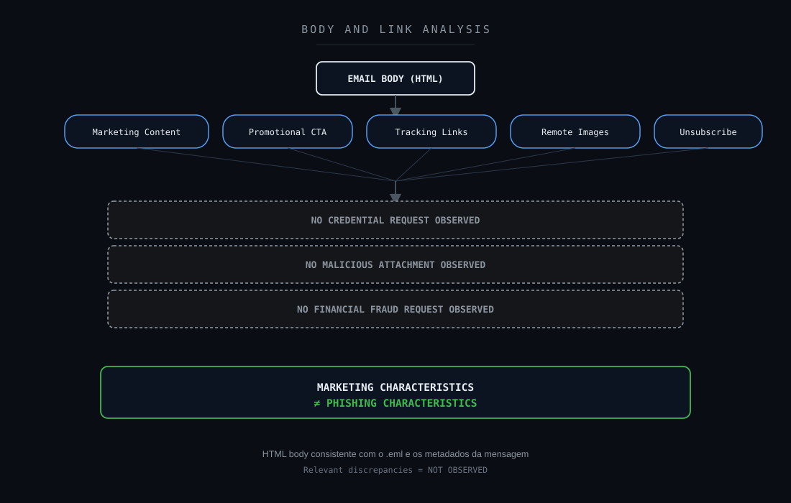

**Objetivo:** demonstrar a diferença entre elementos de marketing e indicadores de fraude.

---

# 14. Tracking Links

Um dos principais elementos capazes de gerar suspeita eram os links de tracking.

Os links utilizavam parâmetros compatíveis com mecanismos de:

```text
Campaign Tracking
Click Attribution
Recipient Personalization
Marketing Analytics
```

Esse comportamento é comum em plataformas de automação de campanhas.

Portanto:

```text
Long Tracking URL
        ≠
Malicious URL
```

O ponto relevante é verificar:

```text
Displayed Domain
Redirect Chain
Final Destination
Infrastructure
Reputation
```

Não simplesmente o tamanho ou complexidade da URL.

---

# 15. List-Unsubscribe

A mensagem incluía mecanismos formais de descadastramento.

Foram observados elementos equivalentes a:

```text
List-Unsubscribe
List-Unsubscribe-Post
```

A presença desses controles é coerente com campanhas comerciais estruturadas.

Entretanto:

```text
List-Unsubscribe
        ≠
Proof of Legitimacy
```

Um atacante também poderia incluir cabeçalhos semelhantes.

O elemento possui valor apenas quando correlacionado com o restante da mensagem.

---

# 16. Infraestrutura de envio

A infraestrutura foi correlacionada com serviço conhecido de automação de marketing.

Elementos observados incluíam:

```text
Marketing Platform Infrastructure
SMTP Host
Authorized SPF IP
Campaign Metadata
Feedback Headers
Tracking Infrastructure
```

A convergência desses elementos sustentou:

```text
Legitimate Marketing Infrastructure = Supported
```

e não simplesmente:

```text
Known Vendor = Automatically Safe
```

O fornecedor tecnológico explica tecnicamente o padrão de entrega.

Não substitui a análise da mensagem.

---

# 17. Threat Intelligence e reputação

A investigação utilizou múltiplas fontes de reputação.

Foram consultadas categorias de ferramentas como:

```text
Domain Reputation
IP Reputation
URL Reputation
WHOIS
DNS
Passive Infrastructure
Public Scanning
Threat Intelligence
Safe Browsing
```

O objetivo não era contar quantos serviços retornavam "clean".

O objetivo era identificar:

```text
Current
Relevant
Corroborated
Technically Related
Evidence
```

As consultas não apresentaram evidência atual e corroborada suficiente para classificar a campanha como maliciosa.

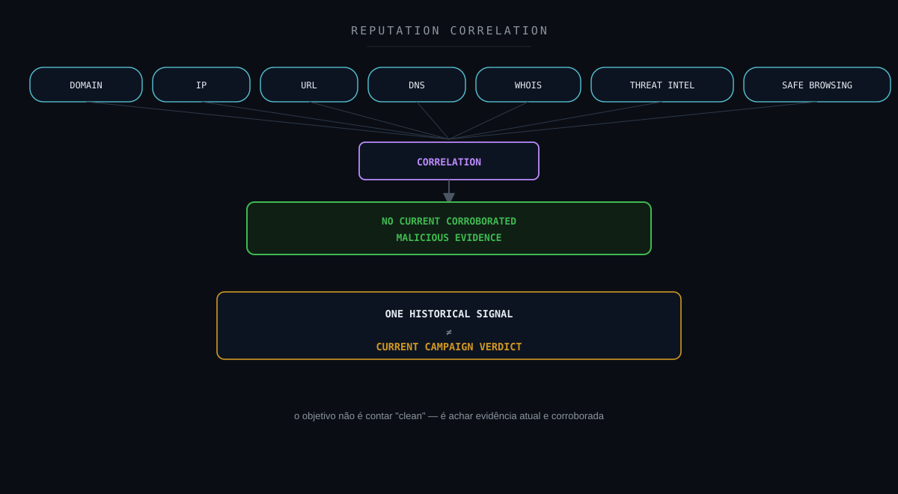

**Objetivo:** representar a diferença entre reputação pontual e correlação contextual.

---

# 18. Registro histórico isolado

Uma fonte reputacional apresentou um registro histórico relacionado à infraestrutura.

Entretanto, o registro era temporalmente distante do evento analisado.

Além disso, não compartilhava:

```text
Current Message-ID
Current Campaign
Current URL
Current Payload
Current Attachment
Current Content
Current Timeline
```

Portanto:

```text
Historical Association
        ≠
Current IOC Correlation
```

A classificação correta foi:

```text
Historical Signal = Observed
Current Relevance = Not Confirmed
```

Esse ponto é importante porque Threat Intelligence precisa respeitar:

```text
Temporal Context
Technical Context
IOC Context
Campaign Context
```

---

# 19. Correlação consolidada

A correlação final apresentou:

```text
SPF PASS
        +
DKIM PASS
        +
DMARC PASS
        +
CompAuth PASS
        +
Aligned Sender Identity
        +
Consistent SMTP Chain
        +
Marketing Infrastructure
        +
Marketing Body
        +
Tracking Consistent with Campaign
        +
Unsubscribe Mechanism
        +
No Credential Harvesting Observed
        +
No Malicious Attachment Observed
        +
No Current Corroborated Malicious Reputation
        ↓
SUPPORTED LEGITIMATE MARKETING
```

Nenhum elemento isolado produziu o veredito.

Foi a convergência das evidências.

---

# 20. Legitimate Marketing vs Phishing

Existem características que podem aparecer nos dois tipos de mensagem.

| Característica | Marketing legítimo | Phishing |
|---|---|---|
| HTML | Comum | Comum |
| Imagens externas | Comum | Comum |
| CTAs | Comum | Comum |
| Tracking | Comum | Pode ocorrer |
| Redirect | Pode ocorrer | Pode ocorrer |
| Domínio autenticado | Comum | Pode ocorrer |
| SPF/DKIM/DMARC PASS | Comum | Também possível |
| Credential Harvesting | Não esperado | Forte indicador |
| Brand Impersonation | Não esperado | Forte indicador |
| Malicious Payload | Não esperado | Forte indicador |
| Fraudulent Urgency | Não esperado | Indicador relevante |

Portanto:

```text
Visual Appearance
        ≠
Verdict
```

e:

```text
Authentication Alone
        ≠
Verdict
```

---

# 21. MITRE ATT&CK

Uma hipótese inicial de phishing poderia lembrar:

```text
T1566 — Phishing
```

Entretanto, o case não apresentou evidência suficiente para sustentar comportamento adversarial.

Portanto:

```text
MITRE ATT&CK T1566
        =
Initial Investigation Hypothesis
```

e não:

```text
Confirmed Adversary Technique
```

Classificação:

```text
MITRE ATT&CK = Not Applicable to Final Verdict
```

Não existe razão técnica para construir uma cadeia ofensiva confirmada.

---

# 22. Attack Flow

Um Attack Flow adversarial não é aplicável.

Não existe evidência suficiente para afirmar:

```text
Phishing
        ↓
User Execution
        ↓
Credential Access
        ↓
Persistence
        ↓
Command and Control
```

O fluxo real é investigativo:

```text
Email Report
        ↓
Header Validation
        ↓
Authentication
        ↓
Content Analysis
        ↓
URL Analysis
        ↓
Reputation
        ↓
Correlation
        ↓
Legitimate
```

Portanto:

```text
Investigation Flow = Applicable
Attack Flow = Not Applicable
```

---

# 23. Framework Mapping

Um framework só entra nesta lista quando há um número, técnica ou controle real e específico que se aplique a este case, não como referência genérica.

### MITRE ATT&CK

**Aplicabilidade: hipótese de investigação (não confirmada).**

```text
T1566 — Phishing
```

Phishing foi hipótese inicial de investigação (Seção 2, Hipótese C); a análise completa não sustentou comportamento adversarial (Seção 21). A técnica permanece hipótese, não confirmação.

### NIST CSF

**Aplicabilidade: direta.**

Principalmente Detect, Respond e Improve.

### NIST SP 800-61

**Aplicabilidade: direta.**

Investigação e resposta ao evento reportado.

### ISO/IEC 27035

**Aplicabilidade: direta.**

Ciclo de 5 fases (Plan & Prepare / Detection & Reporting / Assessment & Decision / Responses / Lessons Learned).

### SANS PICERL

**Aplicabilidade: direta.**

Identification (Seções 8–19) e Lessons Learned (Seções 30 e 32) mapeados diretamente na estrutura deste note. Containment/Eradication não se aplicam, pois nenhuma ameaça real foi confirmada.

### ISO/IEC 27001

**Aplicabilidade: direta.**

Anexo A 5.24–5.28 — controles de gestão de incidente de segurança da informação.

### CIS Controls

**Aplicabilidade: direta.**

```text
CIS 8  — Audit Log Management
CIS 9  — Email and Web Browser Protections
CIS 14 — Security Awareness and Skills Training Program
CIS 17 — Incident Response Management
```

### SOC-CMM

**Aplicabilidade: direta.**

Maturidade do processo de triagem e enriquecimento de e-mail reportado por usuário (Seções 26 e 32).

### Metodologia analítica aplicada

```text
ACH — Analysis of Competing Hypotheses
```

A Seção 2 avalia cinco cenários concorrentes (A: legítima, B: spoofing, C: phishing, D: malicious redirect, E: legítima porém indesejada) e os testa contra a evidência disponível.

```text
Método Científico
```

Hipótese → Evidência → Teste → Conclusão é a estrutura epistêmica de todo o note.

```text
OODA Loop
```

Observe (headers/body/URLs) → Orient (hipótese/evidência) → Decide (veredito) → Act (nenhuma contenção necessária).

**Fora do escopo deste case:** MITRE D3FEND (nenhuma ação defensiva ativa foi empregada — a mensagem foi entregue e avaliada, não bloqueada), MITRE Attack Flow / Cyber Kill Chain (Seção 22 já conclui que não há cadeia adversarial a mapear; o fluxo real deste note é investigativo, não ofensivo), VERIS (nenhum incidente de segurança foi confirmado para classificar), Sigma (nenhuma regra de detecção concreta foi lavrada no note), MITRE Engage e Fight Fraud Framework (sem operação de decepção ou cenário de fraude neste case), COBIT 2019, ITIL 4 e Agile/Kanban (não são frameworks inválidos em si, mas neste case específico não participam materialmente da análise técnica, da estruturação de hipóteses nem do veredito — incluí-los aqui apenas ampliaria o mapa com contexto genérico de gestão, sem relação direta com a evidência do #008).

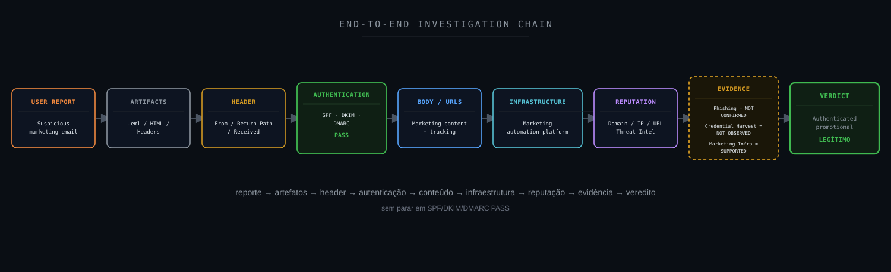

---

# 24. NIST Mapping

O fluxo possui aderência principalmente às funções:

```text
DETECT
RESPOND
IMPROVE
```

### Detect

O usuário identificou comportamento percebido como suspeito e reportou a mensagem.

### Respond

O SOC realizou:

```text
Artifact Collection
Header Analysis
Authentication Validation
Content Analysis
IOC Correlation
Reputation Analysis
Verdict
```

### Improve

A investigação gera conhecimento reutilizável sobre:

```text
Marketing Platforms
Tracking Patterns
Authentication
False Positive Reduction
Email Triage
```

Nenhuma ação de contenção foi necessária porque ameaça não foi confirmada.

---

# 25. CIS Controls

O case possui aderência principalmente a capacidades relacionadas a:

```text
Email and Web Browser Protections
Audit Log Management
Security Awareness
Incident Response
```

Uma capacidade madura de segurança de e-mail precisa combinar:

```text
Authentication
Filtering
Reputation
User Reporting
SOC Analysis
```

Usuários continuarem reportando mensagens suspeitas é desejável.

Um falso positivo de usuário não deve ser tratado como erro operacional.

É parte do mecanismo de defesa.

---

# 26. Detection Strategy

Uma estratégia de análise de e-mail pode ser estruturada em camadas:

```text
STAGE 1
Sender Identity

        ↓

STAGE 2
SPF / DKIM / DMARC

        ↓

STAGE 3
Received Chain

        ↓

STAGE 4
Body Analysis

        ↓

STAGE 5
URL / Attachment Analysis

        ↓

STAGE 6
Infrastructure

        ↓

STAGE 7
Threat Intelligence

        ↓

STAGE 8
Context

        ↓

STAGE 9
Verdict
```

A principal regra é:

```text
Never stop at Authentication.
```

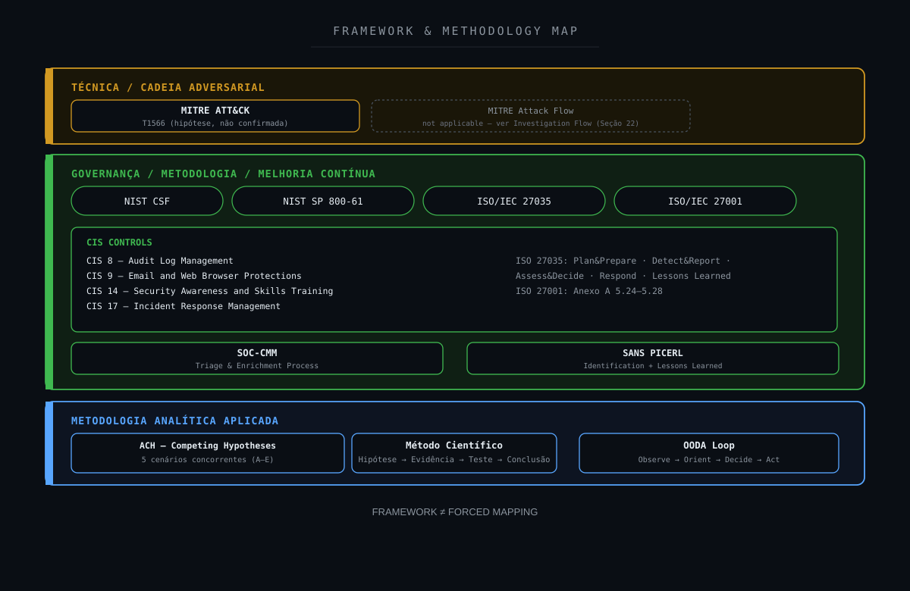

**Objetivo:** mostrar aplicação proporcional dos frameworks.

---

# 27. Detection Gap Analysis

Mesmo com conclusão legítima, existem oportunidades de melhoria.

A análise manual precisou responder:

```text
Is sender infrastructure known?
Is authentication aligned?
Are links expected?
Are redirects benign?
Is this marketing?
Has this campaign appeared before?
Is sender authorized?
```

Uma plataforma enriquecida poderia automatizar parte dessas respostas.

Principal gap:

```text
Email Alert
        ↓
Technical Authentication
        ↓
Missing Business Context
```

O SOC muitas vezes conhece a tecnologia.

Mas não sabe automaticamente:

```text
Did the user subscribe?
Is this campaign expected?
Is this marketing vendor approved?
```

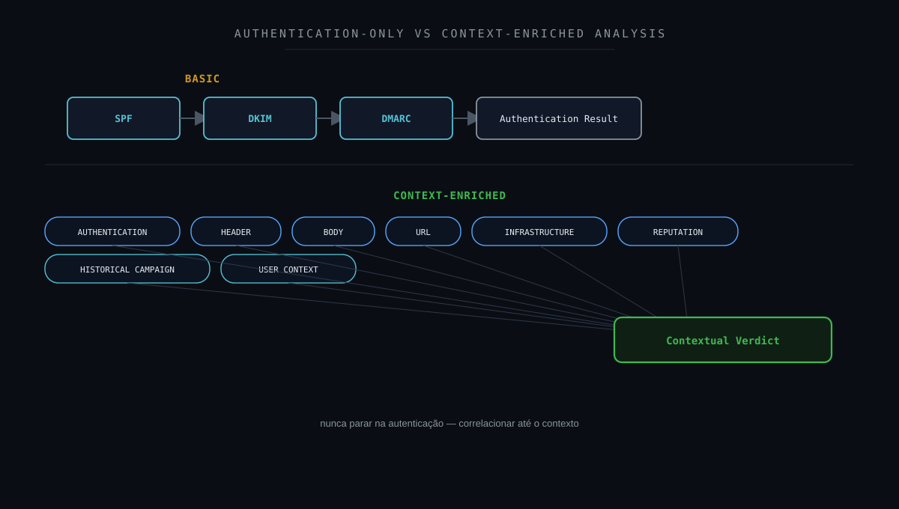

**Objetivo:** demonstrar por que autenticação não deve ser o fim da análise.

---

# 28. Oportunidades de enriquecimento

Uma análise futura pode incluir automaticamente:

```text
Domain Age
Domain Ownership
Sender Reputation
Historical Sender Volume
Campaign Fingerprint
URL Reputation
Redirect Chain
Final Destination
Attachment Hash
Brand Context
User History
Previous Reports
```

Também pode ser útil manter baseline de:

```text
Known Marketing Domains
Known Transactional Platforms
Approved SaaS Senders
Expected Third-Party Mail Platforms
```

Esses dados reduzem tempo de investigação.

---

# 29. Detection Engineering

Uma pipeline de Detection Engineering para e-mail pode utilizar:

```text
HEADER
        ↓
AUTHENTICATION
        ↓
DOMAIN ALIGNMENT
        ↓
INFRASTRUCTURE
        ↓
BODY
        ↓
URL
        ↓
ATTACHMENT
        ↓
REPUTATION
        ↓
CONTEXT
        ↓
RISK SCORE
```

Critérios que aumentariam a suspeita:

```text
Authentication Failure
+
Lookalike Domain
+
Credential CTA
+
Malicious URL Reputation
+
Brand Impersonation
```

Critérios que reduzem a suspeita:

```text
Aligned Authentication
+
Known Marketing Platform
+
Expected Marketing Content
+
Consistent URLs
+
Clean Current Reputation
```

Esses critérios não devem ser tratados como fórmulas absolutas.

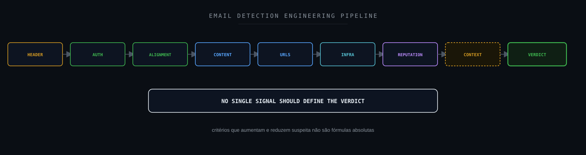

**Objetivo:** representar a estratégia de correlação.

---

# 30. Hardening Opportunities

### Manter SPF corretamente configurado

Reduz spoofing de envelope.

### Implementar DKIM

Permite validação criptográfica da mensagem.

### Aplicar DMARC

Permite política de alinhamento e tratamento.

### Monitorar falhas de autenticação

Especialmente:

```text
SPF Fail
DKIM Fail
DMARC Fail
CompAuth Fail
```

### Proteger usuários

Manter mecanismo simples para reporte de mensagens suspeitas.

### Monitorar URLs

Utilizar análise de redirects e reputação.

### Monitorar anexos

Hash, tipo de arquivo e sandbox quando aplicável.

### Enriquecer remetentes conhecidos

Criar contexto para plataformas legítimas de marketing e SaaS.

### Evitar allowlist ampla

Um domínio autenticado não deve receber confiança irrestrita apenas por reputação histórica.

---

# 31. Defense in Depth

A segurança de e-mail deve utilizar múltiplas camadas.

```text
DNS AUTHENTICATION
        ↓
MAIL GATEWAY
        ↓
ANTI-SPAM
        ↓
ANTI-PHISHING
        ↓
URL PROTECTION
        ↓
ATTACHMENT ANALYSIS
        ↓
USER AWARENESS
        ↓
USER REPORTING
        ↓
SOC
```

Nenhuma camada isolada é suficiente.

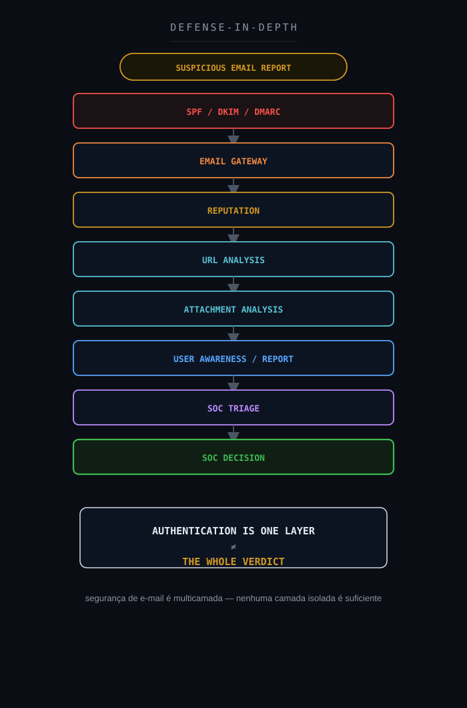

**Objetivo:** mostrar a natureza multicamada da segurança de e-mail.

---

# 32. Métricas operacionais

Métricas relevantes incluem:

### MTTD

Tempo até a mensagem suspeita ser identificada/reportada.

### MTTA

Tempo até o SOC iniciar análise.

### MTTR

Tempo até conclusão e comunicação do veredito.

### False Positive Rate

Percentual de mensagens reportadas que são posteriormente classificadas como legítimas.

### User Reporting Rate

Quantidade de reportes realizados pelos usuários.

### Authentication Coverage

Percentual de domínios com:

```text
SPF
DKIM
DMARC
```

### Automated Enrichment Coverage

Percentual de análises com enriquecimento automático de:

```text
URL
Domain
IP
Sender
Reputation
```

### Verdict Confidence

Nível de confiança da classificação final.

Métricas operacionais reais não devem ser publicadas.

---

# 33. Decision Flow

```text
EMAIL REPORTED
        ↓
AUTHENTICATION VALID?
        ├── NO
        │    ↓
        │  Investigate Spoofing / Misconfiguration
        │
        └── YES
             ↓
DOMAIN ALIGNMENT CONSISTENT?
        ├── NO → Investigate Identity Mismatch
        └── YES
             ↓
CONTENT SUSPICIOUS?
        ├── YES → Analyze Intent
        └── NO
             ↓
URL / ATTACHMENT SUSPICIOUS?
        ├── YES → Dynamic / Reputation Analysis
        └── NO
             ↓
INFRASTRUCTURE CONSISTENT?
        ├── NO → Escalate Analysis
        └── YES
             ↓
CURRENT MALICIOUS REPUTATION?
        ├── YES → Correlate Evidence
        └── NO
             ↓
MARKETING CONTEXT SUPPORTED?
        ├── YES → LEGITIMATE
        └── NO  → CONTINUE VALIDATION
```

Importante:

```text
SPF PASS
        ↓
LEGITIMATE
```

não deve existir como caminho direto.

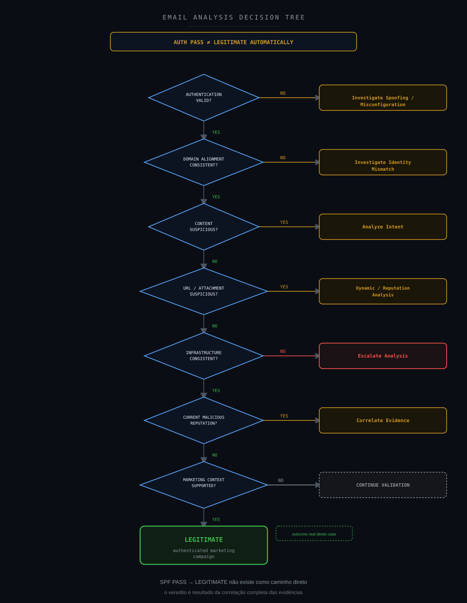

**Objetivo:** transformar a metodologia em fluxo reutilizável.

---

# 34. Veredito técnico

### SPF

```text
Confirmed — PASS
```

### DKIM

```text
Confirmed — PASS
```

### DMARC

```text
Confirmed — PASS
```

### Composite Authentication

```text
Confirmed — PASS
```

### Sender Alignment

```text
Confirmed
```

### SMTP Chain

```text
Confirmed — Consistent
```

### Marketing Content

```text
Confirmed
```

### Tracking Links

```text
Confirmed
```

### List-Unsubscribe

```text
Confirmed
```

### Marketing Infrastructure

```text
Supported
```

### Legitimate Marketing Campaign

```text
Supported
```

### Credential Harvesting

```text
Not Observed
```

### Malicious Attachment

```text
Not Observed
```

### Brand Impersonation

```text
Not Observed
```

### Homograph Domain

```text
Not Observed
```

### Malicious Redirect

```text
Not Observed
```

### Current Corroborated Phishing Evidence

```text
Not Observed
```

### Phishing

```text
Not Confirmed
```

### Malware

```text
Not Confirmed
```

### Security Impact

```text
Not Confirmed
```

## Classificação final

**Legítimo — comunicação promocional autenticada e coerente com campanha de marketing, sem evidências suficientes de phishing, malware, spoofing ou comprometimento.**

Não foi necessária contenção de segurança.

Caso o destinatário não deseje receber comunicações desse tipo, isso deve ser tratado como:

```text
Marketing Preference / Unsubscribe
```

e não como incidente de segurança.

---

# 35. Investigation Flow — visão final

```text
USER REPORT
        ↓
SUSPICIOUS EMAIL
        ↓
ARTIFACT COLLECTION
        ↓
HEADER ANALYSIS
        ↓
SPF PASS
DKIM PASS
DMARC PASS
COMPAUTH PASS
        ↓
ALIGNMENT ANALYSIS
        ↓
CONSISTENT
        ↓
BODY ANALYSIS
        ↓
MARKETING CONTENT
        ↓
URL ANALYSIS
        ↓
TRACKING CONTEXT
        ↓
INFRASTRUCTURE ANALYSIS
        ↓
MARKETING PLATFORM SUPPORTED
        ↓
REPUTATION CORRELATION
        ↓
NO CURRENT CORROBORATED
MALICIOUS EVIDENCE
        ↓
EVIDENCE ASSESSMENT
        ↓
PHISHING NOT CONFIRMED
MALWARE NOT CONFIRMED
        ↓
FINAL VERDICT
LEGITIMATE
```

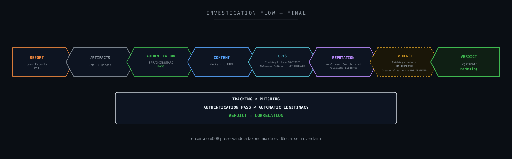

**Objetivo:** encerrar o case demonstrando a metodologia completa de análise.

---

# 36. Referências técnicas

## Microsoft

Microsoft Defender for Office 365

Microsoft Exchange Online Protection

Email authentication in Microsoft 365

## RFC 5321

Simple Mail Transfer Protocol — SMTP.

Aplicação:

```text
SMTP Transport
Received Chain
```

## RFC 5322

Internet Message Format.

Aplicação:

```text
From
To
Subject
Message-ID
Header Structure
```

## RFC 6376

DomainKeys Identified Mail — DKIM.

Aplicação:

```text
DKIM Signature Validation
```

## RFC 7208

Sender Policy Framework — SPF.

Aplicação:

```text
Sender Authorization
```

## RFC 7489

Domain-based Message Authentication, Reporting and Conformance — DMARC.

Aplicação:

```text
Authentication Alignment
DMARC Policy
```

## RFC 8058

Signaling One-Click Functionality for List Email Headers.

Aplicação:

```text
List-Unsubscribe-Post
One-Click Unsubscribe
```

## NIST

NIST Cybersecurity Framework

NIST SP 800-61 Rev. 3

## MITRE ATT&CK

T1566 — Phishing

Utilizado somente como hipótese investigativa inicial.

Nenhuma atividade adversarial foi confirmada.

## CIS

CIS Controls

Especialmente capacidades relacionadas a proteção de e-mail, navegação, logs e resposta.

## SANS

SANS Incident Handler's Handbook — PICERL (Preparation, Identification, Containment, Eradication, Recovery, Lessons Learned).

---

# Disclaimer

Este estudo foi sanitizado para preservar a confidencialidade do ambiente originalmente analisado.

Foram removidos, generalizados ou substituídos:

```text
Organization Names
Recipient Identity
Recipient E-mail
Sender Address
Real Domain
Source IP
Message-ID
Internal Microsoft 365 Identifiers
Conversation IDs
Exact Timestamps
Campaign Identifiers
Tracking Identifiers
Internal Environment Information
```

A marca comercial originalmente presente na mensagem também não é necessária para compreensão técnica do estudo.

Os elementos preservados são exclusivamente aqueles necessários para explicar:

```text
SPF
DKIM
DMARC
Composite Authentication
SMTP
Marketing Infrastructure
Tracking
URL Analysis
Threat Intelligence
Evidence Correlation
```

A aprovação de SPF, DKIM e DMARC não foi utilizada isoladamente como prova de legitimidade.

Da mesma forma, parâmetros de tracking, múltiplas URLs ou conteúdo promocional não foram utilizados isoladamente como evidência de phishing.

O estudo diferencia explicitamente:

```text
Authenticated
        ≠
Legitimate

Tracking
        ≠
Malicious

Reported
        ≠
Confirmed Threat

Historical Reputation
        ≠
Current Campaign Evidence

Not Observed
        ≠
Not Available

Not Confirmed
        ≠
Did Not Happen
```

O veredito foi produzido através da correlação das evidências técnicas disponíveis.

As investigações, decisões técnicas e veredictos apresentados neste estudo refletem experiência prática real do autor. Ferramentas de Inteligência Artificial foram utilizadas como apoio para formatação, diagramação e publicação do conteúdo, não para a condução da investigação em si.

O objetivo desta publicação é compartilhar metodologia de:

- Email Security;
- Phishing Analysis;
- Incident Response;
- Threat Hunting;
- Threat Intelligence;
- Detection Engineering;
- análise de headers;
- validação SPF/DKIM/DMARC;
- análise de URLs;
- classificação de evidências;
- redução de falsos positivos;
- melhoria contínua em operações SOC.

Este projeto é independente e não representa documentação oficial do Wazuh, Microsoft, MITRE, NIST, CIS ou das demais organizações mencionadas.

---

# Wazuh SOC Notes

**Segurança não termina no primeiro indicador. O veredito nasce da correlação entre identidade, infraestrutura, conteúdo, comportamento e contexto.**
