# Wazuh SOC Notes #009: Administrative Shares ≠ Lateral Movement, investigando RPC, SMB e ausência de evidência

**SOC | Threat Hunting | Incident Response | Detection Engineering | Windows | Sysmon | RPC | SMB | Administrative Shares | Wazuh | MITRE ATT&CK**

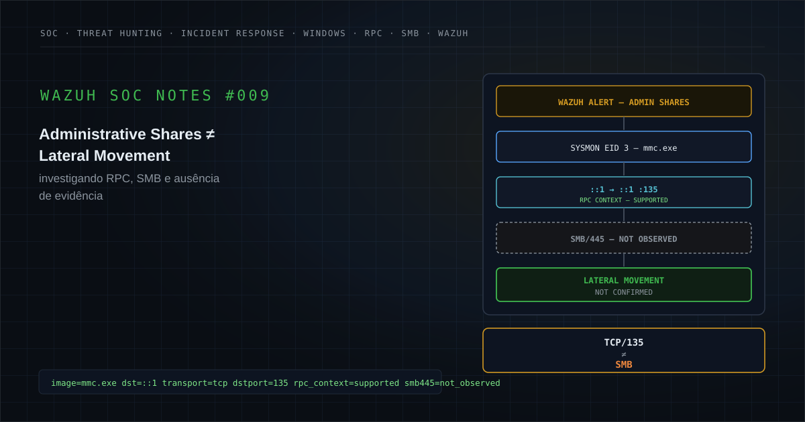

🔗 [Publicado no LinkedIn](https://www.linkedin.com/posts/felipe-r-amaral_wazuh-soc-ir-share-7498855552547008512-IhwX)

---

## Executive Summary

Um alerta de segurança relacionado a possível acesso suspeito a **Windows Administrative Shares** foi investigado após uma detecção baseada em telemetria do **Sysmon Event ID 3: Network Connection**.

O evento registrava:

```text
Process:
C:\Windows\System32\mmc.exe

Source:
IPv6 Loopback ::1
Ephemeral Source Port

Destination:
IPv6 Loopback ::1

Destination Port:
135/TCP

Destination Service:
RPC Endpoint Mapper
```

O ponto mais importante da evidência era o destino:

```text
::1
```

O endereço IPv6 `::1` representa **loopback local**.

Portanto, a conexão observada ocorria:

```text
HOST
  ↓
LOCAL RPC
  ↓
SAME HOST
```

e não:

```text
HOST A
  ↓
NETWORK
  ↓
HOST B
```

A porta de destino também era relevante:

```text
135/TCP
```

associada ao **Microsoft RPC Endpoint Mapper**.

O alerta, entretanto, possuía relação analítica com:

```text
MITRE ATT&CK
T1021.002
SMB/Windows Admin Shares
```

Isso exigiu uma validação cuidadosa.

A investigação precisava responder se a telemetria realmente sustentava:

```text
SMB Communication
Administrative Share Access
Remote Host Interaction
Lateral Movement
```

Dentro do evento analisado:

```text
mmc.exe associated with network event = Confirmed
IPv6 Loopback = Confirmed
TCP/135 = Confirmed
Local RPC Context = Supported

TCP/445 Communication = Not Observed
Remote Destination = Not Observed

Administrative Share Access = Not Confirmed
C$ Access = Not Confirmed
ADMIN$ Access = Not Confirmed
IPC$ Access = Not Confirmed
Remote Authentication = Not Confirmed
Lateral Movement = Not Confirmed
Compromise = Not Confirmed
```

Além disso, a evidência original não apresentava contexto suficiente para determinar:

```text
MMC Console / Snap-in
Command Line
Parent Process
Full Process Lineage
Broader Administrative Context
```

Esses elementos permaneceram:

```text
Not Available
```

A conclusão técnica foi que o evento observado era **muito mais compatível com comunicação RPC local de um componente legítimo do Windows do que com acesso confirmado a Administrative Shares**.

### Classificação final

**Forte indício de Falso Positivo: comunicação RPC local associada ao `mmc.exe`, sem evidência no evento analisado de SMB/445, destino remoto ou acesso confirmado a Windows Administrative Shares.**

A classificação preserva uma limitação material:

> o console/snap-in responsável pelo comportamento e o contexto completo de execução do `mmc.exe` não estavam disponíveis na evidência original.

### Principal aprendizado

```text
Port 135
        ≠
SMB

Admin Share Alert
        ≠
Admin Share Access

Local RPC
        ≠
Lateral Movement

MITRE Mapping
        ≠
Confirmed Technique
```

---

# 1. Contexto do alerta

A investigação começou após o Wazuh gerar um alerta relacionado a possível acesso suspeito a compartilhamentos administrativos do Windows.

A fonte técnica utilizada pela detecção era:

```text
Sysmon Event ID 3
Network Connection
```

O evento apresentava um processo legítimo do Windows:

```text
C:\Windows\System32\mmc.exe
```

associado a uma conexão TCP.

Uma representação sanitizada do evento seria:

```text
Image:
C:\Windows\System32\mmc.exe

ProcessId:
<PROCESS_ID>

User:
<DOMAIN>\<USER>

Protocol:
tcp

SourceIp:
::1

SourcePort:
<EPHEMERAL_PORT>

DestinationIp:
::1

DestinationPort:
135
```

O alerta sugeria possível comportamento relacionado a:

```text
Windows Administrative Shares
```

e possuía associação com:

```text
MITRE ATT&CK T1021.002
SMB/Windows Admin Shares
```

Entretanto, a análise de um alerta não deve começar pela descrição da regra.

Deve começar pela telemetria.

A pergunta passou a ser:

```text
What actually happened?
```

---

# 2. Hipótese inicial

A hipótese inicial era:

> **possível utilização de compartilhamentos administrativos do Windows como mecanismo de movimentação lateral.**

Essa hipótese é tecnicamente relevante porque Administrative Shares como:

```text
C$
ADMIN$
IPC$
```

podem participar de atividades administrativas legítimas e também de operações adversariais.

Exemplos de contexto suspeito poderiam incluir:

```text
Remote Authentication
        ↓
SMB/445
        ↓
Administrative Share
        ↓
Remote File Transfer
        ↓
Remote Service / Execution
```

Entretanto, o evento disponível apresentava:

```text
mmc.exe
        ↓
::1
        ↓
TCP/135
```

A hipótese inicial, portanto, precisava ser testada.

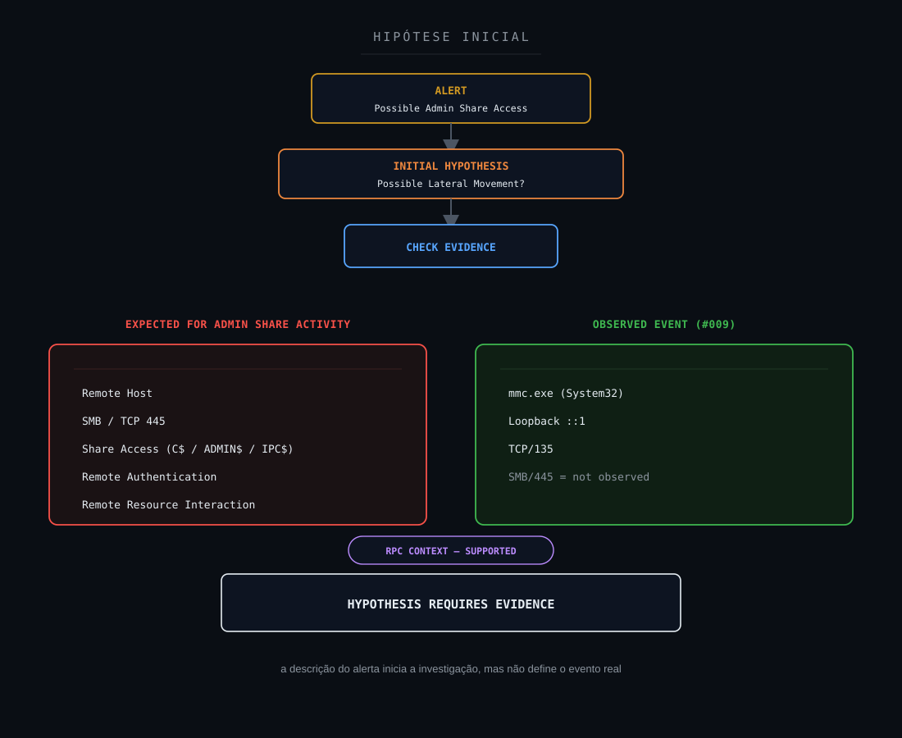

**Objetivo:** mostrar que a descrição do alerta inicia a investigação, mas não define o evento real.

---

# 3. Escopo da investigação

O escopo foi definido para responder:

1. Qual processo originou a conexão?
2. O binário estava em path compatível com Windows?
3. Qual era o endereço de origem?
4. Qual era o endereço de destino?
5. A comunicação era local ou remota?
6. Qual porta foi utilizada?
7. A porta correspondia a RPC ou SMB?
8. Existia tráfego TCP/445?
9. Existia destino remoto?
10. Existia autenticação remota?
11. Existia evidência de acesso a `C$`?
12. Existia evidência de acesso a `ADMIN$`?
13. Existia evidência de acesso a `IPC$`?
14. Existiam eventos Windows de share access?
15. Existia criação de serviço remoto?
16. Existia uso de PsExec?
17. Existia uso de WMI remoto?
18. Existia criação de processo remoto?
19. Existia transferência de arquivo?
20. Existiam credenciais alternativas?
21. Qual usuário executava o processo?
22. Qual era o processo pai?
23. Qual era a command line?
24. Qual MMC console ou snap-in estava carregado?
25. O comportamento era administrativo esperado?
26. Existiam eventos semelhantes no mesmo ativo?
27. Existiam eventos semelhantes em outros ativos?
28. O mapeamento MITRE era sustentado pela evidência?
29. A detecção estava excessivamente ampla?
30. A regra poderia ser refinada?

---

# 4. 5W1H

## What: O que ocorreu?

Foi registrada uma conexão TCP associada ao processo legítimo:

```text
C:\Windows\System32\mmc.exe
```

com destino à porta:

```text
135/TCP
```

do próprio equipamento através de IPv6 loopback.

## Who: Quem esteve envolvido?

O evento possuía contexto de usuário associado ao processo.

Para publicação:

```text
<DOMAIN>\<USER>
```

O usuário real foi removido.

## When: Quando ocorreu?

O evento foi registrado dentro da janela analisada.

O timestamp exato foi removido.

## Where: Onde ocorreu?

A comunicação ocorreu entre:

```text
::1
        →
::1
```

Ou seja:

```text
LOCAL HOST
        →
LOCAL HOST
```

## Why: Por que era relevante?

Porque a regra correlacionava o comportamento com possível acesso a Windows Administrative Shares e com uma técnica relacionada a SMB.

Caso real, isso poderia indicar:

```text
Remote Administration
Lateral Movement
Administrative Share Abuse
```

## How: Como foi detectado?

Por meio do:

```text
Sysmon Event ID 3
Network Connection
```

ingerido e correlacionado pelo Wazuh.

---

# 5. Evidências disponíveis

| Evidência | Fonte | Classificação |
|---|---|---|
| `mmc.exe` associado ao evento de rede | Sysmon EID 3 | Confirmed |
| Path `C:\Windows\System32\mmc.exe` | Sysmon EID 3 | Confirmed |
| Comunicação TCP | Sysmon EID 3 | Confirmed |
| Origem `::1` | Sysmon EID 3 | Confirmed |
| Destino `::1` | Sysmon EID 3 | Confirmed |
| Porta de destino 135 | Sysmon EID 3 | Confirmed |
| Contexto loopback local | Interpretação da telemetria | Supported |
| Contexto RPC Endpoint Mapper | Porta/protocolo | Supported |
| Destino remoto | Evento analisado | Not Observed |
| Comunicação TCP/445 | Evento analisado | Not Observed |
| Acesso a `C$` | Evidência disponível | Not Confirmed |
| Acesso a `ADMIN$` | Evidência disponível | Not Confirmed |
| Acesso a `IPC$` | Evidência disponível | Not Confirmed |
| Sessão SMB | Evidência disponível | Not Confirmed |
| Autenticação remota | Evidência disponível | Not Confirmed |
| Movimentação lateral | Evidência disponível | Not Confirmed |
| Comprometimento | Evidência disponível | Not Confirmed |
| Command line completa | Evidência original | Not Available |
| Processo pai | Evidência original | Not Available |
| MMC console/snap-in | Evidência original | Not Available |
| Process tree completa | Evidência original | Not Available |

O primeiro resultado importante foi:

```text
The alert was real.
```

O segundo:

```text
The alert description was broader
than the evidence actually demonstrated.
```

---

# 6. Evidence Assessment

## Confirmed / Observed

```text
mmc.exe
System32 path
TCP connection
Source ::1
Destination ::1
Destination Port 135
```

## Supported

```text
Local Loopback Communication
RPC Endpoint Mapper Context
Legitimate Windows Administrative Component Context
```

O último item deve ser interpretado com cautela:

```text
Legitimate Binary
        ≠
Legitimate Behavior Automatically
```

## Inferred

Uma operação realizada através de um MMC snap-in poderia explicar a comunicação local RPC.

Entretanto:

```text
Specific MMC Snap-in = Not Available
```

Portanto, isso permanece uma inferência.

## Hypothesis

```text
Administrative Share Abuse
Possible Lateral Movement
```

foram hipóteses de investigação.

## Not Observed

Dentro do evento analisado:

```text
Remote Destination
TCP/445
```

não foram observados.

## Not Available

```text
Command Line
Parent Process
Full Process Lineage
MMC Snap-in
Broader Administrative Context
```

não estavam disponíveis na evidência original.

## Not Confirmed

```text
SMB Session
C$ Access
ADMIN$ Access
IPC$ Access
Remote Authentication
Remote Execution
Lateral Movement
Compromise
```

não foram confirmados.

## Not Applicable

Qualquer framework ou técnica ofensiva sem aderência demonstrável deve permanecer:

```text
Not Applicable
```

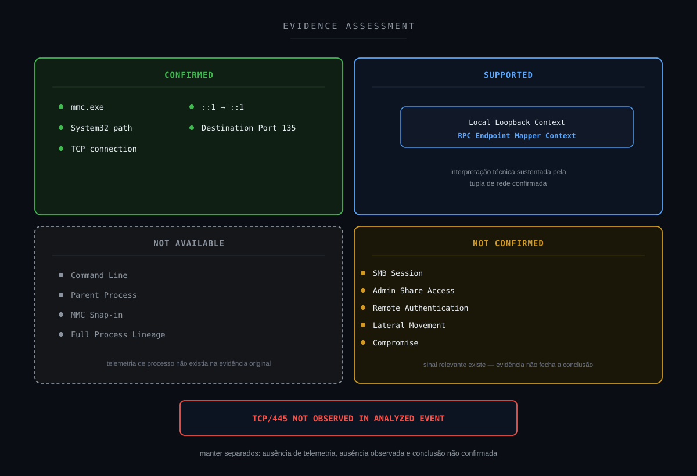

**Objetivo:** manter claramente separadas ausência de telemetria, ausência observada e conclusão não confirmada.

---

# 7. Timeline da investigação

A investigação pode ser representada assim:

```text
Wazuh Alert
        ↓
Possible Admin Share Activity
        ↓
Inspect Original Sysmon Event
        ↓
Process = mmc.exe
        ↓
Inspect Network Tuple
        ↓
Source = ::1
Destination = ::1
        ↓
Destination Port = 135
        ↓
Local RPC Context Identified
        ↓
Check SMB Indicators
        ↓
TCP/445 Not Observed
        ↓
Admin Share Access Not Confirmed
        ↓
Lateral Movement Not Confirmed
        ↓
Telemetry Limitations Recorded
        ↓
Detection Refinement Considered
```

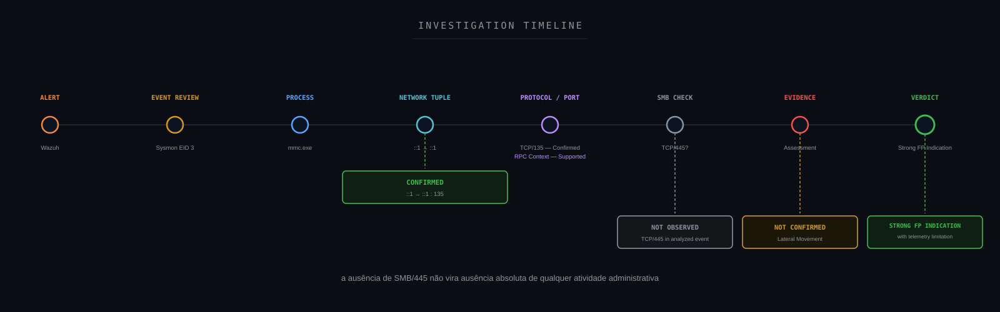

**Objetivo:** mostrar a progressão da análise sem converter ausência de SMB em ausência absoluta de qualquer atividade administrativa.

---

# 8. Sysmon Event ID 3

O **Sysmon Event ID 3** registra conexões de rede associadas a processos.

Ele pode fornecer elementos como:

```text
ProcessId
Image
User
Protocol
SourceIp
SourcePort
DestinationIp
DestinationPort
```

Nesse case, o EID 3 foi particularmente útil porque permitiu correlacionar:

```text
PROCESS
        +
NETWORK
```

A evidência permitiu observar:

```text
mmc.exe
        ↓
TCP
        ↓
::1
        ↓
135
```

Entretanto, Event ID 3 sozinho não responde:

```text
Which MMC snap-in?
Which administrative action?
Which share?
Which file?
Which remote service?
```

Esse é um exemplo importante de limite de telemetria.

---

# 9. O que é mmc.exe?

`mmc.exe` é o executável do **Microsoft Management Console**.

Ele funciona como uma estrutura para carregar consoles e snap-ins administrativos.

Exemplos de funções administrativas que podem utilizar MMC incluem:

```text
Computer Management
Event Viewer
Services
Certificates
Device Management
Group Policy-related consoles
Other Administrative Snap-ins
```

Portanto:

```text
mmc.exe
```

em:

```text
C:\Windows\System32\
```

é compatível com um componente legítimo do Windows.

Mas:

```text
Legitimate Binary
        ≠
Legitimate Activity Automatically
```

Um processo legítimo ainda precisa ser analisado no contexto de:

```text
Parent Process
Command Line
User
Loaded Snap-in
Network Behavior
Target
```

No #009:

```text
mmc.exe = Confirmed
Specific Snap-in = Not Available
```

---

# 10. IPv6 Loopback ::1

O endereço:

```text
::1
```

é o equivalente IPv6 de:

```text
127.0.0.1
```

Ele representa loopback local.

Portanto:

```text
::1 → ::1
```

indica que origem e destino pertencem ao mesmo sistema.

Isso muda radicalmente a interpretação do alerta.

Movimentação lateral normalmente pressupõe interação entre sistemas distintos:

```text
HOST A
        →
HOST B
```

O evento analisado apresentava:

```text
HOST A
        →
HOST A
```

Portanto:

```text
Remote Destination = Not Observed
```

na conexão investigada.

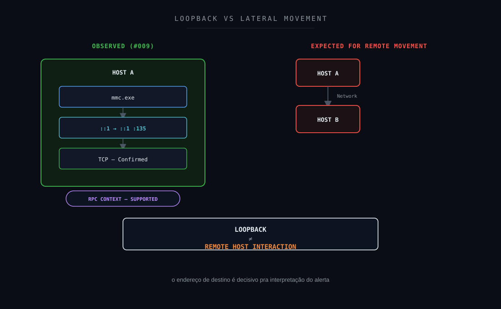

**Objetivo:** explicar visualmente por que o endereço de destino é decisivo.

---

# 11. TCP/135 e RPC Endpoint Mapper

A porta:

```text
135/TCP
```

é tradicionalmente associada ao **Microsoft RPC Endpoint Mapper**.

Em operações Windows baseadas em RPC, clientes podem consultar o Endpoint Mapper para localizar endpoints de serviços RPC.

Isso significa que:

```text
TCP/135
```

pode aparecer em uma ampla variedade de operações administrativas legítimas.

O erro seria converter:

```text
Port 135
```

diretamente em:

```text
SMB
```

porque SMB utiliza principalmente:

```text
TCP/445
```

em ambientes modernos.

Portanto:

```text
RPC
        ≠
SMB
```

e:

```text
TCP/135
        ≠
Administrative Share Access
```

---

# 12. RPC vs SMB

Essa distinção é central no case.

## RPC

Pode ser utilizado para:

```text
Remote Procedure Calls
Service Management
Management Interfaces
Endpoint Discovery
Windows Administrative Operations
```

## SMB

Pode ser utilizado para:

```text
File Sharing
Named Pipes
Windows Shares
Administrative Shares
Remote File Operations
```

As duas tecnologias podem coexistir em determinadas operações administrativas.

Mas são protocolos e evidências diferentes.

Um fluxo adversarial envolvendo administrative shares poderia apresentar:

```text
Authentication
        ↓
TCP/445
        ↓
SMB Session
        ↓
C$ / ADMIN$ / IPC$
        ↓
Remote Resource Interaction
```

No evento investigado:

```text
TCP/135 = Confirmed
TCP/445 = Not Observed
Administrative Share Access = Not Confirmed
```

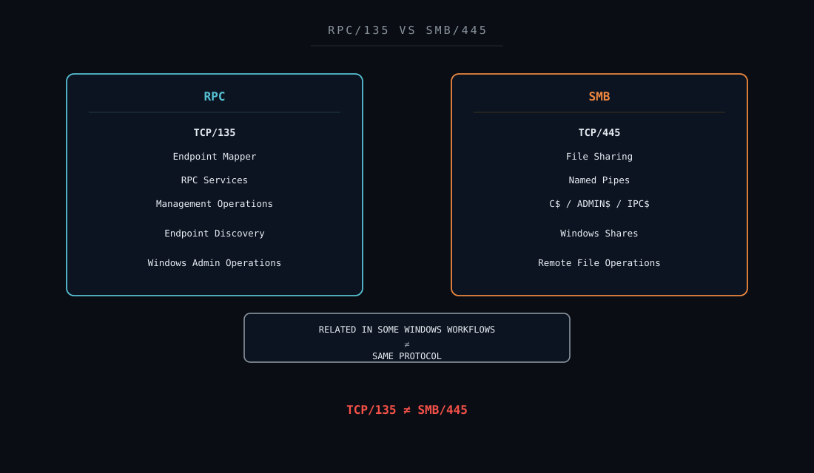

**Objetivo:** eliminar visualmente a associação automática entre RPC e Administrative Shares.

---

# 13. Windows Administrative Shares

O Windows cria determinados compartilhamentos administrativos para funções de administração.

Exemplos clássicos:

```text
C$
ADMIN$
IPC$
```

### C$

Compartilhamento administrativo da unidade do sistema.

### ADMIN$

Normalmente associado ao diretório Windows.

### IPC$

Utilizado para comunicação entre processos e mecanismos como named pipes.

Esses recursos possuem uso legítimo.

Mas também podem participar de:

```text
Lateral Movement
Remote Administration
Tool Transfer
Remote Execution Workflows
```

Para afirmar acesso a uma share administrativa, é necessário encontrar evidência apropriada.

Exemplos:

```text
SMB Session
Share Access Event
Share Name
Remote Host
Remote Authentication
File Operation
```

No evento analisado:

```text
Share Name = Not Available
Admin Share Access = Not Confirmed
```

---

# 14. Evidência necessária para confirmar Administrative Share Access

Uma detecção com maior fidelidade deveria buscar correlação com eventos como:

```text
Windows Security Event ID 5140
A network share object was accessed
```

e:

```text
Windows Security Event ID 5145
A network share object was checked
to see whether client can be granted access
```

Quando disponíveis, esses eventos podem fornecer contexto sobre:

```text
Share Name
Share Path
Source Address
Account
Access Mask
Relative Target Name
```

Também são importantes:

```text
4624
Successful Logon

4625
Failed Logon
```

e eventos de processo, serviço e rede.

Uma cadeia de maior confiança poderia ser:

```text
4624
Remote Authentication
        +
5140 / 5145
Administrative Share
        +
TCP/445
SMB
        +
Process / Service Evidence
        ↓
HIGHER CONFIDENCE
```

O #009 não possuía essa cadeia confirmada.

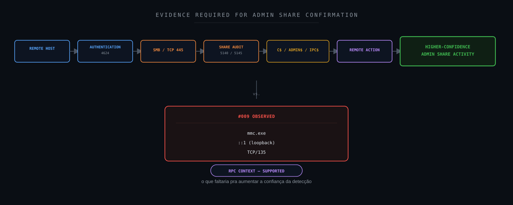

**Objetivo:** mostrar quais evidências faltariam para aumentar a confiança.

---

# 15. Threat Hunting

A investigação pode ser ampliada por hunting.

## Buscar conexões SMB

```text
destination.port:445
```

ou, dependendo da estrutura do índice:

```text
full_log:*DestinationPort* AND full_log:*445*
```

## Mesmo processo

```text
process.image:*\\mmc.exe
```

## Mesmo ativo + TCP/445

```text
host.name:<HOST> AND destination.port:445
```

## Windows Share Access

```text
event.code:(5140 OR 5145)
```

## Administrative Shares

```text
event.code:(5140 OR 5145) AND
(
  win.eventdata.shareName:*C$* OR
  win.eventdata.shareName:*ADMIN$* OR
  win.eventdata.shareName:*IPC$*
)
```

## Remote logons

```text
event.code:4624
```

com análise de:

```text
LogonType
IpAddress
TargetUserName
WorkstationName
```

## Process Creation

```text
event.code:1
```

quando Sysmon Process Creation estiver disponível.

O objetivo não é simplesmente procurar mais eventos.

É testar hipóteses específicas.

---

# 16. Resultado do Threat Hunting

O resultado diretamente sustentado pelo material do case foi:

```text
Observed Connection
        ↓
mmc.exe
        ↓
::1 → ::1
        ↓
TCP/135
```

No evento investigado:

```text
TCP/445 = Not Observed
Remote Destination = Not Observed
```

Não havia evidência suficiente para confirmar:

```text
C$
ADMIN$
IPC$
SMB Session
Remote Authentication
Remote File Transfer
Remote Execution
Lateral Movement
```

Esses elementos permanecem:

```text
Not Confirmed
```

É importante não converter esse resultado em:

```text
No SMB activity ever occurred on the host.
```

A conclusão deve permanecer limitada ao escopo pesquisado.

---

# 17. Possíveis explicações benignas

O comportamento pode ser compatível com atividades administrativas legítimas do Windows.

Exemplos conceituais incluem:

```text
MMC Snap-in
        ↓
Local RPC Request
        ↓
RPC Endpoint Mapper
```

Entretanto, como o snap-in específico não estava disponível:

```text
Specific Administrative Action
        =
Not Available
```

Portanto, o correto é afirmar:

```text
Local administrative/RPC behavior
        =
Supported
```

e não:

```text
Exact legitimate activity
        =
Confirmed
```

Essa distinção é essencial.

---

# 18. Possíveis cenários suspeitos

O fato de o evento parecer compatível com atividade legítima não elimina a necessidade de considerar cenários adversariais.

`mmc.exe` poderia, em determinados contextos, fazer parte de uma cadeia administrativa ou abusada.

Um cenário mais suspeito exigiria elementos adicionais como:

```text
Remote Destination
+
Remote Authentication
+
SMB/445
+
Administrative Share
+
Remote File Activity
+
Suspicious Process Lineage
```

ou:

```text
mmc.exe
+
Unexpected Parent
+
Suspicious Command Line
+
Remote Target
+
Supporting Malicious Evidence
```

Nenhum desses conjuntos estava confirmado no evento analisado.

---

# 19. MITRE ATT&CK Mapping

A detecção possuía relação com:

```text
T1021.002
SMB/Windows Admin Shares
```

Essa técnica descreve utilização de SMB e Windows Administrative Shares em contexto de Remote Services.

Entretanto:

```text
Rule Mapping
        ≠
Technique Confirmation
```

Para confirmar a aplicabilidade comportamental seria esperado encontrar elementos como:

```text
Remote Host
SMB
Administrative Share
Remote Resource Access
```

No #009:

```text
Remote Host = Not Observed
TCP/445 = Not Observed
Administrative Share = Not Confirmed
```

Portanto:

```text
T1021.002
        =
Initial Detection Hypothesis
```

e não:

```text
Confirmed Adversary Technique
```

---

# 20. Lateral Movement Assessment

Para considerar movimentação lateral, deve existir evidência de deslocamento ou acesso entre sistemas.

Conceitualmente:

```text
SOURCE HOST
        ↓
REMOTE ACCESS MECHANISM
        ↓
DESTINATION HOST
```

No evento investigado:

```text
SOURCE HOST
        ↓
LOOPBACK
        ↓
SAME SOURCE HOST
```

Assim:

```text
Lateral Movement
        =
Not Confirmed
```

A ausência de destino remoto na conexão específica enfraquece significativamente essa hipótese.

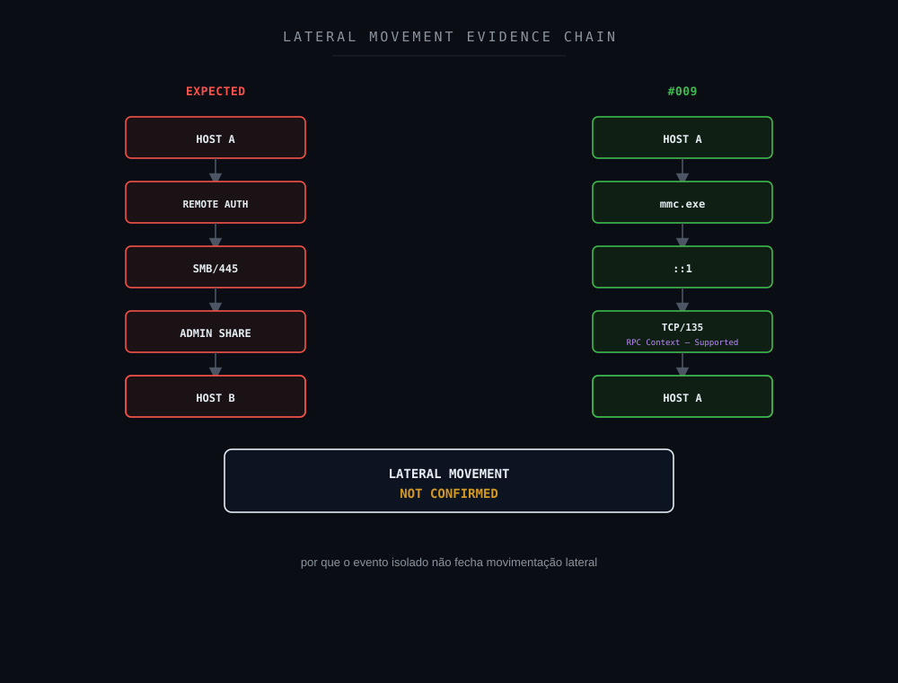

**Objetivo:** demonstrar por que o evento isolado não fecha movimentação lateral.

---

# 21. Attack Flow

Não existe evidência suficiente para construir um Attack Flow adversarial como:

```text
Initial Access
        ↓
Credential Access
        ↓
SMB
        ↓
Admin Share
        ↓
Remote Execution
        ↓
Lateral Movement
```

O fluxo real é investigativo:

```text
Alert
        ↓
Inspect Telemetry
        ↓
Identify Process
        ↓
Identify Network Tuple
        ↓
Loopback Confirmed
        ↓
RPC Context
        ↓
Search SMB Indicators
        ↓
Lateral Movement Not Confirmed
```

Portanto:

```text
Confirmed Attack Flow = Not Applicable
Investigation Flow = Applicable
```

---

# 22. Framework Mapping

Um framework só entra nesta lista quando há um número, técnica ou controle real e específico que se aplique a este case, não como referência genérica.

### MITRE ATT&CK

**Aplicabilidade: hipótese da detecção (não confirmada).**

```text
T1021.002: SMB/Windows Admin Shares
```

T1021.002 foi a técnica associada pela regra de detecção (Seção 1); a evidência disponível não sustentou destino remoto, SMB/445 nem acesso confirmado a compartilhamento administrativo (Seções 16, 19 e 34). A técnica permanece hipótese de detecção, não confirmação.

### NIST CSF

**Aplicabilidade: direta.**

Detect, Respond e Improve.

### NIST SP 800-61

**Aplicabilidade: direta.**

Validação e análise técnica do incidente reportado pelo alerta.

### CIS Controls

**Aplicabilidade: suporte.**

```text
CIS 8 : Audit Log Management
CIS 13: Network Monitoring and Defense
CIS 17: Incident Response Management
```

### Sigma

**Aplicabilidade: parcial.**

A Seção 28 apresenta lógica Sigma conceitual para elevar confiança em Administrative Share Access a partir de eventos 5140/5145. Não é uma regra operacional lavrada neste case, mas participa materialmente do exercício de Detection Engineering do note.

### SOC-CMM

**Aplicabilidade: suporte.**

Maturidade de correlação e enriquecimento de contexto entre processo, rede e autenticação (Seções 26 e 31).

### Not Applicable

```text
MITRE Attack Flow
MITRE Engage
MITRE Fight Fraud
```

MITRE Attack Flow: não existe cadeia adversarial confirmada a mapear (Seção 21); o fluxo real deste note é investigativo, não ofensivo. MITRE Engage: sem operação de decepção neste case. MITRE Fight Fraud Framework: sem cenário de fraude neste case.

ISO/IEC 27035, ISO/IEC 27001, COBIT 2019, ITIL 4, Agile/Kanban, SANS PICERL, ACH, Método Científico e OODA Loop são metodologias válidas em outros contextos, mas não participam materialmente da análise técnica, da estruturação de hipóteses nem do veredito deste case específico; incluí-las aqui seria framework stuffing, não mapping proporcional à evidência.

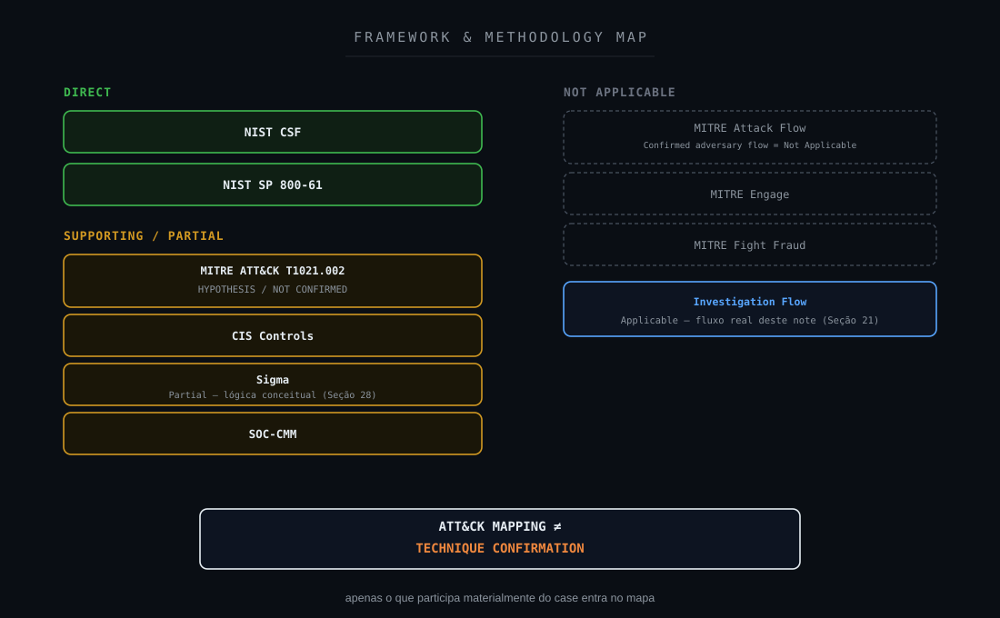

**Objetivo:** demonstrar mapping proporcional à evidência.

---

# 23. NIST Mapping

## Detect

A detecção ocorreu através de:

```text
Sysmon
        ↓
Wazuh
        ↓
Alert
```

## Respond

O analista:

```text
Validated Alert
        ↓
Inspected Raw Telemetry
        ↓
Compared Protocols
        ↓
Evaluated Remote vs Local Context
        ↓
Tested Lateral Movement Hypothesis
```

## Improve

O case aponta oportunidade de:

```text
Detection Refinement
Correlation
Enrichment
False Positive Reduction
```

---

# 24. CIS Controls

O cenário possui relação com capacidades como:

```text
Audit Log Management
Network Monitoring and Defense
Incident Response Management
```

Também demonstra a importância de manter telemetria suficiente para correlacionar:

```text
Process
Network
Authentication
Share Access
```

Uma detecção isolada baseada em uma única conexão pode possuir contexto insuficiente.

---

# 25. Detection Gap Analysis

A detecção atual reconheceu um padrão considerado potencialmente relacionado a Administrative Shares.

Entretanto, o evento que disparou o alerta apresentava:

```text
Port 135
        +
Loopback
```

e não:

```text
Remote Host
        +
SMB/445
        +
Administrative Share
```

O principal gap é:

```text
GENERIC SIGNAL
        ↓
HIGH-SEVERITY SEMANTIC
```

sem evidência suficiente no próprio evento para sustentar essa semântica.

A regra possui valor como ponto de investigação.

Mas pode gerar ruído caso não diferencie:

```text
Local RPC
```

de:

```text
Remote SMB Administrative Share
```

---

# 26. Detection Engineering

Uma detecção mais contextual poderia utilizar múltiplos sinais.

### Stage 1: Process

```text
Image
User
Parent
Command Line
```

### Stage 2: Network

```text
Source
Destination
Loopback?
Remote?
Port
Protocol
```

### Stage 3: Authentication

```text
4624
Logon Type
Source Address
```

### Stage 4: SMB

```text
TCP/445
```

### Stage 5: Share Access

```text
5140
5145
```

### Stage 6: Share Name

```text
C$
ADMIN$
IPC$
```

### Stage 7: Remote Action

```text
File Transfer
Service Creation
Remote Process
```

### Stage 8: Contextual Risk

```text
Expected Administration
        vs
Suspicious Remote Activity
```

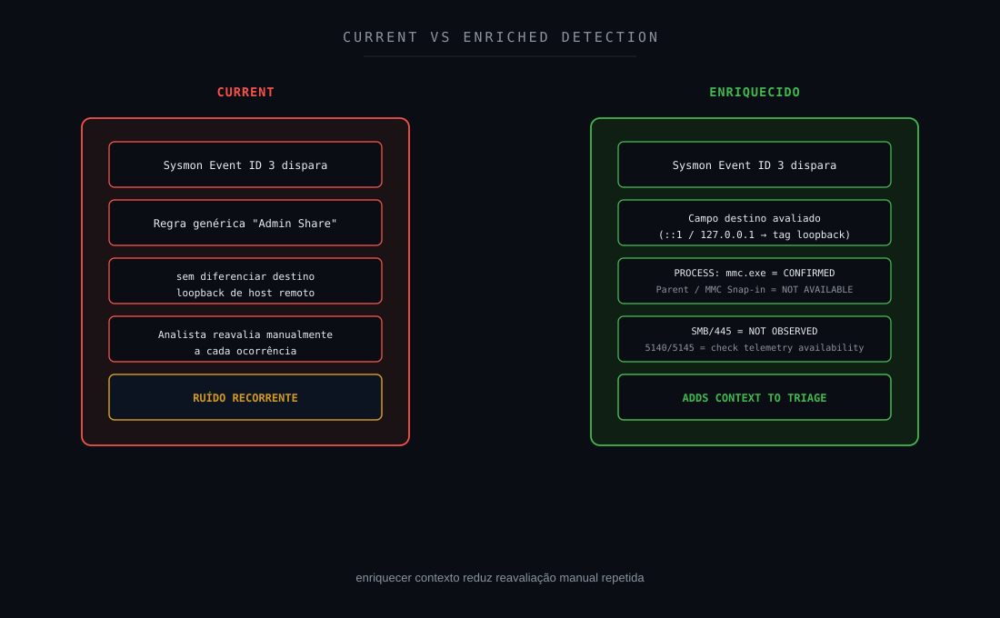

**Objetivo:** mostrar como reduzir falsos positivos e aumentar fidelidade.

---

# 27. Rule Refinement

Caso esse padrão seja validado operacionalmente como legítimo, uma oportunidade é revisar a lógica da detecção.

Exemplos conceituais de refinamento:

```text
IF Destination = Loopback
AND Port = 135
AND Process = Known Administrative Binary
THEN
Reduce Severity / Add Context
```

Entretanto, não é recomendável simplesmente ignorar:

```text
mmc.exe
```

porque:

```text
Legitimate Binary
        ≠
Always Legitimate Behavior
```

Melhor abordagem:

```text
Loopback
+
Port
+
Process
+
User Context
+
Parent
+
Historical Baseline
```

A exceção deve ser comportamental.

Não baseada apenas no nome do executável.

---

# 28. Sigma / Detection Logic

Uma regra Sigma conceitual para elevar confiança em Administrative Share activity poderia correlacionar eventos de share access.

Exemplo simplificado:

```yaml
title: Windows Administrative Share Access
status: experimental

logsource:
  product: windows
  service: security

detection:
  selection_event:
    EventID:
      - 5140
      - 5145

  selection_share:
    ShareName|endswith:
      - '\C$'
      - '\ADMIN$'
      - '\IPC$'

  condition:
    selection_event and selection_share

falsepositives:
  - Legitimate administrative activity
  - Software deployment
  - Backup infrastructure
  - Management tooling

level: medium
```

Essa regra é apenas um exemplo de Detection Engineering.

Não representa evidência observada no #009.

Uma detecção de maior confiança deveria adicionar:

```text
Remote Source
Authentication
User
Asset Context
Process Correlation
```

---

# 29. Hardening Opportunities

### Habilitar auditoria de compartilhamentos

Quando apropriado:

```text
5140
5145
```

### Correlacionar autenticação

Especialmente:

```text
4624
4625
```

### Manter Sysmon Process Creation

```text
Event ID 1
```

para obter:

```text
Parent
Command Line
Process Hash
```

### Manter Sysmon Network Connection

```text
Event ID 3
```

para associação processo/rede.

### Monitorar SMB

Especialmente:

```text
TCP/445
```

entre segmentos sensíveis.

### Baseline de administração

Identificar:

```text
Expected Admin Users
Expected Management Hosts
Expected Tools
Expected Destinations
```

### Evitar exceções amplas

Não criar:

```text
Allow mmc.exe
```

como regra genérica de supressão.

---

# 30. Defense in Depth

Uma arquitetura defensiva para esse cenário pode combinar:

```text
ENDPOINT TELEMETRY
        ↓
PROCESS CREATION
        ↓
NETWORK CONNECTION
        ↓
AUTHENTICATION
        ↓
SMB MONITORING
        ↓
SHARE AUDITING
        ↓
SIEM CORRELATION
        ↓
SOC ANALYSIS
```

Cada camada responde a uma pergunta.

```text
Process
→ What executed?
```

```text
Network
→ Where did it communicate?
```

```text
Authentication
→ Who authenticated?
```

```text
Share Audit
→ Which resource was accessed?
```

```text
SOC
→ Does the complete chain support lateral movement?
```

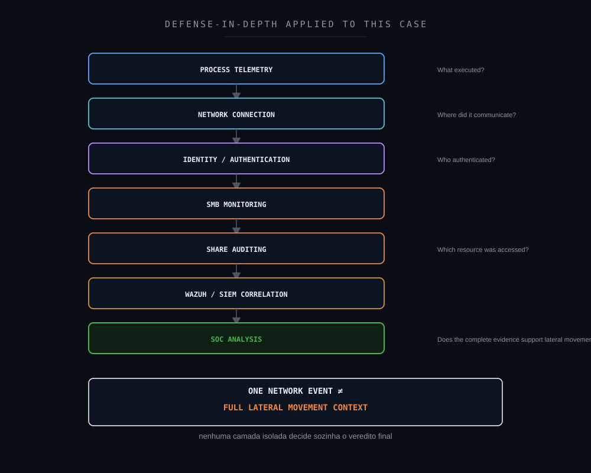

**Objetivo:** demonstrar a necessidade de múltiplas fontes.

---

# 31. SOC-CMM

Em um SOC básico:

```text
Alert
        ↓
Manual Investigation
```

Em um SOC mais maduro:

```text
Alert
        +
Asset Context
        +
Process
        +
Network
        +
Authentication
        +
Share Audit
        +
Historical Baseline
        ↓
Contextual Decision
```

O objetivo de maturidade não é:

```text
More Alerts
```

É:

```text
Better Evidence Per Alert
```

Esse case é um exemplo claro de como um alerta tecnicamente verdadeiro pode possuir descrição mais forte que sua evidência.

---

# 32. Métricas operacionais

Métricas aplicáveis incluem:

### MTTD

Tempo até detecção.

### MTTA

Tempo até início da análise.

### MTTR

Tempo até conclusão operacional.

### False Positive Rate

Percentual de alertas relacionados a Administrative Shares que não apresentam evidência suficiente de acesso remoto.

### Detection Fidelity

Proporção de alertas em que a semântica da regra é sustentada pela telemetria.

### Enrichment Coverage

Percentual de alertas contendo:

```text
Process
Parent
Command Line
User
Destination
Authentication
SMB
Share
```

### Rule Refinement Effectiveness

Redução de ruído sem perda de cobertura relevante.

Valores internos não devem ser publicados.

---

# 33. Decision Flow

```text
ADMIN SHARE ALERT
        ↓
REMOTE DESTINATION?
        ├── NO
        │    ↓
        │  LOOPBACK?
        │    ├── YES
        │    │    ↓
        │    │  ANALYZE LOCAL RPC / PROCESS CONTEXT
        │    │
        │    └── NO
        │         ↓
        │       CONTINUE NETWORK ANALYSIS
        │
        └── YES
             ↓
SMB/445 OBSERVED?
        ├── NO
        │    ↓
        │  ADMIN SHARE ACCESS?
        │    ├── NOT AVAILABLE → SEEK SHARE TELEMETRY
        │    └── NOT CONFIRMED → MAINTAIN HYPOTHESIS
        │
        └── YES
             ↓
SHARE ACCESS EVENT?
        ├── NO / NOT AVAILABLE
        │    ↓
        │  SEEK 5140 / 5145
        │
        └── YES
             ↓
C$ / ADMIN$ / IPC$?
        ├── NO → ANALYZE OTHER SMB ACTIVITY
        └── YES
             ↓
REMOTE AUTHENTICATION?
        ↓
REMOTE ACTION?
        ↓
SUPPORTING MALICIOUS EVIDENCE?
        ↓
VERDICT
```

O caminho do #009 foi:

```text
Admin Share Alert
        ↓
Remote Destination?
NO
        ↓
Loopback?
YES
        ↓
::1 → ::1
        ↓
TCP/135
        ↓
Local RPC Context Supported
        ↓
TCP/445
Not Observed
        ↓
Admin Share Access
Not Confirmed
        ↓
Lateral Movement
Not Confirmed
        ↓
Strong False Positive Indication
```

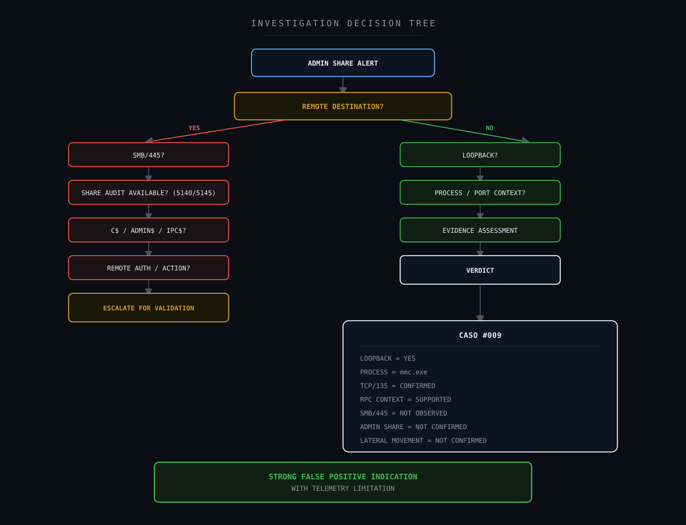

**Objetivo:** criar um fluxo reutilizável para casos semelhantes.

---

# 34. Veredito técnico

### Wazuh alert

```text
Confirmed
```

### Sysmon Event ID 3

```text
Confirmed
```

### `mmc.exe`

```text
Confirmed
```

### `C:\Windows\System32\mmc.exe`

```text
Confirmed
```

### TCP connection

```text
Confirmed
```

### Source `::1`

```text
Confirmed
```

### Destination `::1`

```text
Confirmed
```

### Destination Port 135

```text
Confirmed
```

### Local Loopback Context

```text
Supported
```

### RPC Endpoint Mapper Context

```text
Supported
```

### Remote Destination

```text
Not Observed
in the analyzed event
```

### TCP/445

```text
Not Observed
in the analyzed event
```

### Command Line

```text
Not Available
```

### Parent Process

```text
Not Available
```

### MMC Snap-in

```text
Not Available
```

### Full Process Lineage

```text
Not Available
```

### SMB Session

```text
Not Confirmed
```

### C$ Access

```text
Not Confirmed
```

### ADMIN$ Access

```text
Not Confirmed
```

### IPC$ Access

```text
Not Confirmed
```

### Remote Authentication

```text
Not Confirmed
```

### Remote Execution

```text
Not Confirmed
```

### Lateral Movement

```text
Not Confirmed
```

### Endpoint Compromise

```text
Not Confirmed
```

## Classificação final

**Forte indício de Falso Positivo: comunicação RPC local associada ao `mmc.exe`, sem evidência no evento analisado de SMB/445, destino remoto ou acesso confirmado a Windows Administrative Shares.**

A limitação material permanece:

```text
Specific MMC Snap-in
Command Line
Parent Process
Full Administrative Context
        =
Not Available
```

Portanto, a conclusão não deve ser escrita como:

```text
Confirmed Legitimate Administrative Action
```

O correto é:

```text
Local RPC Context = Supported

Lateral Movement = Not Confirmed

Strong False Positive Indication
with Telemetry Limitation
```

---

# 35. Investigation Flow: visão final

```text
WAZUH ALERT
Possible Administrative Share Activity
        ↓
RAW EVENT
Sysmon Event ID 3
        ↓
PROCESS
mmc.exe
        ↓
NETWORK
::1 → ::1
        ↓
PORT
TCP/135
        ↓
CONTEXT
Local RPC
        ↓
REMOTE DESTINATION
NOT OBSERVED
        ↓
SMB/445
NOT OBSERVED
        ↓
ADMIN SHARE ACCESS
NOT CONFIRMED
        ↓
LATERAL MOVEMENT
NOT CONFIRMED
        ↓
TELEMETRY LIMITATION

Command Line
NOT AVAILABLE

Parent Process
NOT AVAILABLE

MMC Snap-in
NOT AVAILABLE
        ↓
FINAL ASSESSMENT

STRONG FALSE POSITIVE INDICATION
WITH TELEMETRY LIMITATION
```

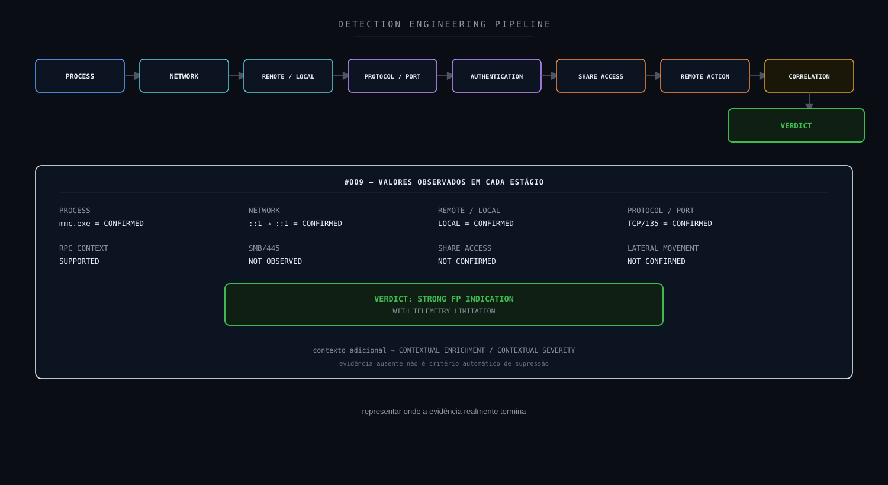

**Objetivo:** representar onde a evidência realmente termina.

---

# 36. Referências técnicas

## Wazuh

Wazuh Documentation

https://documentation.wazuh.com/

Aplicação:

```text
Event Collection
Correlation
Alerting
Investigation
```

## Microsoft Sysinternals: Sysmon

Sysmon Documentation

https://learn.microsoft.com/sysinternals/downloads/sysmon

Aplicação:

```text
Event ID 3
Network Connection
```

## Microsoft: Microsoft Management Console

Microsoft Management Console / Windows Administrative Components.

Aplicação:

```text
mmc.exe
Administrative Snap-ins
```

## Microsoft: RPC

Microsoft Remote Procedure Call.

Aplicação:

```text
RPC
Endpoint Mapper
TCP/135
```

## Microsoft: SMB

Server Message Block.

Aplicação:

```text
SMB
TCP/445
Windows Shares
```

## Microsoft: Windows Security Auditing

Eventos relevantes:

```text
4624
Successful Logon

4625
Failed Logon

5140
Network Share Access

5145
Detailed Network Share Access
```

## MITRE ATT&CK

T1021: Remote Services

https://attack.mitre.org/techniques/T1021/

T1021.002: SMB/Windows Admin Shares

https://attack.mitre.org/techniques/T1021/002/

No #009:

```text
T1021.002
=
Detection Hypothesis

Confirmed Adversary Technique
=
NO
```

## NIST

NIST Cybersecurity Framework

https://www.nist.gov/cyberframework

NIST SP 800-61 Rev. 3

https://csrc.nist.gov/pubs/sp/800/61/r3/final

## CIS

CIS Controls

https://www.cisecurity.org/controls

## Sigma

SigmaHQ

https://sigmahq.io/

## SOC-CMM

SOC-CMM

https://www.soc-cmm.com/

---

# Disclaimer

Este estudo foi sanitizado antes da publicação.

Foram removidos ou substituídos:

```text
Organization
Client
Hostname
Internal IP
External IP
Username
Domain Account
Process ID
Exact Timestamp
Incident ID
Ticket ID
Custom Rule ID
Agent ID
Collector ID
Internal Infrastructure Identifiers
```

O endereço:

```text
::1
```

foi preservado porque representa um endereço técnico padronizado de IPv6 loopback, não um identificador específico do ambiente.

Também foram preservados:

```text
mmc.exe
TCP/135
TCP/445
Sysmon Event ID 3
Windows Event IDs
MITRE ATT&CK T1021.002
```

por serem elementos técnicos públicos necessários para compreensão do estudo.

O alerta originalmente relacionava o comportamento a possível acesso a Windows Administrative Shares.

Essa classificação não foi reproduzida como conclusão automática.

A análise separou explicitamente:

```text
Alert Created
        ≠
Technique Confirmed

TCP/135
        ≠
SMB

RPC
        ≠
Administrative Share Access

Loopback
        ≠
Remote Host

Admin Share Alert
        ≠
Admin Share Access

Administrative Share Access
        ≠
Lateral Movement Automatically

Legitimate Binary
        ≠
Legitimate Behavior Automatically
```

Também foi preservada a distinção entre:

```text
Not Observed
```

e:

```text
Not Available
```

e:

```text
Not Confirmed
```

Neste case:

```text
Remote Destination
TCP/445
```

foram tratados como:

```text
Not Observed
in the analyzed event
```

enquanto:

```text
Command Line
Parent Process
MMC Snap-in
Full Process Lineage
```

foram tratados como:

```text
Not Available
```

e:

```text
SMB Session
Administrative Share Access
Remote Authentication
Remote Execution
Lateral Movement
Compromise
```

foram tratados como:

```text
Not Confirmed
```

Nenhuma ausência de telemetria foi convertida em ausência de comportamento.

Nenhuma técnica MITRE foi tratada como confirmada apenas porque estava associada à detecção.

As investigações, decisões técnicas e veredictos apresentados neste estudo refletem experiência prática real do autor. Ferramentas de Inteligência Artificial foram utilizadas como apoio para formatação, diagramação e publicação do conteúdo, não para a condução da investigação em si.

O objetivo deste estudo é compartilhar metodologia aplicada a:

- SOC Investigation;
- Incident Response;
- Threat Hunting;
- Detection Engineering;
- Windows Security;
- Sysmon;
- RPC;
- SMB;
- Administrative Shares;
- MITRE ATT&CK;
- Evidence Classification;
- False Positive Analysis;
- Detection Refinement;
- Telemetry Gap Analysis.

Este projeto é independente e não representa documentação oficial do Wazuh, Microsoft, MITRE, NIST, CIS ou demais organizações mencionadas.

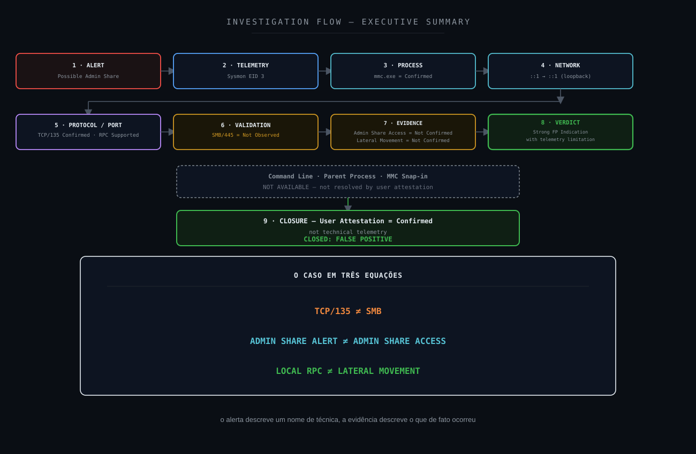

**Objetivo:** encerrar o #009 preservando exatamente o limite da evidência.

---

# Wazuh SOC Notes

**O alerta descreve uma hipótese. A telemetria define o que realmente pode ser provado.**
