# Wazuh SOC Notes #010: RDP Loopback ≠ Reverse Tunnel, investigando Logon Type 10, `::1` e hipótese de tunelamento

**SOC | Incident Response | Threat Hunting | Detection Engineering | Windows Security | RDP | RemoteInteractive | Wazuh | MITRE ATT&CK**

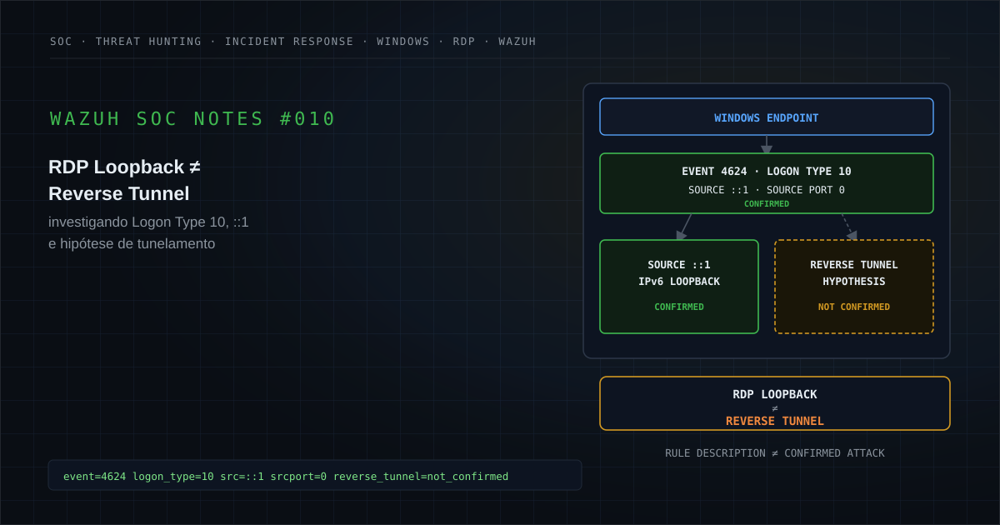

---

## Executive Summary

Um alerta de alta severidade foi gerado pelo Wazuh após um evento Windows Security `4624` registrar um logon bem-sucedido com `Logon Type 10`, associado a uma sessão do tipo **RemoteInteractive**, enquanto o endereço de origem foi registrado como `::1`, o endereço IPv6 reservado para loopback local.

A regra de detecção descrevia o comportamento como possível RDP originado de loopback e levantava hipóteses de **reverse tunneling** e uso de **stolen credentials**.

A telemetria disponível, porém, confirma apenas uma parte dessa narrativa.

O evento comprova:

```text
Successful Logon
+
Logon Type 10
+
Source Address = ::1
+
Source Port = 0
```

Também foram registrados:

```text
Process = C:\Windows\System32\svchost.exe
Logon Process = User32
Authentication Package = Negotiate
Elevated Token = Yes
Restricted Admin Mode = No
Virtual Account = No
```

Esses campos são relevantes para investigação, mas não demonstram por si mesmos:

```text
Reverse Tunnel
Port Forwarding
External Origin
Stolen Credentials
Credential Compromise
Malicious RDP Session
TCP/3389 Network Connection
Lateral Movement
Endpoint Compromise
```

O principal desafio analítico deste case é separar três elementos diferentes:

```text
1. O que o Windows realmente registrou
2. O que a regra Wazuh inferiu
3. O que ainda precisaria ser comprovado
```

Com a evidência disponível, o caso permanece classificado como:

> **Suspeito: requer validação e correlação adicional.**

Não há evidência suficiente para classificá-lo como comprometimento confirmado, reverse tunneling confirmado ou falso positivo confirmado.

A principal lição é:

```text
RDP LOOPBACK
≠
REVERSE TUNNEL

LOGON TYPE 10
≠
MALICIOUS REMOTE ACCESS

RULE DESCRIPTION
≠
STOLEN CREDENTIALS CONFIRMED
```

---

# 1. Contexto da detecção

O Wazuh recebeu um evento do canal de segurança do Windows e acionou a Rule `92656`, de severidade elevada.

A regra foi disparada porque um logon classificado como Remote Desktop / RemoteInteractive apresentou como origem:

```text
::1
```

O endereço `::1` é o endereço de loopback IPv6.

Ele representa comunicação relacionada ao próprio host, de forma conceitualmente equivalente ao papel exercido por:

```text
127.0.0.1
```

em IPv4.

Esse comportamento merece investigação porque um logon remoto interativo normalmente é esperado a partir de alguma origem identificável, como:

```text
Workstation
VPN
Jump Server
Bastion
RPA Platform
Remote Access Gateway
Administrative Endpoint
```

Entretanto, uma origem loopback também pode surgir em arquiteturas legítimas envolvendo brokers, proxies locais, agentes de automação, redirecionamento de sessão ou outros componentes intermediários.

Portanto:

```text
LOOPBACK
=
ANOMALOUS CONTEXT

LOOPBACK
≠
MALICIOUS TUNNEL
```

---

# 2. Hipótese inicial

A regra introduziu uma hipótese de investigação:

```text
RemoteInteractive / RDP Logon
        +
Loopback Address
        ↓
Possible Local Redirection
        ↓
Possible Tunnel / Reverse Tunnel
        ↓
Possible Credential Abuse
```

Essa hipótese é válida como gatilho analítico.

Ela não pode ser tratada como conclusão.

A pergunta correta é:

> Existe evidência adicional demonstrando que uma sessão externa foi encaminhada através de um mecanismo local de tunneling até o RDP do endpoint?

No conjunto de evidências disponível para este case, essa pergunta permanece sem resposta conclusiva.

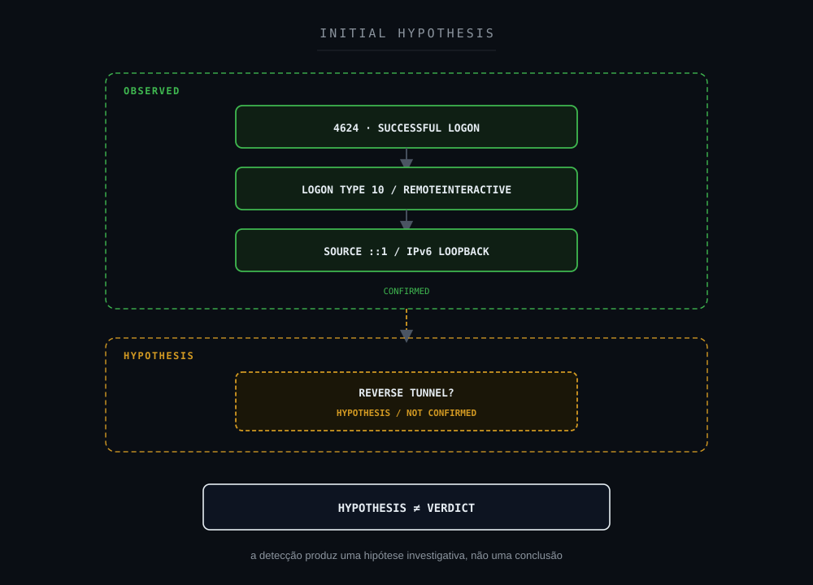

**Objetivo:** mostrar que a detecção produz uma hipótese investigativa e não um veredito.

---

# 3. Escopo da investigação

O escopo disponível neste case é composto principalmente pelo evento Windows Security `4624` que originou o alerta.

A investigação pública foi sanitizada.

Foram removidos:

```text
Hostname
Username
Domain
Internal IP
Exact Timestamp
SID
Logon ID
Logon GUID
Process ID
Event Record ID
Client / Organization
```

Elementos padronizados e tecnicamente relevantes foram preservados:

```text
Rule 92656
Event ID 4624
Logon Type 10
::1
Source Port 0
svchost.exe
User32
Negotiate
Elevated Token
```

Nenhum identificador interno deve ser inferido a partir deste artigo.

---

# 4. 5W1H

## What: O que aconteceu?

Foi registrado um evento Windows Security `4624`, indicando criação bem-sucedida de uma sessão de logon.

O evento apresentou:

```text
Logon Type = 10
Source Network Address = ::1
Source Port = 0
```

O Wazuh correlacionou esses campos e disparou a Rule `92656`.

## Who: Quem esteve envolvido?

A sessão foi criada para:

```text
<USER>
```

no ativo:

```text
<HOST>
```

Os identificadores reais foram removidos.

## When: Quando ocorreu?

```text
<TIMESTAMP>
```

O horário exato foi removido da versão pública.

## Where: Onde foi observado?

No canal:

```text
Windows Security
```

coletado pelo Wazuh no endpoint analisado.

## Why: Por que o alerta foi gerado?

Porque um logon do tipo RemoteInteractive foi registrado com origem IPv6 loopback:

```text
::1
```

A regra considera esse padrão potencialmente relacionado a redirecionamento ou tunelamento.

## How: Como ocorreu tecnicamente?

A telemetria mostra uma sessão de logon criada pelo Windows com os seguintes campos relevantes:

```text
Event ID              4624
Logon Type            10
Source Address        ::1
Source Port           0
Process               C:\Windows\System32\svchost.exe
Logon Process         User32
Authentication        Negotiate
Elevated Token        Yes
Restricted Admin      No
Virtual Account       No
```

O evento não contém evidência suficiente para reconstruir um eventual caminho externo até essa sessão.

---

# 5. Evidências observadas

| Evidência | Estado |
|---|---|
| Wazuh Rule 92656 disparada | **Confirmed** |
| Windows Security Event ID 4624 | **Confirmed** |
| Logon bem-sucedido | **Confirmed** |
| Logon Type 10 | **Confirmed** |
| Source Network Address `::1` | **Confirmed** |
| Source Port `0` | **Confirmed** |
| Workstation associada ao próprio ativo | **Confirmed** |
| `svchost.exe` registrado no campo Process | **Confirmed** |
| Logon Process `User32` | **Confirmed** |
| Authentication Package `Negotiate` | **Confirmed** |
| Elevated Token `Yes` | **Confirmed** |
| Restricted Admin Mode `No` | **Confirmed** |
| Virtual Account `No` | **Confirmed** |
| Endereço `::1` (IPv6 loopback / localhost) | **Confirmed** |
| RemoteInteractive (Logon Type 10) | **Confirmed** |
| TCP/3389 observado em telemetria de rede | **Not Available** |
| Processo responsável por eventual tunnel | **Not Available** |
| Processo cliente RDP | **Not Available** |
| Origem externa anterior ao loopback | **Not Available** |
| Port forwarding | **Not Confirmed** |
| Reverse tunneling | **Not Confirmed** |
| Stolen credentials | **Not Confirmed** |
| Credential compromise | **Not Confirmed** |
| External attacker | **Not Confirmed** |
| Lateral movement | **Not Confirmed** |
| Endpoint compromise | **Not Confirmed** |
| Impact | **Not Confirmed** |

---

# 6. Evidence Assessment

A análise precisa preservar a diferença entre observação, interpretação e hipótese.

### Confirmed / Observed

```text
4624
Successful Logon
Logon Type 10 / RemoteInteractive
Source ::1 / IPv6 Loopback
Source Port 0
svchost.exe (campo Process)
User32
Negotiate
Elevated Token = Yes
Restricted Admin Mode = No
Virtual Account = No
```

`RemoteInteractive` e `IPv6 loopback` são campos diretamente registrados no evento, portanto `Confirmed`. Isso é diferente de uma sessão de rede reconstruída:

```text
RemoteInteractive = Confirmed
TCP/3389 Network Session = Not Available
Reverse Tunnel = Not Confirmed
```

### Not Available

```text
TCP/3389 Network Telemetry
RDP Client Process
Full Process Tree
Tunnel Process
External Origin
Firewall Session
EDR Network Context
Terminal Services Correlation
```

### Not Confirmed

```text
Reverse Tunnel
Port Forwarding
Stolen Credentials
Credential Compromise
External Attacker
Malicious Remote Session
Lateral Movement
Endpoint Compromise
```

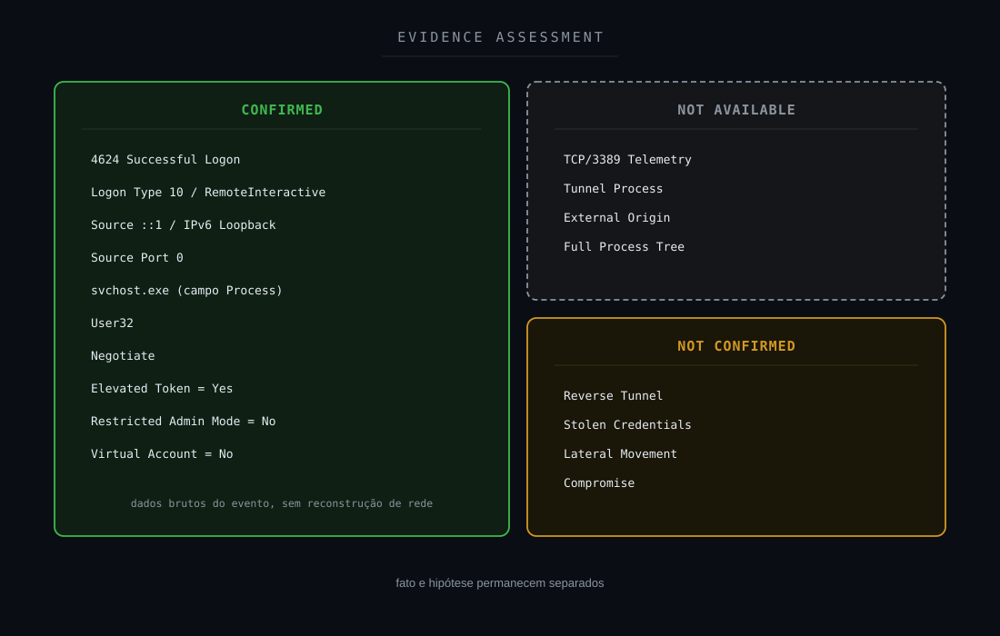

**Objetivo:** tornar explícita a diferença entre fato e hipótese.

---

# 7. Timeline

A timeline comprovável é curta.

```text
T0
Windows creates successful logon session
Event ID 4624
        ↓
T0
Logon Type 10 recorded
        ↓
T0
Source Address = ::1
Source Port = 0
        ↓
T0
Wazuh correlates event
        ↓
Rule 92656 fired
        ↓
Further tunnel / network / process evidence
NOT AVAILABLE IN CASE SOURCE
```

Não existe base suficiente para adicionar artificialmente etapas anteriores ou posteriores.

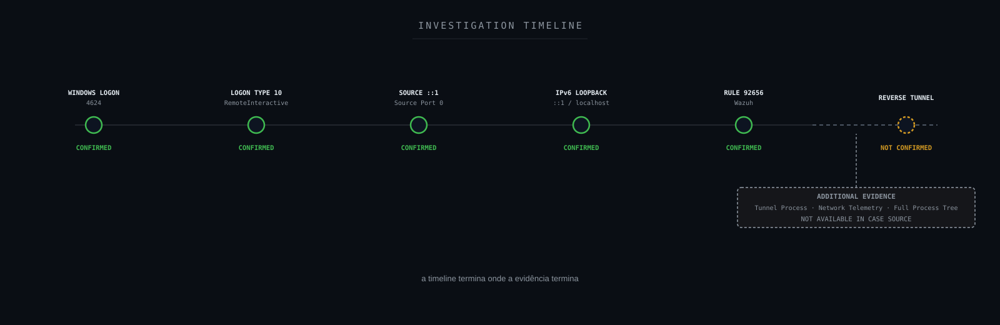

**Objetivo:** mostrar que a timeline termina onde a evidência termina.

---

# 8. Windows Security Event ID 4624

O Event ID `4624` é gerado quando uma nova sessão de logon é criada com sucesso.

Portanto, neste caso:

```text
Authentication / Logon Success
=
Confirmed
```

Isso é diferente de:

```text
Malicious Authentication
=
Not Confirmed
```

O evento confirma que uma sessão foi criada.

Ele não confirma sozinho:

```text
quem iniciou originalmente a cadeia
de onde a conexão realmente veio antes de possíveis intermediários
qual ferramenta iniciou a sessão
se existia tunnel
se a credencial estava comprometida
```

---

# 9. Logon Type 10

O campo:

```text
Logon Type = 10
```

corresponde a um contexto **RemoteInteractive**, normalmente associado a Remote Desktop / Terminal Services.

Isso sustenta o contexto RDP da detecção.

Mas existe uma distinção importante:

```text
REMOTEINTERACTIVE LOGON
≠
NETWORK PACKET CAPTURE
```

O `4624` descreve uma sessão de autenticação.

Ele não substitui:

```text
Firewall Logs
Sysmon Network Events
EDR Network Telemetry
Packet Capture
Terminal Services Connection Logs
```

Portanto, não devemos inferir automaticamente:

```text
Destination Port = 3389
```

porque essa porta não está presente na evidência-base utilizada neste case.

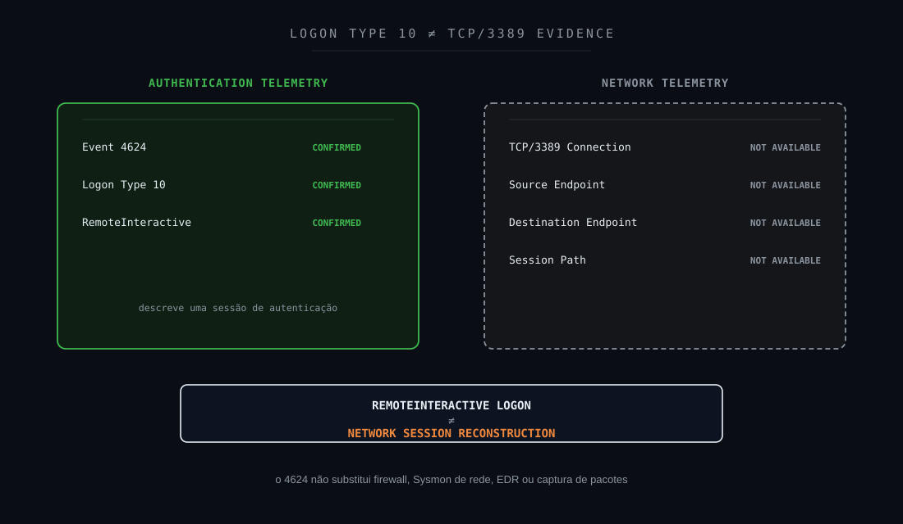

---

# 10. IPv6 Loopback `::1`

O endereço:

```text
::1
```

é o endereço padronizado de loopback IPv6.

Isso significa que o evento registrou a origem como pertencente ao contexto local do próprio host.

Essa observação é materialmente diferente de:

```text
10.x.x.x
172.16.x.x
192.168.x.x
Public IP
```

que poderiam identificar outra origem na rede.

Entretanto:

```text
::1
```

não explica **por que** uma sessão RemoteInteractive chegou ao Windows com esse endereço.

Existem múltiplas hipóteses possíveis.

O SOC precisa descobrir qual delas ocorreu.

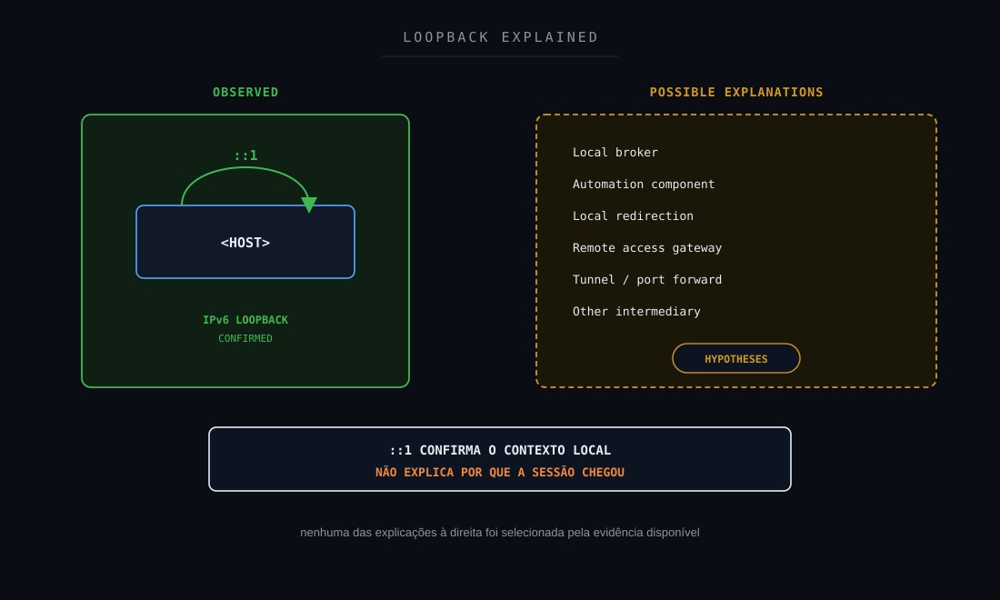

---

# 11. Source Port `0`

O evento registrou:

```text
Source Port = 0
```

Esse é um fato da telemetria (`Confirmed`, dado bruto do evento).

O `Source Port 0` está presente na telemetria do Event 4624. Ele não sustenta, por si só, port forwarding, reverse tunneling ou atividade de rede maliciosa.

Também não deve ser interpretado como uma reconstrução completa da conexão.

O campo não fornece:

```text
Destination Port
Original Remote Source Port
Original Remote Address
Transport Path
Tunnel Endpoint
```

Portanto:

```text
SOURCE PORT 0
≠
NO NETWORK ACTIVITY
```

e também:

```text
SOURCE PORT 0
≠
PORT FORWARDING CONFIRMED
```

e também:

```text
SOURCE PORT 0
≠
TUNNEL INDICATOR BY ITSELF
```

O valor deve ser tratado como um dado que exige correlação com fontes adicionais, não como evidência suspeita isolada.

---

# 12. `svchost.exe`, `User32` e `Negotiate`

O evento contém:

```text
Process Name:
C:\Windows\System32\svchost.exe

Logon Process:
User32

Authentication Package:
Negotiate
```

Esses elementos são diretamente observados.

Porém, o `Process Name` do evento `4624` não deve ser confundido com:

```text
Remote RDP Client
Tunnel Client
Tunnel Server
Attacker Process
```

O registro mostra o processo local associado ao pedido de logon.

Não existe neste case evidência suficiente para reconstruir a cadeia completa de processos que levou à sessão.

Mesmo que:

```text
C:\Windows\System32\svchost.exe
```

seja um caminho esperado para componentes do Windows, não foram apresentados neste case:

```text
Hash
Digital Signature
Process Parent
Command Line
Process Tree
Loaded Modules
```

Logo, a análise deve permanecer restrita ao que foi observado.

---

# 13. Elevated Token

O campo:

```text
Elevated Token = Yes
```

foi registrado no evento.

Isso significa que a sessão recebeu um token elevado no contexto do logon.

Não significa automaticamente:

```text
Privilege Escalation Attack
```

nem:

```text
Administrator Compromise
```

nem:

```text
Credential Theft
```

É um elemento importante para priorização e investigação porque uma sessão elevada possui maior potencial de impacto caso o acesso seja indevido.

Mas:

```text
ELEVATED TOKEN
≠
MALICIOUS PRIVILEGE ESCALATION
```

---

# 14. Rule Description vs. Evidence

A descrição da Rule `92656` contém uma narrativa forte, envolvendo:

```text
Remote Desktop Connection
Loopback Address
Possible Reverse Tunneling
Stolen Credentials
```

O primeiro erro possível em uma investigação seria transformar toda essa descrição em fato.

A regra representa uma **lógica de detecção**.

Não uma conclusão forense.

Separando:

### Evidência

```text
4624
Logon Type 10
::1
Successful Logon
```

### Hipóteses da regra

```text
Reverse Tunnel
Credential Theft
Exploit
```

A conclusão precisa ser construída depois da correlação.

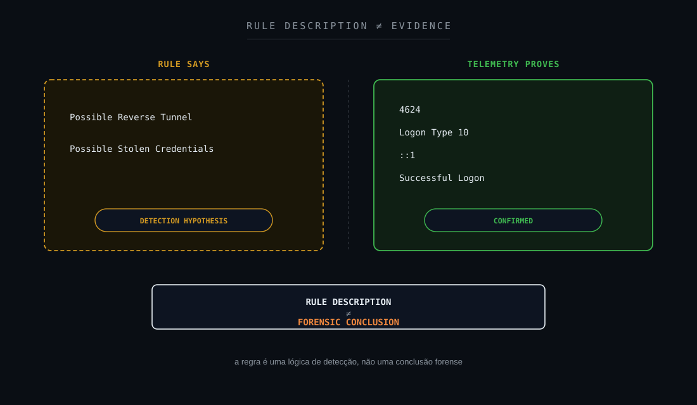

---

# 15. Hipótese de Reverse Tunneling

Um reverse tunnel ou mecanismo semelhante poderia, teoricamente, fazer com que uma conexão remota fosse encaminhada por um processo intermediário e posteriormente apresentada ao serviço local como originada do próprio host.

Essa é uma das razões pelas quais:

```text
RDP + LOOPBACK
```

merece investigação.

Entretanto, para confirmar esse cenário seria necessário localizar evidências adicionais, como:

```text
Tunnel Process
Port Forwarding Configuration
External Session
Listening Socket
Outbound Tunnel Connection
Process Command Line
Network Correlation
Persistence Mechanism
```

Nenhuma dessas evidências está disponível no material-base deste case.

Portanto:

```text
REVERSE TUNNEL
=
NOT CONFIRMED
```

---

# 16. Hipótese de Stolen Credentials

A regra também cita possível uso de credenciais roubadas.

Um logon bem-sucedido demonstra que uma credencial ou mecanismo de autenticação válido foi aceito.

Ele não demonstra como essa credencial foi obtida.

Portanto:

```text
SUCCESSFUL LOGON
≠
STOLEN CREDENTIALS
```

Para sustentar credential compromise seria necessário buscar sinais como:

```text
Abnormal authentication history
Impossible or unusual source
Credential dumping telemetry
Unusual 4648 explicit credential use
Unexpected Kerberos / NTLM patterns
EDR credential-access detections
Account behavior deviation
User / owner validation
```

Na ausência dessas evidências:

```text
STOLEN CREDENTIALS
=
NOT CONFIRMED
```

---

# 17. Explicações legítimas possíveis

O comportamento também pode surgir em cenários benignos.

Exemplos que precisam ser **validados**, não presumidos:

```text
RPA platform
Automation broker
Local session broker
Remote access gateway
Administrative workflow
Jump / bastion architecture
Application virtualization
Session redirection
Support tooling
```

O fato de um ativo ou conta parecer associado a automação não é suficiente para fechar o alerta.

A regra correta é:

```text
AUTOMATION CONTEXT
≠
AUTHORIZED ACTIVITY CONFIRMED
```

---

# 18. Explicações suspeitas possíveis

Também existem cenários adversariais compatíveis com o padrão observado:

```text
Port forwarding
Proxying
Reverse tunnel
Remote access relay
Credential abuse
Unauthorized RemoteInteractive session
Local tunnel terminating on the endpoint
```

Mas compatibilidade técnica não equivale a evidência.

Portanto:

```text
POSSIBLE
≠
CONFIRMED
```

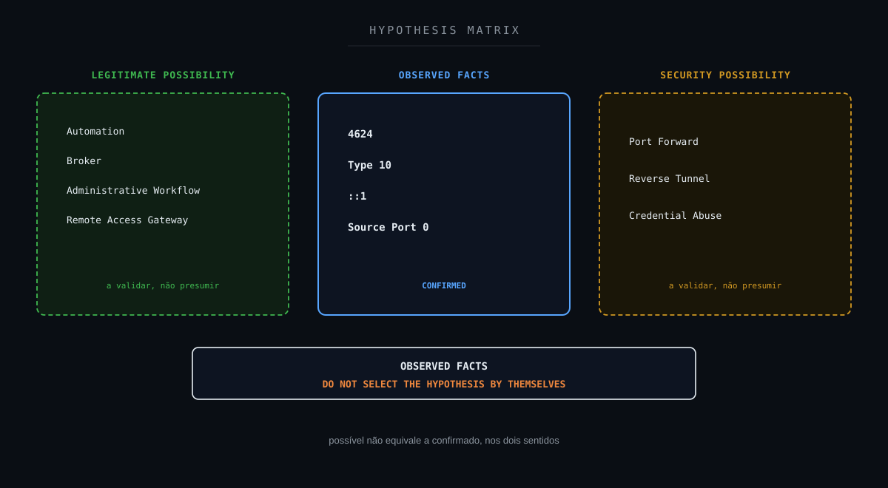

---

# 19. Threat Hunting

A investigação deveria expandir a busca usando o próprio evento como pivô.

## 19.1 Evento-base

```text
win.system.eventID:4624
AND win.eventdata.logonType:10
AND win.eventdata.ipAddress:"::1"
```

## 19.2 Mesmo usuário

```text
win.system.eventID:4624
AND win.eventdata.targetUserName:"<USER>"
```

## 19.3 Falhas próximas

```text
win.system.eventID:4625
AND win.eventdata.targetUserName:"<USER>"
```

Objetivo:

identificar tentativa/falha anterior à sessão bem-sucedida.

## 19.4 Uso explícito de credenciais

Pesquisar:

```text
4648
```

## 19.5 Privilégios especiais

Pesquisar:

```text
4672
```

sem assumir que sua presença comprova ataque.

## 19.6 Kerberos / NTLM

Correlacionar quando disponíveis:

```text
4768
4769
4776
```

## 19.7 Sessões RDP

Avaliar:

```text
4778
4779
```

e logs específicos de Terminal Services, quando coletados.

## 19.8 Sysmon

Quando disponível:

```text
Event ID 1
Process Creation

Event ID 3
Network Connection

Event ID 11
File Create
```

Buscar processos e comandos relacionados a:

```text
ssh
plink
chisel
socat
ncat
ngrok
cloudflared
netsh
portproxy
mstsc
powershell
cmd
```

A presença do nome de uma ferramenta em uma lista de hunting não significa que ela foi observada.

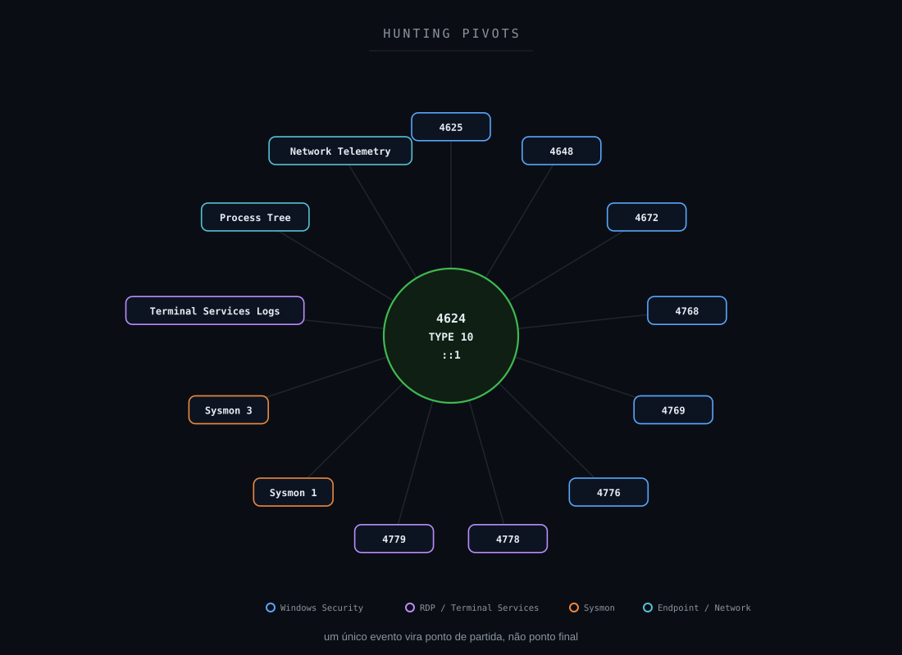

**Objetivo:** mostrar como sair de um único evento e construir contexto.

---

# 20. Fontes de correlação necessárias

Para fechar a hipótese de tunnel seriam especialmente relevantes:

### Windows Security

```text
4624
4625
4648
4672
4768
4769
4776
```

### RDP / Terminal Services

Logs de:

```text
RemoteConnectionManager
LocalSessionManager
```

### Endpoint

```text
EDR Process Tree
EDR Network Telemetry
Sysmon Event ID 1
Sysmon Event ID 3
```

### Network

```text
Firewall
Proxy
VPN
Bastion
Remote Access Gateway
NetFlow
```

### Asset / Identity Context

```text
Account Owner
Account Purpose
Authorized Logon Types
RPA Schedule
Jump Server Architecture
Maintenance Window
Change / GMUD
```

Sem essas fontes, permanece uma lacuna importante entre o alerta e a hipótese de ataque.

---

# 21. Resultado da investigação no escopo disponível

No material-base deste case, não foi fornecida telemetria complementar suficiente para demonstrar:

```text
Tunnel Process
Port Forwarding
Remote Source
External Session
Credential Theft
Credential Dumping
Malicious Process Execution
Persistence
Lateral Movement
Endpoint Compromise
```

Também não existe no conjunto utilizado para este artigo uma confirmação final de usuário ou responsável que permita classificar a atividade como autorizada.

Portanto:

```text
False Positive
=
NOT CONFIRMED

True Positive / Compromise
=
NOT CONFIRMED
```

O resultado técnico permanece:

```text
SUSPICIOUS
VALIDATION REQUIRED
```

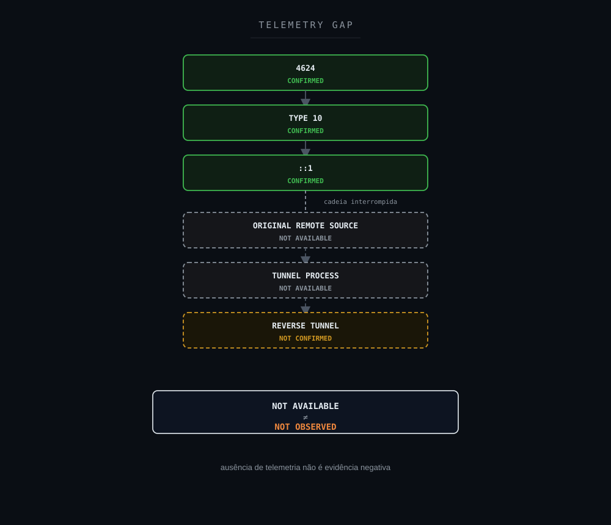

**Objetivo:** demonstrar que ausência de telemetria não é evidência negativa.

---

# 22. MITRE ATT&CK

## T1021.001: Remote Services: Remote Desktop Protocol

O contexto do evento é compatível com investigação relacionada a RDP.

Entretanto:

```text
RDP ACTIVITY
≠
T1021.001 ADVERSARIAL TECHNIQUE CONFIRMED
```

A técnica deve ser tratada como:

```text
Behavioral Context / Partial Mapping
```

até que existam evidências de uso adversarial.

## T1090: Proxy

Reverse tunneling e port forwarding podem se relacionar conceitualmente a mecanismos de proxy/tunneling.

Mas neste case:

```text
T1090
=
Hypothesis Only
```

porque não existe evidência de tunnel ou proxy.

## T1078.002: Valid Accounts: Domain Accounts

O evento demonstra uso bem-sucedido de uma conta.

A telemetria original identificava a conta como pertencente a um domínio Windows. O identificador do domínio foi removido da versão pública durante a sanitização.

A existência de uma conta de domínio confirma o tipo da conta, não confirma abuso adversarial.

Isso não significa:

```text
Compromised Valid Account
```

Portanto:

```text
T1078.002
=
Investigation Hypothesis
```

e não técnica adversarial confirmada.

---

# 23. MITRE Attack Flow

Não existe cadeia adversarial confirmada suficiente para construir um Attack Flow ofensivo.

Não temos sequência comprovada de:

```text
Initial Access
→
Credential Access
→
Tunnel
→
RDP
→
Execution
→
Persistence
```

Portanto:

```text
Confirmed Adversary Attack Flow
=
NOT APPLICABLE
```

O modelo adequado é um:

```text
Investigation Flow
```

---

# 24. Framework Mapping

Um framework só entra nesta lista quando há um número, técnica ou controle real e específico que se aplique a este case, não como referência genérica.

### MITRE ATT&CK

**Aplicabilidade: suporte / parcial (T1021.001), hipótese apenas (T1090 e T1078.002).**

```text
T1021.001: Remote Services: Remote Desktop Protocol   (Supporting / Partial)
T1090: Proxy                                          (Hypothesis Only)
T1078.002: Valid Accounts: Domain Accounts            (Hypothesis Only)
```

T1021.001 descreve o contexto comportamental RDP compatível com o evento, mas sem evidência de uso adversarial (Seção 22). T1090 e T1078.002 permanecem como mapeamento de regra / hipótese de investigação, sem tunnel, proxy, conta comprometida, roubo de credencial ou técnica adversarial confirmados. Nenhuma das três é técnica adversarial confirmada.

### NIST CSF 2.0

**Aplicabilidade: direta.**

Principalmente Detect e Respond (Seção 25).

### NIST SP 800-61 Rev. 3

**Aplicabilidade: direta.**

Análise orientada por evidência, sem contenção automática a partir de uma regra de alta severidade (Seção 26).

### CIS Controls

**Aplicabilidade: suporte / parcial.**

```text
CIS 8 : Audit Log Management
CIS 13: Network Monitoring and Defense
CIS 5 : Account Management
```

### Sigma

**Aplicabilidade: suporte (Detection Engineering).**

A Seção 30 apresenta a lógica genérica da detecção (`4624` + `Logon Type 10` + origem loopback) e o enriquecimento necessário para transformá-la em uma correlação contextual. Não é uma regra operacional lavrada neste case.

### SOC-CMM

**Aplicabilidade: suporte (maturidade de detecção).**

Maturidade de correlação e enriquecimento entre autenticação, endpoint, rede e identidade (Seções 28, 29 e 33).

### Not Applicable

```text
MITRE Attack Flow (para cadeia adversarial confirmada)
MITRE Engage
MITRE Fight Fraud
```

MITRE Attack Flow: não existe cadeia adversarial confirmada a mapear (Seção 23); o fluxo real deste note é investigativo, não ofensivo. MITRE Engage: sem operação de decepção neste case. MITRE Fight Fraud Framework: sem cenário de fraude neste case.

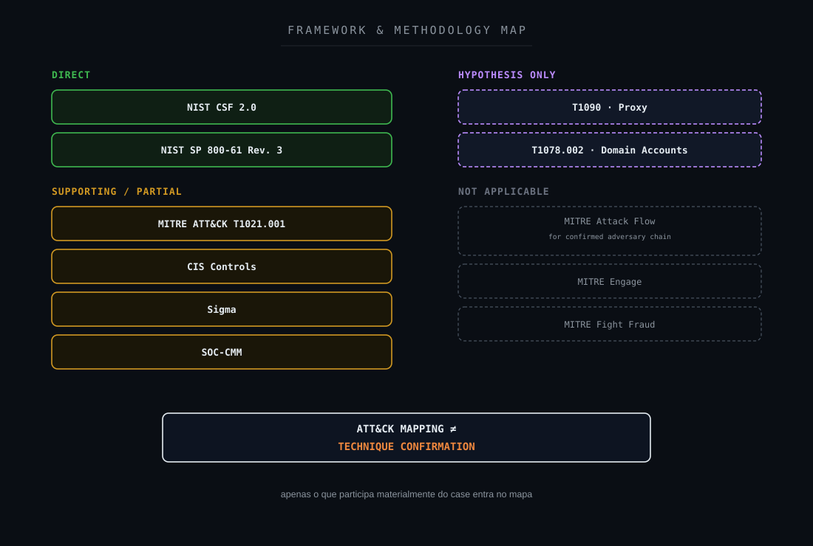

---

# 25. NIST CSF 2.0

O case se relaciona principalmente às funções:

```text
DETECT
RESPOND
```

Especialmente atividades relacionadas a:

```text
Security Monitoring
Adverse Event Analysis
Incident Analysis
```

A principal melhoria de maturidade seria garantir que o evento de autenticação possa ser correlacionado com telemetria de:

```text
Endpoint
Network
Identity
Remote Access
```

para reduzir incerteza.

---

# 26. NIST SP 800-61 Rev. 3

A abordagem utilizada segue o princípio de resposta orientada por evidência:

```text
Detection
→
Analysis
→
Contextualization
→
Decision
```

Um alerta com regra de alta severidade não deve automaticamente avançar para contenção sem avaliar:

```text
Credibility
Scope
Impact
Supporting Evidence
Telemetry Quality
```

Neste caso, a fase de análise não produziu evidência suficiente para fechar comprometimento.

---

# 27. CIS Controls

Os controles mais relacionados ao problema investigativo são:

### Audit Log Management

Garantir coleta suficiente de:

```text
Windows Security
Terminal Services
Sysmon
EDR
Authentication
```

### Network Monitoring and Defense

Correlacionar o logon com:

```text
Network Connections
Remote Access
VPN
Firewall
Tunnel Indicators
```

### Account Management

Validar:

```text
Account Purpose
Interactive Logon Permission
Administrative Privileges
Expected Usage
```

---

# 28. Detection Gap

A Rule `92656` é útil porque identifica um padrão incomum.

O problema surge quando a detecção depende majoritariamente de:

```text
4624
+
Logon Type 10
+
Loopback
```

sem enriquecimento adicional.

Nesse formato, o SOC sabe que:

```text
something unusual happened
```

mas pode não saber:

```text
why it happened
```

O gap principal é:

> Falta de correlação entre a sessão de autenticação, o processo que originou o fluxo, a conexão de rede e o contexto de autorização.

---

# 29. Detection Engineering

Uma detecção mais madura deve transformar o alerta simples em uma correlação contextual.

Base:

```text
4624
+
Logon Type 10
+
Source ::1
```

Enriquecimentos:

```text
Terminal Services Session
+
Account Classification
+
Process Tree
+
Network Connections
+
Port Forwarding Indicators
+
Known Automation Context
+
User / Owner Validation
```

A severidade poderia aumentar quando houver:

```text
Unexpected Account
+
Tunnel Process
+
External Connection
+
Explicit Credential Use
+
Suspicious Process Execution
```

A severidade poderia ser contextualizada quando houver:

```text
Known Authorized Workflow
+
Consistent Automation Pattern
+
Expected Account
+
Expected Schedule
+
Corroborating Telemetry
```

Mas nunca utilizar:

```text
Known Account
+
Loopback
→
Suppress
```

como regra automática.

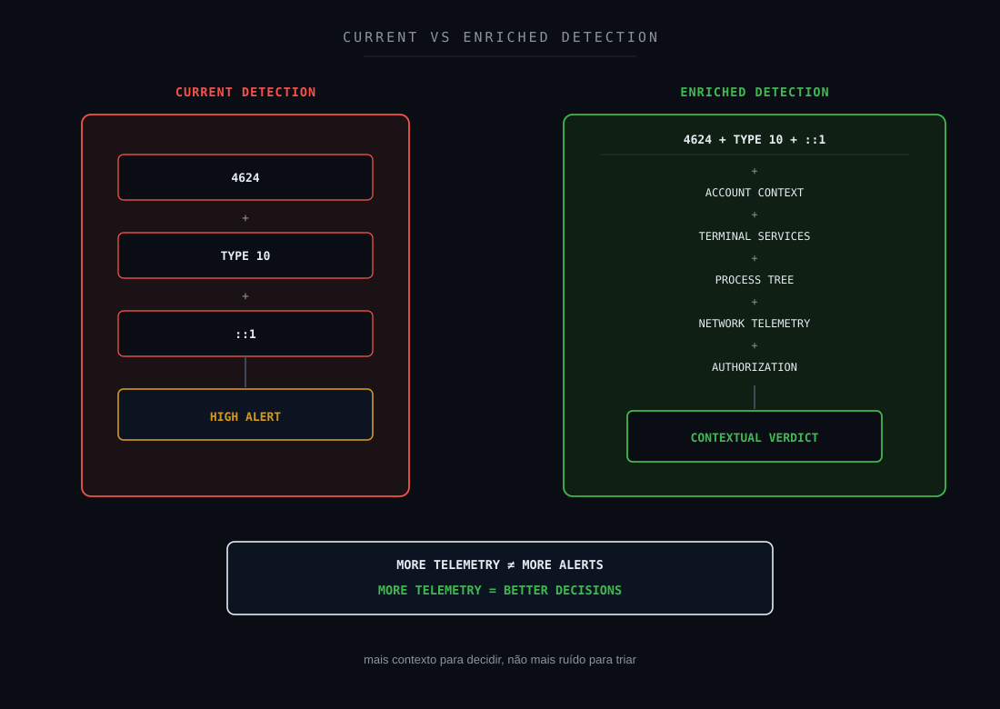

---

# 30. Sigma / Detection Logic

Uma lógica genérica pode procurar por:

```text
EventID = 4624

AND

LogonType = 10

AND

IpAddress IN (
    "::1",
    "127.0.0.1"
)
```

Porém essa lógica deve ser apenas o estágio inicial.

O enriquecimento deve verificar:

```text
Account
Asset
Time
Terminal Services events
Process telemetry
Network telemetry
Authorization
```

Não criar exceção permanente baseada somente em:

```text
<User is automation account>
```

ou:

```text
<Host is RPA server>
```

porque credenciais e ativos legítimos também podem ser abusados.

---

# 31. Hardening

Medidas defensivas aplicáveis incluem:

```text
Restrict RDP access to authorized groups
Use controlled jump / bastion architecture
Require MFA where technically applicable
Review interactive logon rights
Restrict service accounts from interactive logon when unnecessary
Monitor privileged RemoteInteractive sessions
Enable Terminal Services logging
Collect process and network telemetry
Monitor port forwarding configurations
Monitor unexpected tunneling utilities
Review RPA and automation account privileges
```

A política deve refletir a função real do ativo.

---

# 32. Defense in Depth

Uma investigação madura desse padrão depende de múltiplas camadas:

```text
IDENTITY
        ↓
WINDOWS LOGON
        ↓
TERMINAL SERVICES
        ↓
PROCESS TELEMETRY
        ↓
NETWORK TELEMETRY
        ↓
REMOTE ACCESS INFRASTRUCTURE
        ↓
SIEM CORRELATION
        ↓
SOC ANALYSIS
```

Uma única camada dificilmente consegue responder sozinha:

> “Esse RDP loopback é legítimo ou representa um túnel?”

---

# 33. Métricas

Indicadores úteis para acompanhar a maturidade desse use case:

```text
Volume of Loopback RDP Alerts
Alerts by Account
Alerts by Asset
Recurrence Rate
Percentage Enriched with Terminal Services Logs
Percentage with Process Telemetry
Percentage with Network Telemetry
Validation Turnaround Time
False Positive Rate
Confirmed Tunnel Cases
Unresolved Cases Due to Missing Telemetry
```

Não publicar valores internos de ambiente.

O objetivo da métrica é avaliar:

```text
Detection Quality
Telemetry Coverage
Investigation Efficiency
```

---

# 34. Decision Flow

Uma árvore de decisão adequada seria:

```text
4624?
  ↓ YES

LOGON TYPE 10?
  ↓ YES

SOURCE LOOPBACK?
  ↓ YES

REMOTEINTERACTIVE CONTEXT
CONFIRMED

        ↓

AUTHORIZED WORKFLOW CONFIRMED?
        ├── YES
        │      ↓
        │   VALIDATE SUPPORTING TELEMETRY
        │      ↓
        │   CONTEXTUAL FP / EXPECTED ACTIVITY
        │   if evidence supports
        │
        ├── NO
        │      ↓
        │   INVESTIGATE AS UNAUTHORIZED ACTIVITY
        │
        └── UNKNOWN
               ↓
          CORRELATE TELEMETRY
               ↓
          TERMINAL SERVICES
          PROCESS TREE
          NETWORK
          ACCOUNT CONTEXT
               ↓
          TUNNEL EVIDENCE?
               ├── YES → ESCALATE
               ├── NO, SEARCHED → NOT OBSERVED
               └── TELEMETRY MISSING → NOT AVAILABLE
```

A árvore não pode converter:

```text
UNKNOWN
```

em:

```text
UNAUTHORIZED
```

nem:

```text
MISSING TELEMETRY
```

em:

```text
FALSE POSITIVE
```

Resultado atual do #010:

```text
AUTHORIZATION = NOT CONFIRMED
REVERSE TUNNEL = NOT CONFIRMED
COMPROMISE = NOT CONFIRMED
```

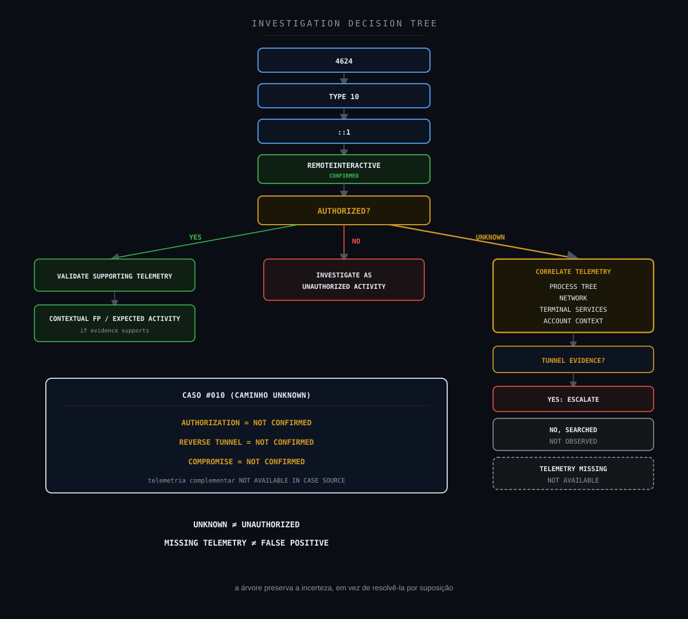

---

# 35. Veredito técnico

A evidência disponível permite afirmar:

```text
Successful Logon
=
Confirmed

Logon Type 10 / RemoteInteractive
=
Confirmed

Source Address ::1 / IPv6 Loopback
=
Confirmed
```

Mas não permite afirmar:

```text
Reverse Tunnel
=
Not Confirmed

Port Forwarding
=
Not Confirmed

Stolen Credentials
=
Not Confirmed

External Attacker
=
Not Confirmed

Credential Compromise
=
Not Confirmed

Lateral Movement
=
Not Confirmed

Endpoint Compromise
=
Not Confirmed
```

Além disso:

```text
TCP/3389 Network Session
=
Not Available

Original External Source
=
Not Available

Tunnel Process
=
Not Available

Full Process Tree
=
Not Available

Terminal Services Correlation
=
Not Available in Case Source
```

## Classificação final

> **Suspeito: logon RemoteInteractive originado de IPv6 loopback, requerendo validação e correlação adicional.**

## Estado

```text
SUSPICIOUS
VALIDATION REQUIRED

REVERSE TUNNEL
NOT CONFIRMED

STOLEN CREDENTIALS
NOT CONFIRMED

COMPROMISE
NOT CONFIRMED
```

Não existe evidência suficiente neste estágio para:

```text
TRUE POSITIVE / COMPROMISE
```

nem para:

```text
FALSE POSITIVE
```

A conclusão correta é preservar a incerteza.

```text
1 · ALERT
Rule 92656
        ↓
2 · TELEMETRY
Windows Event 4624
        ↓
3 · LOGON
Type 10 / RemoteInteractive
CONFIRMED
        ↓
4 · SOURCE
::1 · Source Port 0
CONFIRMED
        ↓
5 · LOOPBACK
IPv6 Loopback
CONFIRMED
        ↓
6 · VALIDATION
Authorization
NOT CONFIRMED
        ↓
7 · ENRICHMENT
Full Process Tree / Network Telemetry / Terminal Services Correlation
NOT AVAILABLE
        ↓
8 · HYPOTHESIS
Reverse Tunnel
NOT CONFIRMED
        ↓
9 · VERDICT
SUSPICIOUS
VALIDATION REQUIRED
```

Callouts:

```text
RDP LOOPBACK
≠
REVERSE TUNNEL
```

```text
LOGON TYPE 10
≠
MALICIOUS REMOTE ACCESS
```

```text
SUCCESSFUL LOGON
≠
STOLEN CREDENTIALS
```

```text
RULE DESCRIPTION
≠
CONFIRMED ATTACK
```

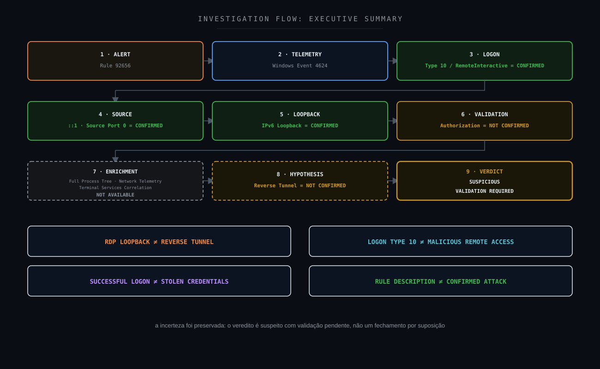

---

# 36. Referências

## Microsoft: Windows Security Event 4624

`An account was successfully logged on`

https://learn.microsoft.com/en-us/windows/security/threat-protection/auditing/event-4624

## Wazuh Documentation

Ruleset and security event analysis:

https://documentation.wazuh.com/

## MITRE ATT&CK: T1021.001

Remote Services: Remote Desktop Protocol

https://attack.mitre.org/techniques/T1021/001/

## MITRE ATT&CK: T1090

Proxy

https://attack.mitre.org/techniques/T1090/

## MITRE ATT&CK: T1078.002

Valid Accounts: Domain Accounts

https://attack.mitre.org/techniques/T1078/002/

## NIST Cybersecurity Framework 2.0

https://www.nist.gov/cyberframework

## NIST SP 800-61 Rev. 3

Incident Response Recommendations and Considerations for Cybersecurity Risk Management

https://csrc.nist.gov/pubs/sp/800/61/r3/final

## CIS Controls

https://www.cisecurity.org/controls

## Sigma

https://sigmahq.io/

## SOC-CMM

https://www.soc-cmm.com/

---

# Disclaimer

Este conteúdo foi produzido como estudo técnico de SOC / Incident Response a partir de um caso real previamente sanitizado.

Todos os identificadores capazes de revelar o ambiente original foram removidos ou substituídos por placeholders.

A análise diferencia explicitamente:

```text
Observed / Confirmed
Supported
Hypothesis
Not Observed
Not Available
Not Confirmed
Not Applicable
```

A ausência de determinada telemetria não é tratada como evidência de que uma atividade não ocorreu.

```text
NOT AVAILABLE
≠
NOT OBSERVED
```

Da mesma forma, o texto de uma regra de detecção não é utilizado como confirmação automática da hipótese descrita pela própria regra.

```text
DETECTION
≠
VERDICT
```

Caso uma validação posterior do responsável confirme um fluxo legítimo, essa informação deverá ser registrada separadamente como:

```text
Confirmed (user attestation)
```

sem alterar retroativamente os estados técnicos que permaneceram:

```text
Not Available
```

ou:

```text
Not Confirmed
```

As investigações, decisões técnicas e veredictos apresentados neste estudo refletem experiência prática real do autor. Ferramentas de Inteligência Artificial foram utilizadas como apoio para formatação, diagramação e publicação do conteúdo, não para a condução da investigação em si.

Este projeto é independente e não representa documentação oficial do Wazuh, Microsoft, MITRE, NIST, CIS ou demais organizações mencionadas.

---

# Wazuh SOC Notes

**Segurança não termina no alerta. O valor está em transformar telemetria em contexto, contexto em evidência e evidência em decisão.**

```text
ALERT
↓
TELEMETRY
↓
HYPOTHESIS
↓
HUNTING
↓
EVIDENCE
↓
DECISION
```
